Each application must have proper security in order to have its data secured. This How-To will teach you how to turn the security on and configure it. You will start with the configuration of user and module roles and their access to page and microflows. Therefore we’ll turn on the prototype/demo security. Next you will deal with production security.

## 1\. Prepare data structure, GUI and example data

To see the results of this how-to it is necessary that you setup a test project with test data.

Before you continue, make sure that you know how to create:

*   **Domain models**, if you need more info, take a look at this [how-to](creating-a-basic-data-layer).

*   **Overview and detail pages**, if you need more info, take a look at this [how-to](creating-your-first-two-overview-and-detail-pages).

*   **Menu items**, if you need more info, take a look at this [how-to](setting-up-the-navigation-structure).

1.  Create the following domain model:
    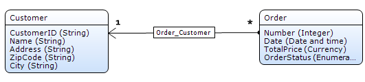
2.  Create **overview** and **detail** pages to manage objects of type **Customer** and **Order**.
3.  Create **menu items** to access the **Order** and the **Customer** overview pages.
4.  Add a new microflow to your module
    _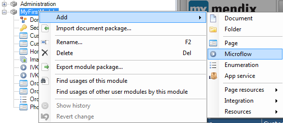_
5.  Name the Microflow_ _IVK_SetOrderToComplete_.
    _
6.  Save the new menu item by clicking **OK**.

    You should see an empty Microflow like this:
    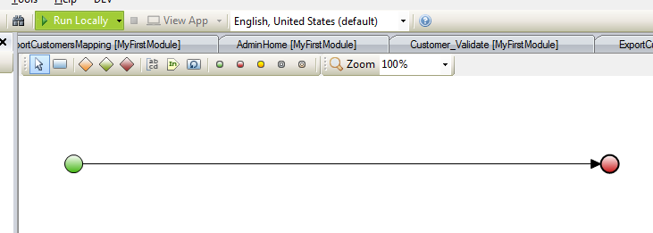
7.  Add a Microflow button to the toolbar of the orders overview and change its caption to _Set Processing to Complete_.
    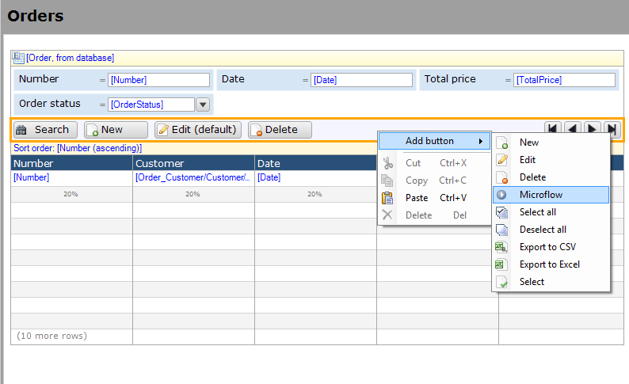
8.  Right click the Microflow button and click **Select Microflow** from the context menu.
    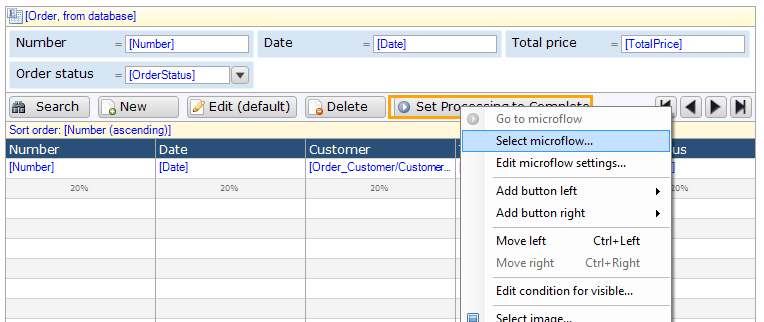
9.  Select the _IVK_SetOrderToComplete_ Microflow and click **select**.
    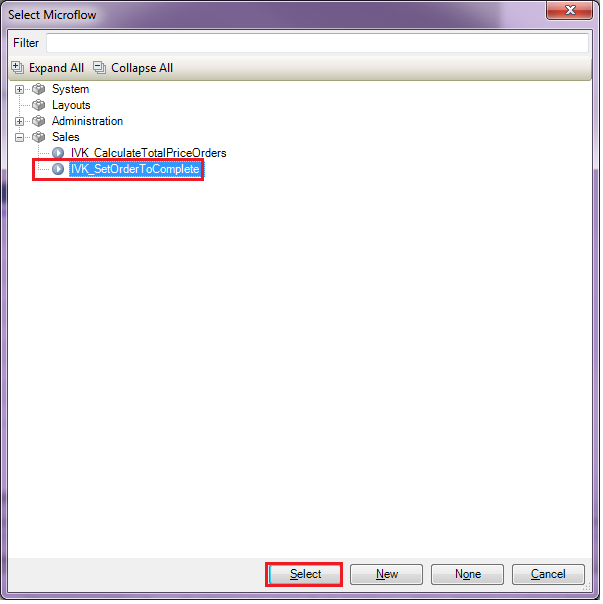
10.  Add the following customer data to your app:
    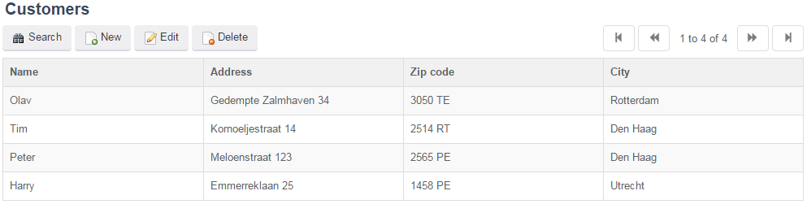
11.  Add the following order data to your app:
    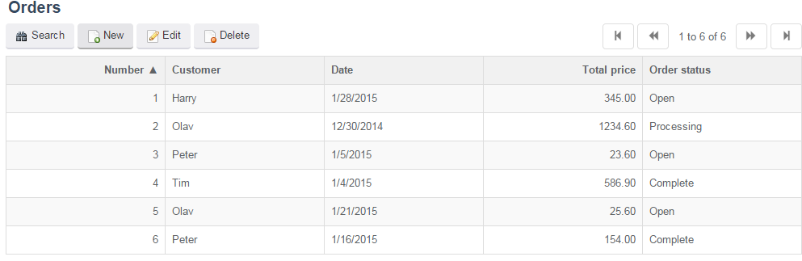

## 2\. Setting the security level to Prototype/Demo

In this part of the how to you will learn how to configure the security at prototype/demo level. Be aware that this level of security is only applicable for development/demo purposes. This level is available for quick development of demo applications. It simulates security, without more complex configuration of the data access. When deploying to the Mendix cloud, production security is mandatory.

1.  Open the project security.
    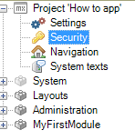
2.  The following properties editor will open.
    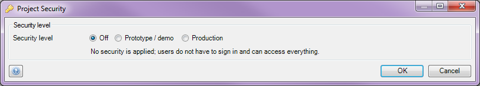
3.  Switch the security level to **Prototype/Demo**.
    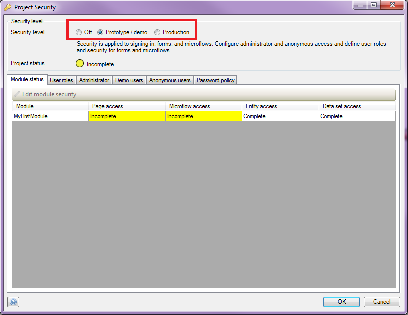
4.  Go to the **Administrator **tab.
5.  Set the master **Administrator password**.
    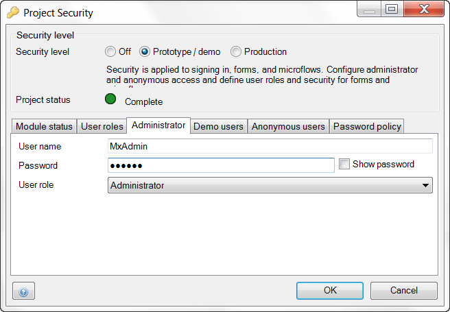

### 2.1 Creating module roles within a module

You have added one or more modules while the security was turned off. So currently, there's is no security configured for those modules. Now that security is turned on, you have to configure it from scratch. Access to a module is managed using module roles. You will now add these.

1.  Open the module security of the **MyFirstModule** module.
    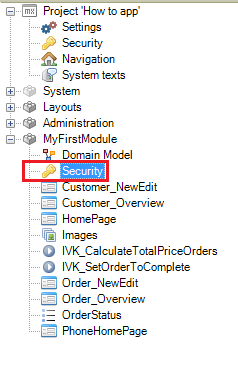
2.  The following properties editor will open.
    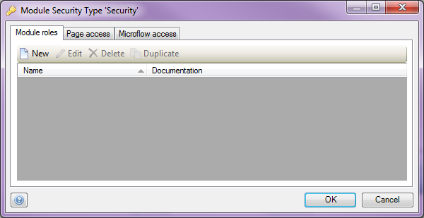
3.  Click **New** and create the **Administrator** module role.
    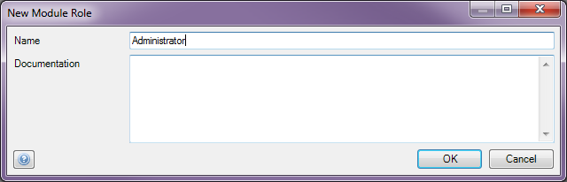
4.  Add the **User** module role.
    

### 2.2 Connecting the User Roles to Module Roles

The two module roles that have been created should be assigned to a user role. When an end user has a specific user role, the end user has access to the data/forms and microflows depending on the assigned module roles of that user role.

1.  Open the project **security.**
2.  Go to the **User roles **tab.
3.  Double click the **Administrator User Role**.
    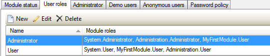
4.  The properties editor will open.
    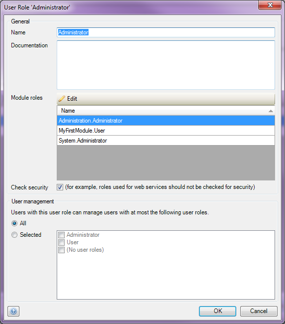
5.  Click **Edit** to open the module role configuration.
    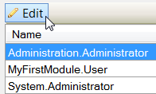
6.  Select the **Administrator** module role for all the modules.
    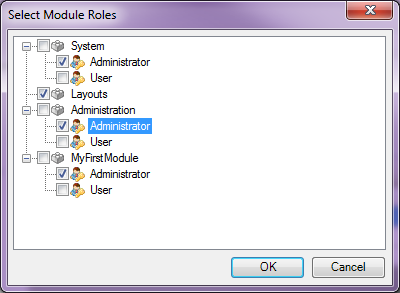
7.  Repeat these steps for the **User** User Role.
    

### 2.3 Configuring page- and microflow access of a module

Next you're ready to configure the page- and microflow access of a module.

1.  Open the module security of the **MyFirstModule** module.
    
2.  Open the **Page Access** tab.
    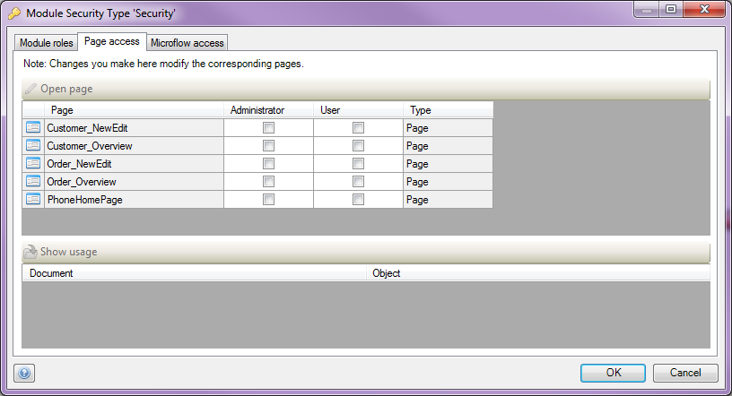
3.  Check the pages according to the example as shown in the picture below:
    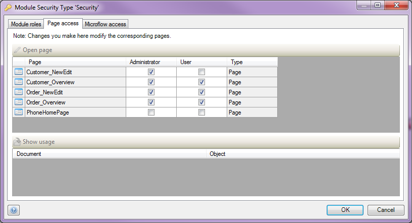 
4.  Go to the **Microflow Access** tab.
5.  Check the microflows according to the example as shown in the picture below:
    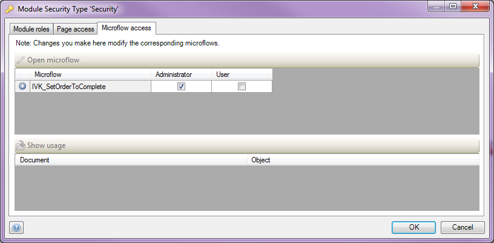
6.  Deploy the application.
7.  Create new users with different roles.
8.  Log in with these users.
9.  Test the differences in your application.

## 3\. Setting the security level to Production

In this part of the How-To you will configure the security at production level. At this level, all security settings must be configured. In addition to prototype/demo security, you have to configure the entity (data) access. Production security is mandatory when deploying to the Mendix cloud.

1.  Open the project security.
    
2.  Switch the security level to **Production**.
    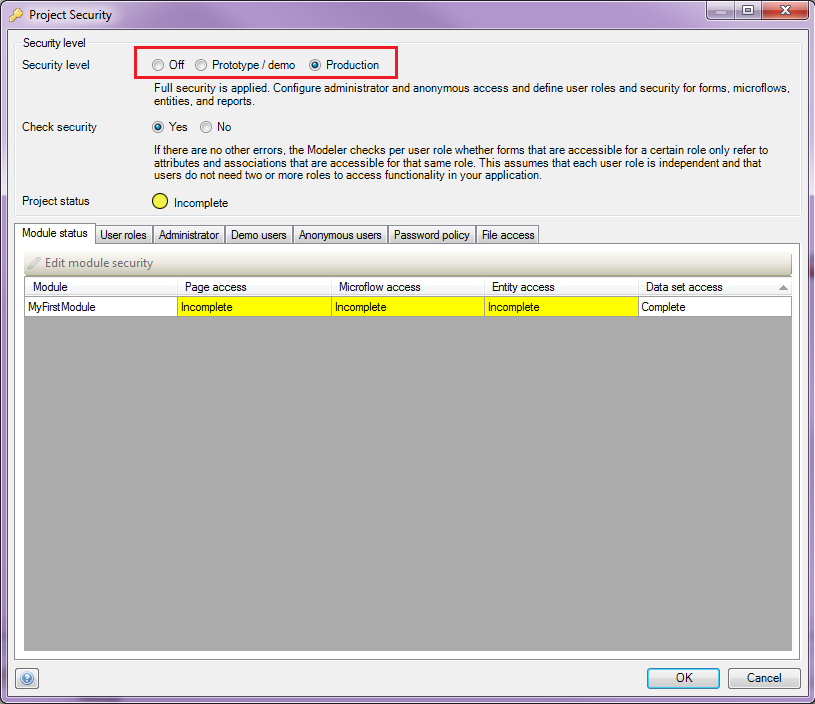

### 3.1 Configuring form Entity Access

1.  Open the module **security** of the **MyFirstModule** module.
    
2.  Open the **Entity Access** tab.
    
3. Click **New** to create access rules for the **Role Administrator **module.

    Make sure to allow a administrator to read/write all.
    And to allow a user less. This to clearly see the difference.

### 3.2 Creating access rules for the Administrator module role

You will start creating access rules for the **Administrator **module role. Since this role represents an administrator, let’s assume he is allowed to create, delete, read and write everything. So you can create the rules in a quick batch.

1.  Check-in all entities.
2.  Click **OK.**
    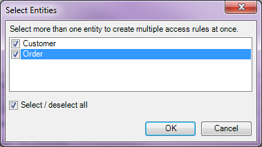
3.  Setting up the rule configuration.

    *   Module role: Administrator
    *   Allow creating new objects: Tick (Yes)
    *   Allow deleting existing objects: Tick (Yes)
    *   Member read and write rights: 'Read, Write'
4. Click **OK**.
    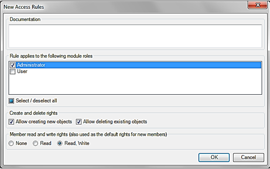

    A separate access rule will be created for all entities when the module role is set to 'Administrator'. 
    It is possible to adjust each rule individually at a later moment.

### 3.3 Creating access rules for the module role 'User'

Next you have to create access rules for the **User** module role. Since this role represents a user with limited access, let’s assume he/she is only allowed to read most data and is allowed to write some of the 'Order' data. This means you have to configure all access rules individually.

1.  Click new to create a new access rule for the **User **module role.
    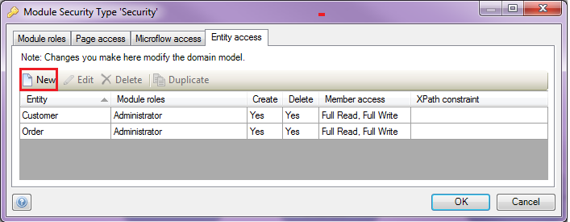
2.  Select the **Customer** entity.
3.  Click **OK**.
    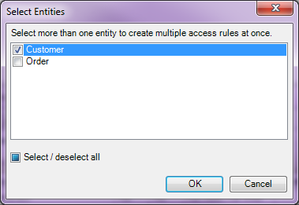
4.  Setting up the correct rule configuration:

    *   Module role: User
    *   Allow creating new objects: Untick (No)
    *   Allow deleting existing objects: Untick (No)
    *   Default rights for new members: None
    *   Member access rights: Read
        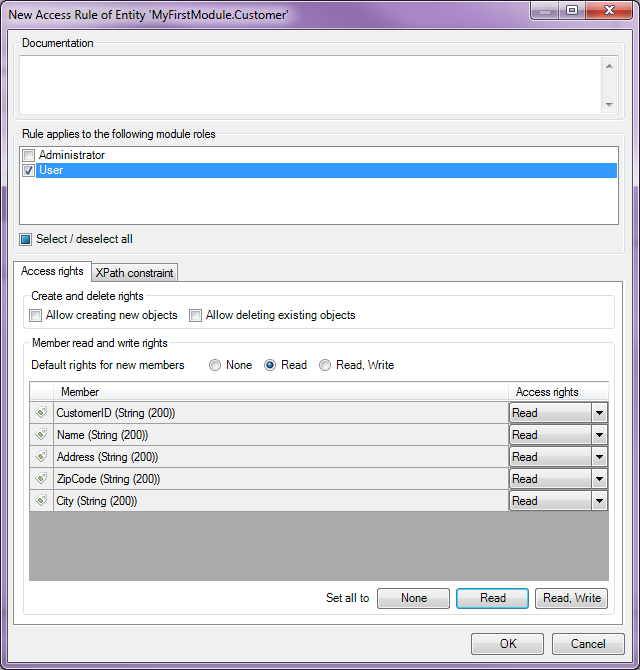
5.  Adjust the rule for the **Order**.
6.  Setting up the correct rule configuration:

    *   Module role: User
    *   Allow creating new objects: Tick (Yes)
    *   Allow deleting existing objects: Untick (No)
    *   Default rights for new members: Read, Write
    *   Member access rights: Read, Write
        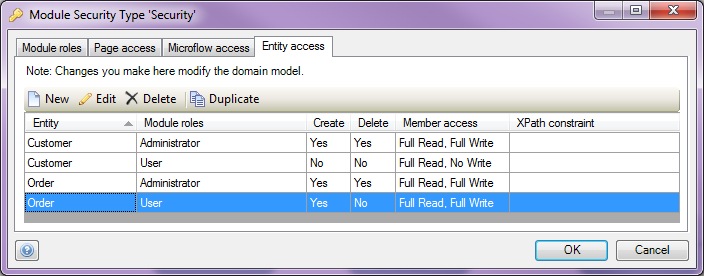
7.  Deploy the application.
8.  Log in with the different users and test the differences in your application. 

## 4\. Define the access rules on the order entity using XPath

In the previous section you have set some access rules to your domain model. In this section you you will define the access rules on the 'Order' entity in a way that orders can only be viewed by a user if the payment status of the order is set to 'Open'. You will do this by adding an XPath constraint to the 'Order' entity for the module role 'User'. The [XPath constraint](/refguide5/xpath-constraints) can be used to constrain the set of objects to which the access rule applies. If the XPath constraint is empty, the rule applies to all objects of the entity.

### 4.1 Add an account with the **User **user role

1.  Click the **Accounts** section at the **Administration** menu item.
    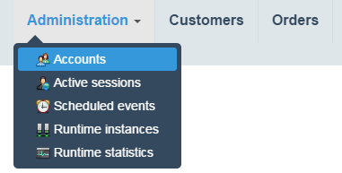
2.  Click **New user**
    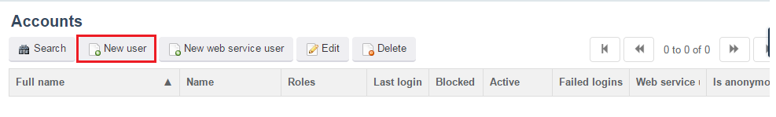
3.  Add an account with the user role **User**.
    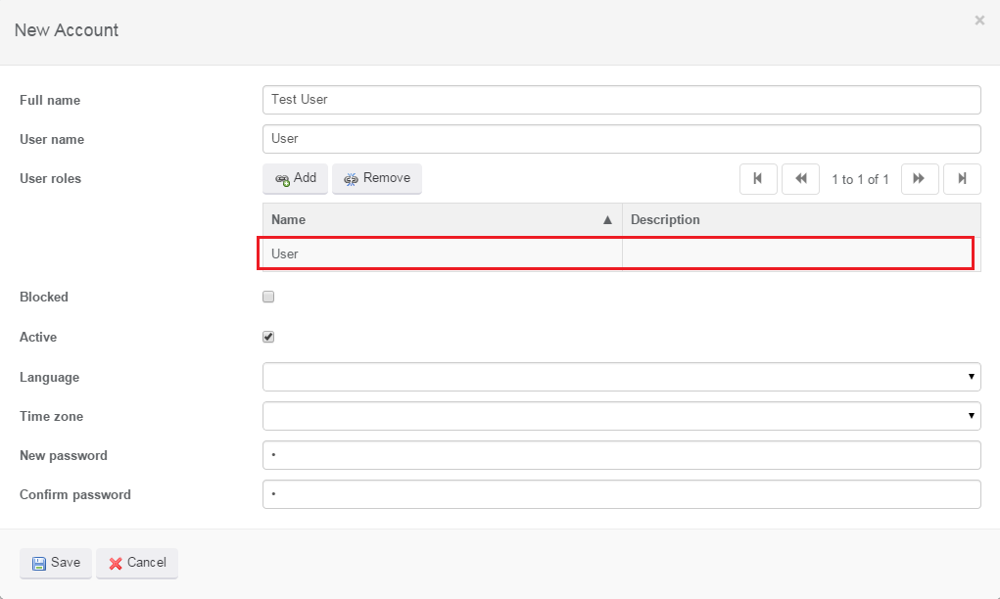
4.  Click **Save**.

### 4.2 Set the entity access to OrderStatus 'Open'.

1.  Double click the **Order** entity.
    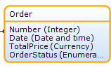
2.  Open the **Access rules** tab.
    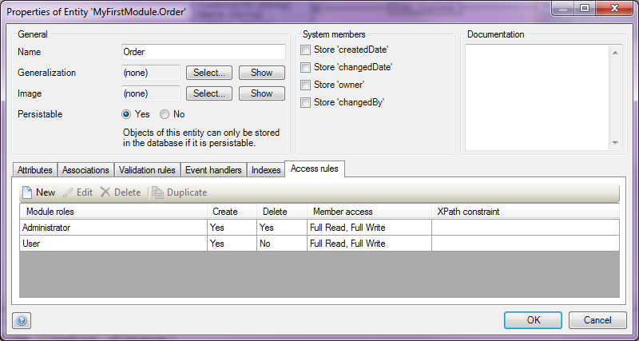
3.  Open the **User** module role.
    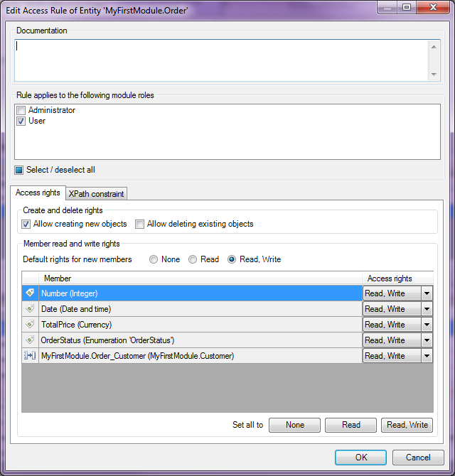
4.  Select the **XPath constraint** tab.
    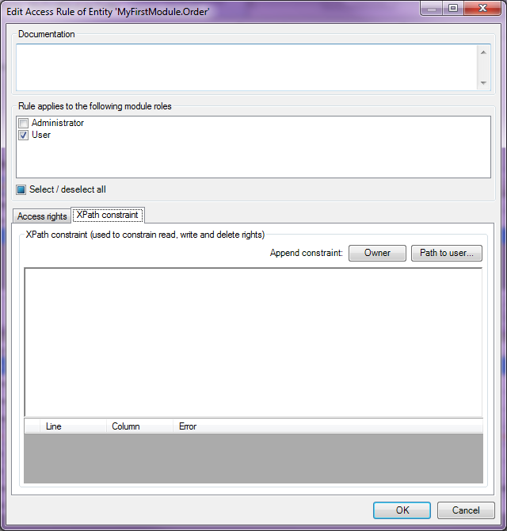
5.  To constrain the access of the financial administrator to only the **Open** orders you add the following **XPath** statement:
    
6.  Click **OK**. The properties editor of your Order entity should look like this:
    
7.  Re-deploy your application.
8.  If you log in with the **Test User** account you will see that only the **Open** orders are shown in the orders overview:
    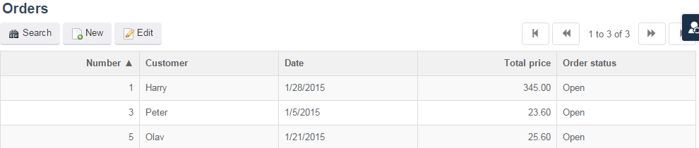

## 5\. Related content

*   [Security](security)
*   [Generating a personal SSH2 key pair](generating-a-personal-ssh2-key-pair)
*   [Creating a secure app](creating-a-secure-app)
*   [Required Network Access for connecting to the Mendix Platform](/howtogeneral/support/troubleshoot-network-issues-for-team-server)
*   [Anonymous User Security](anonymous-user-security)
