Automated tests can be created with different tools, depending on the type of tests. Integration tests can be created with [SoapUI](testing-web-services-using-soapui), unit tests with the [UnitTesting module](testing-microflows-using-the-unittesting-module), and UI tests with Selenium IDE. With Selenium IDE you can create scripts to aid in automation-aided exploratory testing. If you’re looking to create robust, browser-based tests, you should look into using a testing framework with Selenium.

TestNG is a Java testing framework that can be used to drive Selenium. In this how-to you will learn how to create an automated test with TestNG.

**After completing this how-to you will know:**

*   How to create TestNG test files.
*   How to run automated tests with TestNG.
*   How to generate reports with TestNG.

## 1. Preparation

Before you can start with this how-to, please make sure you have completed the following prerequisites.

*   Download and install [Eclipse](http://www.eclipse.org/downloads/).
*   Download [Selenium Client & WebDriver](http://www.seleniumhq.org/download/).
    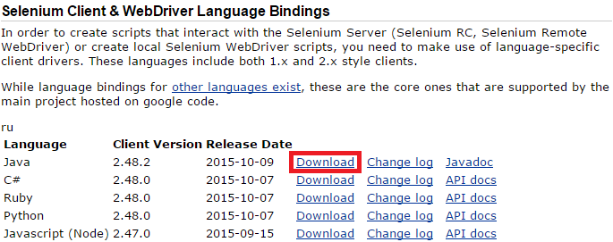 
*   Open the [Company Expenses App](https://appstore.home.mendix.com/link/app/240/Mendix/Company-Expenses) in the Mendix Modeler and run locally.

## 2\. Create a Java project

In this chapter you will install the TestNG plug-in and create a Java project in Eclipse including the TestNG and Selenium libraries.

1.  Open Eclipse.
2.  Click **Help > Eclipse Marketplace...**.
    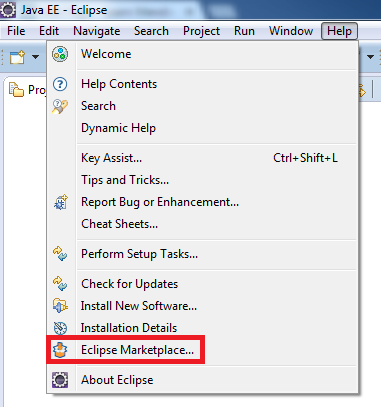
3.  Enter _TestNG_ in the **Find** section and click Go.

    TestNG for Eclipse will be shown in the search results. 
4.  Click on **Install** to install the TestNG plug-in for Eclipse
    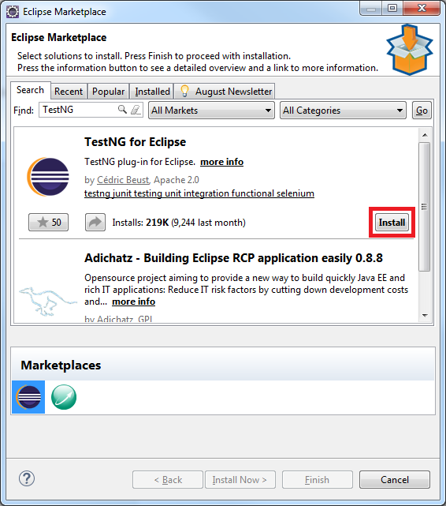
5.  Click **Confirm** to confirm the features.
    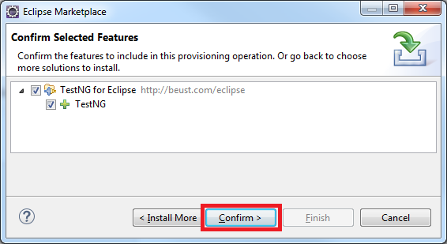
6.  Review the licenses and click **Finish**.

    The plug-in will be installed.
    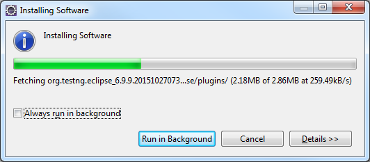
7.  Restart Eclipse for changes to take effect.
8.  Click on the **New** icon.
    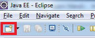
9.  Select **Java Project **and click Next.
    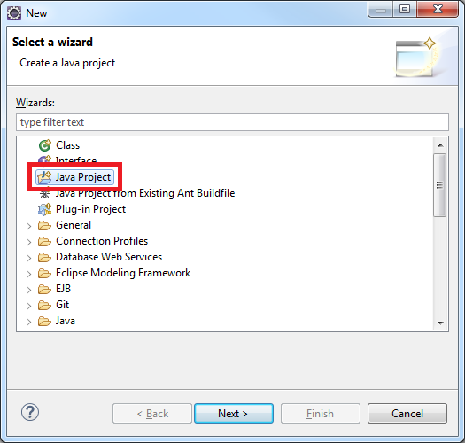
10.  Enter _MyFirstTestNGProject_ as project name and click **Next**.
11.  Select tab **Libraries**.
12.  Click **Add Library****...**.
13.  Select **TestNG** and click **Next**.
14.  Click **Finish** to set the default TestNG Library to this project.
15.  Click **Add External JARs...**.
16.  Navigate to where you saved the Selenium JAR files. 
17. Add all the JAR files inside the selenium-[version] and libs folder.
    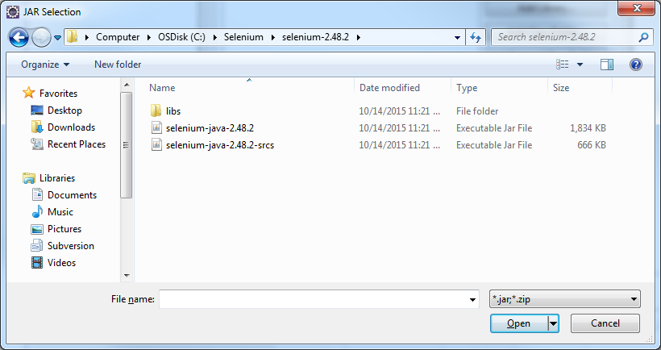

    After adding the JARs the Libraries tab will look like the image below:
    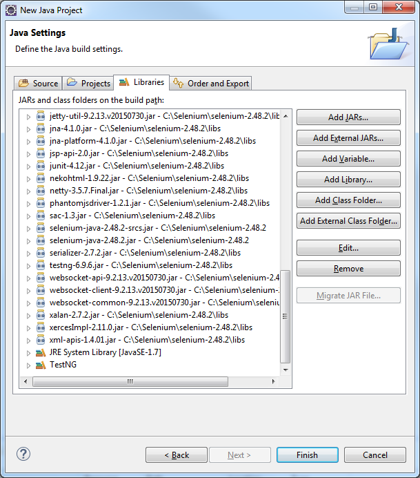
18. Click **Finish** to create the java project. MyFirstTestNGProject will be shown in the Package Explorer.
    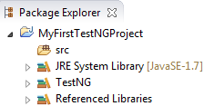

    You are now done setting up your project!

## 2. Create a TestNG file

Lets now create a new TestNG file.

1.  Right-click the **src** folder.
2.  Select **New > Other...**.
3.  Select **TestNG class**.
    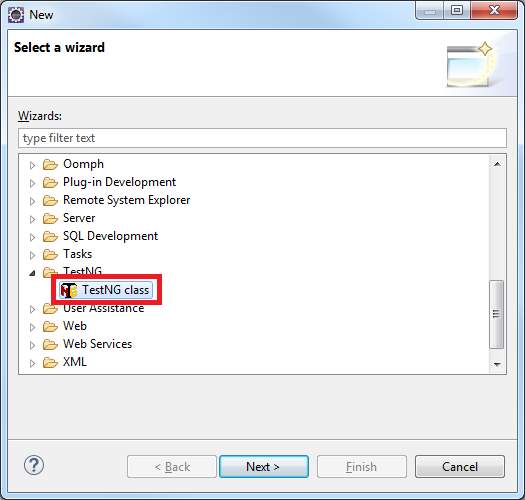
4.  Click **Next**.
5.  Click **Browse...** to select a source folder.
6.  Select **MyFirstTestNGProject > src **and click OK.
7.  Enter _myfirsttestngpackage_ as package name.
8.  Enter _MyFirstTestNGFile_ as class name.
9.  Check **@BeforeTest**.
10.  Check **@AfterTest**.
    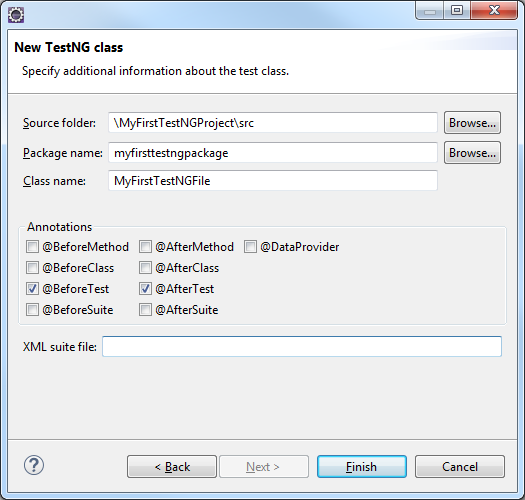
11. Click **Finish**. The template for your first TestNG file will be created automatically as shown below:
    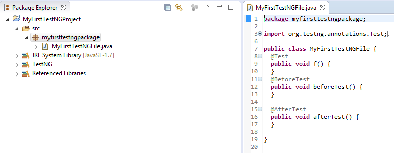
    The @Test annotation is used to tell that the method under it is a test case. In this case, the method f is a test case. The @BeforeTest annotation is used to tell that the method under it will be executed before the first test case. The @AfterTest annotation is used to tell that the method under it will be executed after the last test case.

## 3. Creating a test case

Lets now code your test case.

### 3.1 Add a WebDriver

First you need to create a variable to be used for the Web Driver.

1.  Search for 

    ```java
    public class MyFirstTestNGFile {
    ```

2.  Add the following code on the next line.This will create the variable _driver_ of type WebDriver.

    ```java
    public WebDriver driver;
    ```

3.  Press **CTRL+SHIFT+O** to organize the imports. This will import missing statements and remove unused import statements. The following statement will be imported:

    ```java
    import org.openqa.selenium.WebDriver;
    ```

### 3.2 Add a BeforeTest method

The @BeforeTest annotation is used to tell that the method under it will be executed before the first test case. Before the first test case, you want to open the Firefox browser.

1.  Change the following code

    ```java
    @BeforeTest
    public void beforeTest() {
    }
    ```

    into

    ```java
    @BeforeTest
    public void beforeTest() {
    	driver = new FirefoxDriver();
    }
    ```

    This creates a new instance of the Firefox driver and opens the Firefox browser.

2.  Press **CTRL+SHIFT+O**. The following statement will be imported:

    ```java
    import org.openqa.selenium.firefox.FirefoxDriver;
    ```

### 3.3 Add a AfterTest method

The @AfterTest annotation is used to tell that the method under it will be executed after the last test case. After the last test case, you want to close the browser.

1.  Change the following code

    ```java
    @AfterTest
    public void afterTest() {
    }
    ```

    into

    ```java
    @AfterTest
    public void afterTest() {
    	driver.close();
    }
    ```

    This will close the Firefox browser.

### 3.4 Add the first test method

The first step is to open a URL in the browser.

1.  Change the following code

    ```java
    @Test
    public void f() {
    }
    ```

    into

    ```java
    @Test(priority=1)
    public void openApp() {
    	driver.get("http://localhost:8080/index.html");
    }
    ```

    This test method will open the URL _http://localhost:8080/index.html_ in the Firefox browser. By default, methods annotated by @Test are executed alphabetically. You can use parameters to modify the annotation's function. The parameter _priority_ can be used to execute the methods in a different order. TestNG will execute the @Test annotation with the lowest priority value up to the largest.

### 3.5 Add the second test method

Now that you are on the login window, you want to login.

1.  Open **Firefox**.

2.  Go to _http://localhost:8080/index.html_.
3.  Click the **Firebug** button in the Firefox toolbar.
    
4.  Click the **FirePath** tab.
    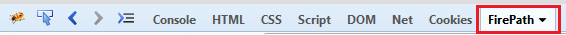 
5.  Click the **Inspect Element** button.
    

6.  Click the **User name** input field.

    The id of the username field is _usernameInput_. The css selector of an id is # (hashtag) + the name of the id. For the username field it will be _#usernameInput_. The same principle is used for the other steps.
    The CSS selector _#usernameInput_ is unique; there is 1 matching node. 
    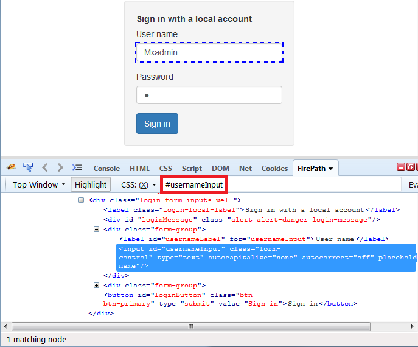
7.  Repeat steps 5 and 6 for the **Password** input field and the **Sign in** button.

    <table><thead><tr><th class="confluenceTh">Element</th><th class="confluenceTh">Css Selector</th></tr></thead><tbody><tr><td class="confluenceTd">Password input field</td><td class="confluenceTd">#passwordInput</td></tr><tr><td class="confluenceTd">Sign in button</td><td class="confluenceTd">#loginButton</td></tr></tbody></table>
8.  Add a new test method called _login_. Use the following code:

    ```java
    @Test(priority=2)
    public void login() {
    	driver.findElement(By.cssSelector("#usernameInput")).sendKeys("MxAdmin");
    	driver.findElement(By.cssSelector("#passwordInput")).sendKeys("1");
    	driver.findElement(By.cssSelector("#loginButton")).click();
    }
    ```

    This test method contains the following test steps:
     - enter _MxAdmin_ as username
     - enter _1_ as password
     - click the login button

### 3.6 Add the third test method

Now that you are logged in, you want to navigate to the expenses tab.

1.  Open the **Mendix Modeler**.

2.  Open the **Desktop_AdminMenu** page.
    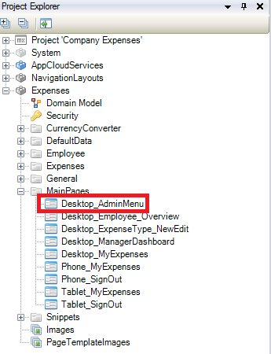

3.  Select the **Expenses** tab.
    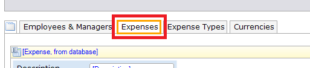

    The name of the **Expenses** tab is _tabPage4._ Every element will automatically get the CSS class _mx-name-[Name],_ so the expenses tab will get the CSS class _mx-name-tabPage4_when the app is running.

    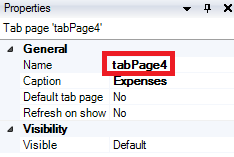
4.  Go back to **Eclipse**.

5.  Add a new test method called _openExpensesTab_. Use the following code:

    ```java
    @Test(priority=3)
    public void openExpensesTab() {
    	WebDriverWait wait = new WebDriverWait(driver, 10);
    	wait.until(ExpectedConditions.visibilityOfElementLocated(By.cssSelector(".mx-name-tabPage4"))).click();
    }
    ```

    This test method calls the ExpectedCondition every 500 milliseconds until it returns successfully or 10 seconds are passed. When 10 seconds are passed and the element is not located, a TimeoutException will be thrown. If the element is located within 10 seconds, the method will click on the element with class name _mx-name-tabPage4_. The class of the expenses tab is _mx-name-tabPage4_. The css selector of a class is .(dot) + the class name, so for the expenses tab it will be _.mx-name-tabPage4_. 

### 3.7 Add the fourth test method

Now that you are on the expenses tab, you want to create a new expense.

1.  Open the **Mendix Modeler**.

2.  Open the **Desktop_AdminMenu **page.

3.  Select the **New Expense** button.
    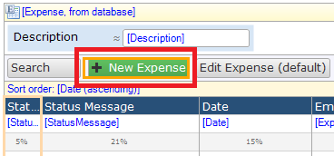

    The name of the **New Expense** button is _newButton3, s_o the button will have the CSS class _mx-name-newButton3_.

    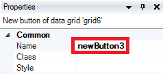

4.  Open the **Desktop_Expense_NewEdit_Admin** page.

5. Find the names of the following elements like you did in step 3:

    <table><thead><tr><th class="confluenceTh">Element</th><th class="confluenceTh">Name</th></tr></thead><tbody><tr><td class="confluenceTd">Amount field</td><td class="confluenceTd">textBox6</td></tr><tr><td class="confluenceTd">Description dropdown</td><td class="confluenceTd"><span>referenceSelector1</span></td></tr><tr><td class="confluenceTd">Save button</td><td class="confluenceTd">saveButton1</td></tr></tbody></table>{}

    The name of an element in your app may be different than the name shown in the Name column. In step 7, use the name of the element of your app.

    {}
6. Go back to **Eclipse**.

7.  Add a new test method called _createExpense_. Use the following code:

    ```java
    @Test(priority=4)
    public void createExpense() {
    	driver.findElement(By.cssSelector(".mx-name-newButton3")).click();
    	driver.findElement(By.cssSelector(".mx-window-active .mx-name-textBox6 input")).clear();
    	driver.findElement(By.cssSelector(".mx-window-active .mx-name-textBox6 input")).sendKeys("15.00");
    	driver.findElement(By.cssSelector(".mx-window-active .mx-name-referenceSelector1 option:nth-child(2)")).click();
    	driver.findElement(By.cssSelector(".mx-window-active .mx-name-saveButton1")).click();
    }
    ```

    This test method contains the following test steps:
     - click the new expense button
     - clear the amount field
     - enter _15.00_ in the amount field
     - select the second option in the description dropdown
     - click the save button

    A popup is shown after clicking on the New Expense button (.mx-name-newButton3). To be sure to retrieve the element of the active page, in this case the popup, you need to add _.mx-window-active_ to the css selector of the elements in the popup. 

    For every input field you need to add 'input' at the end of the css selector.

    The default value of the amount field is 0.00\. To enter a new value you first need to clear the field.

    The reference selector has 6 options; empty, Accomodation, Meal, Other, Supplies, Transport. To select Accomodation, which is the second option, you need to add 'option:nth-child(2)' at the end of the css selector.

### 3.8 Add the fifth test method

After you have created an expense, you want to sign out.

1.  Open the **Mendix Modeler**.

2.  Open the **Desktop_MyInfo** snippet.

3.  Find the name of the following element:

    <table><thead><tr><th class="confluenceTh">Element</th><th class="confluenceTh">Name</th></tr></thead><tbody><tr><td class="confluenceTd">Sign out button</td><td class="confluenceTd">signOutButton1</td></tr></tbody></table>
4.  Add a new test method called _signOut_. Use the following code:

    ```java
    @Test(priority=5)
    public void signOut() {
    	driver.findElement(By.cssSelector(".mx-name-signOutButton1")).click();
    }
    ```

    This test method will click on the element with class name _mx-name-signOutButton1_.

## 4\. Run the test

You are now ready to run the test.

1.  Right-click the **MyFirstTestNGProject** folder.
2.  Select **Run as > 4 TestNG Test**.
    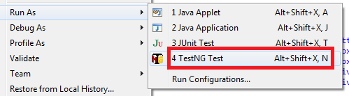

    The results of the test will be shown in the console window and in the TestNG results window.

    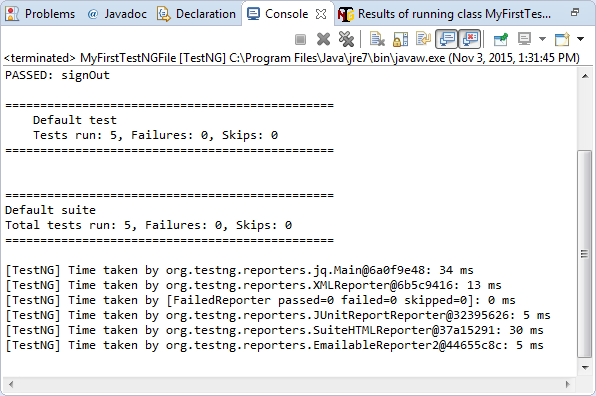

    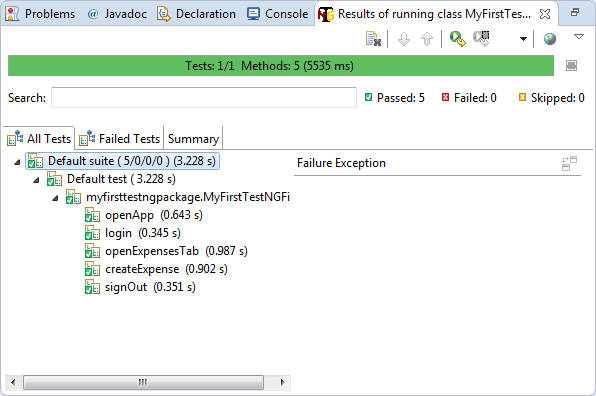

## 5\. Test report

TestNG generates reports in HTML format.

1.  Right-click the **MyFirstTestNGProject** folder.
2.  Select **Refresh**.

    A test-output folder will be created.
    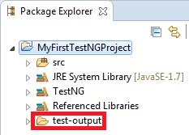
3.  Open the **test-output** folder.
4.  Right-click the **index.html** file.
5.  Select **Open with > Web Browser**.

    The report will look like the following image:
    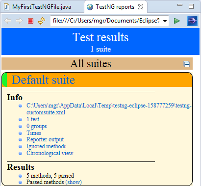
6.  Click on **(show)**.
    The test methods are shown alphabetically.
    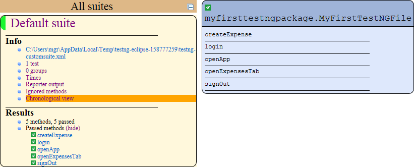

7.  Click on **Chronological** view.
    An overview with the methods in chronological order will be shown.
    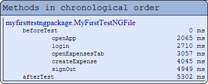

## 6\. Create a test suite

When you run your test like you did in chapter 4, a test suite is created automatically. This test suite contains all testNG files that can be found in the project. But what if you only want to run specific tests? Than you need to create a test suite yourself.

1.  Right-click the **src** folder.
2.  Select **New > Other**.
3.  Open the **XML** folder.
4.  Select **XML File**.
    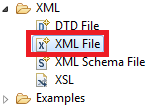 
5.  Click **Next**.
6.  Change the **file name** to _MyFirstTestSuite.xml_.
7.  Click **Finish **to create the xml file.
    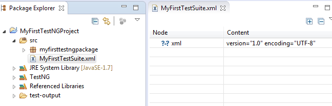
8.  Click the **Source** tab.
    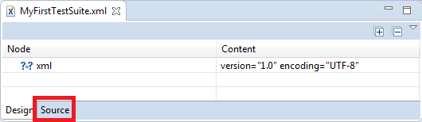
9.  Change the following code

    ```xml
    <?xml version="1.0" encoding="UTF-8"?>
    ```

    into

    ```xml
    <?xml version="1.0" encoding="UTF-8"?>
    <suite name="MyFirstTestSuite">
    	<test name="Test1">
    		<classes>
    			<class
    				name="myfirsttestngpackage.MyFirstTestNGFile" />
    		</classes>
    	</test>
    </suite>
    ```

    This will create a new test suite, _MyFirstTestSuite_. The test suite contain one test, _Test1. _The test contain one testNG file, myfirsttestngpackage.MyFirstTestNGFile.

10.  Right-click the **MyFirstTestSuite.xml** file.
11.  Select **Run as > 1 TestNG Suite**.

Well done! You created your first TestNG Suite!

## 7\. Run your test suite on multiple browsers using @Parameters 

The test you created is now run on Firefox only. If you want to make sure the functionality works as expected in other browsers, you need to perform multi-browser testing. With TestNG it is very easy to perform the same test on different browsers.

1.  Download the [ChromeDriver](https://sites.google.com/a/chromium.org/chromedriver/downloads).

2.  Download the [IEDriver](http://selenium-release.storage.googleapis.com/index.html).
3.  In Eclipse, open **MyFirstTestNGFile**.

4.  Change the following code

    ```java
    @BeforeTest
    public void beforeTest() {
    	driver = new FirefoxDriver();
    }
    ```

    into

    ```java
    @Parameters("browser")
    @BeforeTest
    public void beforeTest(String browser) {
    	if(browser.equalsIgnoreCase("chrome")){
    		System.setProperty("webdriver.chrome.driver", "C://Selenium/chromedriver.exe");
    		driver = new ChromeDriver();
    	}
    	else if(browser.equalsIgnoreCase("ie")){
    		System.setProperty("webdriver.ie.driver", "C://Selenium/IEDriverServer.exe");
    		driver = new InternetExplorerDriver();
    	}
    	else{
    		driver = new FirefoxDriver();
    	}
    }
    ```

    @Parameters is used to insert a parameter, in this case _browser,_ from the test suite xml. If the browser parameter is _chrome_, a chrome driver will start.
    In this how-to the chromedriver.exe is stored in the folder _C://Selenium_. Be sure to use the right path in this code.

5.  Press **CTRL+SHIFT+O**. The following statements will be imported:

    ```java
    import org.openqa.selenium.chrome.ChromeDriver;
    import org.openqa.selenium.ie.InternetExplorerDriver;
    import org.testng.annotations.Parameters;
    ```

6.  Open **MyFirstTestSuite**.
7.  Change the following code

    ```xml
    <?xml version="1.0" encoding="UTF-8"?>
    <suite name="MyFirstTestSuite">
    	<test name="Test1">
    		<classes>
    			<class
    				name="myfirsttestngpackage.MyFirstTestNGFile" />
    		</classes>
    	</test>
    </suite>
    ```

    into

    ```xml
    <?xml version="1.0" encoding="UTF-8"?>
    <suite name="MyFirstTestSuite">
    	<test name="ChromeTest">
    		<parameter name="browser" value="chrome" />
    		<classes>
    			<class name="myfirsttestngpackage.MyFirstTestNGFile" />
    		</classes>
    	</test>
    	<test name="IETest">
    		<parameter name="browser" value="ie" />
    		<classes>
    			<class name="myfirsttestngpackage.MyFirstTestNGFile" />
    		</classes>
    	</test>
    	<test name="FirefoxTest">
    		<parameter name="browser" value="firefox" />
    		<classes>
    			<class name="myfirsttestngpackage.MyFirstTestNGFile" />
    		</classes>
    	</test>
    </suite>
    ```

    The first test, called _ChromeTest_, has the browser parameter _chrome_. This parameter will be used in the @BeforeTest method in MyFirstTestNGFile.

8.  Right-click the **MyFirstTestSuite.xml** file.
9.  Select **Run as > 1 TestNG Suite**.
    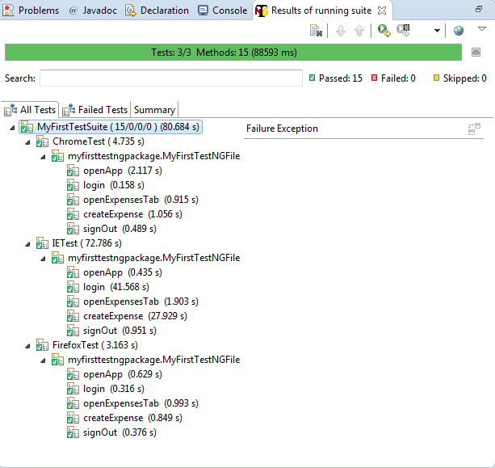

Well done! You created your first automated cross browser test with TestNG!

Now you know how to create a TestNG test file, how to create a test suite and how to run the automated test(s) on multiple browsers.

Happy testing!

## 8\. Related content

*   [Testing web services using SoapUI](testing-web-services-using-soapui)
*   [Testing microflows using the UnitTesting module](testing-microflows-using-the-unittesting-module)
*   [Creating automated tests with TestNG](creating-automated-tests-with-testng)
