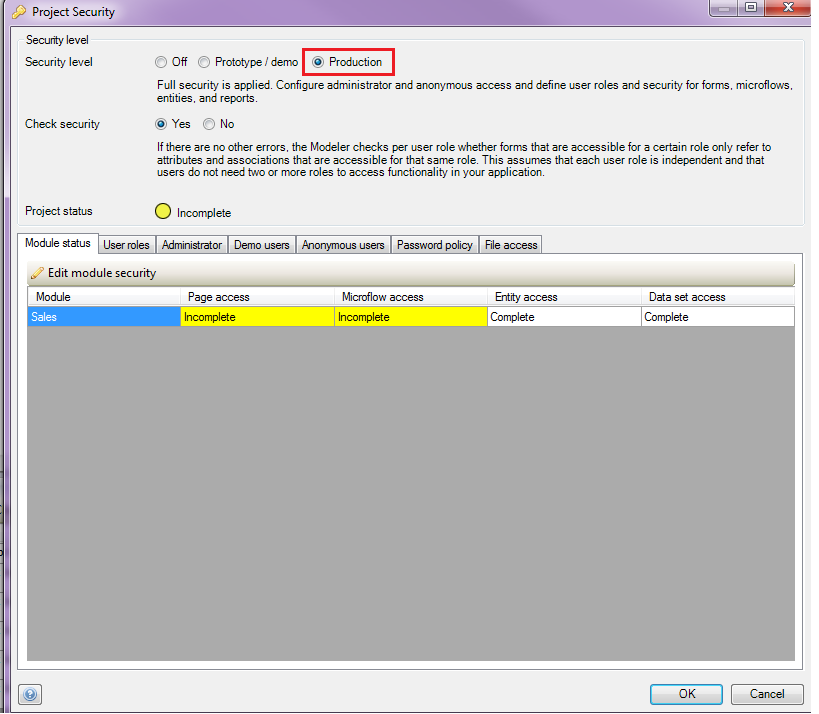
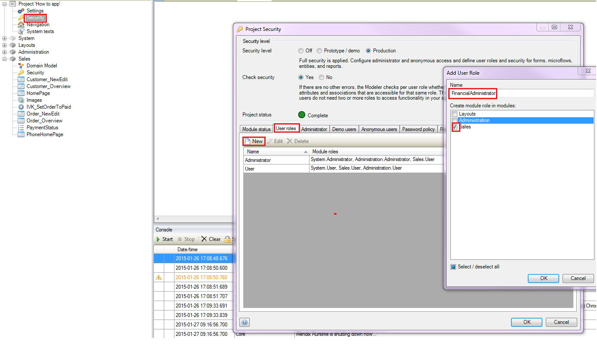
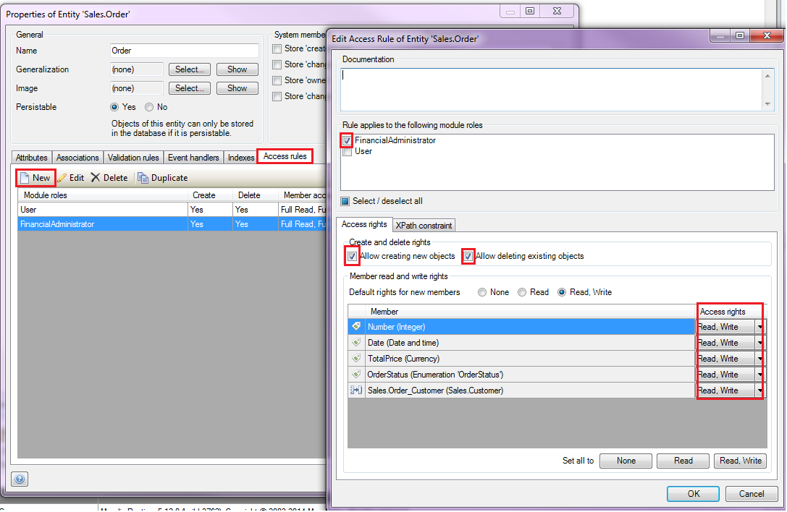
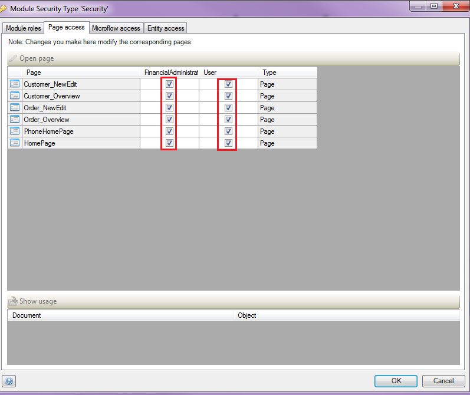
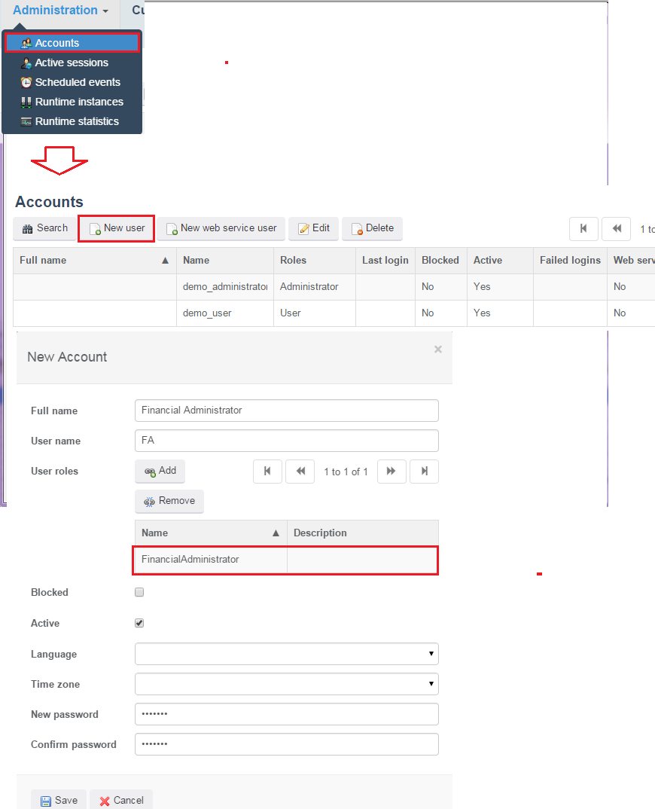
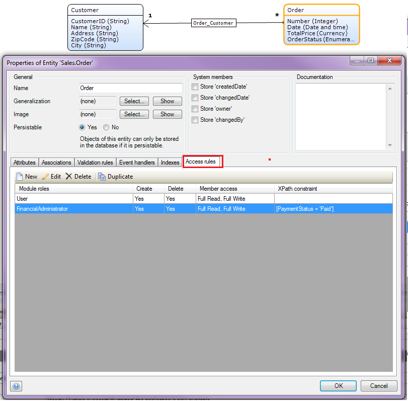
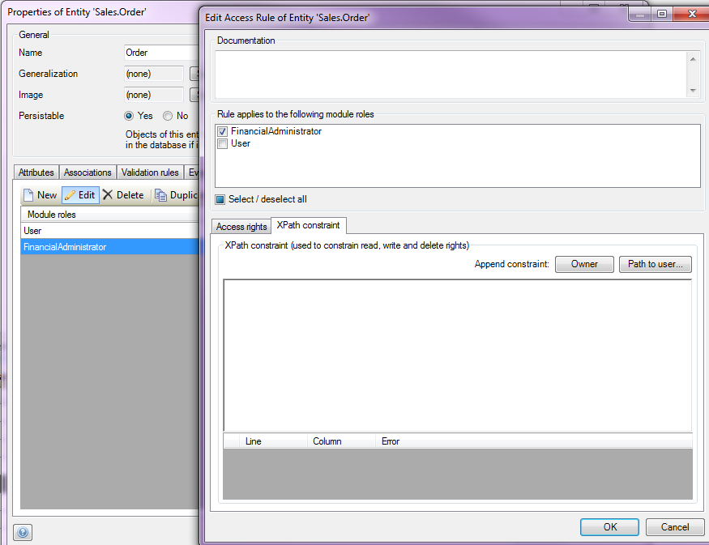
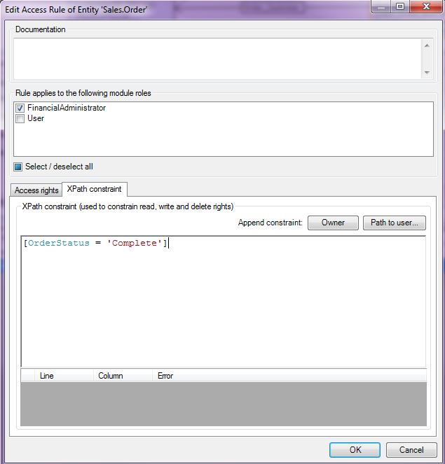
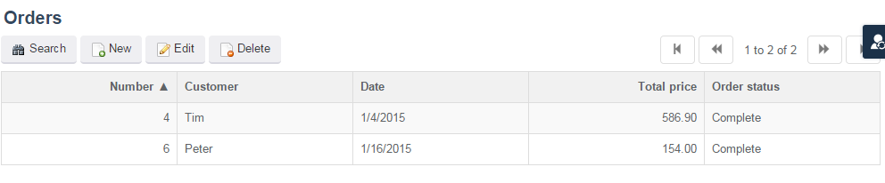

The access rules of an entity define what a user is allowed to do with objects of the entity. Users can be allowed to create and/or delete objects, and to view and/or edit member values. A member is an attribute or an association of an entity. Furthermore, the set of objects available for viewing, editing and removing can be limited by means of an [XPath constraint](/refguide5/xpath-constraints). For more details about access rules, take a look at this [documentation](/refguide5/access-rules).

In this how-to you will prepare a data structure (including security), a GUI and some example data for customers, orders and a financial administrator account. After this preparation you will define access rules for the 'Order' entity using XPath on the payment status. The XPath will constrain the order so it can only be seen by a financial administrator when the payment status of the order is set to 'Paid'.

## 1. Preparing the data structure, GUI and example data

The access rules that will be used during this how-to contains customer and order data. To be able to define access rules, you first need to setup the data structure, user roles, and GUI to maintain customer and order data. If you don't know how to create the data structure and GUI below, take a look at this [how-to](create-and-deploy-your-first-app).

1.  Create the following domain model. If you don't know how to achieve this, take a look at this [how-to](creating-a-basic-data-layer).
    
2.  Create **overview** and **detail** pages to manage objects of type **Customer** and **Order**. If you don't know how to achieve this, take a look at this [how-to.](creating-your-first-two-overview-and-detail-pages)
3.  Create **menu items** to access the **Order** and the **Customer** overview pages. If you don't know how to achieve this, take a look at this [how-to.](setting-up-the-navigation-structure)
4.  Set the security level of you application to **Production**. If you don't know how to change the security level, take a look at this [how-to](creating-a-secure-app).
    

5.  Add the user role **and** module role **FinancialAdministrator** at the security section. If you don't know how to add user/module roles, take a look at this [how-to](creating-a-secure-app).
    

6.  Give both the module roles access to all your created pages and create separate read and write access rights to all your created entities. If you don't know how to set the entity access, take a look at this [how-to](creating-a-secure-app).
    
    

7.  Add the following customer data to your app:
    

8.  Add the following order data to your app:
    

9.  Add an account to your application with the user role **FinancialAdministrator**.
    

## 2\. Define the access rules on the order entity using XPAth

In the previous section you have set up a basic data structure and created some sample data. In this section you you will define the access rules on the 'Order' entity in a way that orders can only be viewed by a financial administrator if the payment status of the order is set to 'Complete'. You will do this by adding an XPath constraint to the 'Order' entity for the module role 'FinancialAdministrator'. 

1.  Open the **Access rules** tab for the **Order** entity
    

2.  Open the **FinancialAdministrator** module role and go to the **XPath constraint** tab.
    

3.  To constrain the access of the financial administrator to only the **Complete** orders you add the following **XPath**.
    

4.  Click **OK** and re-deploy your application.
5.  If you log in with the **Financial Administrator** account you will see that only the completed orders are shown in the orders overview.
    

## 3\. Related content

*   [Defining access rules using XPath](defining-access-rules-using-xpath)
*   [Triggering Logic using Microflows](triggering-logic-using-microflows)
*   [Creating a Custom Save Button](creating-a-custom-save-button)
*   [Extending Your Application with Custom Java](extending-your-application-with-custom-java)
