This how-to explains how you can improve performance by de-normalizing data in Mendix. Before you can start with this how-to you need to create a basic data structure so that you have data to work with.

## 1. Preparation

*   Create a basic data layer. You can use this how-to: [Creating a basic data layer](creating-a-basic-data-layer)

## 2. Denormalization

Let's assume that the domain model contains two related entities called 'Customer' and 'Order'. The customer overview page needs to show the name of the customer and the total order amount next to each other. Showing the customer name is easy, but the total order amount needs to be calculated. To achieve this you generally have 2 options:

*   First option: create a calculated attribute in the 'Customer' entity to compute the total order amount. The down side of this option is that calculated attributes bring down the performance of overview pages.
*   Second option: create a persistent attribute in the 'Customer' entity that stores the total order amount in the database. This is called denormalization. The downside of this option is that the redundant data needs to be kept in sync, but with Mendix event handlers this is really easy.

1.  Create a domain model like below.
    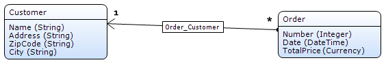
2.  Double click the **Customer** entity to open its properties.
    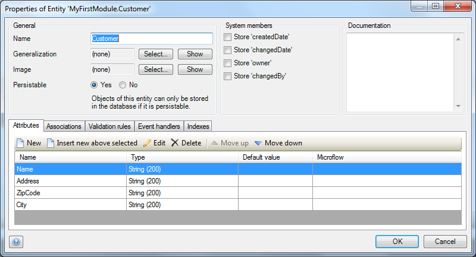
3.  Add a currency attribute **TotalOrderAmount**.
4.  Create an overview and detail page for the **Customer** entity.
5.  Make sure that the customer overview page shows the **TotalOrderAmount** value.
6.  Make sure that the order detail page has a mandatory reference selector to select the customer.

    Now the application is ready to store redundant data, but you still need to keep the data in sync.

## 3\. Keep Denormalized Data in Sync with the 'After Commit' Event.

1.  Open the **domain model**.
2.  Double click the **Order** entity to open its properties.
3.  Open the **Event Handlers** tab page.
    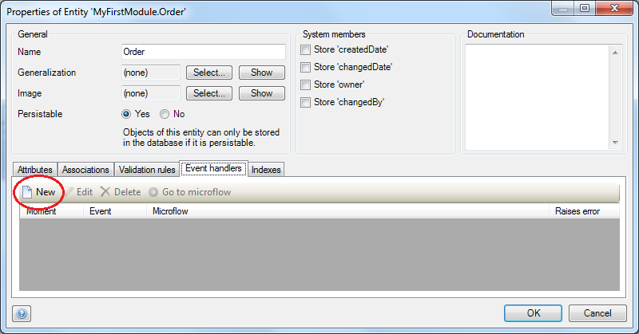
4.  Click **New **to add a new event handler.
    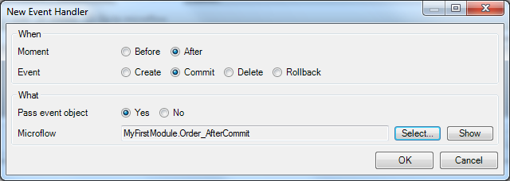
5.  Select **After** as moment and **Commit** as event.
6.  Select **Yes** to pass the event object.
7.  Click **Select...** to open the Microflow selector.
8.  Click **New** and enter a name for the new Microflow, e.g. _Order_AfterCommit_.
9.  Click **OK** to create the new Microflow.
10.  Click **OK** again to save the event handler.
11. Open the new **Microflow,** it should look like this:
    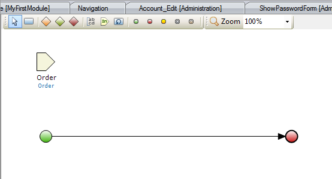
    
    Let's take a moment to think what the new Microflow should do. We want to calculate the total order amount and store this value at the customer object. As you can see, the current Microflow only has an order object as input parameter. So first we need to retrieve the corresponding customer. Then we need to get all the orders of this customer and calculate the total order amount. As soon as we have the total order amount we need to store it in the customer object. Once you're done, the Microflow should look like this:
    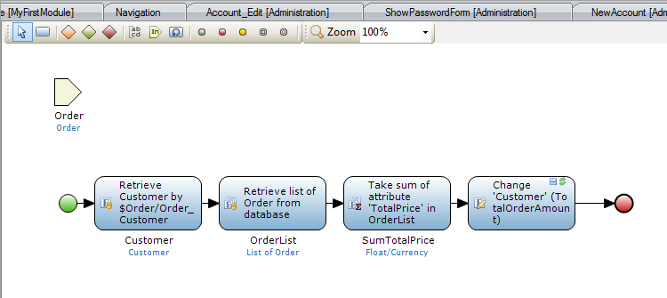

12.  Open the toolbox. It should be in the bottom right of the Mendix Modeler.
    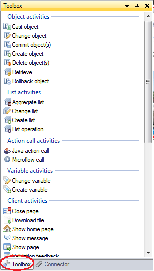
13.  If you can't find the toolbox, you can re-open it from the view menu.
    
14.  Drag a **Retrieve** activity from the toolbox to the line between the start and end event. This inserts a new retrieve activity.
15.  Double click the new **activity** to open its properties.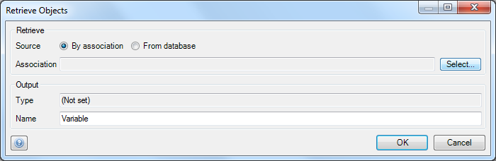
16.  Select **By Association** as **Source.**
17.  Click **Select...** to open the association selector.
    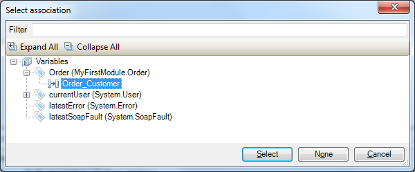
18.  Select **Order_Customer** from the **Variables** node in the tree view and click **Select.** As you can see below, the output section is configured automatically.
    
19.  Click **OK** to save the activity. Your microflow should now look like this: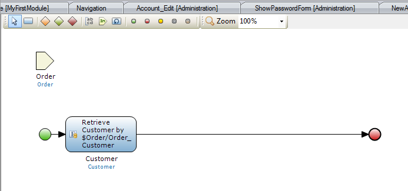
20.  Insert another **'Retrieve** activity and double click it to open its properties.
21.  Now select **From Database** as **Source**.
    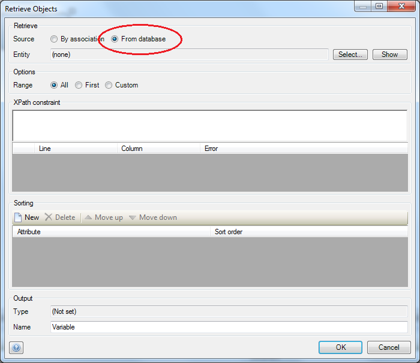
22.  Click **Select...** to open the entity selector.
    
23.  Select **Order** via **Customer** from the **Variables** node in the tree view and click **Select.** As you can see below, the XPath constraint and output sections are configured automatically.
    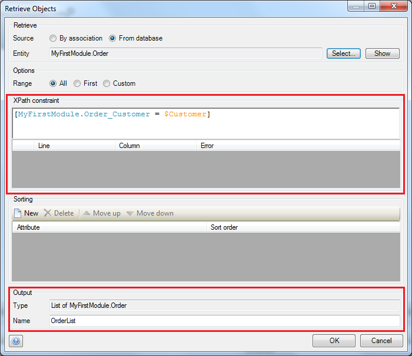
24.  Click **OK **to save the activity. Your microflow should now look like this:
    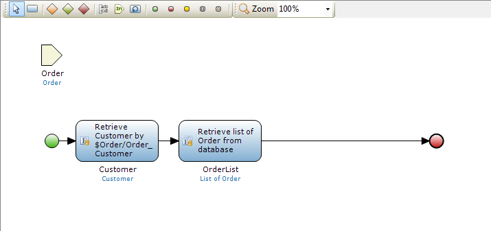
25.  Insert an **Aggregate list** activity and double click it to open its properties.
    
26.  Select **OrderList** as input variable.
27.  Select **Sum** as function.
28.  Select **TotalPrice** as attribute.
29.  Fill in **sumTotalPrice** as output variable name.
30.  Click **OK** to save the activity. Your microflow should now look like this:
    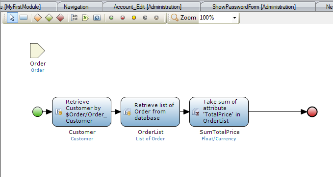
31.  Insert a **Change** activity and double click it to open its properties.
32.  Select **Customer** as an input variable.
33.  Select **Yes** as commit action.
34.  Select **Yes** to refresh in client. The object changes are made server side, with this option the server triggers the client to refresh the object.
35.  Click **New** to create a change item.
    
36.  Select **TotalOrderAmount** as member.
37.  Fill in **$SumTotalPrice** as value.
38.  Click **OK** to save the change item.
39.  Click **OK** again to save the activity. Your Microflow should now look like this:
    
40.  Run the application and create some customers and orders. You should now see an up-to-date value for the **TotalOrderAmount**.

## 4\. Related content

*   [Working with images and files](working-with-images-and-files)
*   [Creating a basic data layer](creating-a-basic-data-layer)
*   [Denormalize Data to Improve Performance](denormalize-data-to-improve-performance)
*   [Setting up data validation](setting-up-data-validation)
*   [Working With Object Events](working-with-object-events)
*   Calculated Values and Stored Values: [Attributes](/refguide5/attributes)
*   [Event Handlers](/refguide5/event-handlers)
