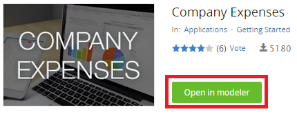
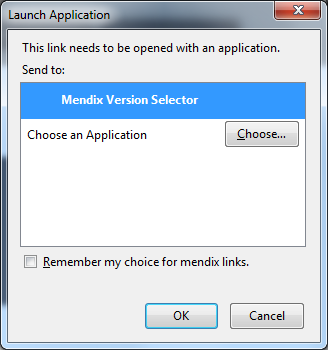
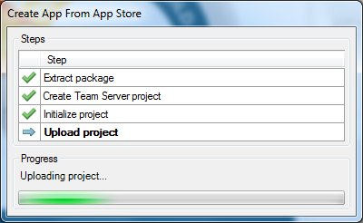
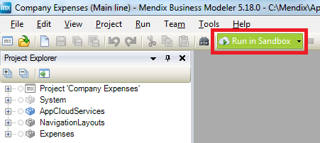
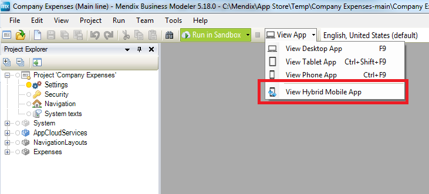
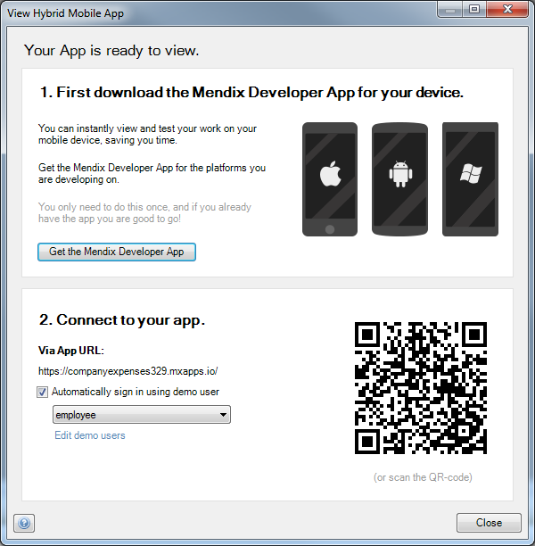
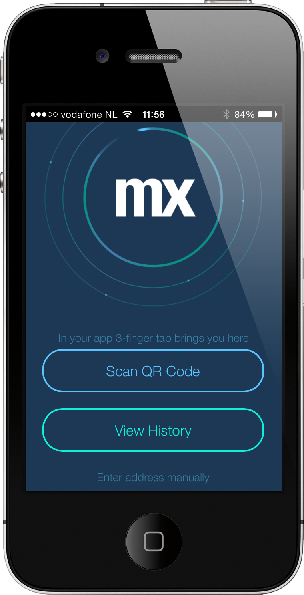
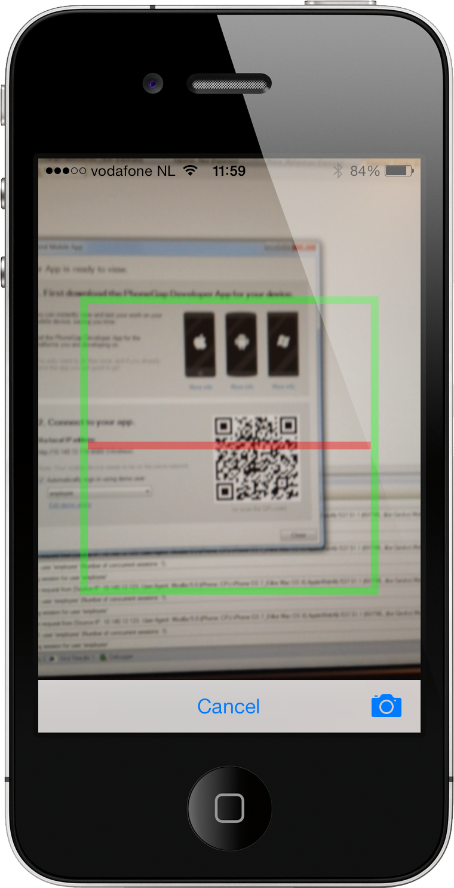
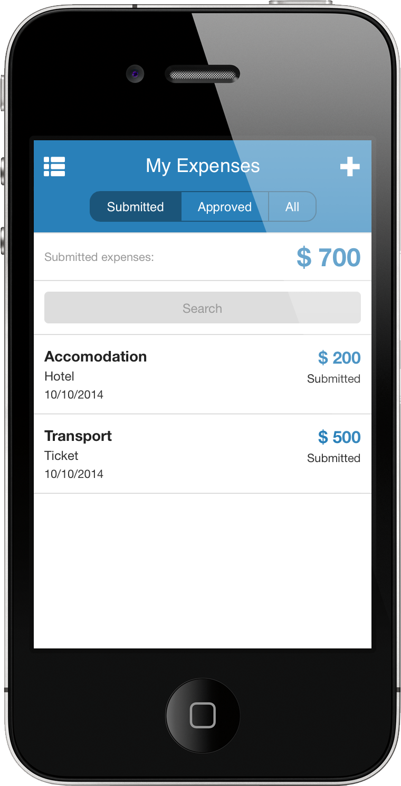

Mendix already supported mobile web development, but with the 5.10 release of the platform it's possible to create and publish hybrid mobile apps. A hybrid app gives you the best of both worlds: it's a web application that can be deployed using the Mendix platform, but it runs inside a container that can be installed as a native app on your device. This container handles native capabilities like the camera and GPS and it can even be published in the Apple App Store, Google Play and Windows Phone Store.The big advantage is that you only need to go through the approval process once and every future update is just a new deployment of your app in the Mendix Cloud.

## 1\. Preparations

*   Hybrid mobility is available since version 5.10 of the Mendix Modeler. If you don't have this (or a higher) version installed on your computer, you can download it from the [Mendix App Store](https://appstore.home.mendix.com/link/modelers).
*   Mendix Developer App: [Download](/refguide5/getting-the-mendix-developer-app). The Mendix Developer App makes it real easy to see a hybrid application in action without the need to get it approved in the different App Stores.

## 2\. Opening a hybrid example app

Go to the [Mendix App Store](https://appstore.home.mendix.com) and locate the Company Expenses example application.

1.  Go to the [Company Expenses](https://appstore.home.mendix.com/link/app/240/Mendix/Company-Expenses) in the Mendix App Store.
2.  Click **Open in Modeler**.
    
3.  Select **Mendix Version Selector** as application to open this link.
    

    The modeler will open the example application and create a new project for you.
    
4.  Click **Run in Sandbox** to deploy this application to the Mendix Cloud.
     

    The Mendix Modeler will notify you as soon as the application is deployed.
5.  Open the **View App** menu by clicking the small arrow and select **View Hybrid Mobile App**.
     

    You should see this screen:
    
6.  Open the **Mendix Developer App** on your device and select **Scan QR Code:
    **
7.  Scan the QR code on the screen with the Mendix Developer App.
    

    You should see the example application running on your device.
    

## 3\. Installing the app on your device

If you want to install this application as native app on your device, you can either install it via iTunes or publish it to one of the mobile app stores. How to achieve this is described in this [how-to](publishing-a-mendix-hybrid-mobile-app-in-mobile-app-stores).

## 4\. Related content

*   [Build a simple HRM app 1: Create, manage and deploy the app](build-a-simple-hrm-app-1-create-manage-and-deploy-the-app)
*   [Build a simple HRM app 2: First steps in building a rich GUI](build-a-simple-hrm-app-2-first-steps-in-building-a-rich-gui)
*   [Build a simple HRM app 3: Show related data in the GUI](build-a-simple-hrm-app-3-show-related-data-in-the-gui)
*   [Build a simple HRM app 4: Enrich the GUI with Filter Options](build-a-simple-hrm-app-4-enrich-the-gui-with-filter-options)
*   [Build a simple HRM app 5: Smarten up your app with business logic](build-a-simple-hrm-app-5-smarten-up-your-app-with-business-logic)
