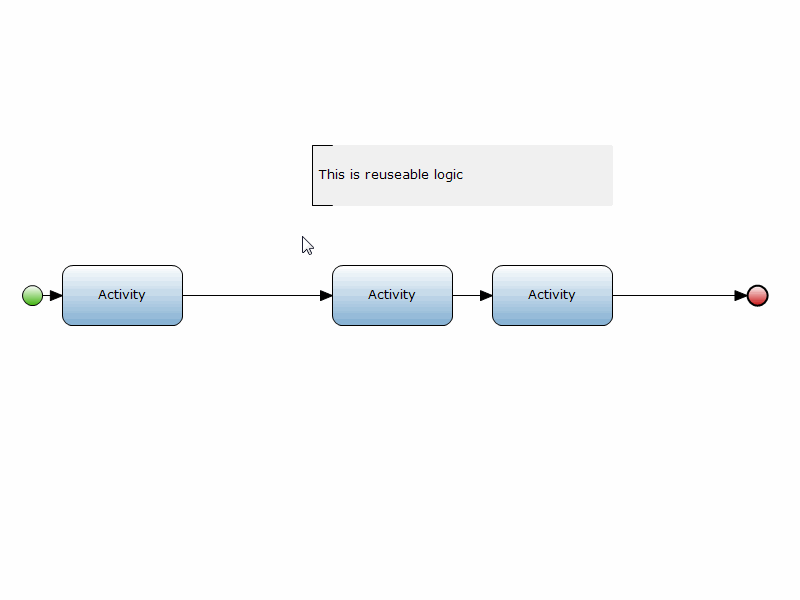

Coming home with sore hands from using the mouse too much during the day is very uncomfortable. Therefore this how-to will teach you how to use the mouse more efficiently while modeling a Mendix app. 

## 1\. Generating a sub microflow from selected actions

If it is possible, re-using logic is an important procedure while developing apps. The actions that form the reusable logic can be selected and turned into a sub microflow. This just takes two clicks as the following animation shows:

## 2\. Dragging a page into a microflow

Dragging an existing form from the project explorer reduces the amount of mouse clicks and hovering a lot. The animation shows how to drag a form into a microflow:

## 3\. Drag a microflow into a microflow

Instead of creating a new sub microflow action it is a lot easier to drag an existing microflow into the current one. The dragged microflow will automatically be identified as a sub microflow.

## 4\. Related content

*   [Defining access rules using XPath](defining-access-rules-using-xpath)
*   [Triggering Logic using Microflows](triggering-logic-using-microflows)
*   [Creating a Custom Save Button](creating-a-custom-save-button)
*   [Extending Your Application with Custom Java](extending-your-application-with-custom-java)
