Mendix is "The App Platform for the Enterprise" and in enterprise software it is not likely that you work in a [green field](https://en.wikipedia.org/wiki/Greenfield_project). In almost every situation you will need to integrate with existing systems. Mendix supports many ways of integration but this how-to focuses on how you can export XML documents with Mendix.

## 1. Preparation

Before you can start exporting XML documents, you need data in your application that is used during the export. You first need to setup the data structure and GUI to maintain customer data. Then you'll create the actual export logic and corresponding export mapping.

Before you continue, make sure that you know how to create:

*   **Domain models**, if you need more info, take a look at this [how-to](creating-a-basic-data-layer).
*   **Custom File Document**, if you need more info, take a look at this [how-to](working-with-images-and-files).
*   **Overview and detail pages**, if you need more info, take a look at this [how-to](creating-your-first-two-overview-and-detail-pages).
*   **Menu items**, if you need more info, take a look at this [how-to](setting-up-the-navigation-structure).

1.  Create the following entity **Customer** in your domain model.
    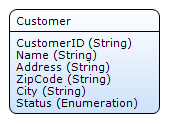
2.  Create **overview** and **detail** pages to manage Customer objects.
3.  Create a **menu item** to access the customer overview page.
4.  Create an entity **XMLDocument** that inherits all properties from **System.FileDocument**. 
    
5.  Create a reference set (Multiplicity **[*-*]) **between XMLDocument and Customer.
    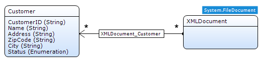

## 2\. Adding an XML Schema (XSD)

Whether you plan to import or export documents, working with XML means that your application must contain an XML schema (also called XSD). An XSD describes the possible contents of an XML file. Based on this XSD your application knows how to read or write an XML file. If you don't have an XSD file there are a couple of online XSD generators that accept an XML document as input. For this how-to you can use [Customers.xsd](attachments/8782441/8945818.xsd).

1.  Right click a module in the project explorer and select **Document** from the **Add** menu. You can also use shortcut **Ctrl+N**.
    

2.  Select **XML Schema** as document type and click **OK**.
    

3.  Enter _CustomersXSD_ as name and click **OK**.
    

4.  In the XML schema editor click **Select...** and select the XSD file that you downloaded earlier.
    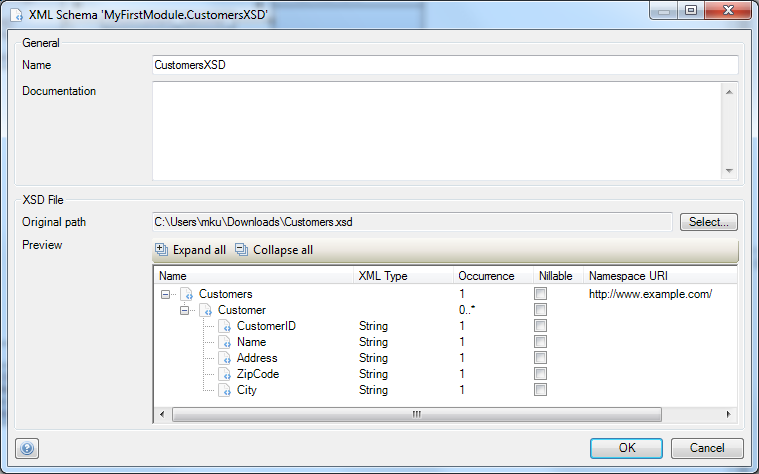

5.  Click **OK** to save the XML Schema. We'll be using this schema in the following steps.

## 3\. Creating a Domain-to-XML mapping

The XML Schema describes what the contents of an XML document should be, but we need to create an Domain-to-XML mapping to define how the data in our application is transformed into a XML document.

1.  Right click a module in the project explorer and select **Document** from the **Add** menu (Ctrl+N).
    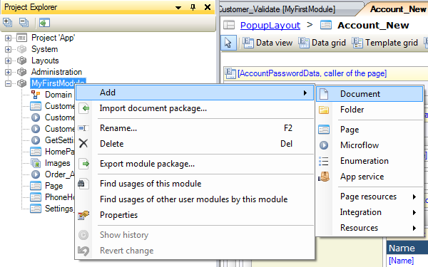

2.  Select **Domain-to-XML mapping** as document type and click **OK**.
    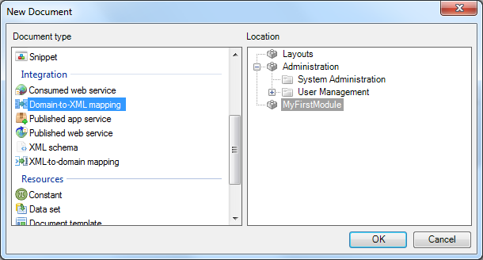

3.  Enter _ExportCustomersMapping_ as name and click **OK**. The elements selector will automatically open.
    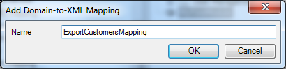

4.  Select **XML schema**as **source**.
5.  Select the previously added **CustomersXSD **as **schema**. You should now see the following tree with elements:
6.  Click the **Expand all** and **Check all** buttons. This automatically selects the Customer element and its child elements. Your screen should now look like this:
    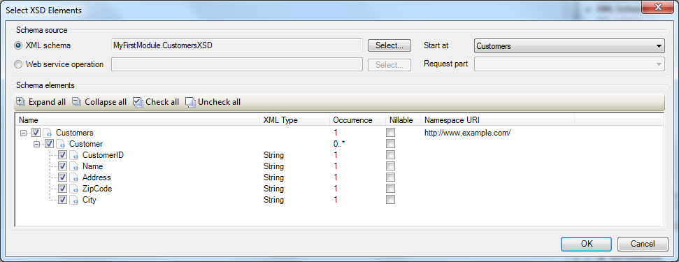

7.  Click **OK**. You should now see the first part of the import mapping like this:
    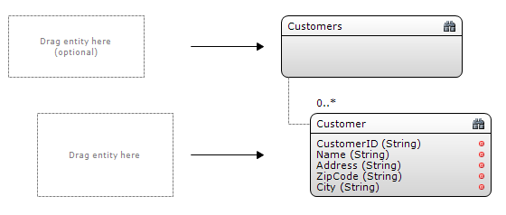

8.  Open the connector, it should be in the bottom right corner of the Mendix Modeler.
    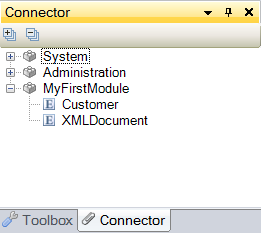

    If you can't find the connector, you can re-open it from the view menu. 

    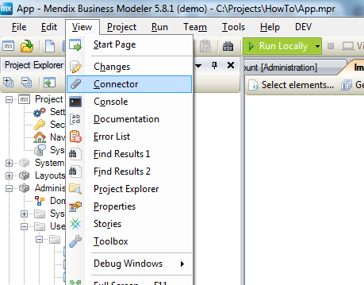 

9.  Drag the entity **XMLDocument** from the connector to the place holder in the mapping editor.
    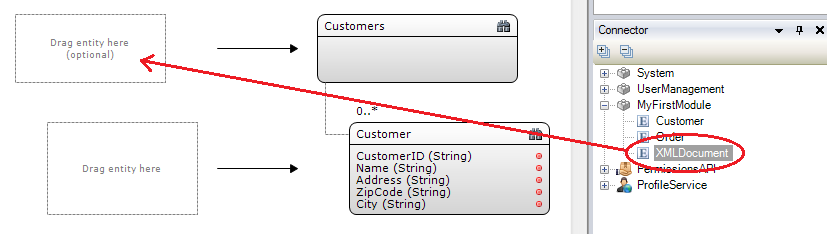
    The mapping editor for this element will pop up, you can close that by clicking **OK**.
10. Drag the entity **Customer** from the connector to place holder in the mapping editor.
    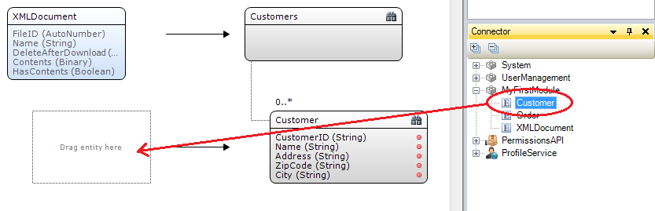

    The mapping editor for this element will open up:
     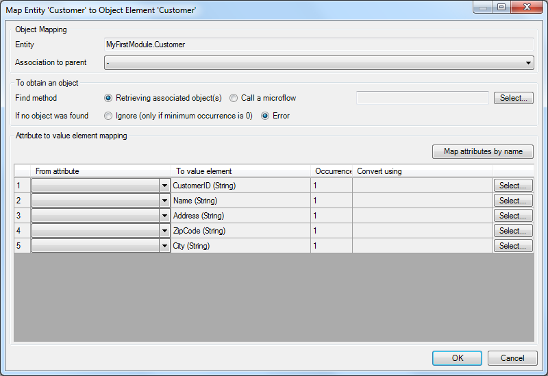

11. Verify that the **Association to parent** setting is set to **XMLDocument_Customer**, this should happen automatically.
12.  Select **Retrieving associated objects** as **Find method**.
13.  Select attributes for all 5 attribute to value mappings or click **Map attributes by Name**, you should have to following mapping:
    

14.  Click **OK **to save the mapping.

## 4\. Creating export logic

In this section we'll explain how you can create logic to export customers stored in your application to an XML document.

1.  Open the Customer overview page. It should look this when using a default layout:
    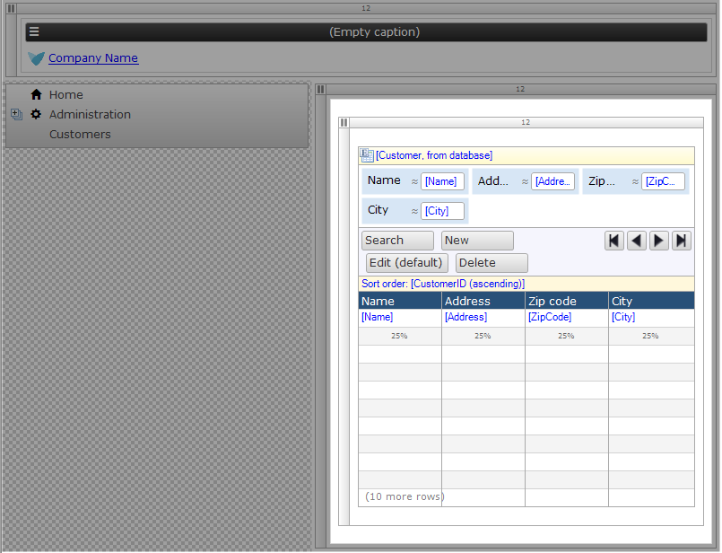

2.  Right click the toolbar of the data grid widget and select **Action **from the **Add** menu to add a new Action button.
    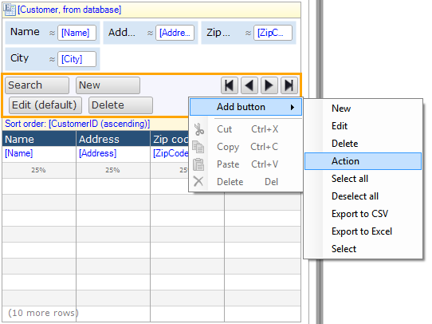

3.  Double click the new button to open the properties editor.
4.  Change the caption to **Export as XML**.
5.  Select **Call a microflow** as the **On click** setting.
    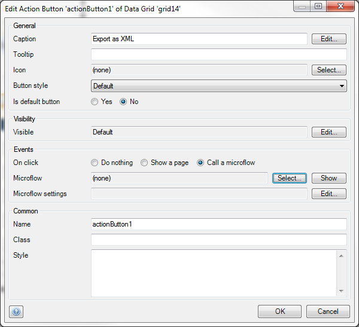

6.  Click **Select...** and create a new Microflow named _Customers_Export_.
7.  Click **OK** to save the button properties.
8.  Right click the new Action button and click **Go to microflow** in the context menu. You should see an empty Microflow with one input parameter.
    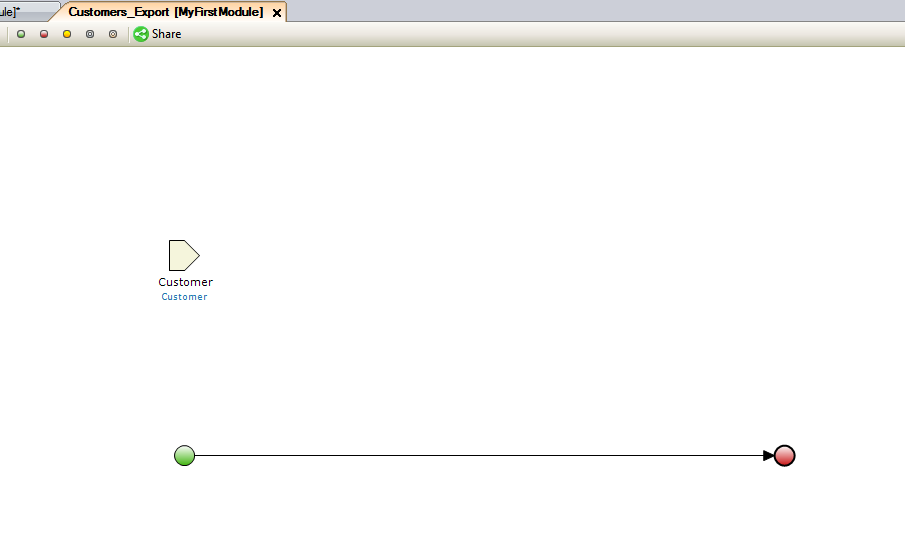

9.  Select the input parameter and delete it.
10.  Open the toolbox. It should be on the bottom right of the Mendix Modeler. If you can't find the toolbox, you can re-open it from the view menu.
11.  Drag a **Retrieve** activity from the toolbox to the line between the start and end event.
12.  Double click the activity to open the properties editor.
    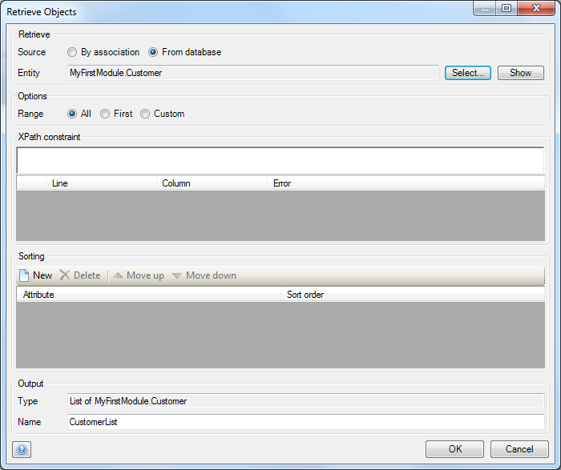

13.  Select **From database** as **Source**.
14.  Click **Select...** and select the customer entity.
15.  Click **OK**. The Microflow should now look like this:
    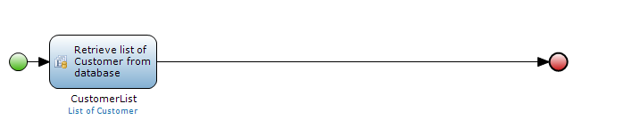

16.  Drag a **Create object** activity from the toolbox to the line between the start and end event.
17.  Double click the activity to open the properties editor.
18.  Select the **XMLDocument** as **Entity**.
    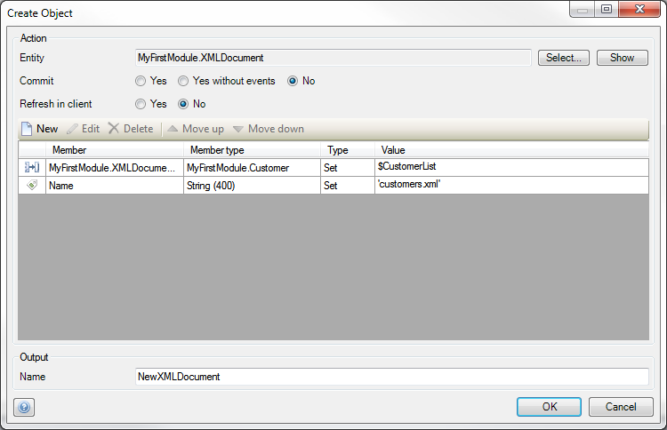

19.  Click **New** to add a change item.
    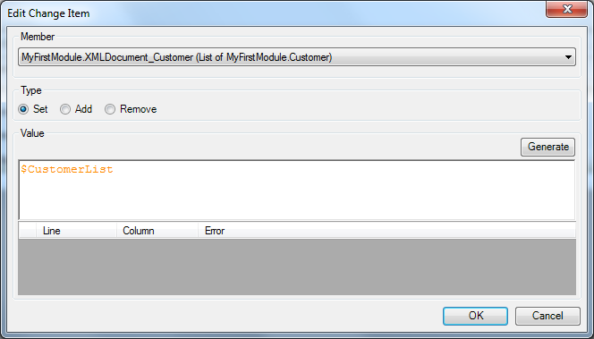

20.  Select the reference **XMLDocument_Customer** as member for the change item.
21.  Fill in _$CustomerList _as value.
22.  Click **OK** to save the change item.
23.  In the same way, create a change item to set the **Name** attribute to _'customers.xml'_ (including quote marks).
24. Click **OK** to save the action properties. The Microflow should look like this:

    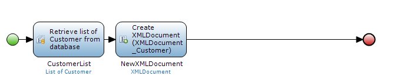

25. Drag an **Export XML** activity from the toolbox to the line between the start and end event. This inserts a new export XML activity.
26.  Double click the new activity to open the properties editor:
    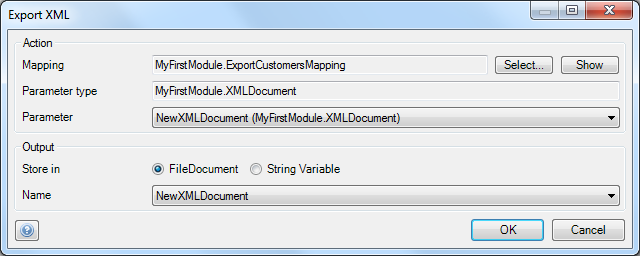

27.  Select the previously created XML-to-Domain mapping **ExportCustomersMapping** as mapping.
28.  Verify that the entity **XMLDocument** is automatically selected as **parameter type**.
29.  Select the created **NewXMLDocument** as parameter.
30.  Select the created **NewXMLDocument** as output variable.
31.  Click **OK** to save the properties. The Microflow should look like this:
    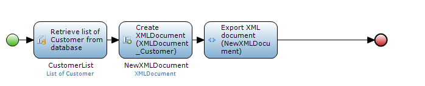

32.  Drag an **Download file** activity from the toolbox to the line between the start and end event.
33.  Double click the actvity to open the properties editor
    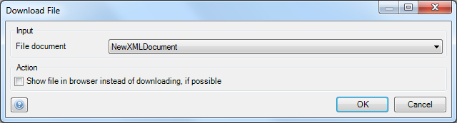

34.  Select the **NewXMLDocument** as input file document and click **OK**. The Microflow should look like this:
    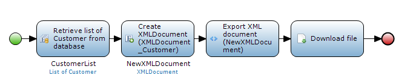

35.  Deploy the application and open the customer overview page.
36.  Click the **Export as XML** button and download the generated XML document.

## 5\. Related content

*   [Expose a web service](exposing-a-web-service)
*   [Consume a Simple Web Service](consuming-a-simple-web-service)
*   [Consume a Complex Web Service](consuming-a-complex-web-service)
