Mendix supports many ways to expose functionality or data of your application to others. The easiest way is to use web services. A web service can contain multiple operations.

**After completing this how-to you will know:**

*   How to create a web service.
*   How to publish a microflow as web service operation.

## 1\. Preparation

Before you can start with this how-to, make sure you have completed the following prerequisites.

*   Download the Mendix Modeler.

<table><thead><tr><th class="confluenceTh">Software</th><th class="confluenceTh">Version used in this how-to</th></tr></thead><tbody><tr><td class="confluenceTd">Mendix Modeler</td><td class="confluenceTd">5.20.0</td></tr></tbody></table>{}

All images, names and steps in this how-to are based on these versions. When using other versions the images and/or names on your screen may be different than the images or names used in this how-to.

{}

## 2\. Data structure and GUI

1.  Create the following entity **Customer** in your domain model. If you don't know how to create an entity, take a look at [this how-to](creating-a-basic-data-layer).
    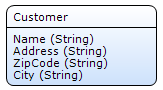
2.  Create overview and detail pages to manage objects of type **Customer**. If you don't know how to create overview and detail pages, take a look at [this how-to](creating-your-first-two-overview-and-detail-pages).
3.  Create a menu item to access the customer overview page. If you don't know how to create menu items, take a look at [this how-to](setting-up-the-navigation-structure).
4.  Run the application and add some data to expose in the web service.

## 3\. Create a published web service

1.  Right click the module you want to store the published web service in.
2.  Select **Add > Published services > Published web service** from the menu.
    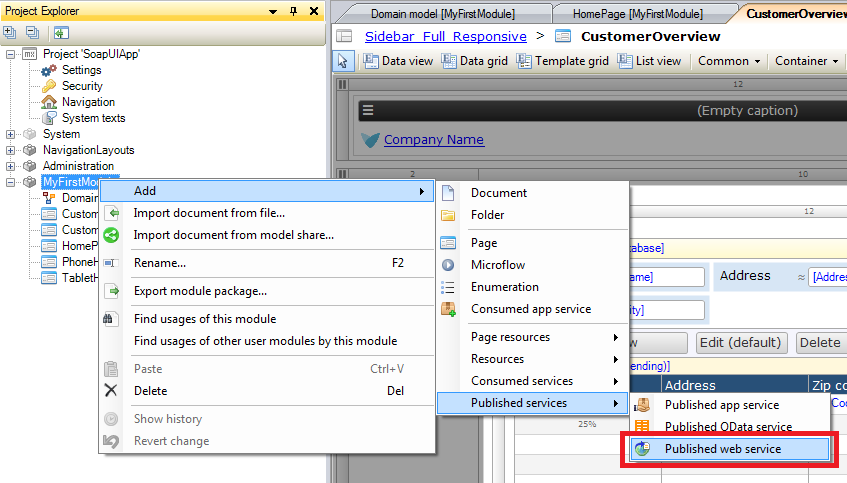
3.  Name the web service **CustomerWebservice** and click **OK**.
    
    You should now see the published web service properties.
4.  At the **General** tab you can change the name.
    
5.  At the **Operations** tab you can see the available operations of the web service. Currently this list is empty. We'll add an operation in the following steps.
    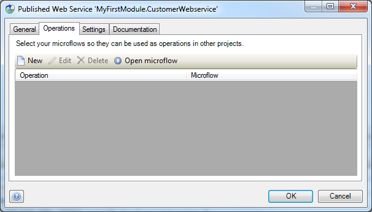
6.  At the **Settings** tab you can configure the other settings. For now leave the settings as they are, [here](/refguide5/published-web-services) you can read more about these settings.
    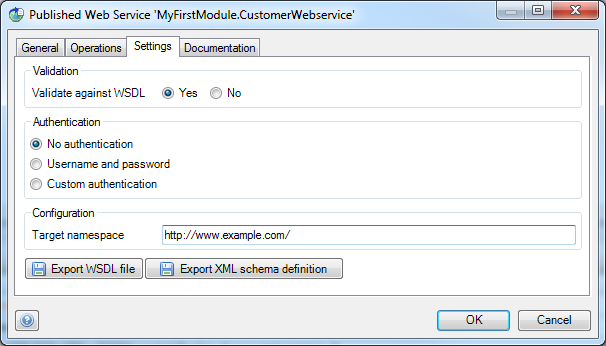
7.  At the **Documentation** tab you can change the documentation.
    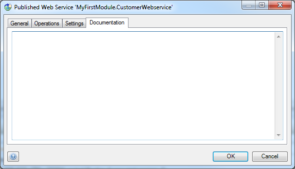
8.  Click **OK.**

## 4\. Create functionality to expose

1.  Create a **Microflow** that retrieves and returns a list of customers from the database. If you don't know how to create a Microflow, take a look at this [how-to](create-your-first-microflow-hello-world).
2.  To make the Microflow a little more exciting, you could add 2 input parameters to dynamically set the range settings of the retrieve action. Configure the range options of the retrieve action as shown below:
    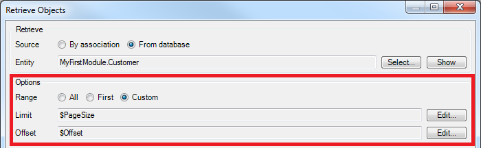

    <iframe width="100%" height="491px" frameborder="0" src="https://modelshare.mendix.com/models/083d4d13-b438-4980-b0ba-90d9a3f59f40/getcustomers?embed=true" allowfullscreen=""></iframe>

## 5\. Publish a Microflow

1.  Right click somewhere in the background of the Microflow and select **Publish as Web service operation...**.
    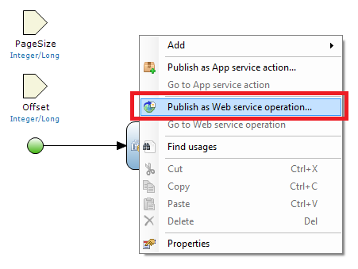

2.  Locate the web service created in step 2 of this how-to and click **Select**.
    

    You should now see the operation properties editor. At the **General** tab you can change the name and documentation.
    

    At the **Parameters** tab you can mark the input parameters as Optional and Nillable.
    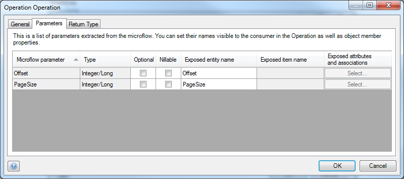

    At the **Return type** tab you can configure the return type.
    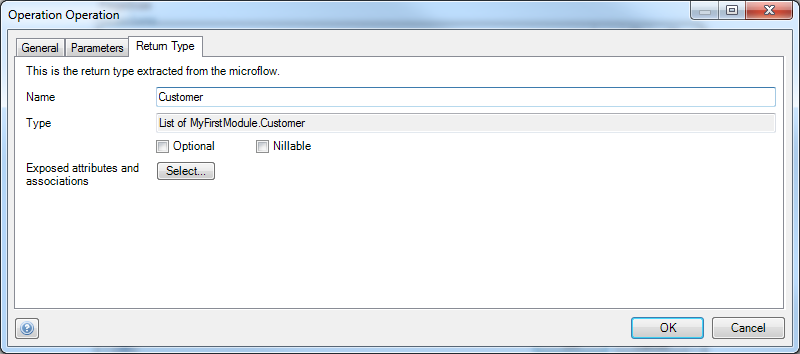

3.  Click **Select... **to select which attributes and associations of the return object **Customer** you want to expose.
    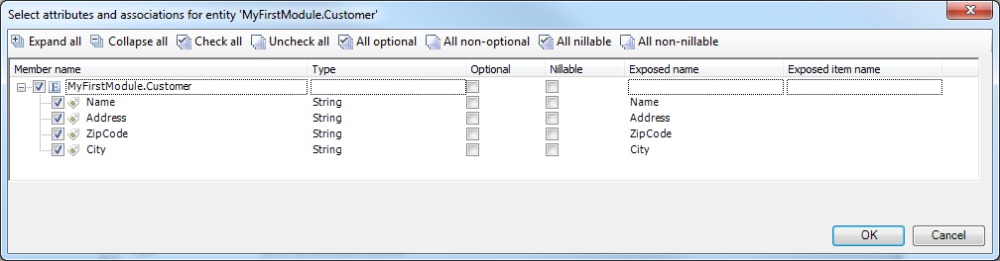

4.  Select the members you want to expose and click **OK**. Only the selected ones will be returned by the web service.
5.  Click **OK** to save the operation.

## 6\. WSDL

You need a WSDL to allow others to interact with the web service you just created. The WSDL describes how to call the operations in the web service.

1.  Run the application locally or in a sandbox.
2.  View the application in your browser.
    If you run the application locally, the application url should look like this: `http://localhost:8080/index.html`.
    If you run the application in a sandbox, the application url should look like this: `https://myfirstapp.mendixcloud.com/index.html`.
3.  In both cases you can replace _/index.html_ with _/ws-doc/_ to open the web service documentation page.
    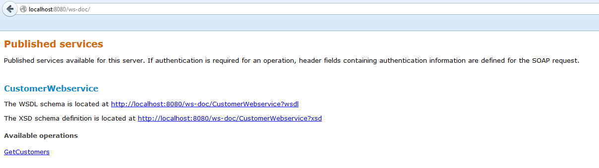
    You should see the name of your web service in the list.
4.  Click the upper URL to open the WSDL. This WSDL can be given to others so that they interact with your web service.

## 7\. Authentication and Users

1.  Double click the published web service in the project explorer to open it.
2.  Open the **Settings** tab.
    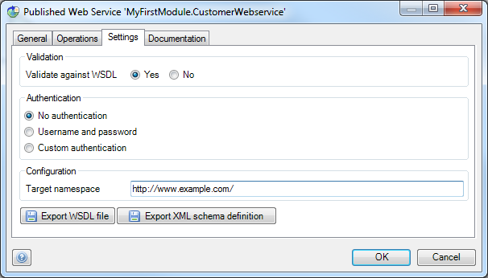
    Currently users of the web service don't need to authenticate.
3.  Switch **Authentication** to **Username** **and password**.
    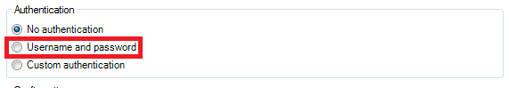 
4. Click **OK** and re-run the application. Users now need to authenticate before they can use the web service.

Mendix allows you to create your own user management functionality as long as your own user object inherits from 'System.User'. The 'User' entity in the 'System' module contains a boolean attribute 'WebServiceUser'. This attribute determines if an user is able to interact with web services. If you want a certain user to be able to interact with web services, the value of this attribute must be 'true'.

## 8\. Considerations

{}

In the modeler some words reserved, such as the words: type, enum, etc.

{}{}

Sometimes you don't wont to publishe a _type attribute with the _ character infront of it. You can change the wsdl name by changing the last column in the select attribute popup.

{}{}

If an attribute is renamed after it is published, the name in the wsdl does not automatically change (that would break a customer's implementation).

{}

## 9\. Related content

*   [Consume a Simple Web Service](consuming-a-simple-web-service)
*   [Consume a Complex Web Service](consuming-a-complex-web-service)
