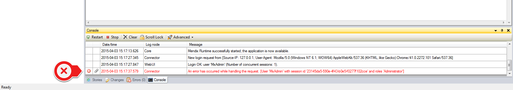
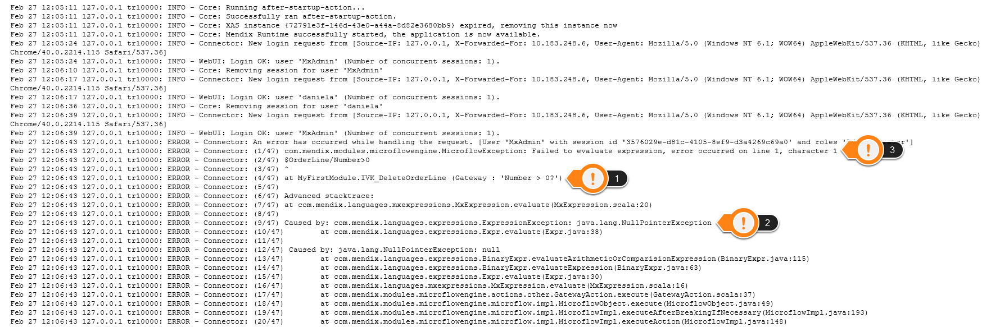

This how to will show how to find the information necessary to locate the root cause of a runtime error.  The message displayed in the application is often vague and non-descript.  Depending on the environment the error occurred in, there are two methods to find this information.

## 1. In the Modeler

If the application is deployed from the modeler, the information is located in the console.

When the error occurs a line with red font will appear in the console.  Double clicking on this line brings up the detailed information:

There are three key pieces of information:

1.  The microflow and action where the error occurred
2.  The type of error that occurred
3.  The expression that the error occurred in

With these three pieces of information, the cause of the error should be able to be found.  If you cannot determine the cause from this information, you can put in a break point in the specified microflow and debug the situation. 

## 2\. In the Application Logs

If the application is deployed from the service console or in the cloud, the information is available in the application logs.  NOTE: You will need to have the timestamp of the error when it occurred – the logs can contain a lot of information, and this timestamp will make searching through them much easier. Once you navigate to the log file, you can search for the error.

Go to the section of the log which corresponds to the time of the error.  There will be a number of lines in that timeframe that have ‘ERROR – ‘ after the timestamp.  These are the lines of the log file which will contain the necessary information.  There are three key pieces of information:

1.  The microflow and action where the error occurred
2.  The type of error that occurred
3.  The expression that the error occurred in

With these three pieces of information, the cause of the error should be able to be found.  If you cannot determine the cause from this information, you can put in a break point in the specified microflow and debug the situation. 

## 3\. Related content

*   [Clearing Warning Messages in Mendix](clearing-warning-messages-in-mendix)
*   [Testing web services using SoapUI](testing-web-services-using-soapui)
*   [Debugging Microflows](debugging-microflows)
*   [Common Mendix SSO Errors](common-mendix-sso-errors)
*   [Monitoring Mendix using JMX](monitoring-mendix-using-jmx)
*   [Debugging Java Actions](debugging-java-actions)

A blog post was written on this topic, which also provides some example errors and solutions, which is available [here](http://www.mendix.com/blog/the-root-cause-of-runtime-errors-and-resolving-the-2-most-common-issues/).  There is more information available for debugging microflows [locally](debugging-microflows) and [remotely](debugging-microflows-remotely).
