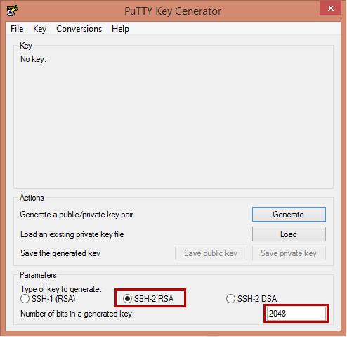
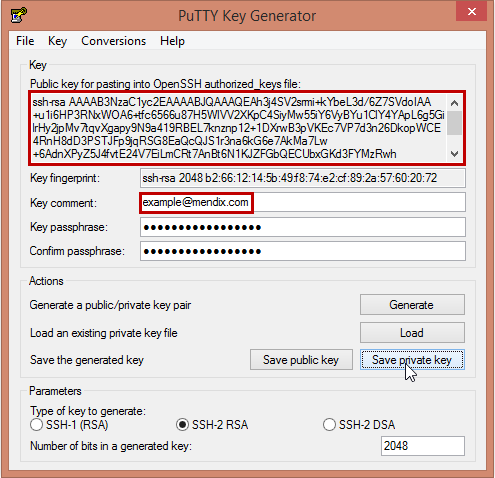
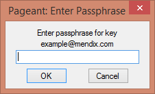
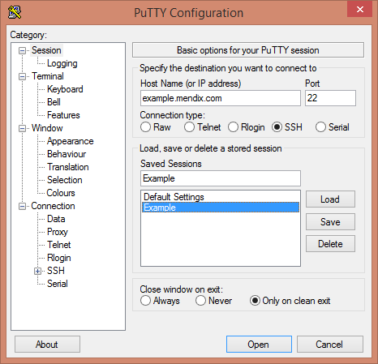

This section describes how to generate a personal SSH2 keypair for use in the Mendix hosting environment.

## 1. Introduction

### What is an SSH2 key pair?

Instead of using old-style passwords, at Mendix we use private/public encryption key pairs for user authentication on the Linux based servers. Every key pair is linked to a single 'person/employee', and consists of a private (secret, only known to the user) and a public (non-secret) part.

So, instead of maintaining a (shared) list of server login accounts with passwords, everyone has his/her personal 'digital key', that can provide access to the locations this person is authorized to log in.

Per login account on a server, multiple public keys can be listed, one for every person that is allowed to login.

### Why should I use it?

As an analogy, think of the credit card size passes that you can have to enter a secured building. Instead of a number combination (password) on the door, every person has his own card to open the door. In the password-scenario, when one of hundreds of employees leaves the company, you have to change the number combination (or change the password) and communicate the new (secret) combination to all of your employees. In case of the use of the passes, you simply revoke access of that specific plastic card to the building, and the ex-employee cannot enter the building anymore! Much more convenient and much more secure.

This is exactly how we work on linux server logins. Your private SSH key is the card, which you have to protect from abuse. The public SSH key is the card number. By granting access to doors based on the number of your access card, we can control who can enter what room (or what server account).

So, if for example, you want another person, John Doe, who is working for Example Company, to have access to the linux server environment for your test application, you first ask John Doe to generate his **own** public/private keys. After that, you communicate the public part of (like ssh-rsa AAAjdsflkjsdf john.doe@example.com) to Mendix, and request access for this person to whatever environment you're allowed to ask access for others on.

When John Doe leaves Example Company, or is not meant to have access to the server account any more, we simply revoke his access by telling the server that he may not login any more. For other users nothing changes.

One of the other main benefits of this way of working is that we never need to communicate secrets like passwords, which end up in mailboxes, notebooks and on post-its everywhere.

## 2\. How do I create my own keys?

### Preparation

1.  Download and install **PutTTY, PuTTYgen** and **Pageant **[here](http://www.chiark.greenend.org.uk/~sgtatham/putty/download.html).

### Creating a key on Linux

If you're on Linux, simply run **ssh-keygen**, and you're done in seconds. Make sure you have a **2048 bit** key, and you get the comment right (your email address).

### Creating a key pair using PuTTY

Using the tools provided with the free **PuTTY** program, everyone can create and use his/her own key pair.

Download PuTTYgen [here](http://www.chiark.greenend.org.uk/~sgtatham/putty/download.html).

1.  Start the PuTTYgen program, and set the following properties:

    *   Type of key to generate: 'SSH-2 RSA'
    *   Number of bits in a generated key: '2048'
        

2.  Then click **Generate** and help the program to generate some randomness by moving the mouse over the gray area.
3.  Enter your email address at the **Key comment** field.
4.  Choose a password (passphrase) to protect your own secret key.
5.  Click **Save private key** to save the private part to a .ppk file.
     
6.  Copy the text listed in the upper text field ('Public key for...'). This is the exact text you have to use in the next section.

    **Do not, ever, share your private key (.ppk file) with anyone.**

## 3\. So, how do I get login access to server accounts?

First, make sure your public key is known at Mendix. The preferred way to do this is to issue a support request in the support portal, so your ssh public key can be added to your user profile.

Whenever your public key is known, anyone who is authorized to grant access to others on specific deployment locations can issue a support request to have your public key added to that server account.

## 4\. I was told I should be able to log in to the 'someproject' account on the example.mendix.net server

1. Load your private key in Pageant by opening the .ppk file. You will be asked for the password which protects the use of your personal private key:
    
2. When it's loaded, start **PuTTY** and enter the server name at the **Host name** field. Other default settings for connecting (SSH, port 22) are **OK**.
3.  Choose a name and click **Save** at the Saved Sessions section if you want to have the server information saved for quick future use.
     
4.  Click **Open.** A login prompt will appear.
5.  Enter the **username** of the login account and the system should should grant you access, informing you you've been authenticated using your keys.

{}

As an alternative you can directly enter the username in the server name edit field by specifying it in the user@server format, e.g. "myappdev@[example.mendix.net](http://example.mendix.net)". When opening this 'session', no username login prompt will appear.

{}

## 5\. Related content

*   [Security](security)
*   [Generating a personal SSH2 key pair](generating-a-personal-ssh2-key-pair)
*   [Creating a secure app](creating-a-secure-app)
*   [Required Network Access for connecting to the Mendix Platform](/howtogeneral/support/troubleshoot-network-issues-for-team-server)
*   [Anonymous User Security](anonymous-user-security)
