This How-To will teach you how to use the Widget Development Plugin for Adobe Brackets. The Widget Development Plugin for Adobe Brackets is a plugin for Adobe Brackets that allows a Mendix Developer to quickly create a Custom Widget project. Adobe Brackets is a code editor for HTML / JavaScript and CSS. The Widget Development Plugin for Adobe Brackets will turn Brackets into an IDE (_Integrated Developement Environment)_ for creating Custom Widgets for the Mendix platform. 

## 1\. Preparations

Please follow these preparations before continuing with this how to.

*   Download Adobe Brackets [here](https://github.com/adobe/brackets/releases/tag/release-1.1)

## 2\. Getting started with Adobe Brackets

1.  **Install** Adobe Brackets on your computer
2.  **Open** Adobe Brackets after the installation completes. Your screen should look similar to this this: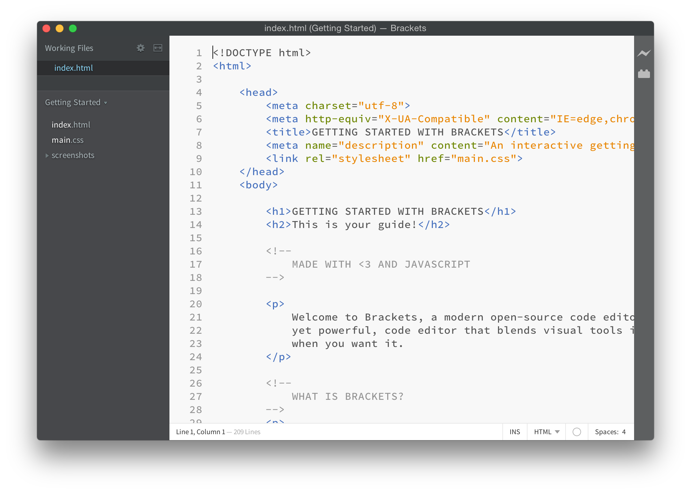

**2.1 Adding the Widget Development Plugin for Brackets**

1.  Open the **Extension manager** by going to **File > Extension manager...**:
    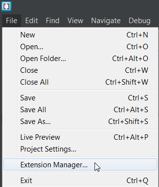
2.  Search for **Widget** the Available tab:
    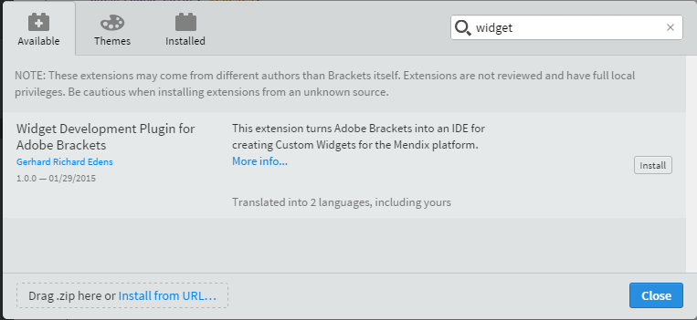
3.  Click **Install** for the **Widget Development Plugin for Adobe Brackets** extension:
    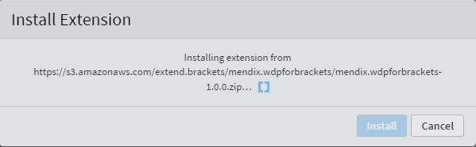
    The Widget Development Plugin is now available in Adobe Brackets. 

## 3\. Creating a new widget

The plugin adds menu options to Brackets. One of them is to start a new Custom Widget. You can start creating a new Custom Widget based on the _AppStoreWidgetBoilerplate_ that is available on the [Mendix GitHub repository](https://github.com/mendix/AppStoreWidgetBoilerplate).

1.  Select **File > New Widget** from the menu to start.
    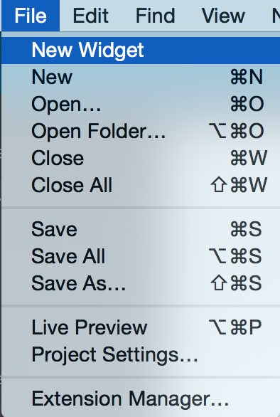

The name of the widget is very important, this name is the name used in Mendix. It is strongly recommended to use [CamelCase](http://en.wikipedia.org/wiki/CamelCase) naming convention. Each new widget should at have an author, version number, copyright, license, package name, widget name and path defined before you can click OK. The location directory must alsoexist.

Information about the settings: 

*   The author should only contain a-z and A-Z characters
*   The license should only contain a-z and A-Z characters
*   The copyright should only contain a-z , A-Z and 0-9 characters
*   The version should only contain 0-9 and / or a . characters
*   The package name should only contain a-z and A-Z characters
*   The name should only contain a-z and A-Z characters
*   The location should only contain a valid directory path

1.  Provide the following values:

    <table><thead><tr><th class="confluenceTh">Field</th><th class="confluenceTh">Value</th></tr></thead><tbody><tr><td class="confluenceTd">Author</td><td class="confluenceTd">Enter your name</td></tr><tr><td colspan="1" class="confluenceTd">License</td><td colspan="1" class="confluenceTd">Apache 2 / MIT</td></tr><tr><td colspan="1" class="confluenceTd">Copyright</td><td colspan="1" class="confluenceTd">My Company B.V. 2015</td></tr><tr><td class="confluenceTd">Version</td><td class="confluenceTd">1.0</td></tr><tr><td colspan="1" class="confluenceTd">Package name</td><td colspan="1" class="confluenceTd">MyFirstPackage</td></tr><tr><td class="confluenceTd">Name</td><td class="confluenceTd">MyFirstWidget</td></tr><tr><td colspan="1" class="confluenceTd">Location</td><td colspan="1" class="confluenceTd">Select a folder on your local drive</td></tr></tbody></table>

    

2.  Click **OK**.
    The plugin will get the latest version of the **AppStoreWidgetBoilerplate** from GitHub, unpack all the contents in the location directory, rename all files and folders, and finally alter the content inside the files according to these settings.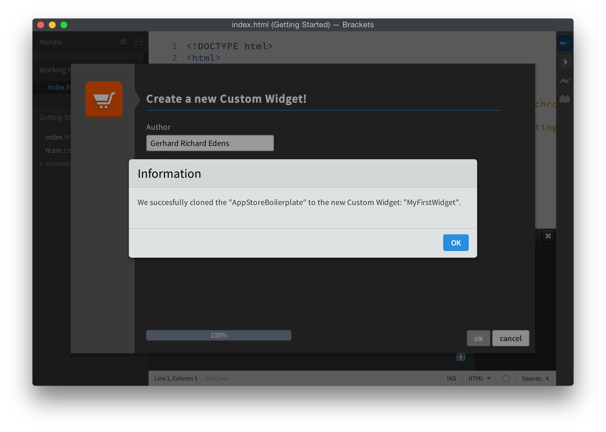
    The location directory is now automatically opened inside Adobe Brackets.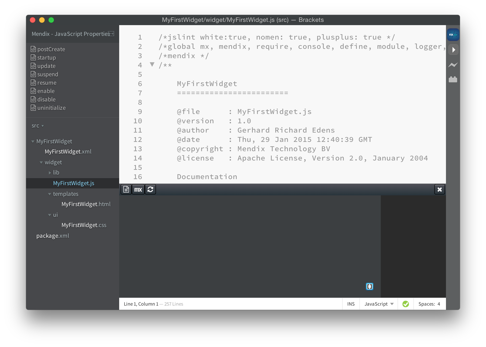

## 4\. Exploring the widget directory

1.  Open the widget source directory. This is the directory you entered when creating the widget.

{}

Because the boilerplate is used you will have a widget that is compliant with the standards we have defined for a GitHub Custom Widget repository. 

{}

The new widget source contains the following directories:

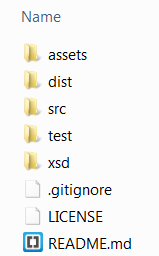

**The dist Directory**

The **dist** directory eventually must contain the .MPK file you create with the SDK.

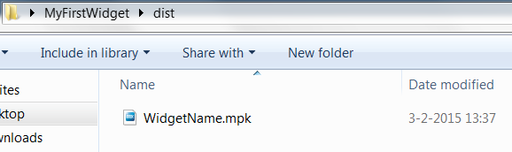

**The src Directory**

The **src** directory contains the source files for your widget.

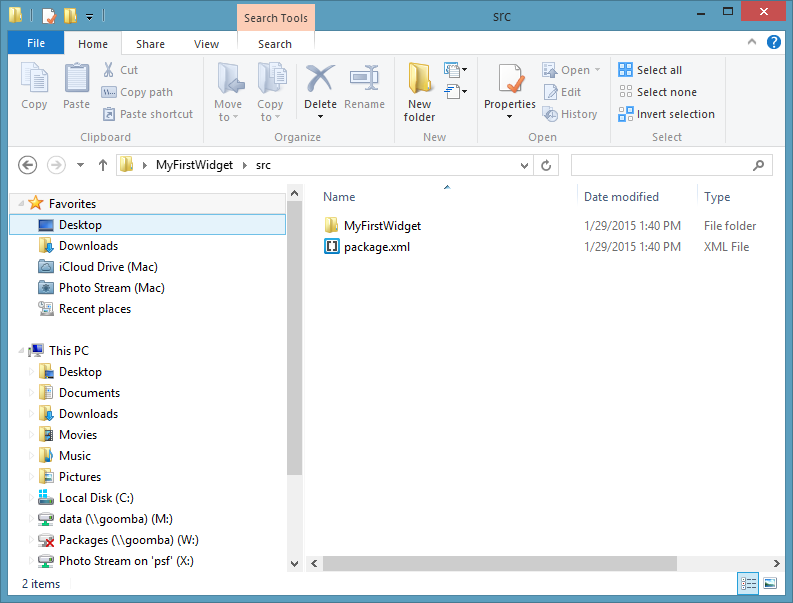

**The test Directory**

The **test** directory contains a fully prepared Mendix test project to test your widget.

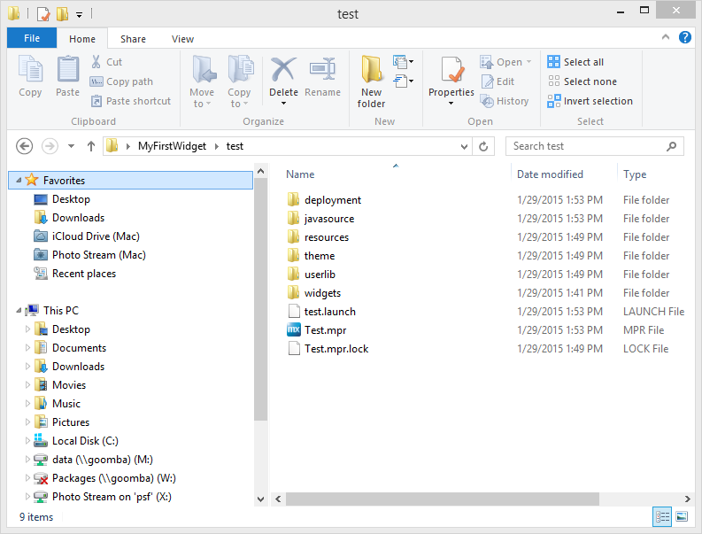

## 5\. Building the widget

In this chapter you will package the widget source into an MPK file.

1.  Create an MPK file by pressing  or clicking the the PLAY button on the right side.
    
    You are informed that the widget is created.
    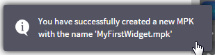
2.  The newly created MPK package is placed in the **test_>_ widgets** directory.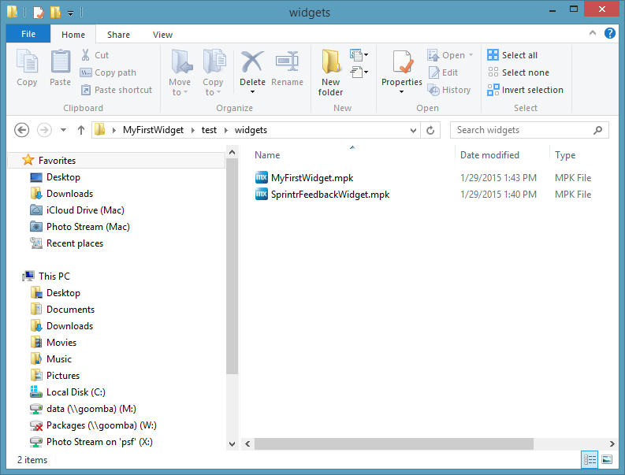

## 6\. What have we learned today?

This How-to has enabled you to start working and building a Custom Widget for the Mendix platform. Using Adobe Brackets as your main integrated development environment. The code examples inside the AppStoreWidgetBoilerplate will provide you a quick overview of what you need to interact with both the user interface and Mendix.

## 7\. Related content

*   [Getting started with the Widget Development Plugin for Adobe Brackets](getting-started-with-the-widget-development-plugin-for-adobe-brackets)
*   [Creating a chainable Custom Widget](creating-a-chainable-custom-widget)
*   [XML Reference Guide](/refguide5/xml-reference-guide)
*   [Creating a Basic Hello World Custom Widget](creating-a-basic-hello-world-custom-widget)
*   [The Mobile Slider Custom Widget](the-mobile-slider-custom-widget)

Some interesting books and articles you might want to read next to dive into the sourcecode of the AppStoreWidgetBoilerplate:

** Writing your own DOJO Widget**

Mendix Custom Widgets are based upon DOJO widgets. You will find the following BLOG post very useful.

[http://dojotoolkit.org/reference-guide/1.10/quickstart/writingWidgets.html](http://dojotoolkit.org/reference-guide/1.10/quickstart/writingWidgets.html)

** ** **The Mendix Client API 5.0**

To communicate with Mendix you need to use the Mendix JavaScript Client API. Read all about it at the following online documentation:

[https://apidocs.mendix.com/5/client/](https://apidocs.mendix.com/5/client/)

** ** **Learning JavaScript Design Patterns - ** **by Addy ** **Osmani**

A very nice book that helps you understand what JavaScript is all about.

[http://addyosmani.com/resources/essentialjsdesignpatterns/book/](http://addyosmani.com/resources/essentialjsdesignpatterns/book/)
