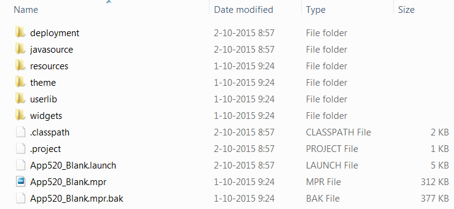

Is your application ready to make use of the features of Mendix 5 but are you not sure how to convert your project to Mendix 5? Don't worry! We are here to help and we are confident that this how-to will lower the barrier that some of you might have. This structured plan is the key to ensure a smooth transition from Mendix 4 to Mendix 5.

Before you continue reading this how-to make sure you have read the [reference guide](/refguide5/moving-from-4-to-5) to understand some of the basics of a Mendix 4 to Mendix 5 transition.

Please note that this plan is quite extensive and that we are aiming for the larger applications with this how-to. You can also use this how-to for smaller applications but that may lead to some overhead. For those applications we recommend taking the parts from this how-to that suit your projects needs.

This how-to will teach you how to do the following:

*   Structure a Mendix 4 to Mendix 5 conversion
*   Do an inventory of your model
*   Keep a clean model

## 1 Preparation

To start with your Mendix 4 to Mendix 5 conversion you want to have a number of things identified, arranged and planned. In the following steps we will help you to set up your plan and identify risks and how to mitigate them.

Next to that it is important to set expectations for the outcome of the conversion. We always recommend doing an as-is conversion to keep the throughput time to a minimum. Improvements can best be taken to a backlog and carried out when the conversion is done.

### 1.1 Intake

First of all you need to do an intake to identify the different skills that you need during this conversion, which Mendix version is going to be the new version, and which factors are relevant for testing the application.

Download a template of the intake [here](attachments/18448628/intake_template.docx).

### 1.2 Prepare an Environment for Test Purposes

After you have defined the key persons, and have a possible start date in mind, you can start arranging a test environment.

Because setting up a proper test environment can sometimes be quit time-consuming, and we do not want to unnecessarily excess the throughput time, we have moved this step to the first phase of the conversion.

Within a proper test environment we have hardware specifications that meet the specifications of the production environment, have test data that represents production data, and can integrate with all integration points like the production environment does.

Also the availability of different devices and the installation of the correct browsers are important in this step.

### 1.3 What You Can Test to Guarantee Success

Now that you have set out actions to arrange a proper test environment, you can identify what you need to test in order to verify that the conversion was a success. You only want to go live when you are completely sure that everything is working as intended.

You want to define a number of test scenarios. Make sure that you at least focus on:

*   The core functionalities of your application
*   Testing all of your user roles
*   Testing all of your integration points

Maybe you still have test scenarios available from your development period and can reuse those.

### 1.4 Get the Right People Available

You now have an idea on what you want to test to verify that the application is successfully converted.

This means that you can now try to get the skills available that are identified during the intake. You will probably need a few people to successfully perform this upgrade. Think of a person who was continuously involved during the project development, and subject matter experts that where involved or have know-how of integrations or Java actions. It is important to know their agenda in order to define some timelines for this conversion.

### 1.5 Get Educated

Now that you have identified which people will be part of the conversion, we need to make sure that they have the right knowledge to work on the conversion. They might get into situations where they will have to make a choice about how to go forward. How will they make the right choice? Do they have enough know-how and insight into the capabilities to make such a decision? To help you in getting the knowledge needed you can do the following:

*   Read the [release notes](/releasenotes/desktop-modeler/)
*   Read [blogs and how-to's](https://developers.mendix.com/) on related topics
*   Follow a Mendix 4 to Mendix 5 conversion workshop. Contact Mendix for more information about this custom workshop

### 1.6 Inventory of the Model

The next step is to create an inventory of the model. You want to administer what is in the project and what actually belongs in the project. Think of complete modules, documents, or widgets that were once imported, but no longer have a purpose in this project.

When the application doesn't use them, get rid of them! This is a way to lower the risk of a conversion failure.

Other items in the project, like App Store modules and widgets, may need to be replaced with newer versions suitable for Mendix 5. We have put together 3 documents to help you to register your model:

*   [ConversionMx4toMx5_InventoryApp_StoreModules_Template.xlsx](attachments/18448628/ConversionMx4toMx5_InventoryApp_StoreModules_Template.xlsx)
*   [ConversionMx4toMx5_InventoryWidgets_Template.xlsx](attachments/18448628/ConversionMx4toMx5_InventoryWidgets_Template.xlsx)
*   [ConversionMx4toMx5_InventoryResources_Template.xlsx](attachments/18448628/ConversionMx4toMx5_InventoryResources_Template.xlsx)

Important for your modules and widgets, is that you can make a comparison between the current version and the replacement, to ensure that the new version will do what you expect.

### 1.7 Create a Timeline for Your Plan

Now that you have identified the people that you need, they are equipped with the knowledge to execute a conversion, and you know when they are available, it's time to make a planning for the conversion. It is important to identify which factors can be a risk for the planning and ensure that you mitigate those risks as much as possible to comply to your planning.

## 2 Clean up Mendix 4

Now that you have made a plan to execute, you can start by cleaning up the model. This will help in reducing risk and avoiding doing unnecessary work.

### 2.1 Freeze Feature Development

It is not advised to continue feature development because of the possibility to mix up work on different branches, and because of losing overview of who is doing what on which branch. Best is to wrap up feature development, test the functionality, merge that branch into the main line, and deploy to the production environment like you would with every release. Once this is done you will have your base line in the main line, and can use that for the conversion. Branch lines can be removed at that point since all changes are now part of your main line.

### 2.2 Main Line or Branch Line

Now that you have no branch lines anymore, and your production environment contains the latest version of the main line, you can start to use the main line as your development line. Where normally you would create a branch line to work on new features, you continue working on the main line for this conversion. This is because it can become a problem to merge a Mendix 4 main line with a Mendix 5 branch line.

### 2.3 Upgrade to the Latest Mendix 4 Version

When you use a version prior to the latest Mendix 4 version, we recommend upgrading to the latest Mendix 4 version. At the time of writing that is 4.8.10. This will make the gap between Mendix 4 and 5 smaller. There might be errors you need to solve, so make sure to solve them and commit your model via the Mendix Modeler.

### 2.4 Remove Unused Items

To start cleaning your model you start with the removal of your unused items. Pages, microflows, and other model resources can easily be found with the **Find Advanced** feature of the Mendix Platform. Make sure that you are aware of any resources being used by external resources, like java actions. Those results can come up in your unused items search results while they are actually in use. You therefore always need to be careful with what you delete! In Mendix 5 you have a new document property where you can flag this document as being used to prevent it from showing in your unused items search results. We therefore recommend registering those documents so you can flag them in Mendix 5, to prevent them from appearing as unused again in your Mendix 5 version.

Please note that the App Store modules can be skipped, since those should not be in your control and should be released clean into the App Store.

We recommend removing documents and committing via the Mendix Modeler per module, so you can oversee the work done and track the changes.

{}

Be sure to search multiple times for unused items, since the deletion of documents can result in other documents becoming unused.

{}

### 2.5 Resolve Model Deprecations and Warnings

When all unused model resources have been removed, you can start solving the deprecations. When you solve the deprecations you will prevent those items from becoming errors in Mendix 5. When you are done, commit your changes.

The next thing is solving the warnings in your project. Solve as many warnings as possible, to ensure that those warnings do not lead to wrongly implemented functionality. Once you are done, commit your changes via the Mendix Modeler.

### 2.6 Remove Unused SVN Files

Now that you have removed all the unnecessary model resources you can dive into the files of your project directory.

Start at the highest level, the root folder. See the example of a healthy root folder below. Everything else in your root folder might be a candidate for removal or relocation. Think of documents like Word and Excel that could be moved to your project in home.mendix.com, instead of being part of your SVN repository.

If you move a level deeper you can remove a number of things on various levels.

*   Javasource: unused module folders, unused AppService folders and unused java actions
*   Resources: Unused miscellaneous files
*   Theme: Old theme zip files
*   Userlib: Unused java archive files (.jar files)
*   Widgets: Unused custom widgets

We recommend committing your changes via the Mendix Modeler, and a commit per subfolder.

### 2.7 Resolve Java Deprecations and Warnings

In this part you will need to open Mendix in a tool like Eclipse, in order to view deprecations and warnings within your java code. Make sure that you solve all of the deprecations and as many warnings as possible. Again you can skip App Store modules.

Commit your model via the Mendix Modeler once you are done.

### 2.8 Normalize and Upgrade App Store Modules

When you have made customizations in your App Store modules, you do not want to lose them when upgrading your module. We therefore recommend moving your customizations to a separate module. This way you can safely upgrade your App Store modules without losing your customizations. Resolve any errors and commit per module via the Mendix Modeler.

### 2.9 Test Your New and Cleaned up Mendix 4 Version

Now that you have cleaned up your Mendix 4 version you can test it. Verify that the functionality is still the same as before.

## 3 Convert to Mendix 5

### 3.1 Remove Your Theme

In your current project you probably have a custom theme to make your application fit your corporate branding. This theme can no longer be used in Mendix 5 due to the [major changes](https://www.mendix.com/blog/the-eye-catching-mendix-ui-framework/) in the platform. Therefore, you can remove all the files in this folder from the project. You do not, however, want to throw all your theme files away, you just separate it from your project. You might be able to use parts for building your new theme.

### 3.2 Upgrade Your JDK Version

In Mendix 4 you were able to use version 6 of the JDK, but with Mendix 5 you cannot use version 6 and need to upgrade to JDK 7 or JDK 8\. Both are supported, where JDK 8 is the preferred version. Please [download](http://www.oracle.com/technetwork/java/javase/downloads/jdk8-downloads-2133151.html) your 32 or 64 bit version.

### 3.3 Upgrade to Mendix 5

The last thing you now need to do before you can actually start converting your model is to [download](https://appstore.home.mendix.com/index3.html) a Mendix 5 version, preferably the latest version. Open your project with Mendix 5 to start the wizard that will guide you through the conversion.

### 3.4 Upgrade Wizard / Upgrade App Store modules and Java Code Conversion and Java Web Service Calls Conversion

The first step in the wizard will help identify the App Store modules in your project and upgrade those where needed. At first you select which of the modules in your project are App Store modules and to which App Store module they co-relate. Once you have confirmed the modules, the wizard will search for the latest versions of those modules. Be aware that it can happen that there is no correlating Mendix 5 version available for a module. The module will still be flagged as an App Store module but will not be replaced with a new version.

After your App Store modules have been updated, some automatic java code changes for logging and web services will be carried out.

Once that is done make sure that you resolve all the errors to continue to the next step of the wizard.

### 3.5 Upgrade wizard / Migrate Java Libraries

When you are making use of custom java actions, you might get errors in this step. See [this page](/refguide5/moving-from-4-to-5) to learn how to deal with those java errors.

Make sure that you have resolved all errors and commit via the Mendix Modeler. This finishes the conversion wizard.

### 3.6 Create New Theme Base

For your project you want to have a fresh base for a new theme. The best way to achieve this is to create a new Mendix 5 project and copy the files from the theme folder to your projects theme folder. The files are:

*   index.html
*   index-rtl.html
*   login.html

Commit your work via the Mendix Modeler without errors and continue with the next step.

### 3.7 Resolve Model Deprecations and Warnings

Resolve all of your model deprecations and warnings that are coming up because of Mendix 5. The number of items that you need to solve here should be very limited, since you have already done this in your Mendix 4 version.

There are two deprecations that we will highlight here, **currency** and **use main placeholder for pop-ups**.

The currency data type is deprecated because of the introduction of a new data type called Decimal. This new type was introduced in [Mendix 5.14](/releasenotes/desktop-modeler/5.14). You will have two logical options to solve your deprecation messages. You can convert your currency data type to a float or to a decimal. Please read the following [guide](/refguide5/data-types) to determine what works for your project.

The second deprecation is the **Use main placeholder for pop-ups** property of a layout. You can read the following [article](https://www.mendix.com/blog/feature-find-page-open-locations/) to learn how to deal with that situation.

Commit your work via the Mendix Modeler without errors and continue to the next step.

### 3.8 Resolve Java Deprecations and Warnings

When you have custom java actions, you can open your project with a tool like Eclipse to manage your java actions. In Eclipse you can find all your deprecations and warnings. Make sure that you solve those in this step.

Commit your work via the Mendix Modeler without errors and continue to the next step.

### 3.9 Consumed Web Services

We recommend re-importing the web services that you are consuming. Resolve any errors that arise, and commit your work via the Mendix Modeler without errors and continue to the next step.

### 3.10 Update Widgets

In this step you can update the widgets of your application. In the preparation phase of your conversion you have registered your widgets and the versions you want to use as replacements. Go to the App Store via the Mendix Modeler and download your selected versions.

Download new versions of the widgets from the App Store. Resolve any errors and commit.

### 3.11 Create New Theme

The creation of a new theme can be quite time-consuming, and can have a large impact on the duration of your conversion. Make sure that you allocate enough resources and time for the result you want to achieve. A pixel-perfect like for like theme can be hard to accomplish and should not be the goal for your theme. An as-good-as theme is a better approach, that will save you a lot of time. It is probably better to move the creation of a completely new design to after the go-live of the new converted version.

### 3.12 Test, Test, Test!

Now that you are done with all steps of the conversion, you want to verify that all your changes result in an application that behaves how you expect it to. You can verify this with the test scripts that you defined earlier. You might run into some issues, so make sure you reserve enough time for testing and resolving of issues.

### 3.13 Release

When you are done with the complete conversion and the tests to verify the functionality, you can update the production environment. Always make sure that you create a backup before doing an upgrade, select a logical time to do the upgrade, and know which values you need to fill in for your constants and custom settings.

Congratulations, you have now successfully converted your Mendix 4 application to Mendix 5! You might have seen a number of things that can be solved differently with Mendix 5, so that you have not only updated your model to Mendix 5, but are also made the best use of the new capabilities of Mendix 5. It looks like a new journey is awaiting...
