Adding large amounts of data to your application, for example rootdata or data from an external application, can be very time consuming. In order to save time and effort, this process can be automated by using the 'Excel Importer' module. In this How-to you will setup import templates, and import data into your application by using the 'Excel Importer'.

## 1\. Prepare data structure, GUI and modules

Before you can start importing data into your application, you first need to set up the data structure and GUI.

Before you continue, make sure that you know how to create:

*   **Domain models** ([Creating a basic data layer](creating-a-basic-data-layer)).
*   **Overview and detail pages** ([Creating your first two overview and detail pages](creating-your-first-two-overview-and-detail-pages)).
*   **Menu items **([Setup the navigation structure](setting-up-the-navigation-structure)).
*   **Microflows** ().
*   **Add Appstore** **content (**[Use App Store Content in the Modeler](/community/app-store/use-app-store-content-in-the-modeler)).
*   **Secure applications **([Creating a secure app](creating-a-secure-app)).

1. Create the following domain model.
    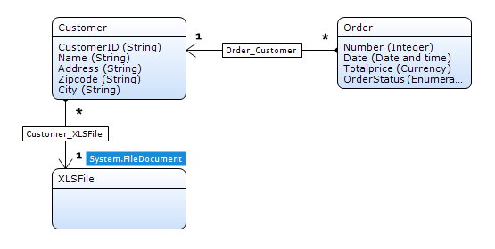

    The 'XLSFile' object inherits from the 'Filedocument' object. If you don't know how to achieve this, please take a look at [Working with images and files](working-with-images-and-files).

2. Create **Overview** and **Detail** pages to manage objects of type **Customer** and **Order**.
3. Create **menu items **to access the **Order** and the **Customer** overview pages.
4. Download the **Excel Importer** and **Mx Model Reflection** modules from the appstore.
5. Create **menu items** for the **ExcelImportOverview** and the **MxObjects_Overview** pages. Those pages already exist within the _**USE_ME** folders of the downloaded modules.
6. Configure the **Administrator** user role to have the **Configurator** modu lerole for the **Excel Importer** module, and the **ModelAdministrator** module role for the **Mx Model Reflection** module.

## 2\. Prepare logic for data import

As an enumeration is used for the **OrderStatus** attribute, a microflow needs to be created to determine the enumeration value of the attribute based on the input from the Excel file. 

1.  Create the following Microflow and name it **IVK_ParseStatus**.
    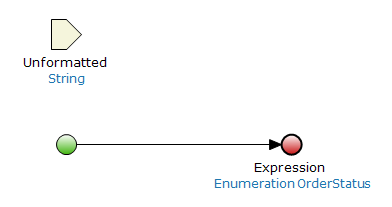
2.  Set the **Return value** as followes:
    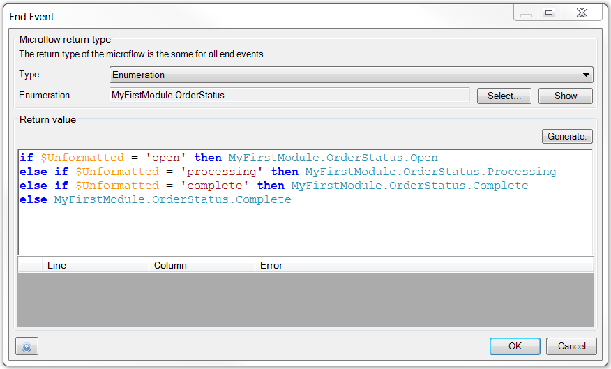
3.  **Save** the microflow.

## 3\. Use the application model meta data in the client

In order to set up import templates for importing data, your application model meta data should be reflected in the client. This can be achieved by using [Mx Model reflection](https://appstore.home.mendix.com/link/app/69/Mendix/Mx-Model-reflection). In this part of the How-to you will learn to do so.

1.  Click on **Run Locally **to start your application.
    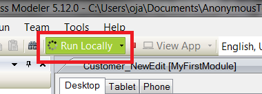
2.  Click on **View App **to open your application in the browser.
    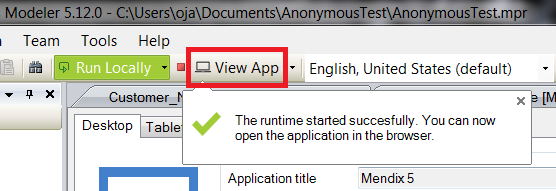
3.  **Log in** as an Administrator.
4.  Click on the menu item for the **MxObjects_Overview** in your navigation.
5.  Select the module that contains the objects you want to use in your client, by clicking on the box to the left of it. In this case **MyFirstModule**.
6. Click on the arrows next to **Synchronize all entities and microflows of checked modules on the left.
    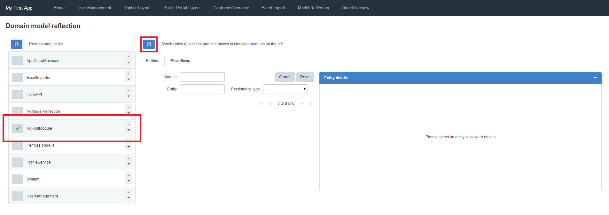
7. Now the two objects and the parse microflow from the module **MyFirstModule** can be seen and used in the client.

## 4\. Create Import Templates

Before you can import data from an Excel File into your application, you have to first setup an import template. In this template you will configure which objects the data should be mapped to, if an object is associated to another object, from which row of the Excel File the import should start and which columns should be imported.

In this How-to you will import data from a simple Excel file which can be downloaded here:

Based on the structure of the file you want to import, you will setup your template.

1.  Click on the menu item for the ExcelImportOverview in your navigation.
2.  Click on **New Template**.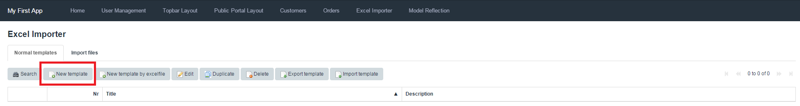
3.  Determine the name of the template.
4.  Click on the arrow next to the **Mendix object** box.
5.  Select the **Customer** object.
    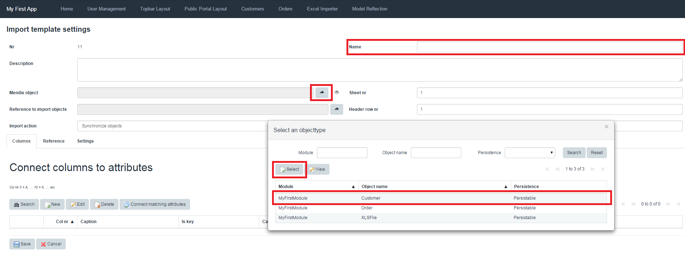

6.  Click on the arrow next to **Reference to import objects** box.
7. Select the **MyFirstModule.Customer_XLSFile** association.

     By setting the association to the XLS File, the XLS file is saved on disk and the imported data is linked to the source file.

8. Set **Import Action** to **Synchronize objects**.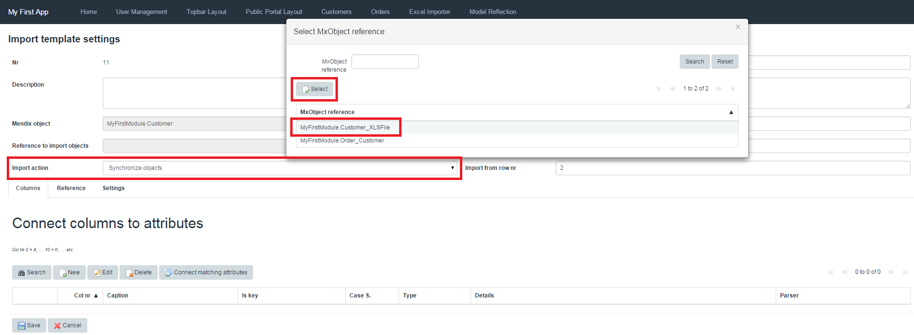

    For this example you will be using a simple Excel file, with just one sheet and columnheaders at the first row. If a more comprehensive Excel file is used you can change these values at the **Sheet nr**, **Header row nr** and **Import from row nr** boxes.

9. Under the **Connect columns to attributes** section, click on **New** to create a mapping from the Excel sheet column to the proper Mendix attribute.
    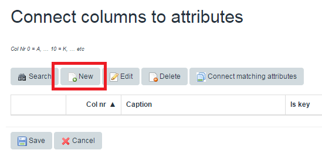

10. Add the column number, this should correspond with the column number from the value on the Excel file you want to map

    The number of the first column in Excel is 0, the second 1, etc.

11. Define the Excel column header as the **Caption** value.

12.  Choose **Attribute** as a **type**.

13.  Click on the arrow next to the **Attribute** box.
    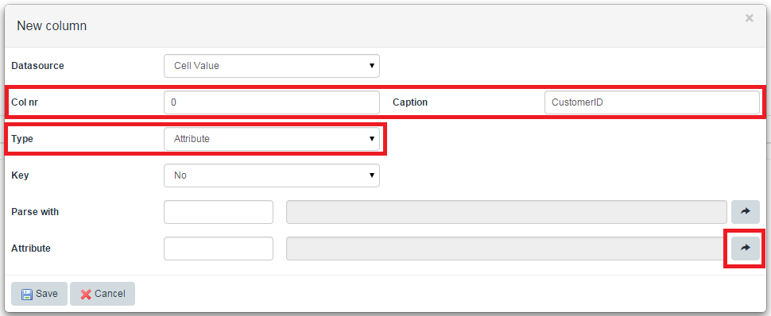

14.  Select the **attribute** you want to map the Excel value to.
    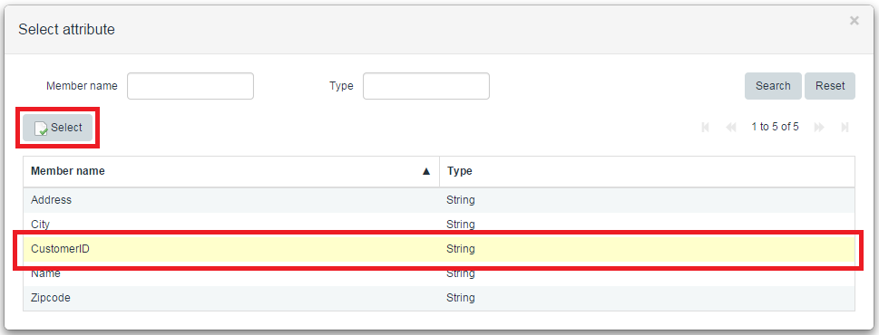

15. Repeat steps 9 to 14 for each attribute of the **Customer** object.

    If the mapping is setup right, a green check will appear in front of the row.

16. For the mapping of attribute **Name** set the key value to **Yes**, to prevent a customer from being duplicated.
    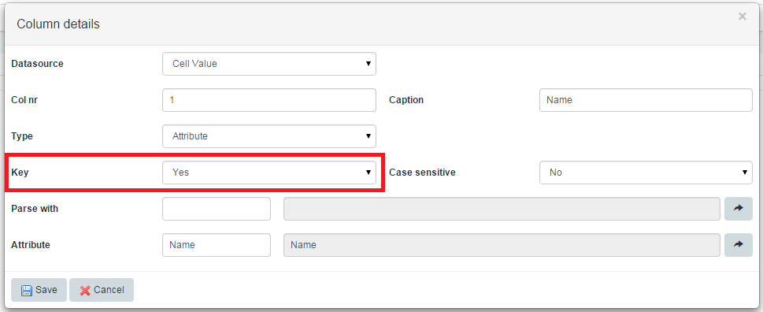

17. After creating all the mappings for the **Customer** object attributes, also create mappings for the **Order** object attributes by repeating steps 9 to 11. Because the **Order** object is associated to the **Customer** object, the mapping setup will be slightly different. The additional steps are discribed below.

18.  Choose **Reference** instead of **Attribute** as a type.

19.  Click on the arrow next to the **Reference** box, here you will select over which association the Order is linked to the Customer.
    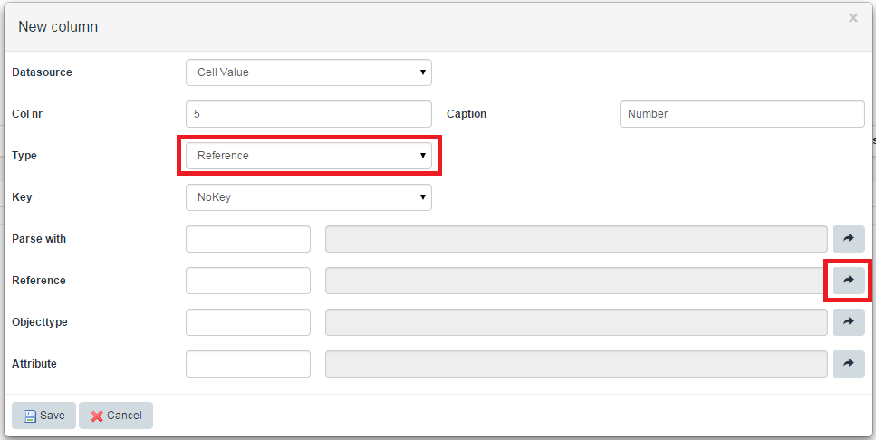

20.  Select the **Customer_Order** association.
    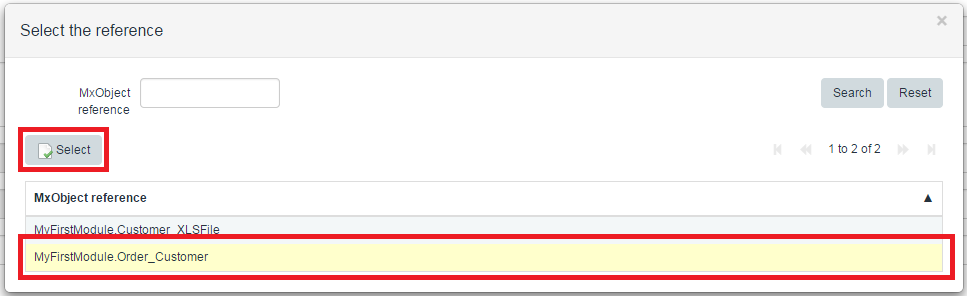

21.  Click on the arrow next to the **Attribute** box.
    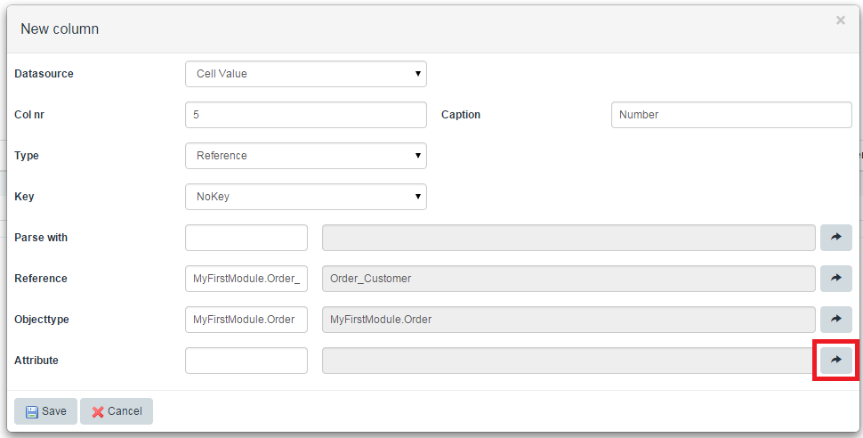

22.  Select the **Number** attribute form the **Order** object.
    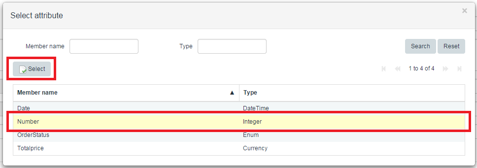

23.  Click **Save**.

24.  Repeat steps 17 to 23 for each attribute of the **Order** object.

25.  For the mapping of attribute **Number** set the key value to**'Yes, only for the associated object**, to prevent orders being duplicated.
    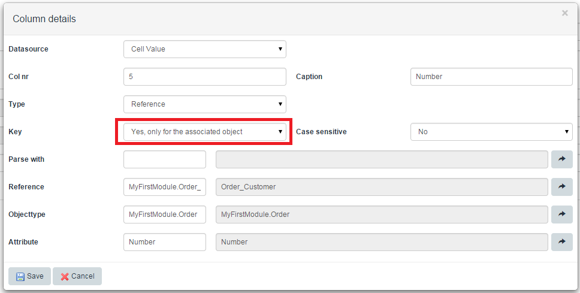

26.  For the mapping of attribute **OrderStatus** the Excel file value needs to be parsed to an enumeration value. To achieve this we can use the **IVK_ParseStatus** microflow, created under 2.0, by clicking on the arrow next to the **Parse with** box.
    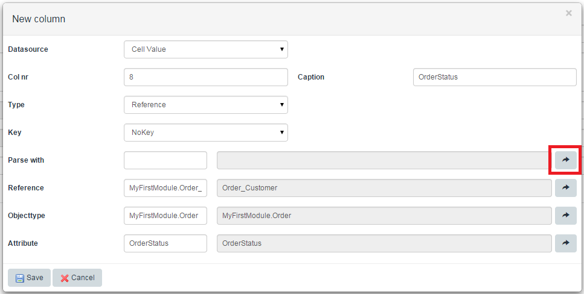

27.  Select the **IVK_ParseStatus** microflow.
    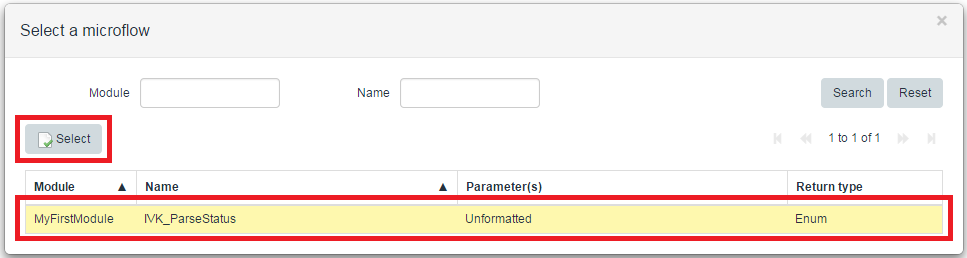

28.  Click **Save**.

29.  Save the **Import Template**.

## 5\. Import Excel File

Now the template is setup you can start importing data from an Excel file into your application. You can use the example file downloadable under **4\. Create Import Templates**

1.  Click on the menu item for the **ExcelImportOverview** in your navigation.
2.  Go to the **Import Files** tab.
3.  Click **New**.
    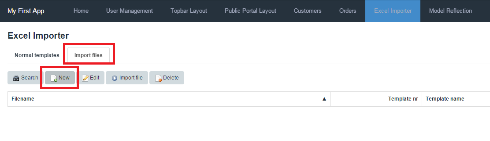
4.  Select the template you just created.
5.  Click **Browse**.
    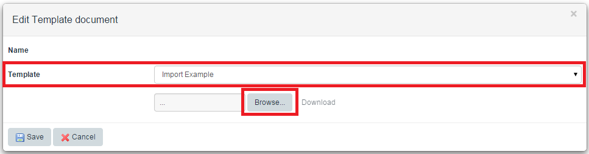
6.  Select the example **Excel file** from your local drive.
7.  Click **Save**.
8.  Select the **Import** file.
9.  Click **Import file**.
    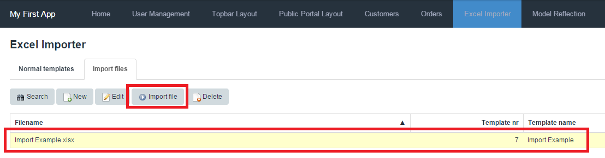
10.  Check if the data is imported under the menu items you created in chapter 1 step 3.

## 6\. Create Import templates by Excel file

In the previous steps you have manually added all the columns to your import template. In this section you will be creating the same Excel template in an automated way. You can do this by using the **New template by excelfile** button at the **Normal templates** tab. An example Excel file can be downloaded here:
 

1.  Click on the menu item for the ExcelImportOverview in your navigation.
2.  Click on **New template by excelfile
    **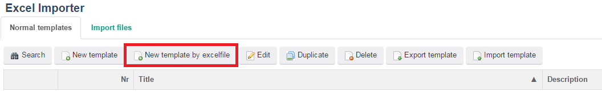
3.  Select the [Import Example.xlsx](attachments/8785707/9273362.xlsx)
4.  Define the sheet number.
5.  Define the Header row nr.
6.  Define the row to import from.
    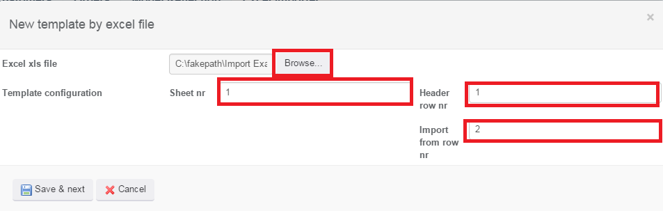
7.  Click on 'Save & next'.
8.  Automatically a row is created for every header of the Excel file.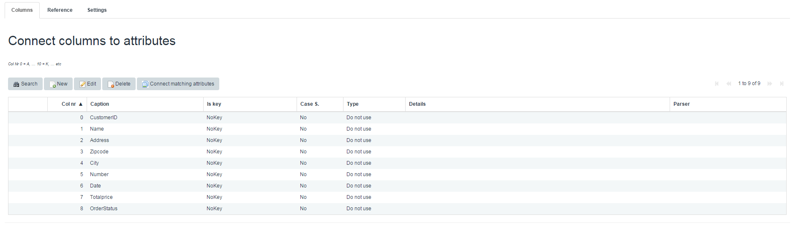
9.  Select the **Customer object****type**.
    
10. Click on **Connecting matching attributes**.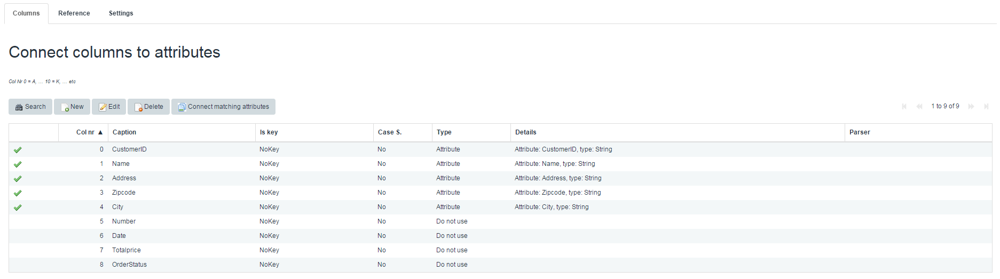

    The attributes of the selected Mendix Object which have the same name as the Caption will be automatically matched.

11. To complete the template repeat the same actions as performed in chapter 4.

    Keep in mind that you have to set a key attribute for as well as the **Customer **object as the **Order** object

## 7\. Export/Import Template

Once you have completed an Excel template you can export the template for example from the test environment and import it into the acceptance environment. When exporting and importing this template, the exact template will be uploaded. So columns are generated, the Mendix object is selected, the attributes are connected, and the parse microflows are selected.

1.  Select the Excel template you created in chapter 4.
2.  Click **Export template **and save the file on your computer
    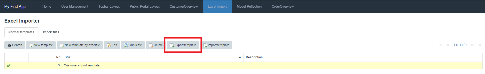
3.  Import the downloaded file by clicking **Import template**.
4.  Select the downloaded file and click **Import**.**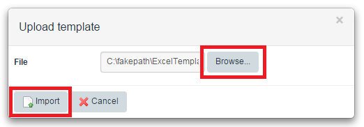**
5. You have now imported a complete import template.

    You will have a duplicate import template in your app, but in a real life situation you would import this template in a different environment/database where this template is not created yet.

## 8\. Related content

*   [Expose a web service](exposing-a-web-service)
*   [Consume a Simple Web Service](consuming-a-simple-web-service)
*   [Consume a Complex Web Service](consuming-a-complex-web-service)
