Mendix is "The App Platform for the Enterprise" and in enterprise software it is not likely that you work in a [green field](https://en.wikipedia.org/wiki/Greenfield_project). In almost every situation you will need to integrate with existing systems. Mendix supports many ways of integration but this how-to focuses on how you can import XML documents with Mendix.

## 1\. Preparing the data structure and GUI

The XML document that is used during this how-to contains customers. To be able to see the imported data, you first need to setup the data structure and GUI to maintain customer data. Then you need to facilitate uploading and downloading of XML documents. Finally you'll create the actual import logic and corresponding import mapping.

Before you continue, make sure that you know how to create:

*   **Domain models**, if you need more info, take a look at this [how-to](creating-a-basic-data-layer).
*   **Custom File Document**, if you need more info, take a look at this [how-to](working-with-images-and-files).
*   **Overview and detail pages**, if you need more info, take a look at this [how-to](creating-your-first-two-overview-and-detail-pages).
*   **Menu items**, if you need more info, take a look at this [how-to](setting-up-the-navigation-structure).

1.  Create the following entity **Customer** in your domain model:
    

2.  Create overview and detail pages to manage objects of type **Customer**.
3.  Create a menu item to access the customer overview page.
4.  Create an entity called **XMLDocument** that inherits all properties from **System.FileDocument**. 
    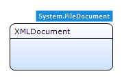
5.  Create overview and detail pages to manage objects of type **XMLDocument**.
6.  Create a menu item to access the XML document overview page. If you don't know how to create menu items, take a look at this [how-to](setting-up-the-navigation-structure).

## 2\. Adding an XML Schema (XSD)

Whether you plan to import or export documents; working with XML means that your application must contain an XML schema (also called XSD). An XSD describes the possible contents of an XML file. Based on this XSD your application knows how to read or write an XML file. If you don't have an XSD file; there are a couple of online XSD generators that accept an XML document as input. For this how-to you can use [Customers.xsd](attachments/7831653/8945815.xsd).

1\. Right click a module in the project explorer and select **Add > Document** from the menu. You can also use shortcut **Ctrl+N**.

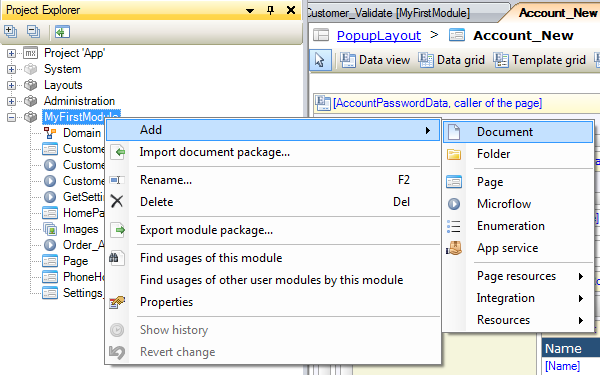

2\. Select **XML Schema** as document type and click **OK.**

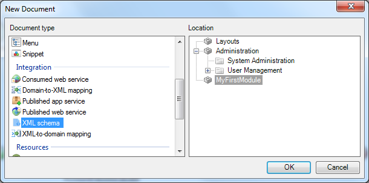

3\. Enter **CustomersXSD** as name and click **OK.**

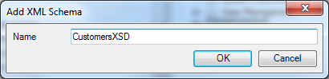

4\. In the XML schema editor click **Select...** and select the XSD file that you downloaded earlier.

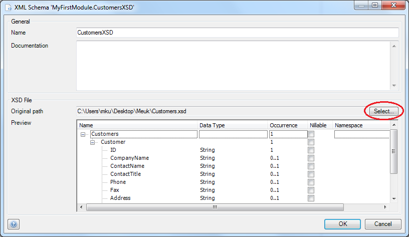

5\. Click **OK** to save the XML Schema. You'll be using this schema in the following steps

## 3\. Create XML-to-Domain mapping

The XML Schema describes what the possible contents of an XML file are, but we need to create an XML-to-Domain mapping to define how the data in the XML document is imported into the application.

1\. Right click a module in the project explorer and select **Add > Document** from the menu. You can also use shortcut **Ctrl+N**.

2\. Select **XML-to-Domain mapping** as document type and click **OK.** 

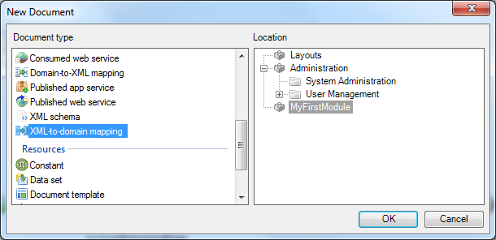

3. Enter **ImportCustomersMapping** as name and click **OK.** The new mapping will open automatically and the elements will be shown.

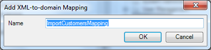  

4\. Select **XML schema** as source.

5\. Select the **CustomerXSD** as schema.

6\. Click the **Expand all** button. You should now see the following tree with elements: 

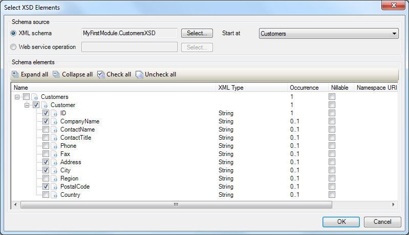

7\. Select the elements; **Customer, ID, CompanyName, Address, City and PostalCode.**
8\. Click **OK**. You should now see the first part of the import mapping like this:

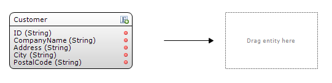

9\. Open the connector, it should be in the lower right of the Mendix Modeler.

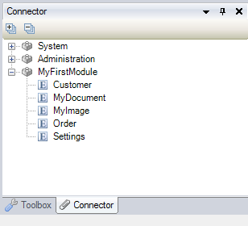 

10\. If you can't find the connector, you can re-open it from the view menu. 

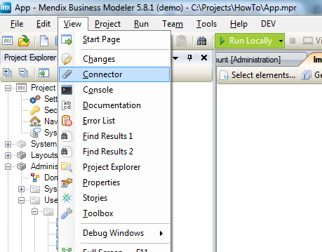 

11\. Drag the entity **Customer** from the connector to place holder in the mapping editor. 

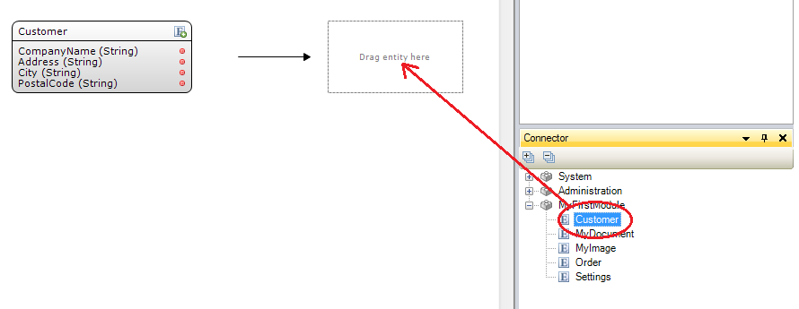 

The mapping editor for this element will open automatically. 

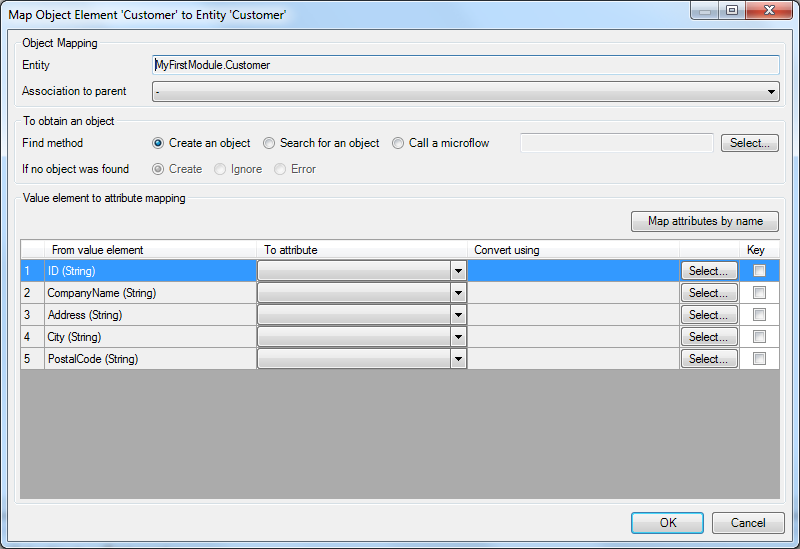

12\. Select **Search for an object** as **Find** method. To be able to search an object you need to define one or more keys in the value to attribute mappings.
13\. Make sure that a new object is created if no object was found.
14\. Select attributes for all 5 value to attribute mappings.
15\. Select **CustomerID** as key, you should have to following mapping: 

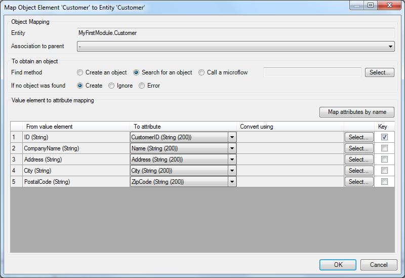

16\. Click **OK** to save the mapping.

## 4\. Create import logic

In this section you will create logic to import customers stored in a [XML document](attachments/7831653/8945816.xml) in your application.

1\. Open the **XMLDocument** overview page. It should look this, using a default layout:

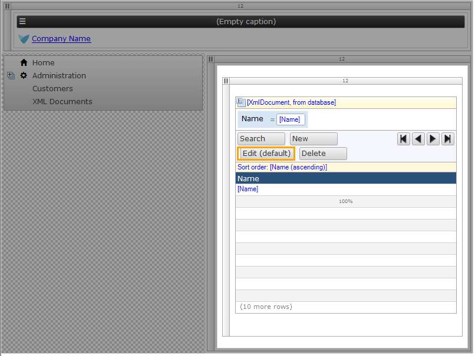

2\. Right click the toolbar of the data grid widget and select **Add button > Action **to add a new action button.

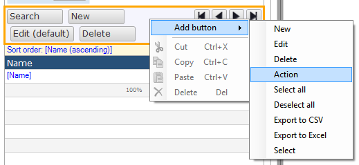

3\. Double click the new button to open the properties editor.

4\. Change the caption to **Import XML Document**.

5\. Select **Call a microflow** as the **On click **event.

6\. Click **Select **for the microflow, create a new microflow and name it **XMLDocument_Import**.
7\. Click **OK** to save the properties.
8\. Right click the new microflow button and click **Go to microflow** in the context menu. You should see an empty microflow with an XMLDocument as input parameter.

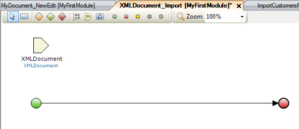

9\. Open the toolbox. It should be on the bottom right of the Mendix Modeler. If you can't find the toolbox, you can re-open it from the view menu.
10\. Drag an **Import XML** activity from the toolbox to the line between the start and end event. This inserts a new import XML activity.
11. Double click the new activity to open the properties editor:

 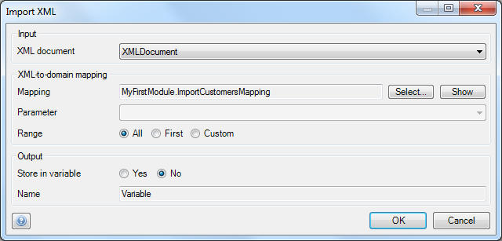

11\. Select input paramater **XMLDocument** as XML document.
12. Select the previously created XML-to-Domain mapping **ImportCustomersMapping** as mapping.
13\. Click **OK** to save the properties. The microflow should look like this:

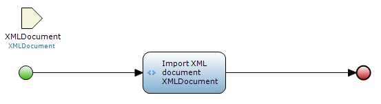

## 5\. Try importing a XML file

1\. Deploy the application, upload [Customers.xml](attachments/7831653/8945816.xml) and trigger the import microflow.
2. Open the customer overview page and check if the customer data is imported into your application.

## 6\. Related content

*   [Expose a Web Service](consuming-a-complex-web-service)
*   [Consume a Simple Web Service](consuming-a-simple-web-service)
*   [Consume a Complex Web Service](consuming-a-complex-web-service)
