Each application can leverage Mendix App Store content to create and send custom emails based off of configurable templates. To achieve this, the app will require three Mendix App Store modules and configuration settings for the SMTP server that will be used to relay the messages.

## 1\. Download the Required Modules from the Mendix App Store

Within this part of the how to you will learn how to download the necessary modules from the Mendix App Store. This is a very quick process, in that in just a few clicks the modules will be imported into your project. The modules that are required for this process are the **MxModelReflection, Encyption,** and **Email Module with Templates** modules.

{}

The MxModelReflection module is a commonly used module in most apps. The purpose of this module is to allow the app to reflect into the domain model (entities and attributes) and microflow definitions at runtime.

{}

### 1.1 Download the 'MxModelReflection' Module

1.  Open the **Mendix App Store** from within the modeler.
2.  Search for the keyword **Reflection.**
3.  Click the **Download** button and include the module as a new module.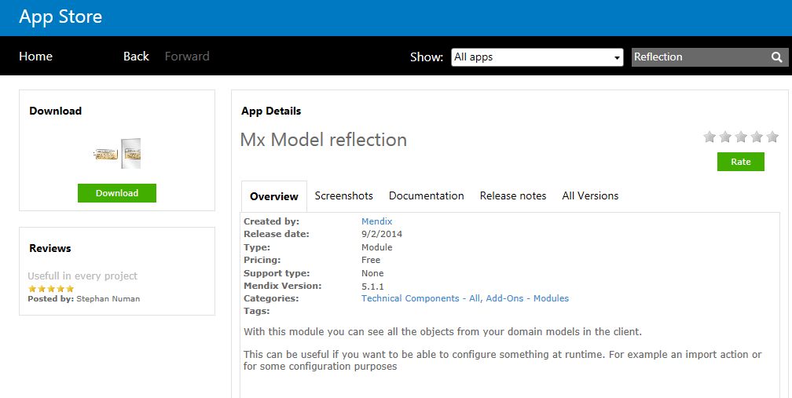
4.  Ensure the module has downloaded successfully and is now a new module in your project.

### 1.2 Download the 'Encryption' Module

1.  Open the **Mendix App Store** from within the modeler.
2.  Search for the keyword **Encryption.**
3.  Click the **Download** button and include the module as a new module.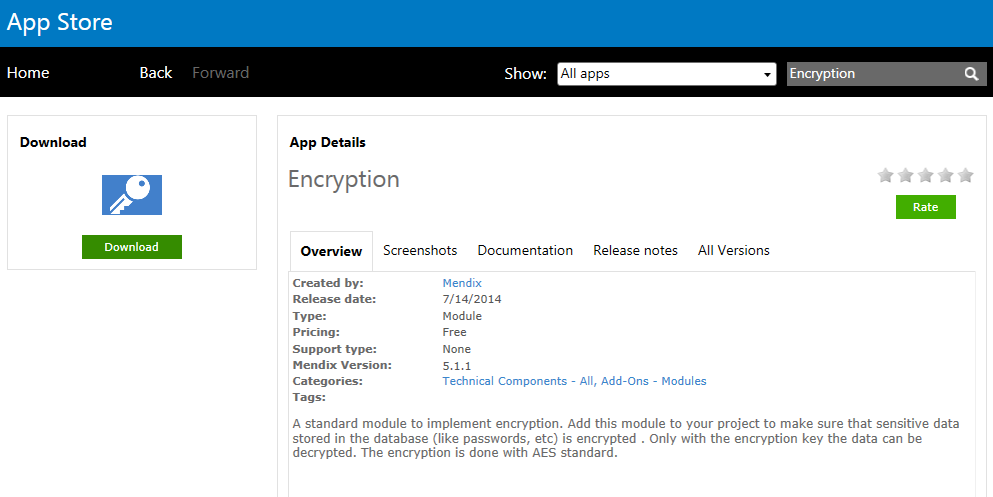
4.  Ensure the module has downloaded successfully and is now a new module in your project.

### 1.3 Download the 'Email Module with Templates' Module 

1.  Open the **Mendix App Store** from within the modeler.
2.  Search for the keywords **Email Template**.
3.  Click the **Download** button and include the module as a new module.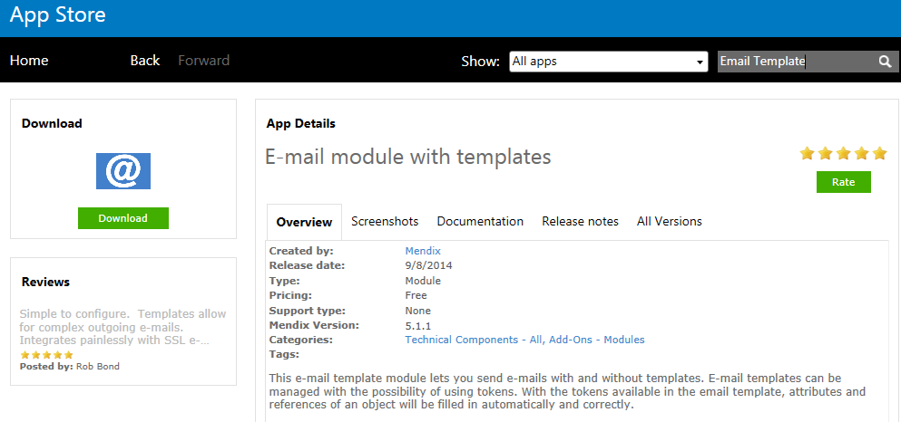

{}

Depending on the layout selected when the project was created, errors in the modeler may arise due to the new module's default layouts. To correct this, open each page that has an error and update the layout to the desired layout within the app.

{}

## 2\. Add Navigation Items to Allow Users to Configure Settings

In this part of the how to you will learn how to add the required pages into the Project Navigation that are needed to configure both the SMTP settings and email templates that will be used within the application.

1.  Open **Navigation** within the project.
2.  Add a new item to the Navigation for **Administrator** to access **MxModelReflection.MxObjects_Overview**.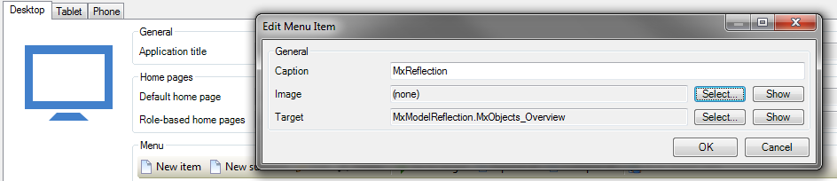
3.  Add a new item to the Navigation for **Administrator** to access **EmailTemplate.IVK_OpenEmailSettings**.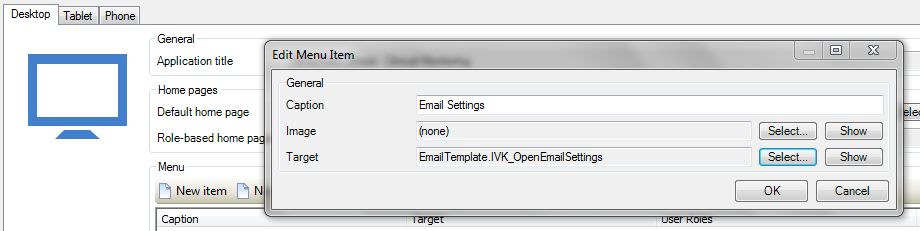
4.  Add a new item to the Navigation for **Administrator** to access **EmailTemplate.EmailTemplate_Overview**.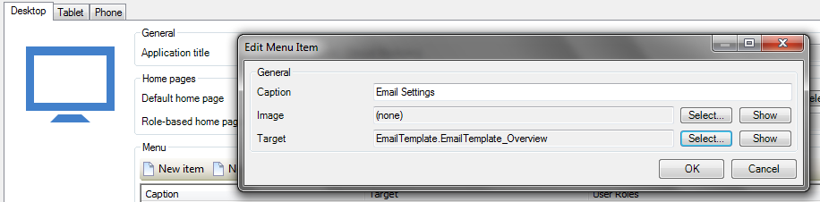 

{}

Within the EmailTemplate module, there are several useful pages that can help in tracking email logs and failures. Add those pages to the Navigation as well for additional information on the email history.

{}

## 3\. Configuration

In this part of the how to you will learn how to run the MxModelReflection synchronization, configure the SMTP settings required to send email from the app, the encryption module, and email templates that will be used in the app. SMTP server settings and configurations should be known at time of configuration. This encompasses settings such as username and password (if authentication is required), server name/address, port number for SMTP relay (25 is default, 587 for TLS), and sender address.

### 3.1 Run the MxModelReflection Synchronization

1.  Open the **MxModelReflection** overview page via the Navigation item configured to **MxModelReflection.MxObjects_Overview**.
2.  Highlight each module the app needs to synchronize and click the **Toggle Module Sync** button (the Sync this Module should now be 'Yes').
3.  Click the **Synchronize Objects** button to execute the synchronization process.

### 3.2 Configuring SMTP Settings

1.  Open the **SMTP Settings** page via the Navigation item configured to **EmailTempate.IVK_OpenEmailSettings**.
2.  If an account is required to authenticate against the SMTP server, enter the **User name** and **Password'**(which will be encrypted).
3.  Configure the **Server** as the SMTP server location (server name or IP address).
4.  Configure the **Port** that will be open to SMTP relay (25 is default, 465 for SSL encryption, 587 for TLS encryption).
5.  Configure the **From address** that will be the sender of the email.
6.  Select an encryption method if SSL or TLS encryption methods are required to send SMTP relay.
7.  **Save** the SMTP configuration settings.
    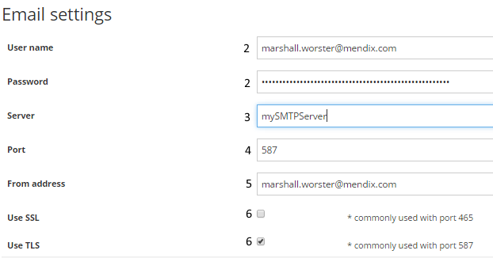

{}

Make sure to allow a administrator to access this page and has read/write the configuration settings entity.

{}

### 3.3 Configuring Email Templates

1.  Open the **Email Template Overview** page via the Navigation item configured to EmailTemplate.EmailTemplate_Overview.
2.  Click **New** to start the creation of a new template.
3.  Enter a name for the template in the **Name** field.
4. Specify by default what the values are for 'From', 'CC', 'BCC', 'Subject', and 'Use Only Plain Text'.

    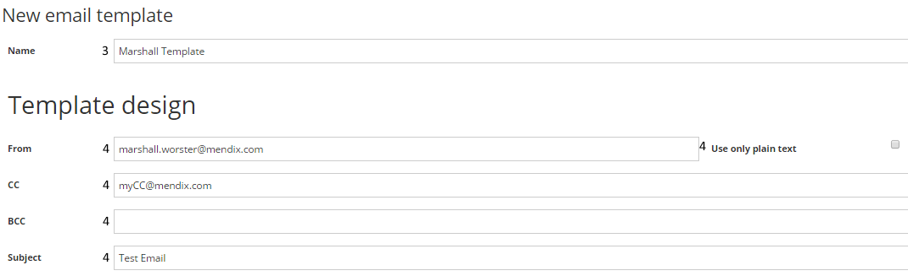

    All of the email values for To, From, CC, BCC, and Subject can be overridden once the email functionality is implemented if those values are to be dynamic within the app. Also, attachments can be added to this process at runtime within a microflow. 

5.  Configure both HTML Text and Plain Text formats for the email with the template text needed to be in the email body. Since the template can handle tokens (described next) go ahead and put placeholders in for those dynamic attributes needed in the email in the format of \{\%TokenSequenceNumber\%\}
    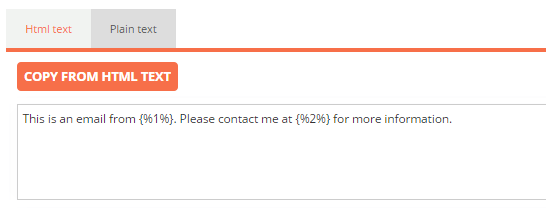
6.  Specify and upload any attachments that will be sent automatically when the email is triggered

### 3.4 Configuring the Template Tokens

1. Select the object that the token will need to be derived from.
    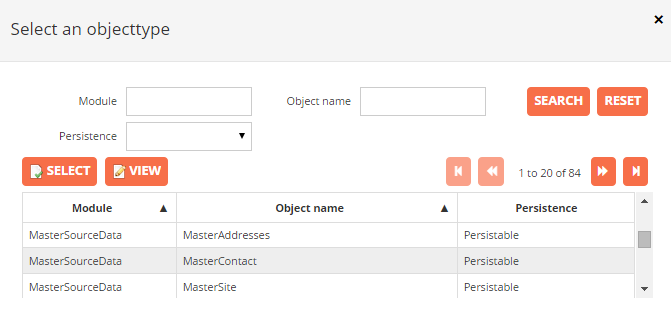

    Within the context of Email Templates, the object will be the Entity in the Domain Model that the data value will be derived from.

2. Set the **TokenSequenceNumber** between the token characters, **Description**, the **Attribute** that will populate in the email when triggered.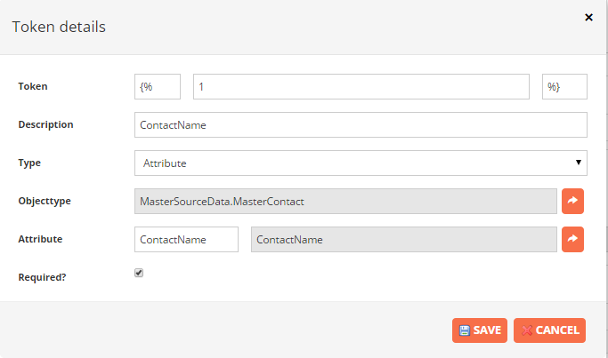
3. Save the token and the template. If tokens are used within the template, it will be required that a parameter of the same entity type is passed to the email microflow so that the tokens can be read off of the correct object.

### 3.5 Configuring the Encryption Key

1.  Navigate to the **Encryption.EncryptionKey** constant within the app and set this value to a 16-character alpha-numeric value.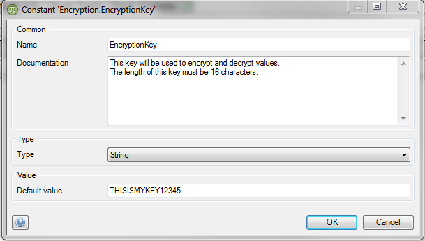

## 4\. Implementing Email Functionality

In this part of the how to you will learn how to utilize the previous configurations to send custom emails from the app by invoking microflows that interact with the EmailTemplate module. There is an example microflow within the EmailTemplate module (EmailTemplate.IVK_CreateAndSendEmail) that should be used as a basis for all email transmissions.

### 4.1 Configure Microflow to Send Emails

1.  Duplicate the **EmailTemplate.IVK_CreateAndSendEmail** microflow.
2.  Rename the duplicated microflow to a desired name.
3.  Move the microflow into a non-App Store content module so it is not overwritten or removed in the future.
4.  Change the microflow to use input parameters relevant to the emails in your app.
5.  Example objects of Order and Customer should be removed for valid objects.
6.  The appropriate EmailTemplate should be retrieved and passed to this microflow.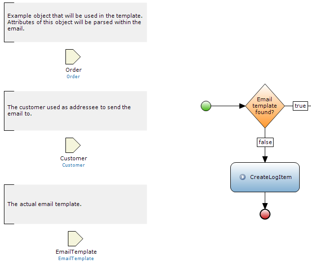
7.  Customize the Action **Set email data based on the customer and template** to the necessary attributes from the microflow parameters.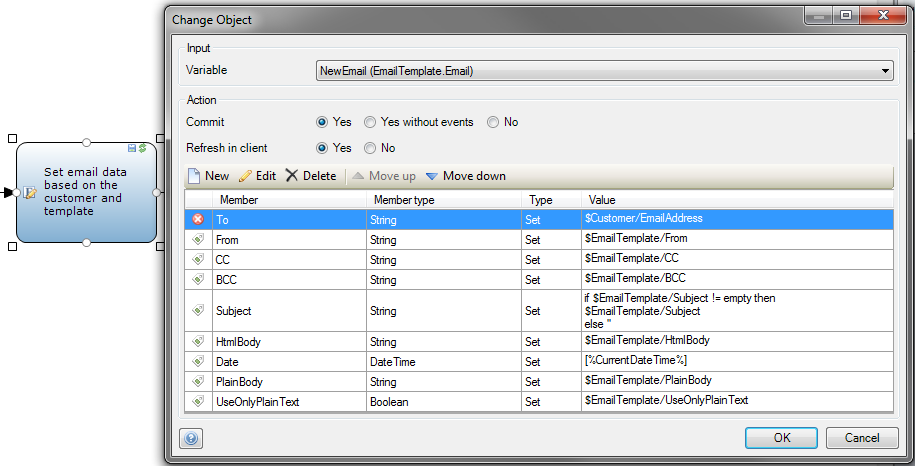
8.  Test the functionality to ensure SMTP and templates are configured correctly.

{}

It is very important to setup Log Activities within the microflows to capture errors or other key events in the log for ease of debugging.

{}

## 5\. Related content

*   [Explore our connectors and adapters](explore-our-connectors-and-adapters)
*   [Access a Samba share from the MxCloud](access-a-samba-share-from-the-mxcloud)
