Your client might already have a centralized identity management solution in place, which houses information for all users in the company. If you want to make use of that information in your Mendix app, you can use the LDAP module available in the App Store. This module will allow you to synchronize user data from your LDAP-compatible identity manager to your Mendix app, for example to keep user names consistent across applications, or to allow users to use the same password for multiple apps. The LDAP module supports any LDAP-compatible identity manager. This how-to will teach you how to set up the LDAP module to work with your app, focusing on Microsoft Active Directory. It will give you a basic understanding of the LDAP module, but will skip over some advanced details. The document assumes basic Mendix knowledge, and some basic knowledge of what LDAP is and how it works.

**Contents:**

## 1\. Preparation

1.  Open the Mendix Modeler.
2.  Import the following App Store modules into your application model:

*   [LDAP Synchronization Module](https://appstore.home.mendix.com/link/app/24/Mendix/LDAP-Synchronization-module)
*   [Encryption](https://appstore.home.mendix.com/link/app/1011/Mendix/Encryption)
*   [Community Commons Function Library](https://appstore.home.mendix.com/link/app/170/Mendix/Community-Commons-Function-Library)

## 2\. Configuring the LDAP Synchronization Module

1.  Double-click **Settings** in the project explorer pane. Select the **Ldap.ASu_StartLdap** Microflow as your **After Startup** Microflow.
    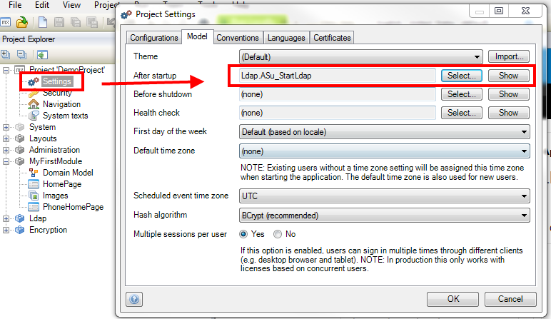
    If you already selected an After Startup Microflow here, extend that Microflow with a call to the LDAP startup Microflow.
2.  Double-click **Navigation** in the project explorer pane.
3.  Add a navigation item that calls the **Ldap.OpenLdapServersOverview** Microflow.
    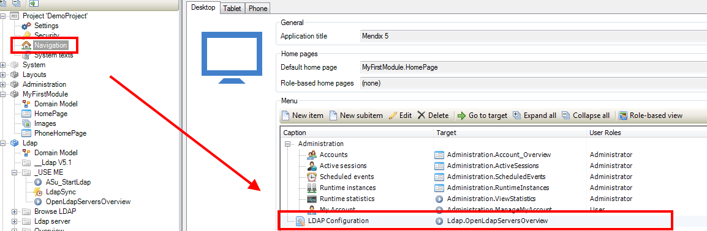
4.  Add the **LdapAdmin** module role to your Administrator role. This will grant users with the Administrator role access to the LDAP admin functionality.
    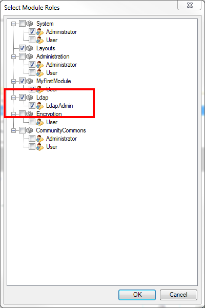
5.  Locate the constant** EncryptionKey**, which should be in the **Encryption** module.
6.  Set the **Default value** to a random value of exactly 16 characters.
    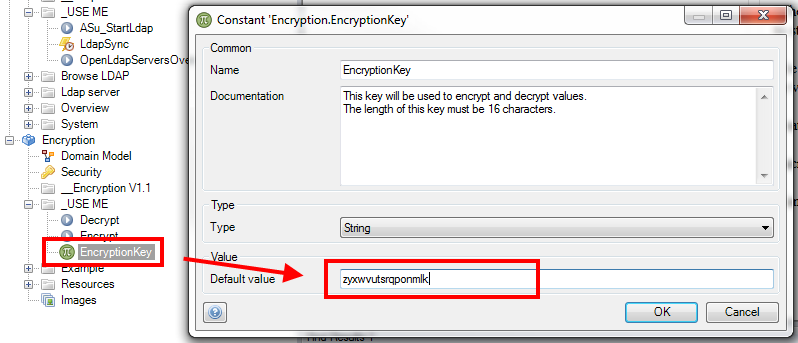
7.  Click **OK.
     **

## 3\. Configure the LDAP server information

In this chapter you will run the application and complete the LDAP configuration in the application itself.

1.  **Deploy/run** the application locally and open it in your browser.
    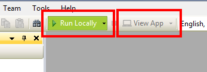
2.  Log into the app using the default administrator account (usually "MxAdmin").
3.  Navigate to the **LDAP Configuration** screen you added in the previous chapter. You will see the following screen:
    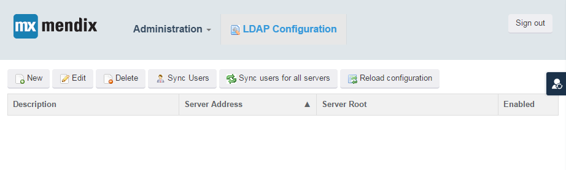
    You can configure multiple LDAP servers connections. At the moment there are none, so let's add one.
4.  Click **New** to add an LDAP server configuration. This opens the following page:
    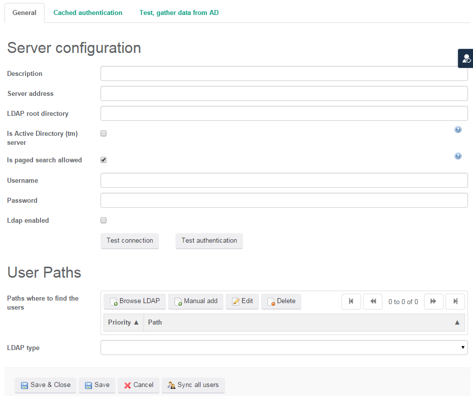
5.  Enter the following information. The administrator of the LDAP server can provide the required information:

    <table><thead><tr><th class="confluenceTh">Field</th><th class="confluenceTh">Description</th><th class="confluenceTh">Example</th></tr></thead><tbody><tr><td class="confluenceTd">Description</td><td class="confluenceTd">A descriptive name for the LDAP connection</td><td class="confluenceTd"><em>Mendix test LDAP server</em></td></tr><tr><td class="confluenceTd">Server address</td><td class="confluenceTd">The URL of the LDAP server. Usually starts with "ldap://"</td><td class="confluenceTd"><em>ldap://ads1.companydomain.local</em></td></tr><tr><td class="confluenceTd">LDAP root directory</td><td class="confluenceTd">The LDAP path that is the root directory of the server. It should be an LDAP distinguished Name (DN).</td><td class="confluenceTd"><em>DC=companydomain,DC=local</em></td></tr><tr><td class="confluenceTd">Is Active Directory</td><td class="confluenceTd">Check this if the server you are connecting to is a Microsoft Active Directory Server. This enables some specific logic to handle these servers. If you are unsure, check this box.</td><td class="confluenceTd">&nbsp;</td></tr><tr><td class="confluenceTd">Is paged search allowed</td><td class="confluenceTd">In some cases, the "paged search" feature of LDAP can cause issues. If you are unsure, leave this box checked. If you later receive error messages that mention paged search, uncheck this box and try again.</td><td class="confluenceTd">&nbsp;</td></tr><tr><td class="confluenceTd">Username</td><td class="confluenceTd">The username of the account that is used by your application to connect to the LDAP server. This account should have read access to all user information that your app needs. In Active Directory environments this name must include the domain prefix (see the example).</td><td class="confluenceTd"><em>COMPANYDOMAIN\testuser</em></td></tr><tr><td class="confluenceTd">Password</td><td class="confluenceTd">The password corresponding to the system account.</td><td class="confluenceTd"><em>abc123!?</em></td></tr><tr><td class="confluenceTd">LDAP enabled</td><td class="confluenceTd">Check this box to include these configuration settings in the user synchronization process. Uncheck this box to temporarily disable these configuration settings while testing.</td><td class="confluenceTd">&nbsp;</td></tr></tbody></table>

6.  Click **Test connection**. The module will now try to connect to the LDAP server using the credentials you provided. If the test was successful you should see the following message: **Connection established**. If not, check the error message in the console log for possible causes and fix the issue(s).

    You will now configure the user path of the LDAP module so that it can find the user information on the server.
7.  Click **Browse LDAP** in the **User paths **section. This opens a popup that displays the contents of the LDAP root directory.
    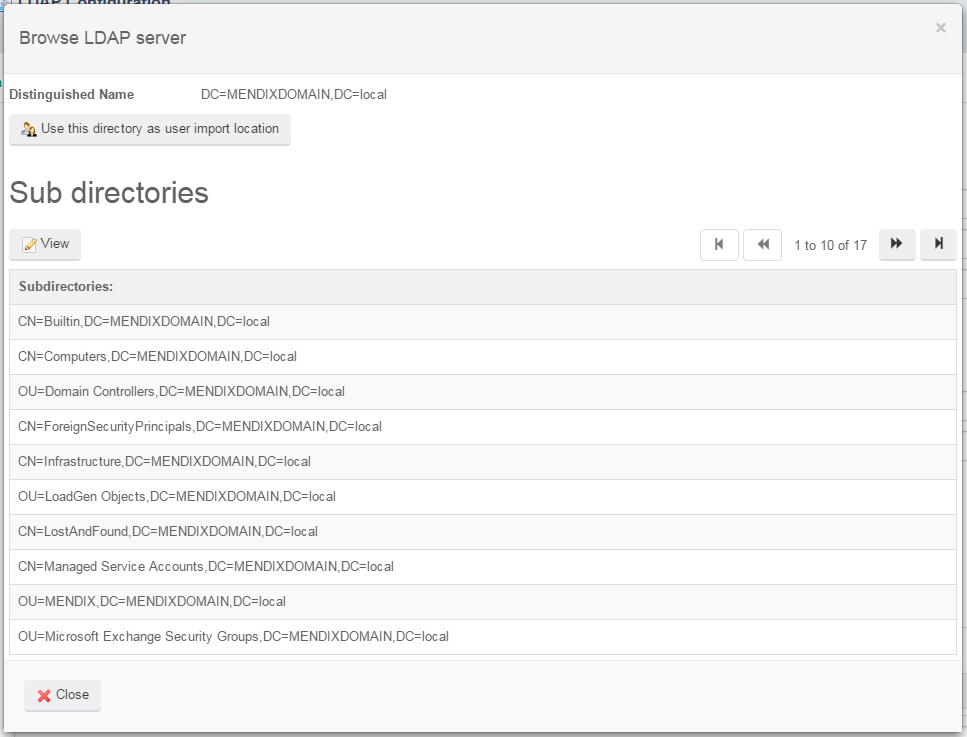
8.  Navigate to the directory that contains the users you want to import. 
9.  Once you have found the directory that contains the users, click **Use this directory as user import location.
    **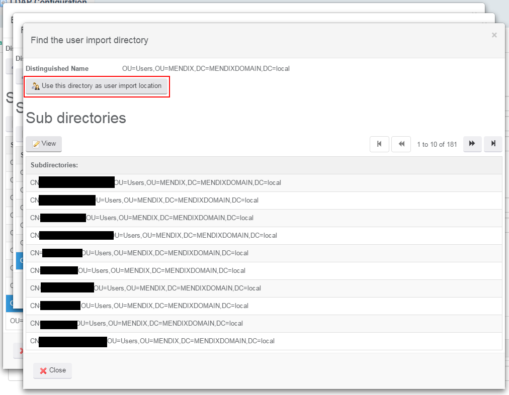
10.  Close all popups. You should now see the selected path in the User Paths overview.
    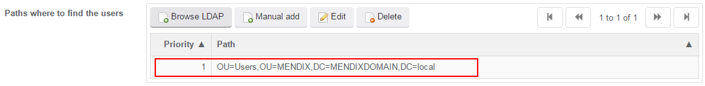

## 4\. Configure the Synchronization Type

The next step is to configure how to handle the user information.

1. In the server configuration screen, locate the **LDAP type** setting at the bottom.
    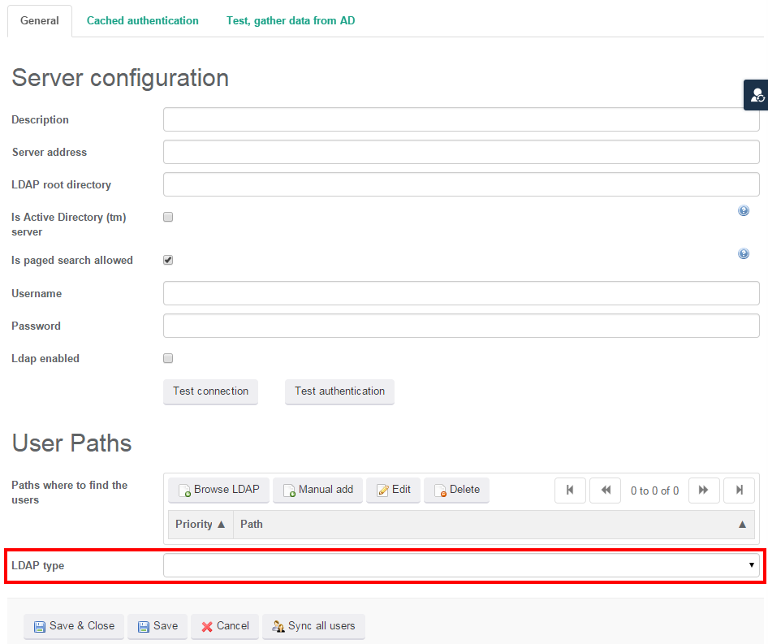
2. Select **Import the users from the Active Directory**.
    The LDAP type can have three values:

    *   Import the users from the Active Directory: The LDAP module will import user information from the LDAP server into Mendix.
    *   Only authenticate users: The LDAP module will use Active Directory to authenticate users, but will not import user information.
    *   Authenticate and create users: The LDAP module will use Active Directory to authenticate users, and create accounts in Mendix for successfully authenticated users who do not already exist.

    You will see extra configuration settings appear at the bottom of the form. Two extra tabs will also appear that contain extra configuration options for this setting. 
    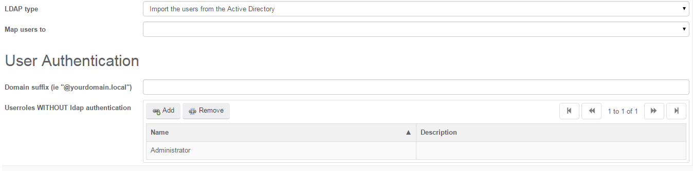

3. Enter the following additional information:

    <table><thead><tr><th class="confluenceTh">Field</th><th class="confluenceTh">Description</th><th class="confluenceTh">Example</th></tr></thead><tbody><tr><td class="confluenceTd">Map users to</td><td class="confluenceTd">The Mendix entity that represents users in your app.</td><td class="confluenceTd"><em>Administration.Account</em></td></tr><tr><td class="confluenceTd">Domain suffix</td><td class="confluenceTd">In Active directory user names are often suffixed with the domain of the company. If you want users to be able to log in using just their user name, enter the domain here. It will be stripped from the full user name, leaving just the actual account name as a username.</td><td class="confluenceTd"><em>@companydomain.local</em></td></tr><tr><td class="confluenceTd">Userroles WITHOUT ldap authentication</td><td class="confluenceTd">In most cases, certain user roles (usually administrators) should not be authenticated against LDAP. This can be, for example, because the corresponding users or roles don't exist in the LDAP server, or because the users should be able to log in when LDAP is not available for some reason. In most cases, you should enter an administrator role with access to the LDAP configuration.</td><td class="confluenceTd"><em>Administrator</em></td></tr></tbody></table>

## 5\. Configure User Mappings

The final step in the configuration is to configure how the LDAP module handles user information found in the LDAP server.

1.  Open the **User import mapping** tab of the server configuration.
    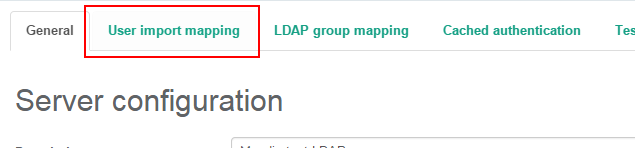
    On this page you can configure the attribute mapping of the user entity selected in the **General** tab.
    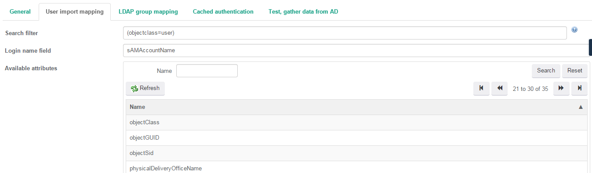
2.  Click **Refresh** in the **Available attributes** overview. The LDAP module will now retrieve all user attributes that are available on the LDAP server.

    These attributes can be mapped to attributes on the Mendix side. The most important attribute is the users' name. You can configure this in the **Login name field** attribute. In this setting you should enter the name of the LDAP attribute that contains the username. In the case of Active Directory, this is almost always _sAMAccountName._
3.  In **Login name field**, enter _sAMAccountName_ (note the capital letters).
4.  Under **Custom attribute mapping** you can map other, non-essential attributes, from LDAP to Mendix users. Click **New** in this grid.
    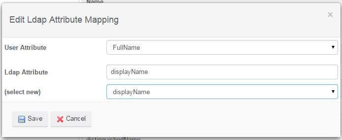
5.  Select an attribute name in the **User Attribute** drop down, for example "FullName". If the drop down is empty, click **Cancel**, **Save & Close** and reopen the server configuration. This refreshes the information in the settings screens.
6.  In the **(select new)** drop down, select an LDAP attribute, like "displayName".
7.  Click **Save**.You have just created an LDAP attribute mapping. The "displayName" attribute of an LDAP user will now be used to fill the "FullName" attribute of a Mendix user, when it is created during the synchronization.
8.  Open the **LDAP group mapping** tab.
    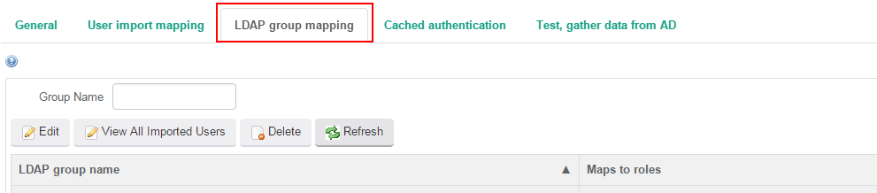
9.  Click **Refresh**. The LDAP module will now retrieve all known groups from the LDAP server. On this screen you can map LDAP groups to Mendix user roles. In other words, when a user is a member of a certain group in LDAP, it will get the corresponding user role in Mendix.
10.  Select the group that you would like to map to a user role and click **Edit**.
    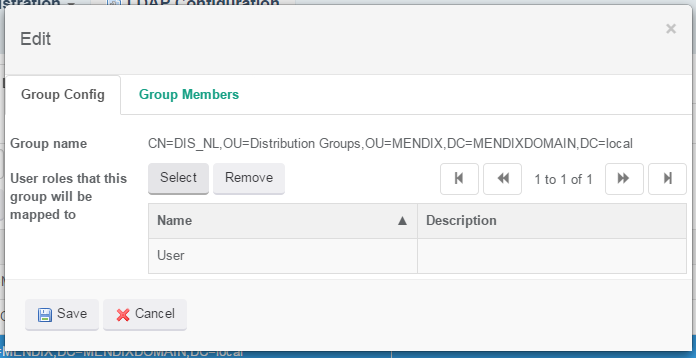
11.  Click **Select** to open the user role selector
12.  **Double click** the user role you want to use for this mapping.
13.  Click **Save** to store the mapping.
14.  Finally, click **Save & Close** to store the LDAP server configuration.

## 6\. Synchronizing the users

Now that you have configured the LDAP module it's time to synchronize the users.

1.  **Select** the configuration you created in the server overview and click **Sync Users**.
    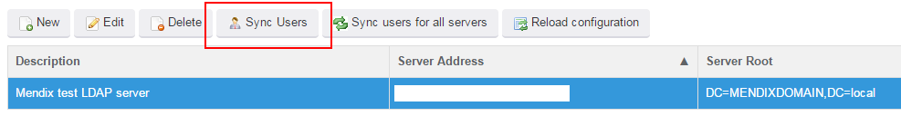
    The module will now synchronize all users from the LDAP server to your Mendix app. You can follow the progress in the console log of the app.
    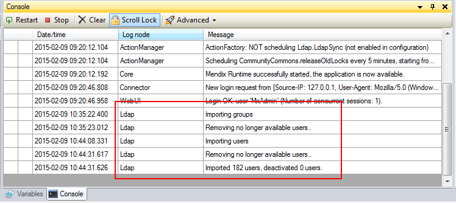
2.  Open the user account overview to see the imported users. By default this should be available in the **Administration** menu.

## 7\. Next steps

After synchronizing the user information users can not sign in yet. This is because their passwords have been set to random values. For security reasons it is not possible to synchronize LDAP passwords. You can only synchronize user information. You can allow users to log in by assigning new passwords to the accounts. You can create a Microflow to reset passwords automatically.

If you want to allow users to sign in using their LDAP account passwords, you can set the "LDAP type" setting to a value that includes authentication. An explanation of how to configure this is beyond the scope this how-to, however, additional information can be found in the App Store documentation of the LDAP module.

Finally, you may want to automatically and/or periodically re-synchronize the LDAP user information. The LDAP module provides a scheduled event to do this, called "Ldap.LdapSync". You can configure the interval of this event to meet your needs. In most cases a nightly synchronization will be sufficient. If you set a different "LDAP type" in the configuration, it may not be necessary to periodically synchronize at all. See the App Store documentation for more information.

Note that the scheduled event will always synchronize all enabled LDAP server configurations. If you want to override this default behavior you can change the "Ldap.ImportLdapUsersFlow" Microflow.

## 8\. Related content

*   [Expose a Web Service](consuming-a-complex-web-service)
*   [Consume a Simple Web Service](consuming-a-simple-web-service)
*   [Consume a Complex Web Service](consuming-a-complex-web-service)
*   [http://www.openldap.org/](http://www.openldap.org/)
*   [https://appstore.home.mendix.com/link/app/24/Mendix/LDAP-Synchronization-module](https://appstore.home.mendix.com/link/app/24/Mendix/LDAP-Synchronization-module)
