This how-to explains how you can work with images and files with Mendix. Out of the box Mendix supports uploading of files and images. It also allows you to view images and download files that you uploaded. First you need to create your own domain model and define which entities are images and which are files. This is done by the concept of 'inheritance', sometimes called 'generalization'. By inheriting from 'System.Image' your own entity gets all the properties of the system image entity. This means that you can use the standard platform widgets to upload and view images. The same goes for file documents.

## 1. Preparation

Before you start with this how-to please follow these prerequisites:

*   [Creating a basic data layer](creating-a-basic-data-layer)

## 2\. Images

1.  Open your domain model and create an entity called **MyImage**.
2.  Double click the entity to open its properties.
3.  Click **Select** at the **Generalization** property to open the entity selector.
    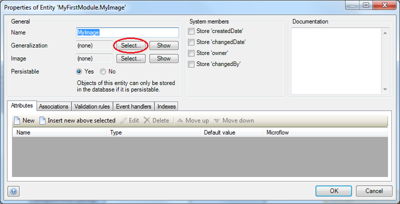
4.  Select **System.Image** and click the **Select** button.
    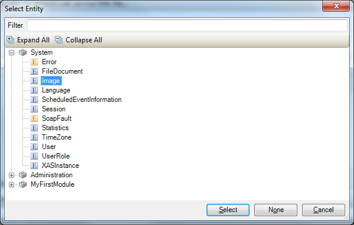
5.  Click **OK** in the entities property form. Your entity now inherits all properties from the 'System.Image' entity you selected and should look like this:
    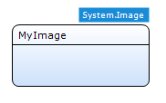
6.  Create an overview and detail page to manage objects of the entity that you just created. Your detail page should look like this:
    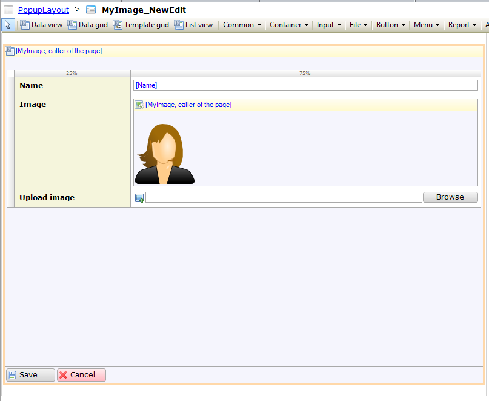
7.  Open the **detail page** and double click the ImageUploader to open its properties. On this form you can select the maximum file size, and thumbnail width and height. Mendix automatically generates a thumbnail for the images you upload via the ImageUploader.
    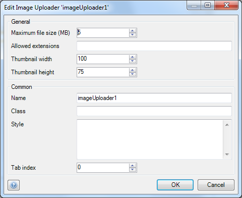
8.  Double click the ImageViewer to open its properties. On this form you can select the default image, width, height and if the viewer should show the thumbnail or full image.
    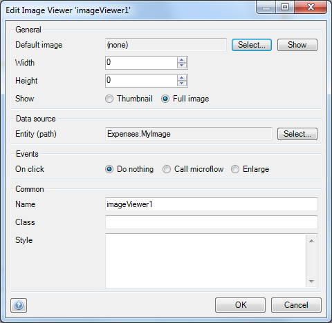

## 3\. File Documents

1.  Open your domain model and create an entity **MyDocument**.
2.  Double click the entity to open its **properties.**
3.  Click **Select** at the **Generalization** property to open the entity selector.
    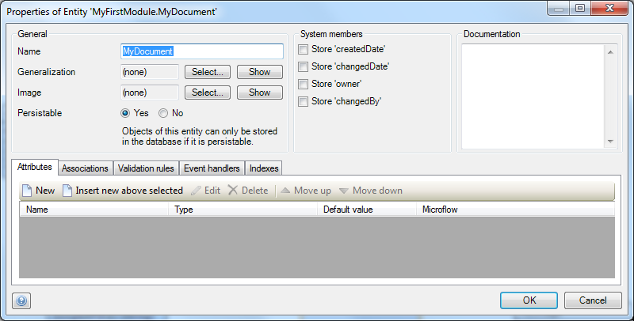
4.  Select **System.FileDocument** and click **Select.
    **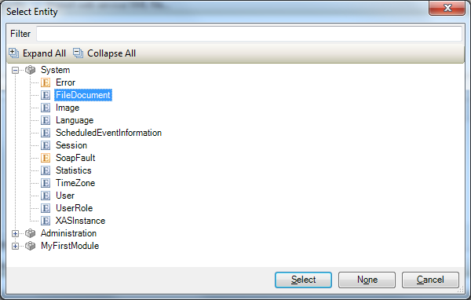
5.  Click **OK** in the entities property form. Your entity now inherits all properties from the System.FileDocument entity you selected and should look like this:
    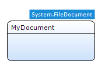
6.  Create an overview and detail page to manage objects of the entity that you just created. If you don't know how to create those pages, take a look at [this](creating-your-first-two-overview-and-detail-pages) how-to. Your detail page should look like this:
    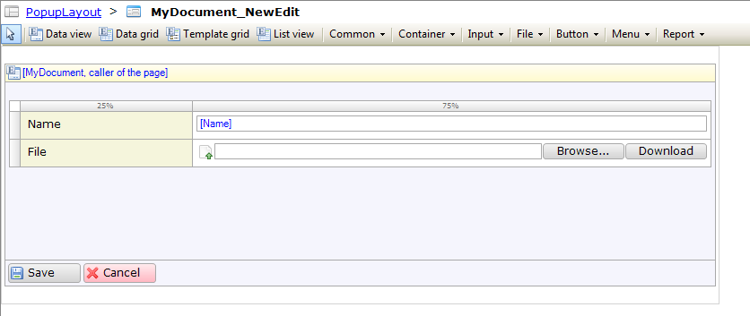
7.  Open the detail page and double click the FileManager to open its properties. On this form you can select the maximum file size and allowed file extensions.
    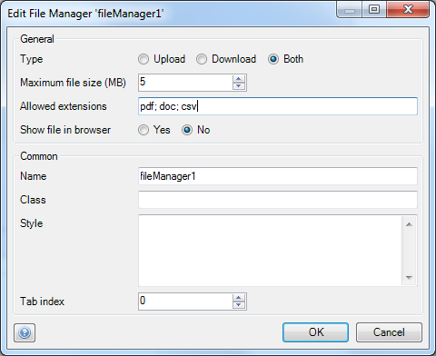

## 4\. Navigation and Security

1.  Create a navigation item for your overview page to start using it. If you don't know how to setup the navigation structure, take a look at [this](setting-up-the-navigation-structure) how-to.
2.  If you turned on security for this application you need to configure page access on both the overview and detail pages. If you don't know how to configure page access, take a look at [this](creating-a-secure-app) how-to.

## 5\. Related content

*   [Creating a basic data layer](creating-a-basic-data-layer)
*   [Denormalize Data to Improve Performance](denormalize-data-to-improve-performance)
*   [Setting up data validation](setting-up-data-validation)
*   [Working With Object Events](working-with-object-events)
