## 1 Introduction

This how-to is based on the video "Build a simple HRM app: Smarten up your app with business logic," which is part of the [Getting Started videos](http://gettingstarted.mendixcloud.com/link/courses/gettingstarted).

This is the last how-to in a series of five on how to create a simple HRM application. In this how-to, you learn how to smarten up your application by adding business logic.

**After using this how-to, you will know how to do the following:**  

*   How to create a microflow
*   How to build business logic

## 2 Prerequisites

Before you can start with this how-to, make sure you have completed the following prerequisite:

* Use the fourth how-to in this series: [Build a Simple HRM App 4: Enrich the GUI with Filter Options](build-a-simple-hrm-app-4-enrich-the-gui-with-filter-options)

## 3 Creating a Microflow

In this section you will create a microflow.

### 3.1 Adding an Action Button That Calls a Microflow

To add an action button that calls a microflow, follow these steps:

1. Open the **Employee_Overview** page of the MyFirstModule module.
2. Right-click the grid control bar of the data grid in the **Master Detail** container and select **Add button** > **Action**.
    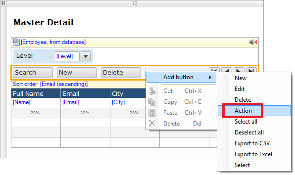 
    To learn more about action buttons, see the [Action Button section of the Mendix Reference Guide](/refguide6/action-button).
3. Double-click the new button and change the caption of the button to *Promote*.
    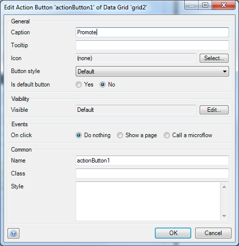
4. Select **Call a microflow** as the on click event:
    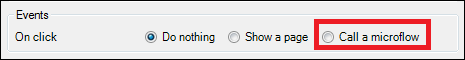
    To learn more about a microflow, see the [Microflows chapter of the Mendix Reference Guide](/refguide6/microflows).
5. Click **Select** to select a microflow:
    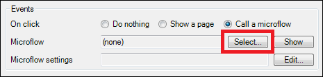 
6. Click the **MyFirstModule** module, and then click **New** to add a new microflow to the Responsive module:
    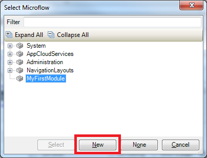 
7. Enter *Employee_Promote* in the **Name** field, then click **OK** to create the microflow:
    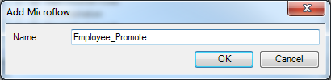 
8. Right-click the new button and select **Go to microflow**:
    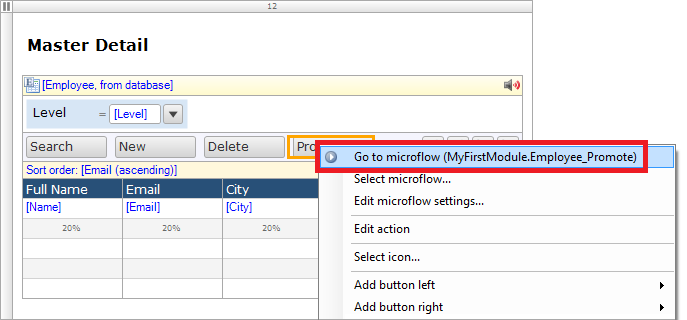 

The microflow should look like this:
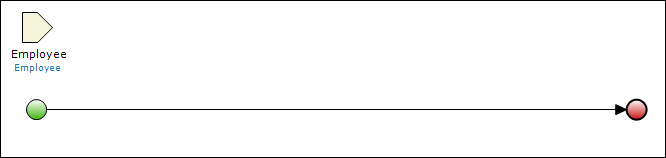 

### 3.2 Adding an Exclusive Split

To add an exclusive split, follow these steps:

1. Select an exclusive split from the toolbar of the microflow editor:
     
     To learn more about exclusive splits, see the [Exclusive Split chapter of the Mendix Reference Guide](/refguide6/exclusive-split).
2. Click a point on the line to add the exclusive split to the flow:
    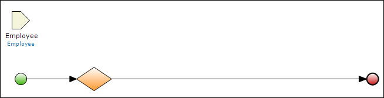 
3. Double-click the new exclusive split to open the properties editor:
    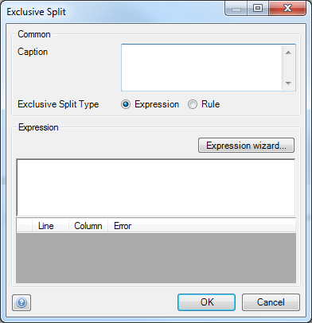
4. Enter *Level?* in the **Caption** field. 
5. Place your cursor in the **Expression** field and then press **CTRL + SPACE** to bring up a list of suggestions:
    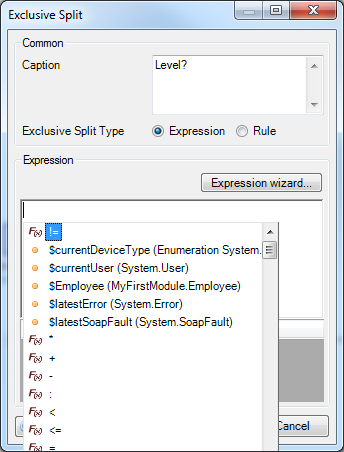 
    To learn more about microflow expressions, see the [Microflow Expressions chapter of the Mendix Reference Guide](/refguide6/microflow-expressions).
6. Select **$Employee (MyFirstModule.Employee)** from the list of suggestions. This employee object corresponds to the input object of the microflow:
    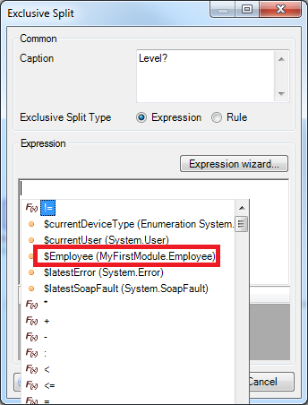
7. Add a forward slash ("/") to the value in the **Expression** field. This will show all the attributes of the employee object:
    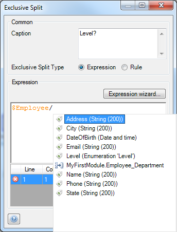
8. Select **Level (Enumeration 'Level')**:
    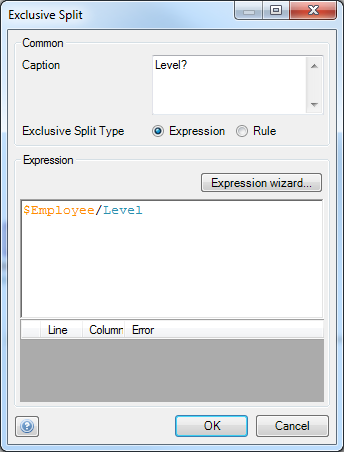
9. Click **OK**. The exclusive split will now evaluate the values from the Level attribute:
    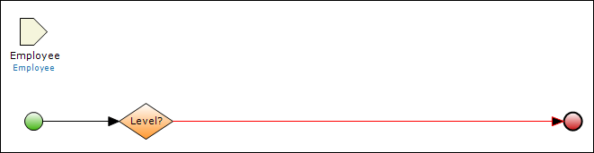 
10. Double-click a point on the line between the exclusive split and the end event, and then select **Junior** from the **Value** drop-down menu:
    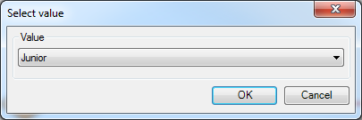 
11. Click **OK**. When the employee in the input parameter has the Junior level, this path will be executed:
    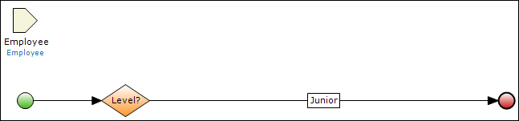
12. Select an end event from the toolbar of the microflow editor:
    
    To learn more about an end event, see the [End Event section of the Mendix Reference Guide](/refguide6/end-event).
13. Add an end event to the flow:
    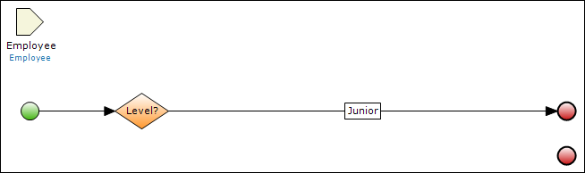
14. Drag a line from the exclusive split to the new end event.
    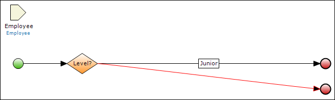
15. Double-click a point on the line between the exclusive split and the new end event, and then select **Medior** in the **Value** drop-down menu:
    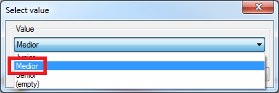
16. Click **OK**.
17. Repeat steps 10–16 for the *Senior* and *(empty)* values. The microflow should look like this:
    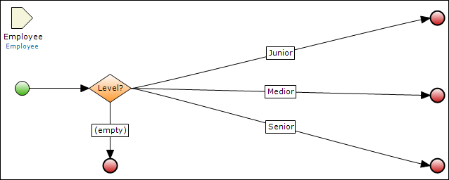

### 3.3 Adding Activities to the Microflow

To add activities to the microflow, follow these steps:

1. Drag a **Change object** activity from the **Toolbox** to the **Junior** path:
    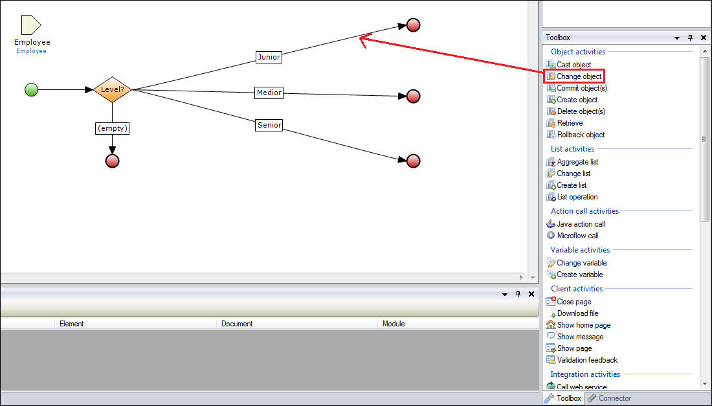
    To learn more about activities, see the [Activities chapter of the Mendix Reference Guide](/refguide6/activities).
    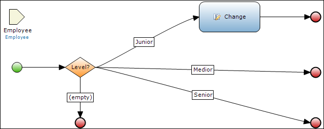
2. Double-click the new change object activity to open the **Change Object** properties editor:
    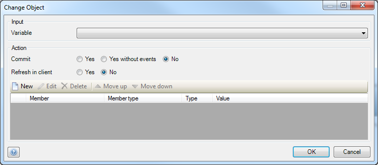
3. Select **Employee (MyFirstModule.Employee)** from the input **Variable** drop-down menu:
    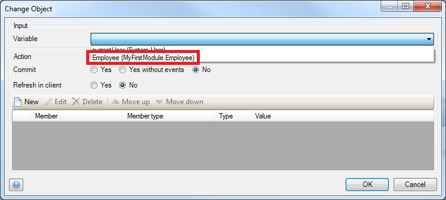 
4. Set **Commit** to **Yes**. This will save the change to the database.
5. Set **Refresh in client** to **Yes**. This will update the value in the UI.
6. Click **New** to add a new change item:
    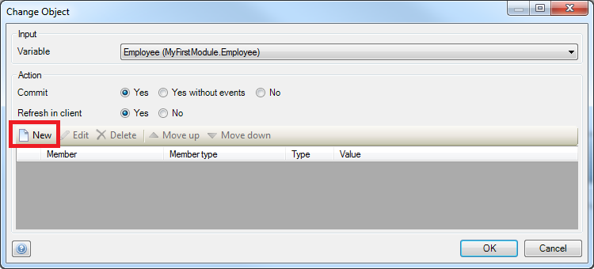 
7. Select **Level (Enumeration 'Level')** from the **Member** drop-down menu:
    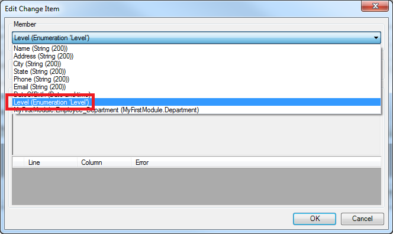 
8. Click **Generate**:
    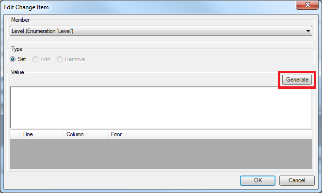 
9.  Select **Medior** from the **Constant** drop-down menu, then click **OK**:
    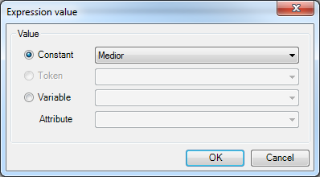
10. Click **OK** to save the change object properties. The microflow will look like this:
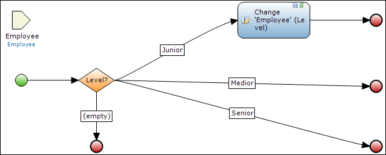 
11. Repeat steps 1–10 for the *Medior* path. Make sure that you set the level value to **Senior**. The microflow should then look like this:
    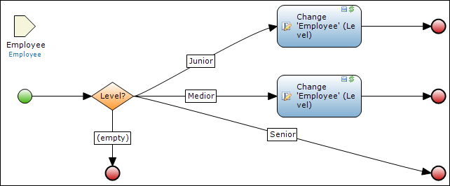
12. Drag a **Show message** activity from the **Toolbox** to the **Senior** path:
     
13. Double-click the show message activity to open the **Show Message** properties editor.
14. Enter *Employee is already at senior level* in the **Template** field, then click **OK**:
    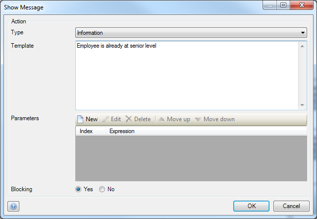
15. Drag a **Change object** activity from the **Toolbox** to the path that will be executed when the employee has no level.
16. Repeat steps 2 through 10 for this new change object activity and make sure that you set the level value to **Junior**. The microflow will look like this:
    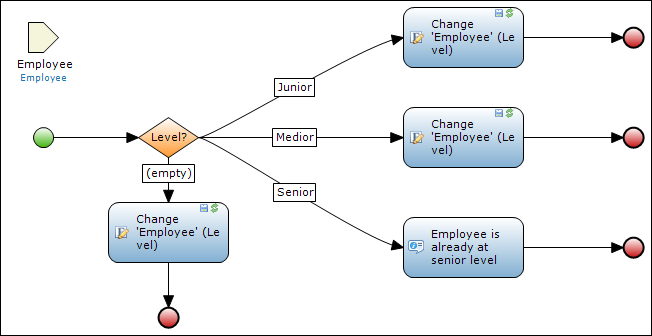 

## 4 Viewing Your App

To view your app, follow these steps:

1. Click **Run in Sandbox**, then **Save and continue**, and then **View App**.
2. Click **Employees** in the navigation list, and then select an employee with the **Medior** level.
3. Click **PROMOTE**. The level of the employee will change from **Medior** to **Senior**.
4. Click **PROMOTE**. You will see a message that you cannot promote the employee because the employee is already Senior.

## 5 Related Content

* [Build a Simple HRM App 1: Create, Manage, and Deploy the App](build-a-simple-hrm-app-1-create-manage-and-deploy-the-app)
* [Build a Simple HRM App 2: First Steps in Building a Rich GUI](build-a-simple-hrm-app-2-first-steps-in-building-a-rich-gui)
* [Build a Simple HRM App 3: Show Related Data in the GUI](build-a-simple-hrm-app-3-show-related-data-in-the-gui)
* [Build a Simple HRM App 4: Enrich the GUI with Filter Options](build-a-simple-hrm-app-4-enrich-the-gui-with-filter-options)
* [Create and Deploy Your First App](create-and-deploy-your-first-app)
* [Testing Microflows Using the UnitTesting Module](testing-microflows-using-the-unittesting-module)
