## 1 Introduction

With the REST services module from the Mendix App Store, the full power of JSON-based REST APIs is available to Mendix developers. The module serves three goals: to consume services, publish services, and synchronize data between (Mendix) apps by combining consuming and publishing. 

{}

Starting with Mendix 6.6, there is an easier way to consume a REST service. For details, see [How to Consume a REST Service (for Versions 6.6–6.10)](consume-a-rest-service_66).

{}

In this how-to, you will consume a JSON-based REST services by integrating with the API of the world famous Rijksmuseum that allows us to search for art.

**This how-to will teach you how to do the following:**

* Create a GET REST Service
* Create a POST REST Service

## 2 Prerequisites

In this section you will download the REST module from the App Store and test your service in the browser. The service tested in this how-to is the API of the Rijksmuseum, used to search for art. You will be consuming this endpoint: `https://www.rijksmuseum.nl/api/en/collection/?key=<key>&format=json&q=<search query>`.

To use this service, you need to create an account at [https://www.rijksmuseum.nl](https://www.rijksmuseum.nl/) in order to obtain an API key at the website. You can also perform the steps of this how-to using your own REST service.

Make sure you have completed these prerequisite steps:

1. Open the Mendix Modeler, and then click **App Store** in the upper-right part of the toolbar to open the App Store.
2. In the App Store, search for and download the latest **Rest Services** module:
    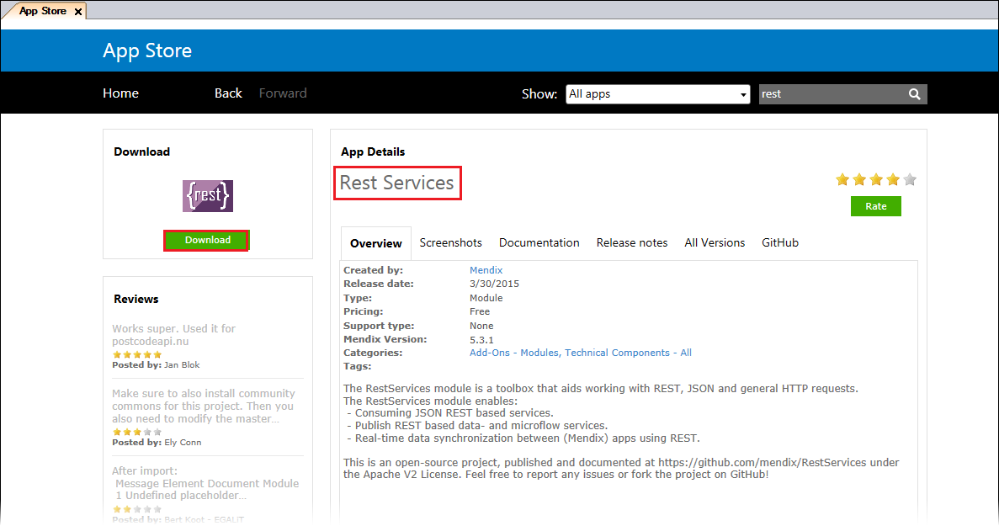
3. Search for and download the latest **Community Commons Function Library** module from the App Store:
    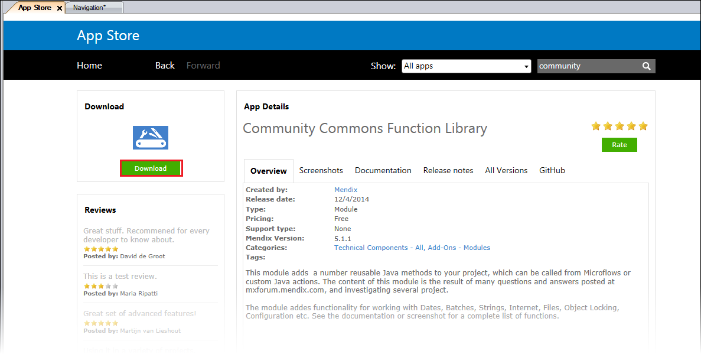
4. Test your service in the browser by filling in the `<key>` and `<search query>` fields in the URL stated above (you can use *Van Gogh* as an example search query). This will result in something similar to the following JSON fragment:
    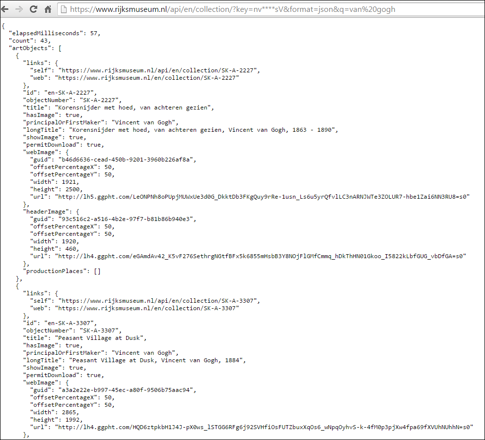

## 3 Creating a Data Model for the REST Service

In this section, you will define a data model to consume this service. You will create a Query entity to store the search request and a Results object to store the result. Then you will add all the interesting pieces of the resulting JSON to your domain model so that it reflects the structure of the JSON response (according to the JSON deserialization rules described here: [https://github.com/mweststrate/RESTServices#json-deserialization](https://github.com/mweststrate/RESTServices#json-deserialization)).

* `{` = object

* `[{` = list of objects

* `[` = list (to be able to map a list of string/float/Boolean values, you need to set a many-to-many association to the **Primitive** entity in your **RestServices** module or to a subclass of the **Primitive** entity)

To create a data model for the REST service, follow these steps:

1. Create a non-persistable **Query** object and name the attribute the same as the query parameter (case-sensitive):
    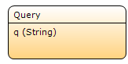
2. Create a non-persistable **Results** object to store the result and link it to the **Query** entity in order to display the results in the interface:
    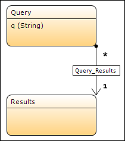
    Create your entity structure based on the JSON structure, starting with the **Results** entity. Make sure you rename the association to the name of the JSON object.

3. Create a non-persistable entity called **ArtObject** with two attributes:
    * title
    * principalOrFirstMaker
4. Create a many-to-many (`*-*`) association between the **Results** entity and the **ArtObject** entity.
5. Rename the association to **artObjects**:
    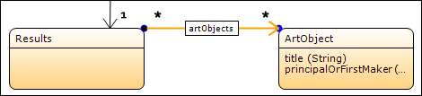
6. Create a non-persistable entity called **Image** with one attribute called **url** (string).
7. Create a one-to-many (`1-*`) association between the **ArtObject** entity and the **Image** entity and  call it **webImage**:
    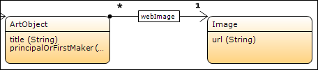
8. Create a non-persistable entity called **ProductionPlace**.
9. Make a generalization to **RestServices.Primitive**.
10. Create a many-to-many (`*-*`) association between the **ArtObject** entity and the **ProductionPlace** entity and call it **productionPlaces**:
    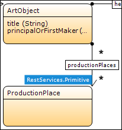

Your Domain Model should look similar to this:

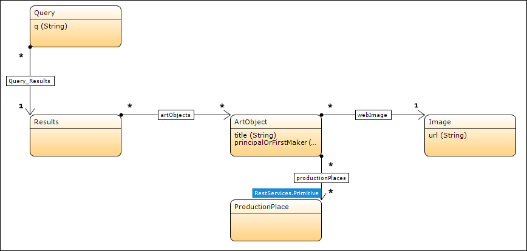

{}

The association name needs to match the name in the JSON exactly. The name of the entity can be anything you want.

{}

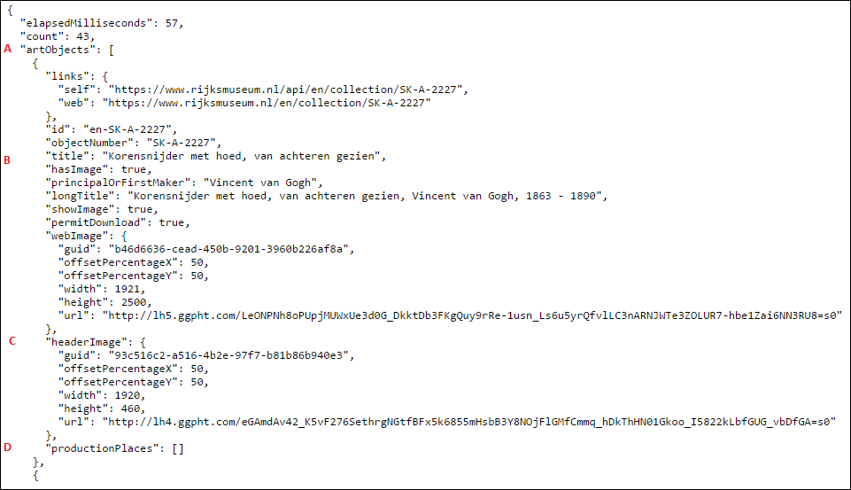

| Section | Description |
| --- | --- |
| A | List of objects, association: **artObjects** |
| B | The **title** attribute of the **ArtObject** entity (you can name the entity anything you want, but the attribute has to be exactly the same) |
| C | Single object, association: **headerImage** |
| D | List of strings, association: **productionPlaces** |

## 4 Creating the Results Page

In this section, you will create a page enabling users to enter a search query and see the results in a data grid over the provided association, and you will add a button that will execute the search.

### 4.1 Using a Microflow as a Data Source

To use a microflow as a data source, follow these steps:

1. Create a new page called **SearchArt**.
2. Add a data view with the **Microflow** data source type, and then click **Select...**.
    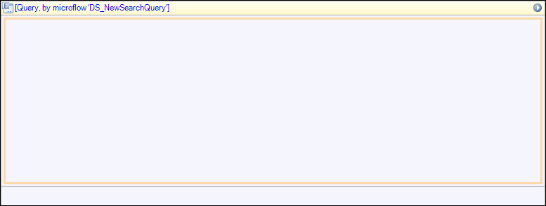
    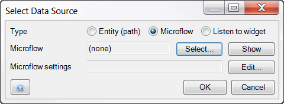
3. Create a new microflow and call it *DS_NewSearchQuery*.
4. Add a **Create object** activity.
5. Select the **Query** entity from the **Select Entity** pop-up window:
    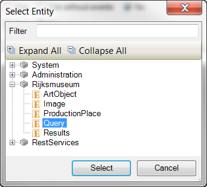
6. Name the query _NewQuery_ in the **Create Object** dialog box, and click **OK**.
7. Open the properties of the end event and select **Object** for **Type**:
    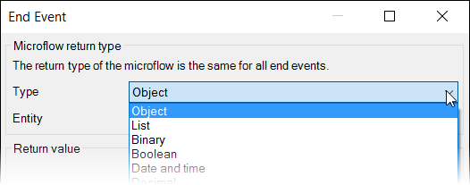
8. Select the **Query** entity, and under **Return value**, enter _$NewQuery_:
    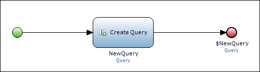
9. Click **OK** and then save the microflow.

### 4.2 Creating the Search and Result Pages

To create the search and result pages, follow these steps:

1. Go back to the **SearchArt** page and add a **Group Box**.
2. Add a new **Table** with three columns.
3. In the first column, enter **Search the Rijksmuseum**.
4. Add the **Query > q** attribute to the middle column.
5. Add a microflow button to the last column:
    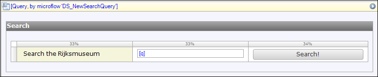
6. Add a nested **Results** data view inside the **Query** data view, and then add a nested **ArtObject** template grid inside the **Results** data view:
    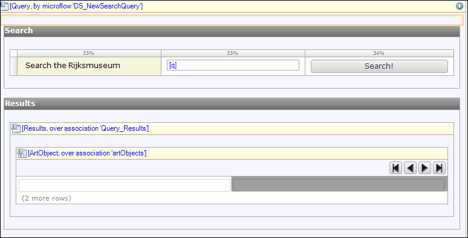
7. Add the fields as illustrated in the screenshot below to the **ArtObject** template grid:
    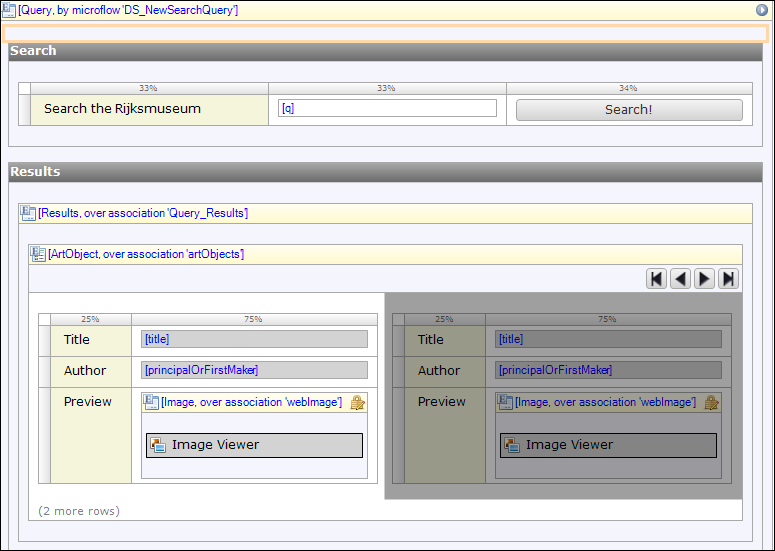

    You can download the **Image Viewer** widget from the App Store and add the **url** attribute to the **Image attribute** in the properties section:

    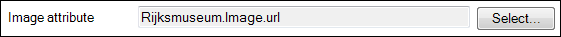

8.  Add the created page to your navigation.

## 5 Consuming the Service Using a Get Request

In this section you will consume the service in the **Search** microflow using the Get request to retrieve data.

To consume the service using a Get request, follow these steps:

1. Create a **microflow** with **Query** as the input parameter and link it to the **Search** button:
    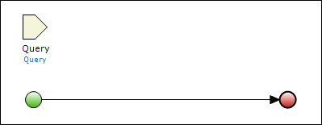
2. Create a new **Results** object and add a **request** Java Action to the microflow:
    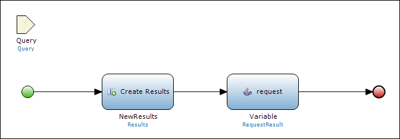
3. Add the **request** Java Action with the following details:

    Name | Argument
    --- | ---
    method | RestServices.HttpMethod.GET
    url | 'https://www.rijksmuseum.nl/api/en/collection/?key=' + <API_Key> + '&format=json'
    optRequestData | $Query
    optResponseData | $newResults
    sendWithFormEncoding | false

    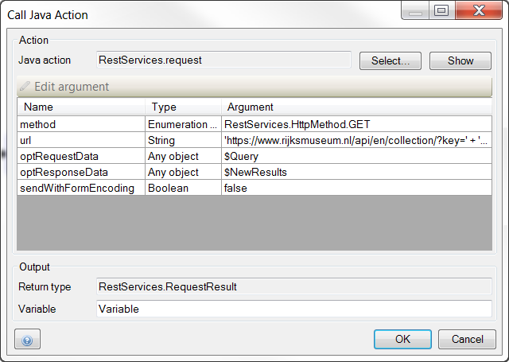

    You have now requested the data from the Rijksmuseum, and the data has been mapped to your **Results** and associated entities.
4. Add a Change object activity and link the **NewResults** object to the **Query** object. This will show the search results on the page:
    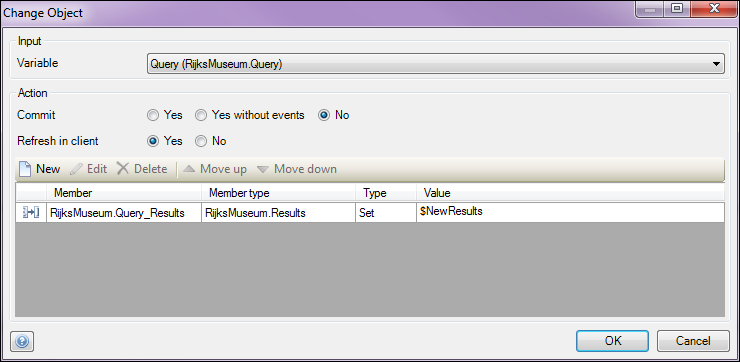
    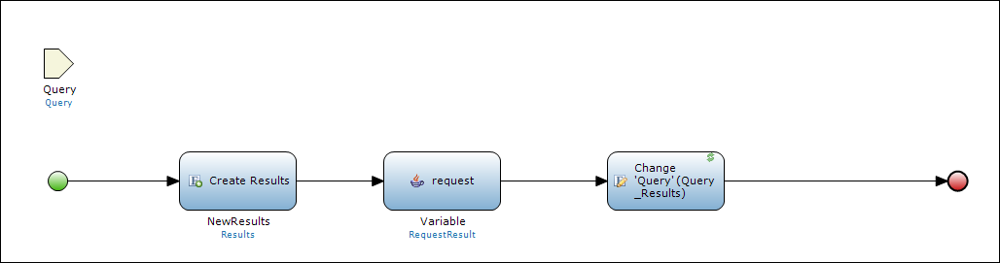
5. Run your application and search for _van Gogh_. You will see the following results:
    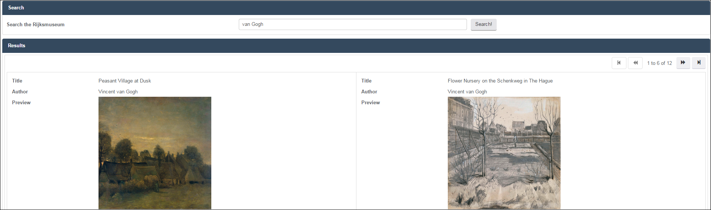

## 6 Consuming the REST Service with a POST Request

In this section, you will create a microflow to hypothetically send data back to the Rijksmuseum. There is no POST service available, but this example demonstrates how you would setup a POST request if the service was available.

1. Open the **SearchArt** page.
2. Add a microflow button to the search page and name it _Update_. 
3. Add an edit button to the **ArtObject** template grid so that you can change the data of the result.
    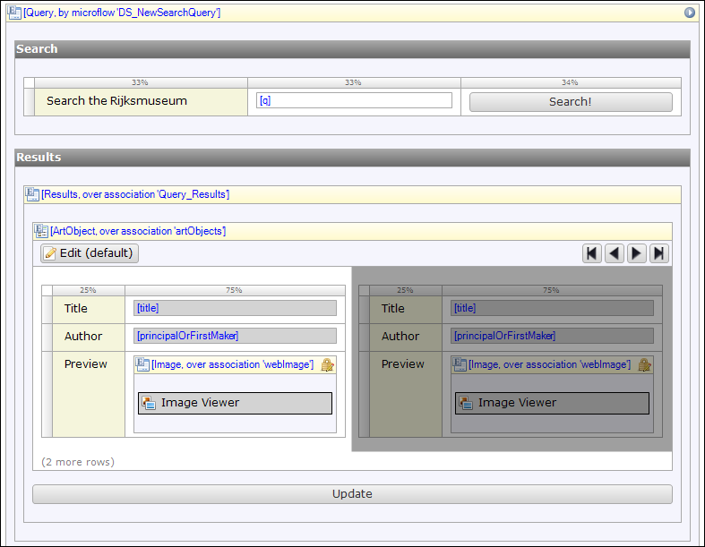
4. Create a microflow for the **Update** button and add the following:
    * Input Parameter –Results
    * Java action – Request

    Name | Argument
    --- | ---
    method | RestServices.HttpMethod.POST
    url | 'https://www.rijksmuseum.nl/api/en/collection/?key=' + <API_Key> + '&format=json'
    optRequestData | $Results (ideally you would name it Request)
    optResponseData | Add here the entity to which you can map the response (if a response is available from the service)
    sendWithFormEncoding | false

    **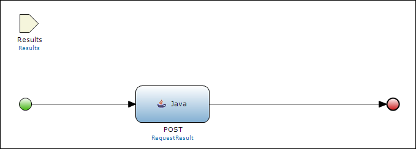**
    If you now change the data of one of the objects linked to the **Results** object that you are passing on to the microflow, the POST request will update the other system accordingly.

## 7 Related Content

* [Consuming a Complex Web Service](consume-a-complex-web-service)
* [Consuming a Simple Web Service](consume-a-simple-web-service)
* [Exporting XML Documents](export-xml-documents)
* [Importing Excel Documents](importing-excel-documents)
* [Exposing a Web Service](expose-a-web-service)
* [Selenium Support](selenium-support)
* [Synchronizing User Accounts Using the LDAP Module](synchronizing-user-accounts-using-the-ldap-module)
* [Importing XML Documents](importing-xml-documents)
* [Exposing Data to BI Tools Using OData](exposing-data-to-bi-tools-using-odata)
