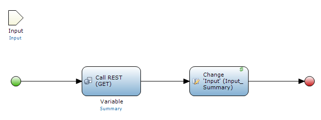

## 1 Introduction

In your Mendix app, you can use information from REST services. This how-to shows you how to do that through an example in which you create an app that retrieves Wikipedia pages from a REST service. The resulting app is [available for download](attachments/consume-a-rest-service_66/WikipediaApi.mpk).

**This how-to will teach you how to do the following:**

* Call the REST service in a microflow

## 2 Prerequisites

Before starting this how-to, make sure you have completed the following prerequisites:

* Install Modeler version 6.6 or higher
  * If you need to use an older version of the Modeler, you can follow [How to Consume a Rest Service (for Versions 6.0–6.10)](consume-a-rest-service) for Mendix versions prior to 6.6

## 3 Creating a JSON Structure

The Wikipedia REST service allows you to retrieve the summary of a page. This service can be reached at `https://en.wikipedia.org/api/rest_v1/page/summary/{title}`, where `{title}` is the title of a page.

We will start by providing the Modeler as an example of what the REST service returns:

1. Open your browser and go to [https://en.wikipedia.org/api/rest_v1/page/summary/Tahiti](https://en.wikipedia.org/api/rest_v1/page/summary/Tahiti)
   * This calls the REST service with a GET request – the result is the summary of the [Tahiti page on Wikipedia](https://en.wikipedia.org/wiki/Tahiti) in the JSON format

    

2. Copy the whole JSON snippet.
3. Add a new **JSON Structure** to your app. A [JSON structure](../refguide6/json-structures) contains sample JSON that you can use in your app.
4. Paste the JSON snippet.
5. Click **Refresh**. This analyzes the structure of the JSON snippet so we can use later.

    

6. Click **OK**.

## 4 Creating an Import Mapping

An [import mapping](../refguide6/import-mappings) specifies how the JSON relates to [entities](../refguide6/entities). Here we will generate those entities, but generally you can map the JSON to any entity you like.

To create an import mapping:

1. Create a new **Import Mapping**.
2. Click the radio button for **JSON structure** and then click **Select...**.
3. Double-click **JSON_structure**.
4. Click **Expand all** and then click **Check all**.

    

5. Click **OK**. You will now see the structure on the right.
6. Click **Map automatically...**. The Modeler will inform you that it has applied some changes. That means that it has generated entities that match the JSON structure.
7. Click **Close**.

## 5 Adding an Input Entity to the Domain Model

Our sevice takes the title of the page as an input. It returns the summary of the page. 

In this section, you are creating an entity that represents this input and associating it with its summary.

To add an input entity to the domain model, follow these steps:

1. In the **Project Explorer**, double-click the **Domain Model**.
2. Rename **Root** to **Summary**.
3. From the **Toolbox**, drag an **Entity** onto the **Domain Model**.
4. Double-click the entity and enter *Input* for the **Name**.
5. For **Persistable**, select **No**.
6. On the **Attributes** tab, click **New** to add a string attribute and name it *Title*.
7. Click **OK**.
8. Drag an association from **Input** to **Summary**.

  

## 6 Calling the REST Service in a Microflow

You will now call the REST service in a [microflow](../refguide6/microflows). The microflow takes an **Input** as a parameter and sets the associated **Summary**.

To call the REST service in a microflow, follow these steps:

1. Create a new microflow.
2. Add an **Input** object as an input parameter.
3. From the **Toolbox**, drag a **Call REST service** activity onto the microflow and double-click it.
4. Edit the location to `https://en.wikipedia.org/api/rest_v1/page/summary/{1}`, with the parameter `$Input/Title`.

    

5. On the **Response** tab, set **Response handling** to **Apply import mapping** (or to **Import mapping for the entire response**, depending on your version).
6. Click **Select** and double-click **Import_mapping**.
7. For **Name**, enter *Summary*.

    

8. Click **OK**.
9. From the **Toolbox**, drag a **Change object** activity onto the microflow and double-click it.
10. For the **Variable**, select **Input (MyFirstModule.Input)**.
11. For **Refresh in client**, select **Yes**. This makes sure that the summary gets shown on the screen.
12. Click **New**.
13. Under **Member**, select **MyFirstModule.Input_Summary (MyFirstModule.Summary)**.
14. Under **Value**, enter *$Summary*.

    

15. Click **OK**
 
    

16. Click **OK**

    

There you have it: a microflow that takes the title of an article as input and associates it with its summary.

The rest of this how-to will describe turning this microflow into an app. It doesn't deal with consuming REST services anymore, so you only need to follow along if you want to see the REST call in action.

## 7 Creating a Page

To create a page for this app, follow these steps:

1. Open the **Homepage** and add a **Data view**.
2. From the **Connector**, drag the **Input** entity onto to yellow **[Unknown]** bar.
3. Select **Microflow**.
4. For the **Name**, enter *CreateInput*. Please note that when this page loads, it needs a new **Input** object – you will fill the **CreateInput** microflow that creates this object below.
5. Click **OK**.
6. From **Container**, add a new **Table** with one row and two columns.
7. Drag the **Title** field onto the left column.
8. From the **Project Explorer**, drag **Microflow** onto the right column.
9. On the **Properties** tab, enter *Get summary* for the caption of the button.
10. Add a **Data view** below the table (inside the other data view).
11. From the **Connector**, drag the **Summary** entity onto the yellow **[Unknown]** bar.
12. Click **OK**.
13. From this data view, delete all the fields except **Extract**.
14. Double-click **Extract**.
15. For **Show label**, select **No**.
16. Click **OK**.
17. Delete the **Save** and **Cancel** buttons.

    

## 8 Filling In the CreateInput Microflow

Now all that is left is to have the **CreateInput** microflow create a new **Input** object.

To fill in the CreateInput microflow, follow these steps:

1. In the **Project Explorer**, double-click **CreateInput**.
2. From the **Toolbox**, drag on a **Create object** activity.
3. Double-click the activity.
4. Click **Select...** and double-click **Input**.
5. Click **OK**.
6. Double-click the red **End event**.
7. Under **Return value**, enter *$NewInput*.
8. Click **OK**

Congratulations! You can now start your app and get summaries from Wikipedia.

## 9 Related Content

* [How to Consume a Complex Web Service](consume-a-complex-web-service)
* [How to Consume a Simple Web Service](consume-a-simple-web-service)
* [How to Export XML Documents](export-xml-documents)
* [How to Import XML Documents](importing-xml-documents)
* [How to Import Excel Documents](importing-excel-documents)
* [How to Expose a Web Service](expose-a-web-service)
* [How to Expose Data to BI Tools Using OData](exposing-data-to-bi-tools-using-odata)
