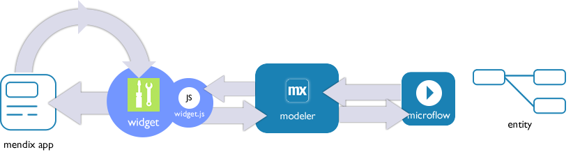

## 1 Introduction

This how-to is a quick introduction on how to build a custom widget to extend your Mendix application. We’re using the famous “Hello World” example to get you started. At the end of this how-to, you will have a basic understanding of the structure and setup of a Mendix widget.

The Mendix front-end uses the DOJO framework to implement widgets. Each Mendix widget in MX5 is essentially a DIJIT widget that inherits from `mxui.widget._WidgetBase`. For more information on DIJIT widgets and their life cycle, see [http://dojotoolkit.org/documentation/tutorials/1.6/understanding_widget/](http://dojotoolkit.org/documentation/tutorials/1.6/understanding_widget/).

**This how-to will teach you how to do the following:**

* Set up a development environment
* Create your first widget from the [AppStoreWidgetBoilerplate](https://github.com/mendix/AppStoreWidgetBoilerplate)
* Set up your Mendix test project
* Test the custom widget at runtime

## 2 Prerequisites

Before starting with this how-to, make sure you have completed the following prerequisites:

* Download and install the [Mendix Modeler](https://appstore.home.mendix.com/link/modelers/)
* [Get Started with the Widget Development Plugin for Adobe Brackets](getting-started-with-the-widget-development-plugin-for-adobe-brackets)

## 3 Custom Widget Overview

This section explains what a custom widget is and how it behaves in the Mendix platform.

### 3.1 What Is a Custom Mendix Widget?

A Mendix custom widget is a part of the user interface in your Mendix app. It enables functionality and interaction with the end-users of your app. The custom widget can alter the interface, data, and images of the app as well as the way the app works. 


A custom widget is also a folder packaged as a .zip file and renamed to an .mpk file. It contains JavaScript, HTML, CSS, and XML files that can be read by the Modeler.


The following files are required to create a widget:

* A *package.xml* file that defines the HTML, XML, CSS, and JavaScript files that make up the custom widget inside the Modeler
* A *widget.xml* file that contains the properties you can set in Mendix to configure the widget
* A *widget.js* file that is the JavaScript core of your widget
* A *widget.html* file that is the HTML template of your widget

### 3.2 The Development Lifecycle of a Custom Widget

 

1. Code your widget with Adobe Brackets (using the Widget Development Plugin).
2. Package and deploy the widget in Adobe Brackets to the **widgets** folder of your test project by pressing F4. Widgets downloaded from the App Store are also placed inside the **widgets** folder.
3. In the Modeler, press F4 to synchronize the project directory.
4. In the Modeler, you need to set the properties of your custom widget and the widgets you imported. If you changed the properties of your widget, you have to update your widgets before being able to set the properties again.
5. In the Modeler, press F5 to start the app locally or rerun the app.
6. In Chrome or Firefox, you can debug the JavaScript code created for your widget.

### 3.3 The Runtime Lifecycle of a Custom Widget



* A widget is responsible for a part of the UI of an app
* The *widget.js* file contains the logic to get data from a microflow into the widget
* The widget is responsible for handling data and (re)creating the UI for which it's responsible
* The widget also needs to handle interactivity from the web browser and end-user
* Updates on entities where the widget is attached can trigger a re-rendering of the part of the UI
* Never try to connect widgets to each other through HTML –  use entities and microflows for that instead, as the normal runtime lifecycle of a widget will handle the interface, management of events, and rendering 
* If Mendix has sent data and with an update there is no data, the widget should ALWAYS return to its original state without data

#### 3.3.1 First Initialization of a Widget


* The client sends a request to build the widget
* If the widget is configured to receive an entity from the Modeler, it will receive it
    * The widget will get the entity in the updated JavaScript function.
* It is up to the widget to do something with the Mendix entity
    * The Mendix entity in JavaScript is called a context object

#### 3.3.2 Making the Widget Intelligent


* It is important to know that a custom widget knows nothing when it starts working in the Mendix client-side code
* You have to make a proper starting point, so make your widget configurable for a particular situation within your app
    * Make this as generic as possible so you can reuse the widget in other places in your apps

{}

A property will contain the end-result of something that is configured/provided by Mendix. You must always create a starting situation where you gather what you need before continuing with the logic inside your widget and/or inside the Mendix platform.

{}

#### 3.3.3 Loading Data in Your Custom Widget


The widget needs to request the Modeler to execute a microflow:


2. The microflow executes, gathers data from the entities, and sends it back to the widget. Note that a microflow is a server-side action.
3. It is up to the widget to handle the data.

## 4 Creating a Custom Widget with Adobe Brackets

Start building your own Mendix custom widget by creating a copy of the [AppStoreWidgetBoilerplate](https://github.com/mendix/AppStoreWidgetBoilerplate). This boilerplate contains all the files and folders you need for the "Hello World" example widget. The Widget Development Plugin turns Adobe Brackets into an IDE that provides easy access to downloading and altering the AppStoreWidgetBoilerplate.

To create a custom widget with Adobe Brackets, follow these steps:

1.  Open **Adobe Brackets**, click **File**, and select **New Widget** from the menu:

    

    The name of the widget is very important, because it will be used in Mendix. Using the CamelCase naming convention is recommended (for more information, see [http://en.wikipedia.org/wiki/CamelCase](http://en.wikipedia.org/wiki/CamelCase)). Each new widget should have at least the author, version number, copyright, license, package name, widget name, and path defined before you can click **Continue**. The location directory must also exist, and you must have access rights to the folder. 

    These are the additional naming guidelines about the settings:

    | Field(s) | Naming Guideline
    | --- | --- |
    | Author, License name, PackageName, Name | Can only contain a-z and A-Z characters |
    | Copyright | Can only contain a-z , A-Z, and 0-9 characters |
    | Version | Can only contain 0-9 and "." characters |
    | Location | Can only contain a valid directory path |

2.  Provide the following values:

    | Field | Value |
    | --- | --- |
    | Author | Your name |
    | License name | Apache 2 / MIT |
    | Copyright | My Company B.V. 2015 |
    | Location | Select a folder on your local drive |
    | Version | 1.0 |
    | PackageName | HelloWorldPackage |
    | Name | HelloWorld |

    

    The location directory is now automatically opened inside Adobe Brackets:

    
3. Go to the **Location** directory that you entered in the widget creation screen.
4. Open the **test** directory. You will find the Mendix test project for the custom widget called *test.mpr* here. You will also find a folder called **widgets**, which is where the widgets you download from the App Store as well as any custom widget packages go. 

    The *.mpk* package needs a specific folder structure for it to be unpacked properly when deploying. This is an example of the folder structure for the "Hello World" widget that you just created with the Widget Development Plugin:

    
5. You will now load the widget in the Modeler. To do this, create an *.mpk* file by pressing F4 or clicking the play icon on the right side of the screen:

    

    You will then be informed that the widget has been created:

    

    The newly created MPK package is placed in the **test > widgets** directory:

    

6. Open the test project by opening *Test.mpr* from the test directory. To do this, you can press F7 or click this button in the Mendix panel in Brackets:
    

    The test project is then created in Mendix. It's possible that Brackets will ask you to select a Modeler version. Select the correct version of your installed Modeler.

    

## 5 Exploring the Custom Widget XML Files

### 5.1 The Package XML File

The name "package.xml" already suggests that this file is related to the package. It is used by the Modeler to find the widget files and unpack your widget. Within the AppStoreWidgetBoilerplate, you already get a working example of the *package.xml* file for your newly created widget. This *package.xml* file is configured with the settings you entered in the **Create a new Custom Widget** dialog box.

Open *HelloWord/src/package.xml* in Brackets:

```xml
<?xml version="1.0" encoding="utf-8" ?>
<package xmlns="http://www.mendix.com/package/1.0/">
<clientModule name="HelloWorld" version="1.0" xmlns="http://www.mendix.com/clientModule/1.0/">
<widgetFiles>
<widgetFile path="HelloWorld/HelloWorld.xml"/>
</widgetFiles>
</clientModule>
</package>
```

Because *package.xml* is an XML file, it needs to start the file with the proper [document type definition](http://en.wikipedia.org/wiki/Document_type_definition):

```xml
<?xml version="1.0" encoding="utf-8" ?>
```

The first element used in the *package.xml* is `package`. It contains the `xmlns` attribute (the XML namespace). The value of this attribute is the same for every widget. The tag will look like this:

```xml
 <package xmlns="http://www.mendix.com/package/1.0/">
```

The next element inside the package element is `clientModule`. It contains these three attributes:

Attribute | Description
--- | ---
`name` | This is most commonly the same as the name of your MPK.
`version` | Although currently unused by the Modeler, keeping track of the version of your widget package here is recommended.
`xmlns` | `clientModule` uses a different namespace.

The tag looks like this:

```xml
<clientModule name="HelloWorld" version="1.0" xmlns="http://www.mendix.com/clientModule/1.0/">
```

Inside the `clientModule` element, you define the specific paths to the widget XML files. This means that for each individual widget, you need an XML file, and the path to each file should be specified here. Mendix uses the `widgetFile` XML element with `path` as an attribute and the relative path to the widget XML file as the value of this attribute. These elements are grouped using the `widgetFiles` element. 

There is one widget in your package (the HelloWorld widget), so the tags should look like this: 

```xml
<widgetFiles>
<widgetFile path="HelloWorld/HelloWorld.xml"/>
</widgetFiles>
```

### 5.2 The Widget XML File

The AppStoreWidgetBoilerplate also comes with a pre-configured widget XML file. The Modeler uses the widget XML file to create the property input fields, which show up when you add your widget to a form.

Open *HelloWorld/src/widget/helloworld.xml* in Brackets:

```xml
<?xml version="1.0" encoding="utf-8" ?>
<widget id="HelloWorld.widget.HelloWorld" needsEntityContext="true" xmlns="http://www.mendix.com/widget/1.0/">
<name>HelloWorld</name>
<description>The description of this widget.</description>
<icon></icon>
<properties>
    <property key="backgroundColor" type="attribute">
        <caption>Background Color</caption>
        <category>Appearance</category>
        <description>The background color of the widget.</description>
        <attributeTypes>
            <attributeType name="String"/>
        </attributeTypes>
    </property>
    <property key="messageString" type="string" required="true" defaultValue="">
        <caption>Message</caption>
        <category>Appearance</category>
        <description>The message visible within the widget.</description>
    </property>
    <property key="mfToExecute" type="microflow" required="false" defaultValue="">
        <caption>Microflow</caption>
        <category>Behavior</category>
        <description>The microflow to execute on click.</description>
        <returnType type="Boolean"></returnType>
    </property>
    </properties>
</widget>
```

The first element in the file is `widget`. It contains these three attributes:

Attribute | Description
--- | ---
`id` | This is the widget’s JavaScript class: the path to the .js file, starting at the root folder, separated by dots. Note that this is case-sensitive. For more information, see [Dojo’s documentation on modules](http://dojotoolkit.org/documentation/tutorials/1.8/modules/).
`needsEntityContext` | This is a Boolean and it tells the Modeler whether or not your widget needs to be placed inside a dataview.
`xmlns` | You've seen this attribute before in your package XML. The value of this attribute is the same for every widget XML file.

The entity context needs to be set to `true`, because you're going to use a Mendix entity object in the widget. That means the tag will look like this:

```xml
<widget id="HelloWorld.widget.helloworld" needsEntityContext="true" xmlns="http://www.mendix.com/widget/1.0/">
```
Inside the widget element, there are three straightforward child elements:

Child Element | Description
--- | ---
`name` | This element is used to add the name of the widget. This is how it will show up among the “Add-ons” in the Mendix Modeler (if you’ve done the introduction course, you’re familiar with this button). For example: `<name>Hello world</name>`.
`description` | This element is used to add a brief description of the widget. What is the widget for? For example: `<description>This is my new Hello World widget and it does really cool stuff! (like printing a sentence on the screen, woo!)</description>`
`icon` | This element is used to define the widget's icon. Every element or widget in the Mendix Modeler has its own icon. It is a [Base64](http://en.wikipedia.org/wiki/Base64) representation of the image, so it can be used in an XML file.

Next you will define the widget properties. Any properties you define in your widget XML file can be set using the Mendix Modeler and they will be passed to your JavaScript file so you can use them in your widget. To define properties in XML, you have to use the `property` element. Since you’re making a list, the individual property elements will be grouped inside a `properties` element, like this:

```xml
<properties>
    <property key="backgroundColor" type="attribute">
        <caption>Background Color</caption>
        <category>Appearance</category>
        <description>The background color of the widget.</description>
        <attributeTypes>
            <attributeType name="String"/>
        </attributeTypes>
    </property>
    <property key="messageString" type="string" required="true" defaultValue="">
        <caption>Message</caption>
        <category>Appearance</category>
        <description>The message visible within the widget.</description>
    </property>
    <property key="mfToExecute" type="microflow" required="false" defaultValue="">
        <caption>Microflow</caption>
        <category>Behavior</category>
        <description>The microflow to execute on click.</description>
        <returnType type="Boolean"></returnType>
    </property>
</properties>
```

All property elements define at least two attributes: `key` and `type`. The value of `key` is the name of the property in your widget, so use a descriptive name. The value of `type` refers to the type of the property, for example, `string` or `integer`. Some additional attributes are optional, like `isDefault` and `required`. However, based on the type, you may have to define certain attributes so that the Modeler gets all the information it requires. An XSD is provided in each AppStoreWidgetBoilerplate to help you define what you need to set at certain property types.

Your Hello World widget needs an input string, which doesn't need any additional attributes defined:

```xml
 <property key="messageString" type="string">
```

Every property element contains at least three child elements. As with the attributes, based on the type of the property, you may have to define additional child elements. A string only needs the three following:

Child Element | Description
--- | ---
`caption` | This element is used to add the name of the property. This is how it will show up in the Properties list in the Modeler. For example: `<caption>Hello World string</caption>`.
`category` | This element defines in what category this property will be shown in the Properties list in the  Modeler. Common categories are “Behavior,” “Appearance,” and “Data source”. For example: `<category>Data source</category>`.
`description` | This element is used to add a useful description of the property so that the end-user knows what it’s for. For example: `<description>Add the string you want to print on your screen here (e.g.: Hello World!).</description>`.

## 6 Exploring the JavaScript File

The widget package contains a *package.xml* file and a *helloworld.xml* file. Now all you need is some action. Mendix uses the [Dojo framework](http://dojotoolkit.org/), and custom Mendix widgets are based on [Dijit](http://dojotoolkit.org/reference-guide/1.6/dijit/), which is Dojo’s widget framework.

To explore the JavaScript file, open *HelloWorld/ src/widget/HelloWorld.js* in Brackets and take a look at the source:

```js
/*jslint white:true, nomen: true, plusplus: true */
/*global mx, define, require, browser, devel, console, document, jQuery */
/*mendix */
/*
    HelloWorld
    ========================
    @file      : HelloWorld.js
    @version   : 1.0
    @author    : Gerhard Richard Edens
    @date      : Tue, 21 Apr 2015 13:00:38 GMT
    @copyright : Mendix b.v.
    @license   : Apache 2
    Documentation
    ========================
    Describe your widget here.
*/
// Required module list. Remove unnecessary modules, you can always get them back from the boilerplate.
define([
    'dojo/_base/declare', 'mxui/widget/_WidgetBase', 'dijit/_TemplatedMixin',
    'mxui/dom', 'dojo/dom', 'dojo/query', 'dojo/dom-prop', 'dojo/dom-geometry', 'dojo/dom-class', 'dojo/dom-style', 'dojo/dom-construct', 'dojo/_base/array', 'dojo/_base/lang', 'dojo/text', 'dojo/html', 'dojo/_base/event',
    'HelloWorld/lib/jquery-1.11.2.min', 'dojo/text!HelloWorld/widget/template/HelloWorld.html'
], function (declare, _WidgetBase, _TemplatedMixin, dom, dojoDom, domQuery, domProp, domGeom, domClass, domStyle, domConstruct, dojoArray, lang, text, html, event, _jQuery, widgetTemplate) {
    'use strict';
    var $ = jQuery.noConflict(true);

    // Declare widget's prototype.
    return declare('HelloWorld.widget.HelloWorld', [_WidgetBase, _TemplatedMixin], {
        // _TemplatedMixin will create our dom node using this HTML template.
        templateString: widgetTemplate,
        // Parameters configured in the Modeler.
        mfToExecute: "",
        messageString: "",
        backgroundColor: "",
        // Internal variables. Non-primitives created in the prototype are shared between all widget instances.
        _handles: null,
        _contextObj: null,
        _alertDiv: null,
        // dojo.declare.constructor is called to construct the widget instance. Implement to initialize non-primitive properties.
        constructor: function () {
            this._handles = [];
        },
        // dijit._WidgetBase.postCreate is called after constructing the widget. Implement to do extra setup work.
        postCreate: function () {
            console.log(this.id + '.postCreate');
            this._updateRendering();
            this._setupEvents();
        },
        // mxui.widget._WidgetBase.update is called when context is changed or initialized. Implement to re-render and / or fetch data.
        update: function (obj, callback) {
            console.log(this.id + '.update');
            this._contextObj = obj;
            this._resetSubscriptions();
            this._updateRendering();
            callback();
        },
        // mxui.widget._WidgetBase.enable is called when the widget should enable editing. Implement to enable editing if widget is input widget.
        enable: function () {},
        // mxui.widget._WidgetBase.enable is called when the widget should disable editing. Implement to disable editing if widget is input widget.
        disable: function () {},
        // mxui.widget._WidgetBase.resize is called when the page's layout is recalculated. Implement to do sizing calculations. Prefer using CSS instead.
        resize: function (box) {},
        // mxui.widget._WidgetBase.uninitialize is called when the widget is destroyed. Implement to do special tear-down work.
        uninitialize: function () {
            // Clean up listeners, helper objects, etc. There is no need to remove listeners added with this.connect / this.subscribe / this.own.
        },
        // We want to stop events on a mobile device
        _stopBubblingEventOnMobile: function (e) {
            if (typeof document.ontouchstart !== 'undefined') {
                event.stop(e);
            }
        },
        // Attach events to HTML dom elements
        _setupEvents: function () {
            this.connect(this.colorSelectNode, 'change', function (e) {
                // Function from mendix object to set an attribute.
                this._contextObj.set(this.backgroundColor, this.colorSelectNode.value);
            });
            this.connect(this.infoTextNode, 'click', function (e) {
                // Only on mobile stop event bubbling!
                this._stopBubblingEventOnMobile(e);
                // If a microflow has been set execute the microflow on a click.
                if (this.mfToExecute !== '') {
                    mx.data.action({
                        params: {
                            applyto: 'selection',
                            actionname: this.mfToExecute,
                            guids: [this._contextObj.getGuid()]
                        },
                        callback: function (obj) {
                            //TODO what to do when all is ok!
                        },
                        error: lang.hitch(this, function (error) {
                            console.log(this.id + ': An error occurred while executing microflow: ' + error.description);
                        })
                    }, this);
                }
            });
        },
        // Rerender the interface.
        _updateRendering: function () {
            this.colorSelectNode.disabled = this.readOnly;
            this.colorInputNode.disabled = this.readOnly;
            if (this._contextObj !== null) {
                domStyle.set(this.domNode, 'display', 'block');
                var _colorValue = this._contextObj.get(this.backgroundColor);
                this.colorInputNode.value = _colorValue;
                this.colorSelectNode.value = _colorValue;
                html.set(this.infoTextNode, this.messageString);
                domStyle.set(this.infoTextNode, 'background-color', _colorValue);
            } else {
                domStyle.set(this.domNode, 'display', 'none');
            }
            // Important to clear all validations!
            this._clearValidations();
        },
        // Handle validations.
        _handleValidation: function (_validations) {
            this._clearValidations();
            var _validation = _validations[0],
                _message = _validation.getReasonByAttribute(this.backgroundColor);
            if (this.readOnly) {
                _validation.removeAttribute(this.backgroundColor);
            } else {
                if (_message) {
                    this._addValidation(_message);
                    _validation.removeAttribute(this.backgroundColor);
                }
            }
        },
        // Clear validations.
        _clearValidations: function () {
            domConstruct.destroy(this._alertdiv);
            this._alertdiv = null;
        },
        // Show an error message.
        _showError: function (message) {
            if (this._alertDiv !== null) {
                html.set(this._alertDiv, message);
                return true;
            }
            this._alertDiv = domConstruct.create("div", {
                'class': 'alert alert-danger',
                'innerHTML': message
            });
            domConstruct.place(this.domNode, this._alertdiv);
        },
        // Add a validation.
        _addValidation: function (message) {
            this._showError(message);
        },
        // Reset subscriptions.
        _resetSubscriptions: function () {
            var _objectHandle = null,
                _attrHandle = null,
                _validationHandle = null;
            // Release handles on previous object, if any.
            if (this._handles) {
                this._handles.forEach(function (handle, i) {
                    mx.data.unsubscribe(handle);
                });
                this._handles = [];
            }
            // When a mendix object exists create subscribtions.
            if (this._contextObj) {
                _objectHandle = this.subscribe({
                    guid: this._contextObj.getGuid(),
                    callback: lang.hitch(this, function (guid) {
                        this._updateRendering();
                    })
                });
                _attrHandle = this.subscribe({
                    guid: this._contextObj.getGuid(),
                    attr: this.backgroundColor,
                    callback: lang.hitch(this, function (guid, attr, attrValue) {
                        this._updateRendering();
                    })
                });
                _validationHandle = this.subscribe({
                    guid: this._contextObj.getGuid(),
                    val: true,
                    callback: lang.hitch(this, this._handleValidation)
                });
                this._handles = [_objectHandle, _attrHandle, _validationHandle];
            }
        }
    });
});
require(['HelloWorld/widget/HelloWorld'], function () {
    'use strict';
});
```
This looks like a lot of code, but it is actually well organized. We will go through it step by step below.

### 6.1 The Bare Minimum Making Up the DIJIT Widget

When you build a custom widget from the AppStoreWidgetBoilerplate, it is based on an AMD-DIJIT widget. If you cut down to the core of the JavaScript file, the following code is what you get:

```js
define([ ... ], function ( ... ) {
    'use strict';

    return declare( ... , [ ... ], {

    });
});
require(['HelloWorld/widget/HelloWorld'], function () {
    'use strict';
});
```

### 6.2 What Does require Do?

An AMD-DIJIT Widget works with `require` and `declare`. First, `require` loads all the JavaScript files that make up your widget, and `declare` makes the widget available for Mendix.

`define` defines a set of JavaScript files needed to create the DIJIT widget. These JavaScript files are explained:

* To be able to create a DIJIT widget, you need the `dojo/_base/declare`, `mxui/widget/_WidgetBase`, and `dijit/_TemplateMixin` JavaScript:

    ```js
    'dojo/_base/declare', 'mxui/widget/_WidgetBase', 'dijit/_TemplatedMixin',
    ```

* Next you need extra DOJO and Mendix functionality to be able to create and alter the HTML and add JavaScript events:

    ```js
    'mxui/dom', 'dojo/dom', 'dojo/query', 'dojo/dom-prop', 'dojo/dom-geometry', 'dojo/dom-class', 'dojo/dom-style', 'dojo/dom-construct', 'dojo/_base/array', 'dojo/_base/lang', 'dojo/text',
    ```

* Lastly, you need external libraries, so by using `dojo/text`, you can load in any HTML template and CSS used in the Custom Widget:

    ```js
    'jquery', 'dojo/text!HelloWorld/widget/template/HelloWorld.html'
    ```

### 6.3 What Does declare Do?

After `require` has done its job, it's up to `declare` to provide a new custom widget to Mendix. This is done with the following line of code:

```js
return declare('HelloWorld.widget.HelloWorld', [ _WidgetBase, _TemplatedMixin ], {
```

* The `_WidgetBase` variable holds `mxui/widget/_WidgetBase`
* The `_TemplateMixin` variable holds `dijit/_TemplateMixin`
* Both modules are combined into a new JavaScript module with the name `HelloWorld.widget.HelloWorld`

### 6.4 Internal and External Variables

Desktop widgets in Mendix 4 and earlier use a legacy method to declare their properties by wrapping them in an `inputargs` property. The `inputargs` object is used for two things: adding default values and type casting. Note that this only works in combination with `mxui.widget.declare()`. Widgets for Mendix 4 and 5 use `dojo/declare`, so the `inputargs` object doesn’t do anything there.

Even though it is not necessary in Mendix 5 and later, this helps to keep your input variables organized, so adding it is still advised:

```js
// Parameters configured in the Modeler.
mfToExecute: "",
messageString: "",
backgroundColor: "",
```

### 6.5 The Constructor Function

Every DIJIT widget has a function called `constructor`. This function is called to pre-set values to the variables used inside your widget.

```js
// Internal variables. Non-primitives created in the prototype are shared between all widget instances.
_handle: null,
_contextObj: null,
_objProperty: null,
// dojo.declare.constructor is called to construct the widget instance. Implement to initialize non-primitive properties.
constructor: function () {
this._objProperty = {};
},
```
The code for executing a custom widget is shared among its instances. This means that variables  you define with a value are shared across all instances. If you want to define a value per instance, you must do so by setting the value within the `constructor` function.

To clarify which variables are internal and which are external, internal variables are defined with an underscore ("`_`"). The same is done to clarify internal and external functions, wherein internal functions  also start with an underscore ("`_`").

### 6.6 The postCreate Function

For the initialization of the widget, you will overwrite the DIJIT widget’s `postCreate` function. In some cases you’ll want to use the startup function to make sure the parsing and creation of any child widgets has completed (for more info, see [http://dojotoolkit.org/reference-guide/1.8/dijit/_WidgetBase.html](http://dojotoolkit.org/reference-guide/1.8/dijit/_WidgetBase.html)). DOJO warns that the startup function might be called more than once (for details, see [http://mail.dojotoolkit.org/pipermail/dojo-interest/2009-September/039477.html](http://mail.dojotoolkit.org/pipermail/dojo-interest/2009-September/039477.html)), so be sure to remember this if you use it in your widget.

```js
postCreate : function () {
...
```

Our postCreate function uses a DOM function from the [Mendix Client API](http://apidocs.mendix.com/5/client/). However, if possible, use the functions provided by DOJO. DOM functions in the Mendix API are mainly for handling browser incompatibilities. This function adds the text stored in the `messageString` variable, which is passed into the widget through our XML, to your widget's `domNode`.

```js
postCreate: function(){
	...
	this.domNode.appendChild(dom.create('span', { 'class': 'helloworld-message' }, this.messageString));
	...
} 
```

As you can see, the `messageString` that is set as a property in the *widget.xml* file is available at runtime in the `this` scope of the widget. So, `this.messageString` will be the result configured in the Modeler.

### 6.7 The Update Function

The Mendix `mxui.widget._WidgetBase` module contains a function called `update` that must be overridden. The update function is fired when the context is changed or initialized. A Mendix custom widget can be attached to a context object by placing the widget on the form inside a  data view:

 

The update function must always call a `callback` function, which is always provided by the DOJO framework:

```js
        // mxui.widget._WidgetBase.update is called when context is changed or initialized. Implement to re-render and / or fetch data.
        update: function (obj, callback) {
            console.log(this.id + '.update');
			...
            callback();
        },
```

Within `this._contextObj`, we hold the object that is sent to the update function:

```js
        // mxui.widget._WidgetBase.update is called when context is changed or initialized. Implement to re-render and / or fetch data.
        update: function (obj, callback) {
            ...
            this._contextObj = obj;
            this._resetSubscriptions();
            this._updateRendering();
            ...
        },
```

{}

An object sent to the update function can also be null! You must handle these exceptions in your widget code. 

{}

### 6.8 The _updateRendering and _resetSubscriptions Functions

Within the update function, we call the `_updateRendering` and `_resetSubscriptions` functions. The `_resetSubscriptions` function will create a subscription to any change of an entity to which the widget is attached. If there is already a subscription created, the function will first destroy the previous one.

The `_updateRendering` function will eventually render changes to the UI. Within the Hello World example, it is responsible for setting the background color. The `_updateRendering` function is also responsible for setting the widget back to its original state when it didn't have data. It is important that a widget does this in order to create a normal flow for how an app reacts to changing data. 

The developer is responsible for making this happen:

```js
        _updateRendering: function () {
            this.domNode.style.backgroundColor = this._contextObj ? this._contextObj.get(this.backgroundColor) : "";
        },
        _resetSubscriptions: function () {
            // Release handle on previous object, if any.
            if (this._handle) {
                this.unsubscribe(this._handle);
                this._handle = null;
            }
            if (this._contextObj) {
                this._handle = this.subscribe({
                    guid: this._contextObj.getGuid(),
                    callback: this._updateRendering
                });
            }
        }
```

## 7 Adding the Custom Widget to a Mendix Project

The final step is to add your widget to your Mendix project. The widget should now be available from the **Add-on** menu.

To add the custom widget to your Mendix project, follow these steps:

1. Open the test project by opening *Test.mpr* in the **test** directory (you can also use F7 in Brackets). The test project is created in Mendix 5.14.1, so it's possible that Brackets will ask you to select a Modeler version. Select the **Modeler version** of your installed Mendix version:

    

    Brackets will open the test project for you inside Mendix:

    

2. You need to configure the test project.

Widget build log: in some cases, a widget may fail to build from the Modeler. In order to find out what went wrong, check the *build-report.txt* file in the **deployment > data > tmp > dojo** folder in your project.

## 8 Further Reading

Some interesting books and articles are listed below that you might want to read when diving into the sourcecode of the AppStoreWidgetBoilerplate.

### 8.1 Writing Your Own DOJO Widget

Mendix custom widgets are based on DOJO widgets. For more information, see this blog post:

[http://dojotoolkit.org/reference-guide/1.10/quickstart/writingWidgets.html](http://dojotoolkit.org/reference-guide/1.10/quickstart/writingWidgets.html)

### 8.2 The Mendix Client API 6.0

To communicate with Mendix, you need to use the Mendix JavaScript Client API. For details, see the [Mendix 6 Client API](https://apidocs.mendix.com/6/client/).

### 8.3 Learning JavaScript Design Patterns

This is a great book that can help you understand what JavaScript is all about:

[http://addyosmani.com/resources/essentialjsdesignpatterns/book/](http://addyosmani.com/resources/essentialjsdesignpatterns/book/) 

## 9 Related Content

* [Create a Chainable Custom Widget](create-a-chainable-custom-widget)
* [Get Started with the Widget Development Plugin for Adobe Brackets](getting-started-with-the-widget-development-plugin-for-adobe-brackets)
* [Use the Mobile Slider Custom Widget](the-mobile-slider-custom-widget)
