## 1 Introduction

Mendix uses visual models called microflows to define the logic of your application. A microflow is a visual way of expressing what traditionally would be written in code. This how-to explains how you can create a custom save button on a detail page by utilizing microflows.

**This how-to will teach you how to do the following:**

* Create a custom Save button

## 2 Prerequisites

Before starting with this how-to, make sure you have completed the following prerequisites:

* Create a basic data layer (for details, see [How to Create a Basic Data Layer](create-a-basic-data-layer))
* Create overview and detail pages for the customer object (for details, see [How to Create Your First Two Overview and Detail Pages](create-your-first-two-overview-and-detail-pages))
* Create a menu item to access the customer overview page (for details, see [How to Set Up the Navigation Structure](setting-up-the-navigation-structure))

## 3 Replace the Default Save Button With a Custom Save Button

To replace the default Save button with a custom one, follow these steps:

1. Open the **Customer_NewEdit** detail page, which should look like this:
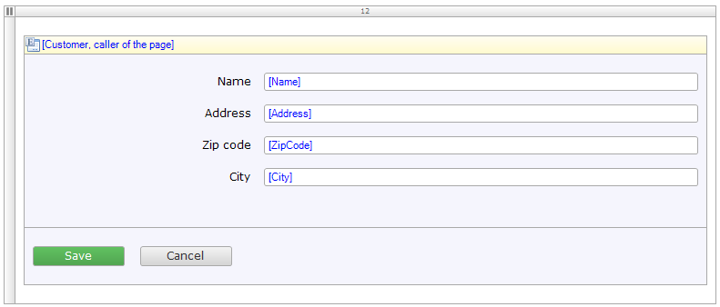

2. Right-click the **Save** button and remove it by selecting **Delete**.
3. Open the **Button** menu and select **Action button**.
4. Add the Action button to the button bar:

    

5. Double-click the new **Action button** to open its properties:

    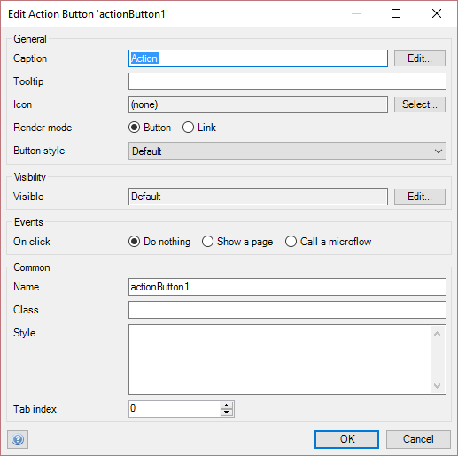

6. Change the *Caption* to **Save**.
7. Change the *Icon* to the **Save** image:

  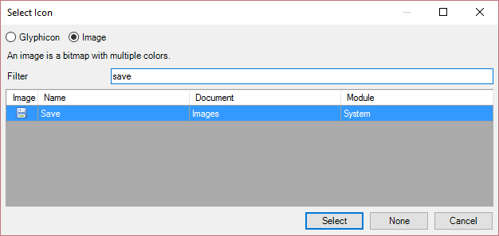

8. In the *Events* section, select **Call a micvroflow** and create a new microflow with the name **Customer_Save**.
9. Click **OK** to save the new microflow button.

## 4 Re-create the Default Save Behavior

1. Right-click the new **Microflow** button and select **Go to microflow** to open the new microflow:

    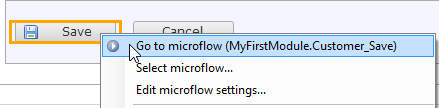

    The microflow should look like this:

    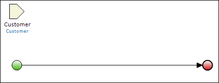

2. Open the **Toolbox** from the bottom-left corner of the Modeler:

    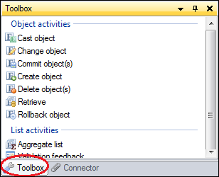    
    You can also open it from the **View** menu:

    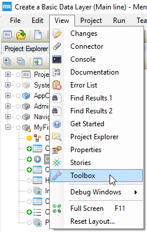

3. Drag a **Commit object(s)** action from the **Toolbox** to the line between the green start and red end events, which will insert a commit action activity.
4. Double-click the new activity to open its properties:

    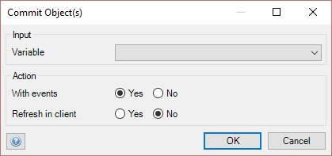
5. In the *Input* section, select **Customer** for *Variable* and click **OK**. The microflow should now look like this:

    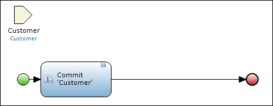

6. Drag a **Close page** action from the **Toolbox** to the line between the green start and red end events, which will insert a close page action activity. You have now re-created the default save behavior, and the m should look like this:

    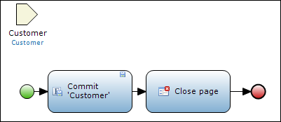

## 5 Extend the Microflow with Your Own Functionality

1. Drag a **Show message** action from the **Toolbox** to the line between the Close page and end event, which will insert a show message action activity.
2. Double-click the new activity to open its properties.
3. Select **Information** as the *Type* of message.
4. Enter a message as a **Template** value, for example, **Customer is saved!**:

    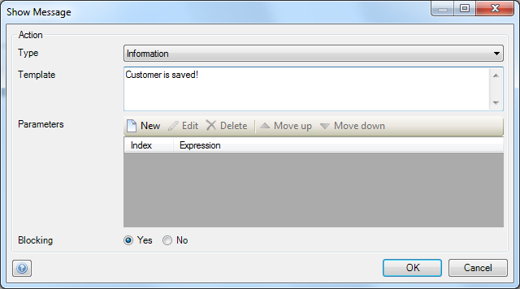

5. Click **OK** to save the properties. The microflow should now look like this:
    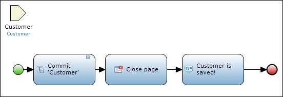

## 6 Related Content

* [How to Define Access Rules Using XPath](define-access-rules-using-xpath)
* [How to Trigger Logic Using Microflows](triggering-logic-using-microflows)
* [How to Extend Your Application with Custom Java](extending-your-application-with-custom-java)
* [How to Work With Lists in a Microflow](working-with-lists-in-a-microflow)
* [How to Optimize Retrieve Activities](optimizing-retrieve-activities)
* [How to Configure Error Handling](set-up-error-handling)
* [How to Optimize Microflow Aggregates](optimizing-microflow-aggregates)
* [How to Extract and Use Submicroflows](extract-and-use-sub-microflows)
* [Button Widgets](/refguide6/button-widgets)
* [Save Button](/refguide6/save-button)
* [Microflow Activities](/refguide6/activities)
