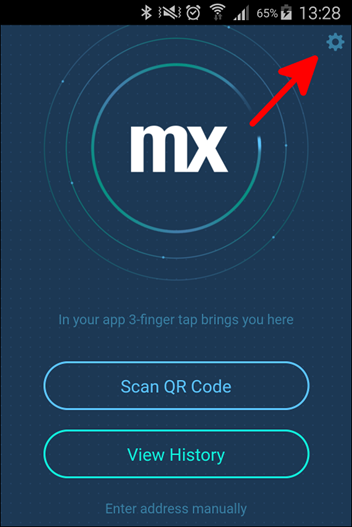

## 1 Introduction

This how-to explains the steps involved in debugging a Mendix application that is running in the Mendix Developer App on your mobile phone.

**This how-to will teach you how to do the following:**

* Debug a mobile application

## 2 Prerequisites

Before starting this how-to, make sure you have completed the following prerequisites:

* Install [weinre](https://people.apache.org/~pmuellr/weinre/docs/latest/)
* Install the Mendix Developer App (v1.1 or later) on your mobile device:
    * Download for [Android](https://play.google.com/store/apps/details?id=com.mendix.MendixDeveloperApp&hl)
    * Download for [iOS](https://itunes.apple.com/us/app/mendix-developer-app/id922423316)
    * Download for [Windows Phone](https://www.microsoft.com/en-us/store/p/mendix-developer-app/9wzdncrdftvr)

## 2 Start weinre

From your console, start weinre with the following parameters: `weinre --boundHost 1.2.3.4 --httpPort 9090`:

* `1.2.3.4` is your local IP, which will most probably match the address that you see in the history of your Mendix Developer App
* You can change `9090` to a different port as long as it doesn't clash with your application's port, which is usually 8080

## 3 Connect Your Mendix Developer App

Click the settings icon in the top-right corner of the screen to configure your debugger:

On the configure screen, fill in the same settings that you used to start weinre, which should be [http://1.2.3.4:9090](http://1.2.3.4:9090) (wherein `1.2.3.4` is your local IP).

You can now navigate to the same address on your local browser to start the debugging session.

## 4 Related Content

* [How to Find the Root Cause of Runtime Errors](finding-the-root-cause-of-runtime-errors)
* [How to Clear Warning Messages in Mendix](clear-warning-messages)
* [How to Test Web Services Using SoapUI](testing-web-services-using-soapui)
* [How to Monitor Mendix Using JMX](monitoring-mendix-using-jmx)
* [How to Debug Java Actions Remotely](debug-java-actions-remotely)
* [How to Log Levels](log-levels)
* [How to Debug Microflows](debug-microflows)
* [How to Debug Java Actions](debug-java-actions)
* [How to Handle Common Mendix SSO Errors](handle-common-mendix-sso-errors)
* [How to Debug Microflows Remotely](debug-microflows-remotely)
