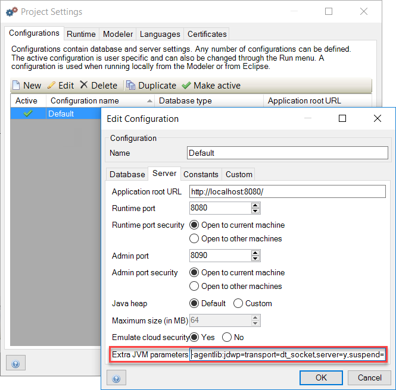

## 1 Introduction

To debug the Java actions used in a Mendix microflow, you need to make some configuration changes to the way you start the Mendix runtime. This how-to will explain how to manage this.

**This how-to will teach you how to do the following:**

* Edit the server configuration
* Configure remote debugging

## 2 Prerequisites

None.

## 3 Editing the Server Configuration with Extra JVM Parameters

In this section, you will learn how to configure the security at the prototype/demo level. Be aware that this level of security is only applicable for development/demo purposes. This level is available for the quick development of demo applications. It simulates security without the more complex configuration of data access. When deploying to the Mendix cloud, production security is mandatory.

To edit the server configuration with extra JVM parameters, follow these steps:

1. Open the project settings.
2. Edit the configuration.
3. Go to the **Server** tab on the **Edit Configuration** editor and add the following line to the **Extra JVM parameters** field: `-agentlib:jdwp=transport=dt_socket,server=y,suspend=n,address=5005`

    

4. Next, start your application in Mendix.

## 4 Configuring Remote Debugging

In your Java IDE, you need to configure remote debugging. This screenshot shows the configuration in IntelliJ:

1. Start the debugger.
2. Place some breakpoints in your Java code.
3. Start debugging.

## 5 Related Content

* [How to Find the Root Cause of Runtime Errors](finding-the-root-cause-of-runtime-errors)
* [How to Clear Warning Messages in Mendix](clear-warning-messages)
* [How to Test Web Services Using SoapUI](testing-web-services-using-soapui)
* [How to Monitor Mendix using JMX](monitoring-mendix-using-jmx)
* [How to Log Levels](log-levels)
* [How to Debug Microflows](debug-microflows)
* [How to Debug Java Actions](debug-java-actions)
* [How to Common Mendix SSO Errors](handle-common-mendix-sso-errors)
* [How to Debug Microflows Remotely](debug-microflows-remotely)
* [How to Get Started with Nexus Maven Repository Manager](http://www.andrejkoelewijn.com/blog/2010/03/09/getting-started-with-nexus-maven-repository-manager/)
* [How to Use Eclipse to Debug Your Tomcat Web Application](http://www.andrejkoelewijn.com/blog/2003/10/23/using-eclipse-to-debug-your-tomcat-web-application/)
* [How to Profile Mendix Using JProfiler](http://www.andrejkoelewijn.com/blog/2014/01/15/profiling-mendix-using-jprofiler/)
