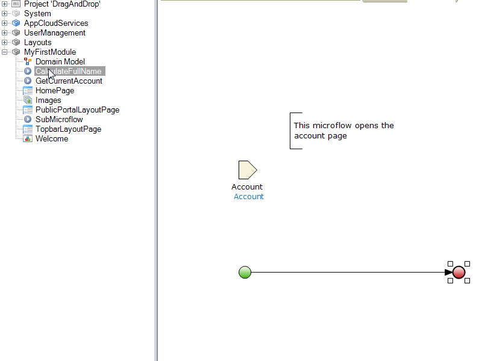
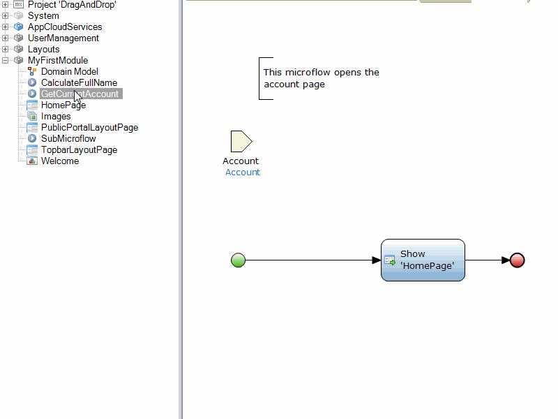

## 1 Introduction

Coming home with sore hands from using the mouse too much during the day is uncomfortable. This how-to will teach you how to use the mouse more efficiently while modeling a Mendix app.

**This how-to will teach you how to do the following:**

* Generate a submicroflow from selected actions
* Drag a microflow or a page into a microflow

## 2 Prerequisites

None.

## 3 Generating a Submicroflow from Selected Actions

If possible, re-using logic is an important procedure while developing apps. The actions that form the reusable logic can be selected and turned into a submicroflow. This just takes two clicks, as shown in this animation:

## 4 Dragging a Page into a Microflow

Dragging an existing form from the Project Explorer reduces the amount of mouse clicks and mouse pointer hovering. This animation shows how to drag a form into a microflow:

## 5 Dragging a Microflow into a Microflow

Instead of creating a new submicroflow action, it is easier to drag an existing microflow into the current one. The microflow that was dragged will automatically be identified as a submicroflow.

## 6 Related Content

* [How to Define Access Rules Using XPath](define-access-rules-using-xpath)
* [How to Trigger Logic Using Microflows](triggering-logic-using-microflows)
* [How to Create a Custom Save Button](create-a-custom-save-button)
* [How to Extend Your Application with Custom Java](extending-your-application-with-custom-java)
* [How to Work With Lists in a Microflow](working-with-lists-in-a-microflow)
* [How to Optimize Retrieve Activities](optimizing-retrieve-activities)
* [How to Set Up Error Handling](set-up-error-handling)
* [How to Optimize Microflow Aggregates](optimizing-microflow-aggregates)
* [How to Extract and Use Submicroflows](extract-and-use-sub-microflows)
