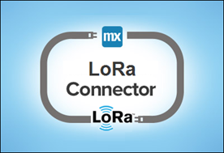
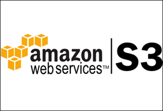

## 1 Introduction

One of the strengths of Mendix is that it’s easy to connect your Mendix application with other systems. Our App Store is filled with all kinds of connectors and adapters. This how-to presents an overview of some of our connectors.

**This how-to will teach you how to do the following:**

* Explore the connectors and adapters

## 2 Prerequisites

None.

## 3 KPN LoRa Connector

This module is a connector for the LoRa devices and enables receiving incoming messages through the LoRa network (as it is provided by KPN in the Netherlands).

[Click to download in the Mendix App Store.](https://appstore.home.mendix.com/link/app/2747/First-Consulting/KPN-LoRa-Connector)

## 4 Amazon S3 Connector

Provides access to Amazon S3 inside of Mendix.

[Click to download in the Mendix App Store.](https://appstore.home.mendix.com/link/app/2074/Mendix/Amazon-S3-Connector)

## 5 Salesforce.com-Connector

Build Mendix apps on top of your [Salesforce.com](http://Salesforce.com) environment in minutes. Get the rapid development and deployment power of Mendix seamlessly integrated on top of your entire existing [Salesforce.com](http://Salesforce.com) architecture. This adapter quickly and easily allows you to communicate with standard or custom objects in your company's [Salesforce.com](http://Salesforce.com) instance.

[Click to download in the Mendix App Store.](https://appstore.home.mendix.com/link/app/1424/Mendix/Salesforce.com-Connector)

## 6 SAML

This module allows you to use SAML to authenticate your users in your cloud application. This module can communicate with any Identity provider that supports SAML2.0 or Shibboleth.

[Click to download in the Mendix App Store.](https://appstore.home.mendix.com/link/app/1174/Mendix/SAML)

## 7 Kerberos Single Sign On

This module enables Kerberos based Single Sign On in your application. Very useful in Windows Active Directory environments, since this protocol supports Integrated Windows Authentication. As a result, users logged on to the windows domain do not have to enter their credentials to log in to your application.

[Click to download in the Mendix App Store.](https://appstore.home.mendix.com/link/app/25/Mendix/Kerberos-Single-Sign-On)

## 8 LDAP

The LDAP Provisioning Agent is used to synchronize users, available in your Directory Server, to the Mendix Platform using the LDAP Protocol.

[Click to download in the Mendix App Store.](https://appstore.home.mendix.com/link/app/1218/Mendix/LDAP-Provisioning-Agent)

## 9 Excel Importer

Import all the Excel files you want!

[Click to download in the Mendix App Store.](https://appstore.home.mendix.com/link/app/72/Mendix/Excel-importer)

## 10 Excel Exporter

Create templates that export data from your Mendix application to Excel or CSV format. This module creates an OQL query and directly prints the result to a filedocument in your desired format. Add styling to your Excel to create proper headers and styling formats to create a complete report.

[Click to download in the Mendix App Store.](https://appstore.home.mendix.com/link/app/726/Mendix/Excel-exporter)

## 11 Skype Call Widget

Skype URIs enable developers to create innovative mobile, web, and desktop apps that initiate Skype calls and chats, enabling your users to reach their friends, family and businesses in a convenient yet familiar way. For example, if your mobile app presents a contact list that contains Skype names or phone numbers, your app can use a Skype URI to launch the official Skype client and initiate a call to a selected contact.

[Click to download in the Mendix App Store.](https://appstore.home.mendix.com/link/app/757/Skype-Call-Widget)

## 12 Lync

Launch a new (or existing) Lync conversation directly from your Mendix app. Only compatible with Mendix 5+.

[Click to download in the Mendix App Store.](https://appstore.home.mendix.com/link/app/1313/Mendix/Lync)

## 13 Google Maps

Bring the world into your application, with the Google Maps widget!

[Click to download in the Mendix App Store.](https://appstore.home.mendix.com/link/app/39/Mendix/Google-Maps-Widget)

## 14 IMAP/POP3 incoming email

This module enables your project to retrieve emails from POP3/POP3S/IMAP/IMAPS servers.

[Click to download in the Mendix App Store.](https://appstore.home.mendix.com/link/app/1042/Mendix/IMAP/POP3-incoming-email)

## 15 MxSMTP Module

This module lets your application run a mail server. It will process any messages it receives and stores these in your application.

[Click to download in the Mendix App Store.](https://appstore.home.mendix.com/link/app/256/Mendix/MxSMTP-Module)

## 16 SFTP Connection

This component allows exchanging filedocuments with an SFTP server. It allows files to be send to a location, retrieved from a location and file listing of a location (for batch retrieval for instance). Mind that this component works with SFTP (SSH) and not with FTPS (SSL).

[Click to download in the Mendix App Store.](https://appstore.home.mendix.com/link/app/368/SFTP-Connection)

## 17 Simple CSV Exporter

This module is used for exporting to CSV from microflow.

[Click to download in the Mendix App Store.](https://appstore.home.mendix.com/link/app/1573/Appronto/Simple-CSV-Exporter)

## 18 Uber integration

Integration into Uber's APIs for logging in, viewing profile data, estimating trips and prices..

[Click to download in the Mendix App Store.](https://appstore.home.mendix.com/link/app/2590/Mendix/Uber-Integration)

## 19 Google analytics

This widget lets you track events, pages, and transactions on your own Google Analytics account.
[Click to download in the Mendix App Store.](https://appstore.home.mendix.com/link/app/105/Mendix/Google-Analytics)

## 20 Related Content

*   [Explore our connectors and adapters](explore-the-connectors-and-adapters)
*   [Access a Samba share from the MxCloud](access-a-samba-share-from-the-mxcloud)
