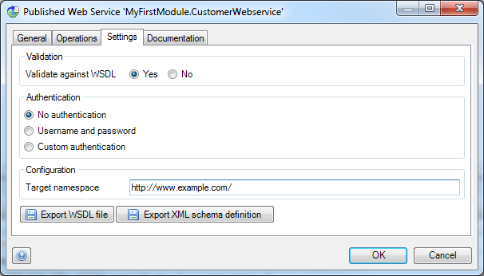
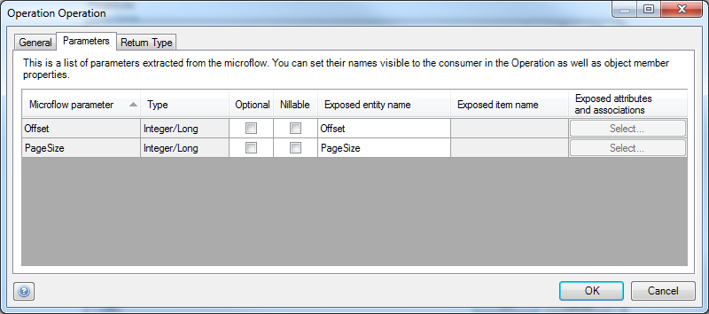
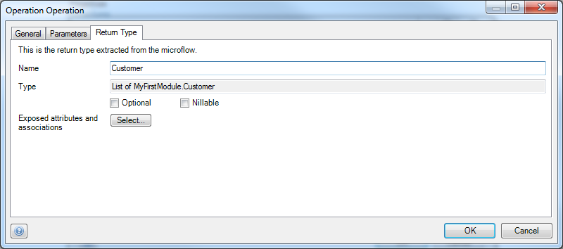

## 1 Introduction

Mendix supports many ways to expose the functionality or data of your application to others. The easiest way is to use web services. A web service can contain multiple operations.

**This how-to will teach you how to do the following:**

* Create a web service
* Publish a microflow as web service operation

## 2 Prerequisites

Before starting this how-to, make sure you have completed the following prerequisites:

* Download the latest version of the [Mendix Modeler](https://appstore.home.mendix.com/index3.html)

{}

This how-to was written based on Modeler version 5.20. All the images, names, and steps in this how-to are based on this version. When using other versions, the images and/or names on your screen may be different than the images and names used in this how-to.

{}

## 3 Data Structure and GUI

1. Create the following **Customer** entity in your domain model (for details on how to create an entity, see [How to Create a Basic Data Layer](create-a-basic-data-layer)):

    

2. Create overview and detail pages to manage objects of the **Customer** type (for details on how to create overview and detail pages, see [How to Create Your First Two Overview and Detail Pages](create-your-first-two-overview-and-detail-pages).
3. Create a menu item to access the customer overview page (for details on how to create menu items, see [How to Set Up the Navigation Structure](setting-up-the-navigation-structure).
4. Run the application and add some data to expose in the web service.

## 4 Creating a Published Web Service

To create a published web service, follow these steps:

1. Right-click the module in which you want to store the published web service and select **Add** > **Published services** > **Published web service**:

    

2. In the **Add Published Web Service** window, enter *CustomerWebservice* for the **Name** and then click **OK**:

    

3. You should now see the **Published Web Service** properties window. Take note of the following tab details:
    * On the **General** tab, you can change the **Name** if necessary:

        

    * On the **Operations** tab, you can see the available operations of the web service (currently the list is empty, so we'll add an operation [6 Publishing a Microflow](#6)):

        

    * On the **Settings** tab, you can configure the other settings (for now leave the settings as they are; for details on these settings, see [Published Web Services](/refguide6/published-web-services) in the Mendix Reference Guide):

        

    * On the **Documentation** tab, you can change the documentation:

        

4. Click **OK.**

## 5 Creating the Functionality to Expose

To create the functionality to expose, follow these steps:

1. Create a microflow that retrieves and returns a list of customers from the database (for details on how to create a microflow, see [How to Create Your First Microflow: Hello World!](create-your-first-microflow-hello-world)).
2. To make the microflow more exciting, add two input parameters to dynamically set the range settings of the retrieve action. Configure the range options of the retrieve action like this:

    

    <iframe width="100%" height="491px" frameborder="0" src="https://modelshare.mendix.com/models/083d4d13-b438-4980-b0ba-90d9a3f59f40/getcustomers?embed=true" allowfullscreen=""></iframe>

## 6 Publishing a Microflow

To publish a microflow, follow these steps:

1. Right-click somewhere in the background of the microflow and select **Publish as Web service operation...**:

    

2. Locate the web service created in [4 Creating a Published Web Service](#4) and click **Select**:

    

3. You should now see the **Operation Operation** properties editor. Take note of the following tab details:

    * On the **General** tab, you can change the **Name** and **Documentation**:

        

    * On the **Parameters** tab, you can mark the input parameters as **Optional** and **Nillable**:

        

    * On the **Return type** tab you can configure the return type:

        

4. Click **Select...** to select which attributes and associations of the return object **Customer** you want to expose:

    

5. Select the members you want to expose and click **OK**. Only the selected members will be returned by the web service.
6. Click **OK** to save the operation.

## 7 Getting a WSDL

You need a Web Services Description Language (WSDL) to allow others to interact with the web service you just created. The WSDL describes how to call the operations in the web service.

To get a WSDL, follow these steps:

1. Run the application locally or in a sandbox.
2. View the application in your browser:
    * If you run the application locally, the application URL should look like this: `http://localhost:8080/index.html`
    * If you run the application in a sandbox, the application URL should look like this: `https://myfirstapp.mendixcloud.com/index.html`
3. In both of the above cases, you can replace `/index.html` with `/ws-doc/` to open the web service documentation page:

    

    You should see the name of your web service in the list.
4. Click the "WSDL schema" URL to open the WSDL. This WSDL can be given to others so that they can interact with your web service.

## 8 Authentication and Users

To change the user authentication, follow these steps:

1. Double-click the published web service in the **Project Explorer** to open it.
2. In the **Published Web Service** properties window, open the **Settings** tab. Because **No Authentication** is set, currently users of the web service do not need to authenticate:

    

3. Change **Authentication** to **Username and password**:

    

4. Click **OK** and re-run the application. Users now need to authenticate before they can use the web service.

Mendix enables creating your own user management functionality as long as your own user object inherits from `System.User`. The `User` entity in the `System` module contains the `WebServiceUser` Boolean attribute. This attribute determines if an user is able to interact with web services. If you want a certain user to be able to interact with web services, the value of this attribute must be *true*.

## 9 Considerations

When exposing a web service, consider the following things:

* In the Modeler some words are reserved for Mendix use (for example, type, enum)
* Because you may not want to publish a "_type" attribute with an underscore ("`_`") in front of it, you can change the WSDL name by changing the last column in the selected attribute window
* If an attribute is renamed after it is published, the name in the WSDL does not automatically change (because that would break the customer's implementation)

## 10 Related Content

* [How to Consume a Complex Web Service](consume-a-complex-web-service)
* [How to Consume a Simple Web Service](consume-a-simple-web-service)
* [How to Export XML Documents](export-xml-documents)
* [How to Import Excel Documents](importing-excel-documents)
* [How to Enable Selenium Support](selenium-support)
* [How to Synchronize User Accounts Using the LDAP Module](synchronizing-user-accounts-using-the-ldap-module)
* [How to Import XML Documents](importing-xml-documents)
* [How to Consume a REST Service](consume-a-rest-service)
* [How to Expose Data to BI Tools Using OData](exposing-data-to-bi-tools-using-odata)
