## 1 Introduction

To filter data on your page, you can use the search bar functionality, or you can add an XPath constraint to your data grid. The search bar contains search fields that allow the end-user to quickly find the information he or she needs. XPath is a hard-coded constraint on your data grid that filters the data.

This how-to will start with preparing a data structure and some example data. After this setup, you will filter your data with a search bar. Then you will filter your data using different XPath constraints. 

**This how-to will teach you how to do the following:**

* Prepare the data and the data structure
* Prepare the GUI
* Filter a list using the search bar
* Filter a list using XPath

## 2 Prerequisites

To see the results of this how-to, it is necessary that you set up a test project with test data.

Before you continue, make sure that you know how to create the following:

* **Domain models** (for more information, see [How to Create a Basic Data Layer](create-a-basic-data-layer))
* **Overview and detail pages** (for more information, see [How to Create Your First Two Overview and Detail Pages](create-your-first-two-overview-and-detail-pages))
* **Menu items** (for more information, see [How to Set Up the Navigation Structure](setting-up-the-navigation-structure))

To set up the test data, follow these steps:

1. Create the following domain model:

    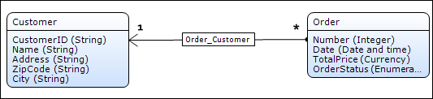

2. Create overvie and detail pages to manage the **Customer** and **Order** objects.
3. Create menu items to access the **Order** and the **Customer** overview pages.
4. Add the following customer data to your app:

    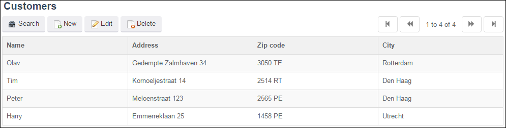

5. Add the following order data to your app:

    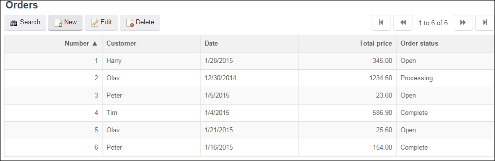

## 3 Filtering a List of Orders Using the Search Bar

In the previous section, you set up a basic data structure and created some sample data. In this section, you will add search fields to the search bar to enable filtering data on the overview page. In the examples below, you will filter via the order status and a minimum price.

To filter a list of orders using the search bar, follow these steps:

1. Open your **Orders** overview page and right-click the (empty) section above the **Search** button.

    {}

    The search bar section might be already populated if you automatically filled the contents of your data grid.

    {}

    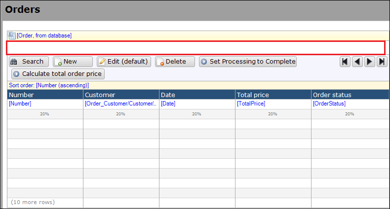

2. Right-click the search bar section and select **Drop-down**:

    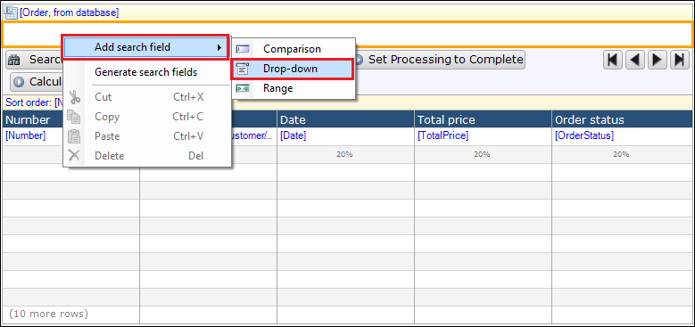

3. Add the **OrderStatus** attribute to the search field and define the name:

    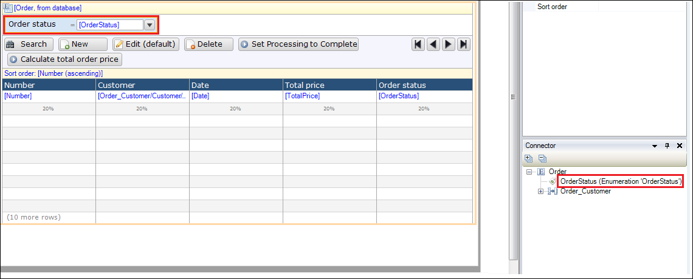

4. Redeploy your application and click **Search** on the **Orders** overview. The new search field will appear.

    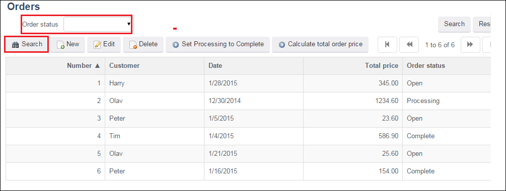

5. Use the **Order status** search field to filter your list to a specific order status and then click **Search**:

    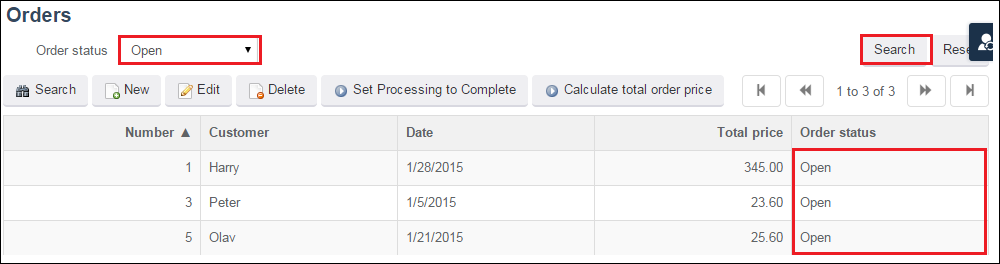

6. To filter a minimum price, add another search field to the **Orders** overview of the **Comparison** type:

    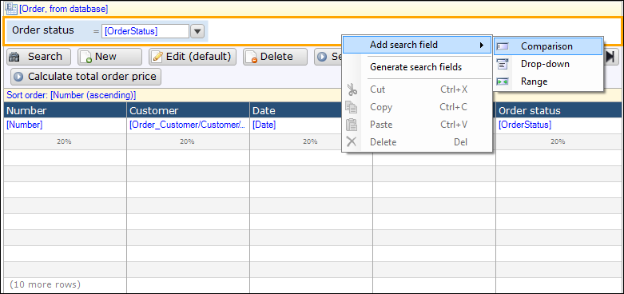

7. Select the **TotalPrice** attribute, name the search field **Minimum total price**, and change the **Comparison** from **Contains** to **Greater or equal**:

    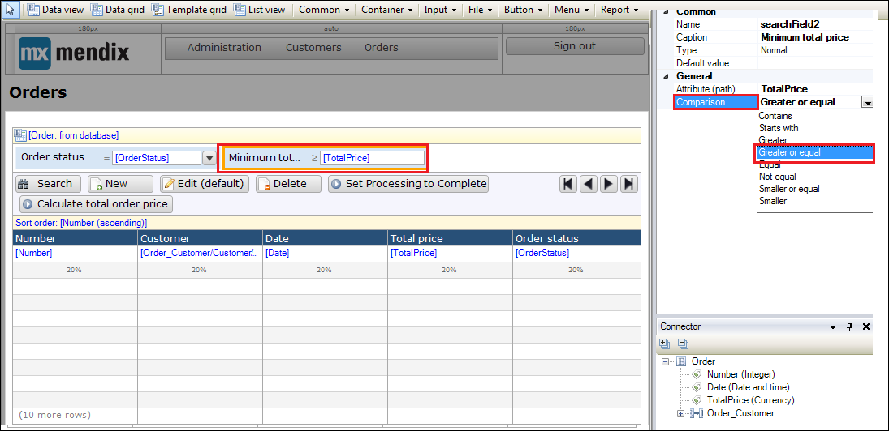

8. Redeploy your application and enter *50* in the new search field. Your list will be filtered to only show orders with a minimum value of "50."

    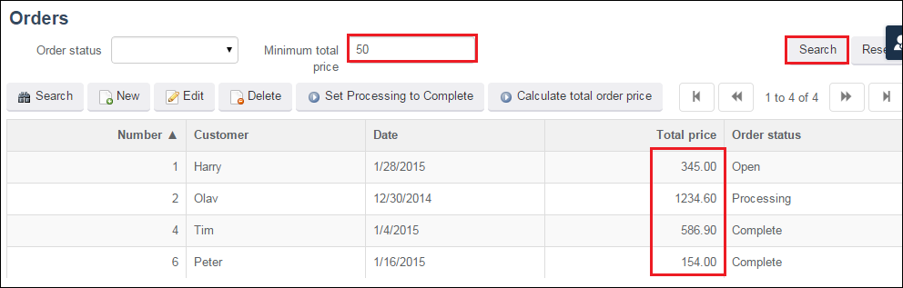

## 4 Filtering a List of Orders on the "Open" Status Using XPath 

In the previous section, you used the search bar to filter the data on your overview page. Now you will add an XPath constraint on the **Orders** data grid. With an XPath constraint on a data grid, you can filter (in a hard-coded way) the objects shown in the list. 

Mendix XPath is one of the Mendix query languages designed to retrieve data. XPath uses path expressions to select the data of Mendix objects and their attributes or associations. To learn more about XPath, see take a look at this [XPath Constraints](/refguide6/xpath-constraints?) in the Mendix Reference Guide.

To constrain the data grid so that it only displays orders with the status of "Open," follow these steps:

1. Select the **Order** data grid and click **XPath constraint** in the properties section on the right:

    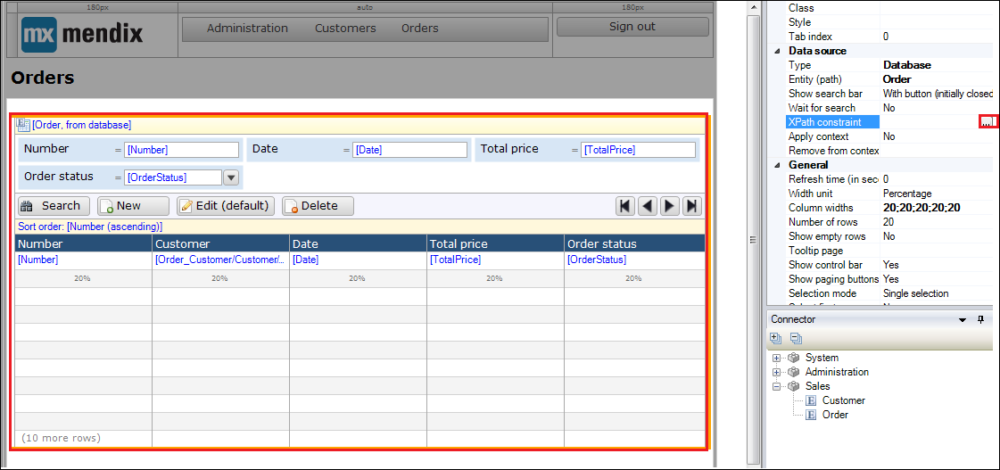

2. Enter the following expression in the **XPath Constraint** pop-up window: 

    `[OrderStatus = 'Open']`

    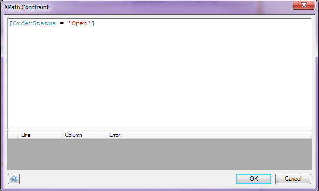

    The data grid will now only show orders with the status of "Open."

3. Run your application to see the following result set:

    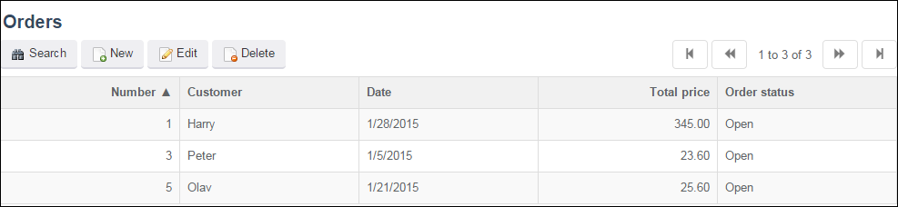

## 5 Filtering a List of Orders on the Minimum Total Price Using XPath

In the previous section, you have constrained the data grid to the status of "Open." In this section, you will change the constraint to ensure that the data grid will only show orders with a minimum value of "50.00."

To filter the list of orders for the minimum total price using XPath, follow these steps:

1. Select the **Order** data grid, open the **XPath constraint** field in the properties section, and enter the following expression:

    `_[TotalPrice >= 50]`

    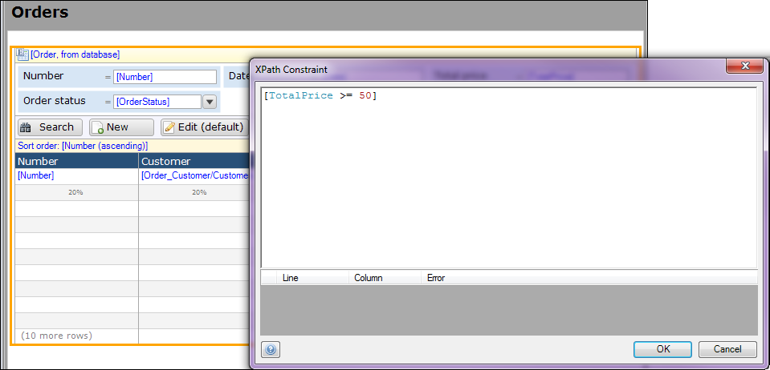
 
2. When you run your application, you will see the following result set:

    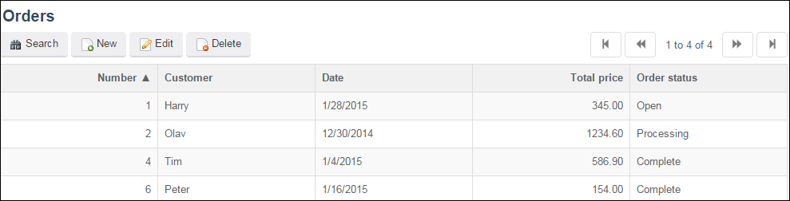

## 6 Combining Constraints Using XPath

In the previous two sections, you used single constraints to filter the data grid on the status and the minimum total price. In this section, you will combine those two constraints. The combination can be made with the `or` and `and` logical operator.

To combine constraints using XPath, follow these steps:

1. To constrain the results in the **Order** overview to only "Open" orders *or* orders with a minimum price of "50.00," insert an `or` statement into the XPath in the **XPath Contraint** pop-up window:

    ```
    [OrderStatus = 'Open']
    or
    [TotalPrice >= 50]
    ```

    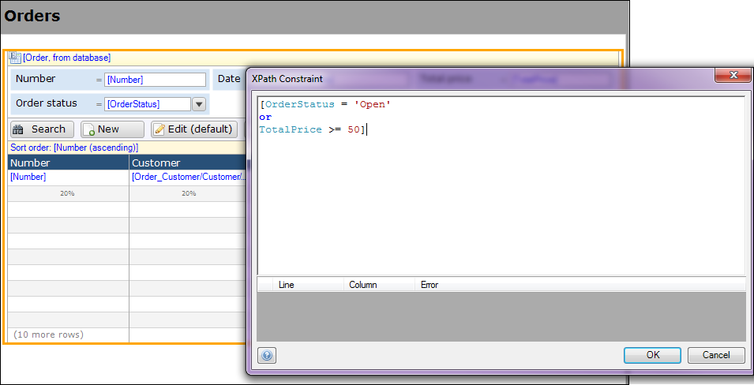

2. Run your application to see all the orders with the order status of "Open" or with a total price higher than or equal to "50":

    

3. To constrain the results in the **Orders** overview to only orders that are "Open" *and* have a minimum total price of "50," insert an `and` statement into the XPath in the **XPath Contraint** pop-up window:

    ```
    [OrderStatus = 'Open']
    and
    [TotalPrice >= 50]
    ```

    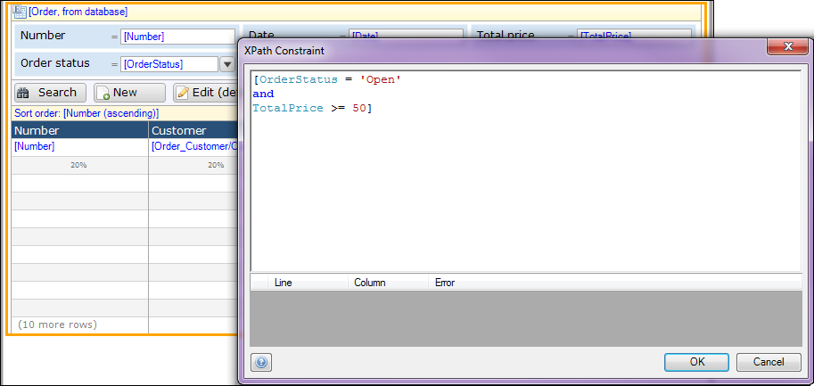

4. Run your application to see orders which are "Open" and have a minimum total price of 50:

    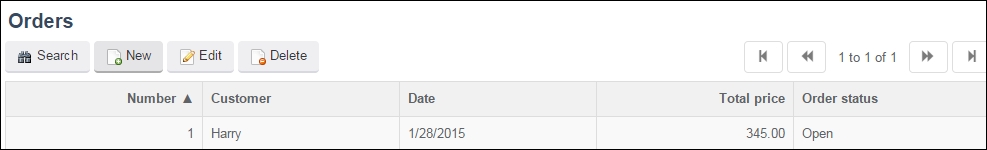

## 7 Filtering the Orders List with the Attributes of Associated Customers Using XPath

In the previous section, you constrained the data grid to attributes of the same entity as the data grid entity. In this section, you will constrain with attributes over an associated object. 

In the example activity of this section, you will filter the orders by their associated customers based on the city letter of the customer. So, to constrain the results in the **Orders** overview to only the orders from customers in Rotterdam, follow these steps:

1. Enter the following XPath into the **XPath Contraint** pop-up window:

    `[Sales.Order_Customer/Sales.Customer/City = 'Rotterdam']`

    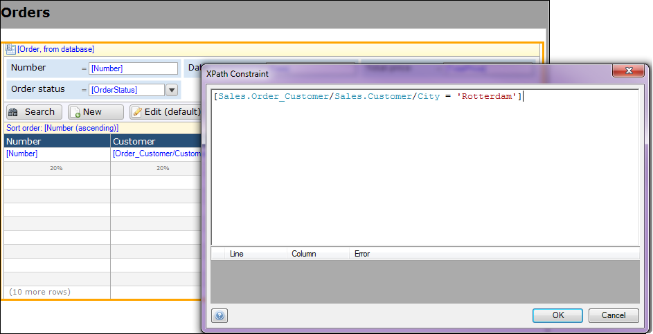

2. Run your application to only see the orders of customers in Rotterdam:

    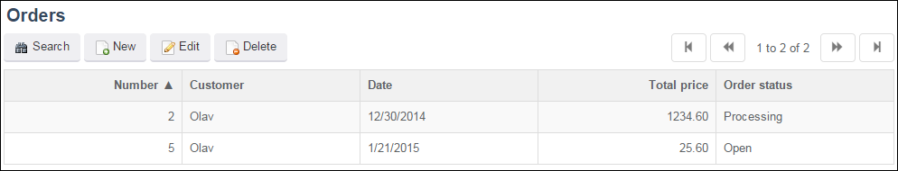

## 8 Related Content

* [How to Configure the Scout and Windows 10 Workaround](scout-and-windows-10-workaround)
* [How to Set Up Layouts and Snippets](layouts-and-snippets)
* [How to Set Up the Mendix UI Framework](setup-mendix-ui-framework)
* [How to Set Up the Mendix UI Framework with Just CSS](setup-mendix-ui-framework-with-just-css)
* [How to Set Up the Mendix UI Framework with Koala](setup-mendix-ui-framework-with-koala)
* [How to Set Up the Navigation Structure](setting-up-the-navigation-structure)
* [How to Create Your First Two Overview and Detail Pages](create-your-first-two-overview-and-detail-pages)
* [How to Find the Root Cause of Runtime Errors](finding-the-root-cause-of-runtime-errors)
* [XPath Constraints](/refguide6/xpath-constraints)
