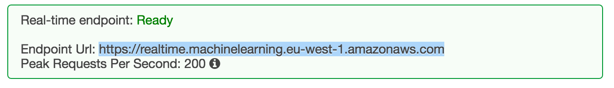

## 1 Introduction

We live in a world of digital innovations, where many applications help us to make better decisions in our daily life. Since Mendix World 2016 you have great opportunity to move your innovated business into new frontiers. Mendix applications are now not only capable of storing data, but also of making accurate predictions using the data based on the currently best known machine learning algorithms. With the brand new AwsMLConnector module, it becomes feasible to incorporate a Mendix application with the Amazon ML service, which opens up new opportunities to make a Mendix application smart like never before. You can always refer to the [Amazon ML tutorial](https://aws.amazon.com/machine-learning/) for more information about regression models and machine learning in general.

This how-to explains how to integrate your Mendix application with AmazonML to make a prediction using a pre-trained regression model and the MakeRealTimeRegressionPrediction action.

**After completing this how-to you will know:**

*   How to configure your Mendix application to be ready for making predictions
*   How to make a prediction with the MakeRealTimeRegressionPrediction action

## 2 Prerequisites

Before using the MakeRealTimeRegressionPrediction action, an appropriate regression model should be trained on the Amazon ML service. The model should be available on an enabled endpoint and configured with the proper access rules:

*   **Amazon access key id** and **Amazon secret key** for authentication
*   **Regression model id**, like **ml-1nlhUMRih2r** in the picture below
    

*   **Endpoint URL** for real-time predictions, like in the picture below
    

Having all the necessary preconditions fulfilled, the MakeRealTimeRegressionPrediction action can then be used to make predictions. But before that, you need to first install the AwsMLConnector module and configure a Mendix project.

## 3 Installation

To make the MakeRealTimeRegressionPrediction action available in a Mendix project, the AwsMLConnector module should already have been successfully imported.

## 4 Configuration

In order to make use of the MakeRealTimeRegressionPrediction action, you should already have configured a Mendix project with the three constants listed below:

*   **AwsMLConnector.AwsAccessKey** - Amazon access key for authentication
*   **AwsMLConnector.AwsSecretKey** - Amazon secret key for authentication
*   **AwsMLConnector.PredictEndpoint** - Prediction endpoint URL


## 5 Using the MakeRealTimeRegressionPrediction Action in a Microflow

### 5.1 Schema of the Regression Model

Having the regression model trained and the Mendix project configured, we are now ready to use the **MakeRealTimeRegressionPrediction** action for making predictions. Let's assume that for this particular example there is a regression model with the following schema (please refer to [this ](http://docs.aws.amazon.com/machine-learning/latest/dg/creating-a-data-schema-for-amazon-ml.html)tutorial for additional information about the Amazon ML schema format): 

**Schema of the regression model**

```java
{
  "version" : "1.0",
  "rowId" : "id",
  "rowWeight" : null,
  "targetAttributeName" : "rul",
  "dataFormat" : "CSV",
  "dataFileContainsHeader" : false,
  "attributes" : [ {
    "attributeName" : "id",
    "attributeType" : "CATEGORICAL"
  }, {
    "attributeName" : "cycle",
    "attributeType" : "NUMERIC"
  }, {
    "attributeName" : "s2",
    "attributeType" : "NUMERIC"
  }, {
    "attributeName" : "s3",
    "attributeType" : "NUMERIC"
  }, {
    "attributeName" : "s4",
    "attributeType" : "NUMERIC"
  }, {
    "attributeName" : "rul",
    "attributeType" : "NUMERIC"
  } ],
  "excludedAttributeNames" : [ ]
}
```

From the schema listed above, we know that the model predicts a **rul** feature (see **targetAttributeName**'s value) based on the given vector of **[id, cycle, s2, s3, s4] **features. Suppose that we need to predict the value of the **rul** feature from the features' values of the given vector **[3, 126, 642.88, 1589.75, 1418.89]**. Taking into account that the **MakeRealTimeRegressionPrediction** action accepts two arguments, **mlModelId** and **List of AwsMLConnector.RecordEntry** objects, the only thing that we still need to do is to convert the given vector into **List of AwsMLConnector.RecordEntry** objects.

### 5.2 Creating a Microflow

First of all, we need to create a microflow and add an instance of **AwsMLConnector.RecordEntry** that represents a feature, with key **id** and value **3,** which is later inserted into a **List of AwsMLConnector.RecordEntry**:


Then we need to repeat the same steps for the **[cycle = 126, s2 = 642.88, s3 = 1589.75, s4 = 1418.89]** values in our example, to fill in the list with all the necessary objects required to make a prediction:


Having the model id and the list of features, we are now ready to make a prediction. Drag and drop this **MakeRealTimeRegressionPrediction** action from the **AwsMLConnector **and configure it with an appropriate model id and the just created list of the objects (be aware that both the model id and a model's schema that are used in this tutorial are only relevant to this particular example and will differ in your case):


A prediction made by the **MakeRealTimeRegressionPrediction **action is available as an instance of the **AwsMLConnector.RegressionPrediction **type. In the particular example depicted above, the **Prediction** variable refers to the predicted value:


As the prediction is available through the **Prediction** variable, we can simply log the result in the console:


With just a few steps it is now possible to make your Mendix application smart like never before. Enjoy!
