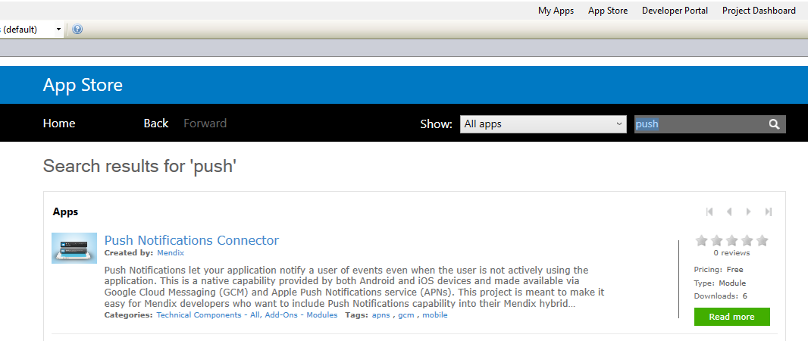
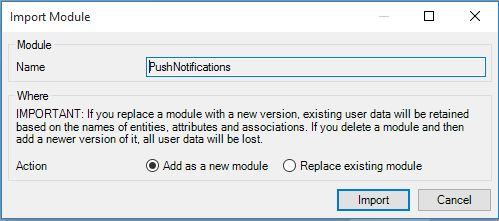
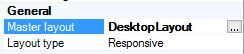
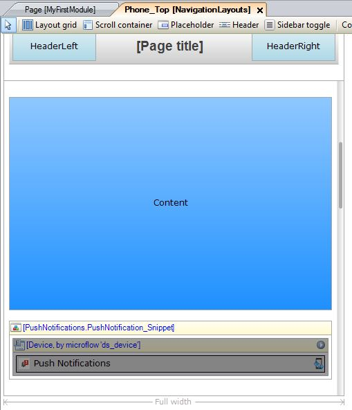
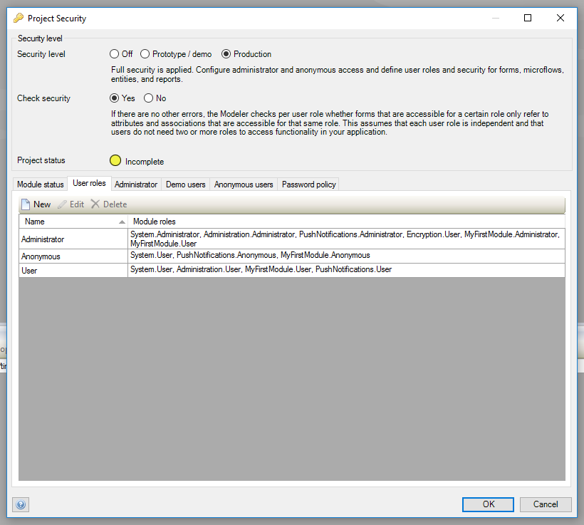

## Introduction

This guide will walk you through the steps needed to implement push notifications in your application.

**This how-to will teach you how to do the following:**

* Import the `PushNotifications` module
* Add the Push Notification widget and administrator pages
* Update several project files with the necessary dependencies
* Obtain FCM/APNs access/credentials and configuring them with your application
* Build the hybrid mobile package

## 2 Prerequisites

None.

## 3 Steps

### 3.1 Step 1 – Import the `PushNotifications` Module from the App Store

The `PushNotifications` module is published in the Mendix App Store. To import it into your project, click on 'App Store' in the top right of Modeler. This will open the App Store in a new tab. Search for _Push Notifications Connector_ and click on the title of the result.

On the resulting page, click on the green `Download` button. Make sure that 'Add as a new module' is selected, and click OK.

### 3.2 Step 2 – Install Module Dependencies

The `PushNotifications` module has two dependencies; the `Encryption` module and the `Community Commons Function Library` module. Include both dependencies by downloading them from the App Store, similar to how you installed the `PushNotifications` module. While importing you may again get a dialog about overwriting project files, which you can confirm by clicking the `OK` button.

If your project is using an older version of the [Encryption module](https://appstore.home.mendix.com/link/app/1011/Mendix/Encryption), it might trigger an error for referencing a non-existent layout. Fix it by assigning the master layout of the `Encryption.ResponsiveLayout_Certificate` layout to another layout (in this specific use case it is not really important which layout is used). This does not apply to version 1.3.1 and higher.

After importing the module and the dependencies, your error dock will inform you that entity access is out of date; double-click on the error, and then click on `Update security` at the top of the domain model pane to fix this error.

### 3.3 Step 3 – Include the Push Notifications Snippet in the Application's Layouts

To properly register your device with a third party remote push service (FCM or APNs) and display in-app notifications, the widget should be put on the pages of your app. One way to accomplish this is by
drag-and-dropping the snippet called PushNotification_Snippet (located in _USE ME folder in the PushNotifications module) into the layouts used by your app. Note that push notifications are currently not working on
the desktop.

If your app is offline-compatible, please ensure that a sync button is available to the user, so that device registration requests will be synchronized with the server. Also, make sure your app has an [offline device profile](/refguide6/offline-device-profile).

{}

Please do not remove the buttons with the caption "GCM Settings reference" and "Device Registration reference" from the PushNotification_Snippet; they are necessary to make the widget offline-compatible. Note that both buttons are
invisible to the user.

{}

### 3.4 Step 4 – Start Connectors from Your "After Startup" Microflow

The PushNotifications module contains a microflow named `AfterStartup_PushNotifications` which will start the connectors for FCM and APNs for you. Call this microflow from your AfterStartup microflow.

If your project uses Mendix SSO, most likely the `AppCloudServices.StartAppCloudServices` microflow is set to execute after startup. Please refer to the [reference guide](/deployment/mendixcloud/integrate-your-app-with-mendix-sso) for details. We suggest to change your startup microflow to a new microflow, from where you call both after startup microflows.
<iframe width="100%" height="491px" frameborder="0" src="https://modelshare.mendix.com/models/02c590e5-f8bf-4f0e-90d6-3719390ee863/onstartupacsandpushnotifications?embed=true" allowfullscreen=""></iframe>

### 3.5 Step 5 – Set up the Administration Pages

Add the `PushNotifications_Administration` page to the project navigation, so it can be reached after you deploy your app. This page contains three tabs: _`Pending Messages`_, _`Devices`_, and _Configuration_. The _Pending Messages_ tab shows all the messages that are queued either because they were sent using the `QueueMessage` action or because previous attempts to send them failed. The _Devices_ tab contains a list of all devices registered with the application and is useful for testing purposes. The _Configuration_ tab is used to configure your application to be able to reach the respective services (APNs and FCM) later on.

{}

Do not add the administration pages to the navigation layout of offline devices; the administration pages are not offline compatible.

{}

### 3.6 Step 6 – Set Up the Project Security for Your Module

Set the `Project security` -> `User roles` to include the `PushNotifications.Administrator` role as part of the main `Administrator` role and the `PushNotifications.User` role as part of the main `User` role. If your application allows anonymous users, then include the `PushNotifications.Anonymous` role role as part of the main `Anonymous` role.

### 3.7 Step 7 – Deploy Your App

At this point all implementation steps are done and you can deploy your application to the Mendix cloud. If you are using a Free App, simply click the `Run` button.

{}

You should make sure that the `Encryption.EncryptionKey` constant has a value before you start the application. If the value is not set, you will get a NullPointerException when you try to send a notification to APNs.

If you are using a Free App, you should set a default value for the constant in the model. Otherwise, you can configure the constant value in the Mendix Cloud Portal.

{}

### 3.8 Step 8 – Set Up Access to APNs and FCM

Set up access to APNs and FCM and configure them in your application. Note that starting with FCM is recommended because it is significantly less complicated than setting up APNs. You can return to this step later on to set up APNs.

See [Setting up Apple Push Notification Server](setting-up-apple-push-notification-server) and [Setting up Firebase Cloud Messaging Server](setting-up-google-firebase-cloud-messaging-server) for the details.

### 3.9 Step 9 – Build the Hybrid Mobile Application

You will need to build the hybrid mobile application. Refer to the [Publishing a Mendix Hybrid Mobile App how-to](publishing-a-mendix-hybrid-mobile-app-in-mobile-app-stores) to get the explanation on how to do this.

For more information about PhoneGap Build, you can refer to their [documentation](http://docs.build.phonegap.com/en_US/index.html).

Note that a free PhoneGap Build account is limited to a single application, whereas paid plans support multiple applications. As a consequence, you may need to delete an existing app from your PhoneGap build environment in order to create a new one.
