Mendix applications rarely exist in isolation.  Many developers find that the apps they build need to alert people in other parts of the business about important activities.  The best solution for this is often that ubiquitous notification framework, email.  If your company has an SMTP exchange, Mendix can leverage that server to send emails directly from your application.  The SMTP Email module makes this easy by providing settings, error logs, and message queues with just a few short configuration steps.

**After completing this how-to you will know:**

*   How to install the SMTP Email module into your application
*   How to send and email from a Mendix app using your own SMTP relay
*   How to perform administrative email tasks at runtime
*   How to set up an email queue

## 1. Preparation

Before you can start with this how-to, please make sure you have completed the following prerequisites.

*   Have a working SMTP relay configured for your email server
*   Know how to install modules from the app store
*   Know how to create pages and microflows in Mendix

## 2.Setting up the module

In this chapter we will install the SMTP Email module and integrate it into an existing Mendix application.

### 2.1 Installing the module into your application

1.  Download the SMTP Email module from the App Store
    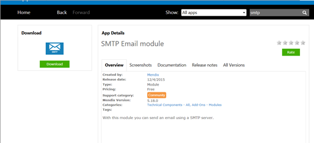
2.  You’ll need to download and set up the [Encryption Module](https://appstore.home.mendix.com/link/app/1011/Mendix/Encryption) as well. This will allow for protected passwords.

    {}

    As with all app store modules, it is important that you do NOT modify any contents within the module itself.  If you do, you run the risk of having your changes overwritten upon the next update.

    {}
3.  Create a new module called EmailCustomizations to house the project-specific pages and flows.

    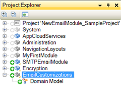

### 2.2 Exposing the configuration page

1.  Create a new page called EmailAdmin.
2.  Drop in the snippit SMTPEmailModule.Administration to give you access to those pages.
3.  Add the EmailAdmin page to your Admin navigation
4.  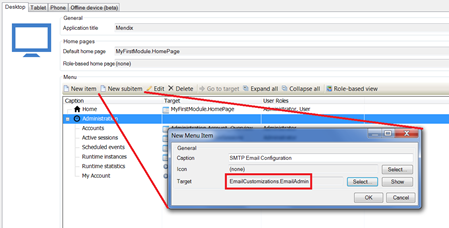

###  2.3 Configuring the SMTP settings

1.  Launch your application and head to the SMTP settings page that have just been exposed.  On the Settings tab, enter the SMTP credentials of the existing relay.

    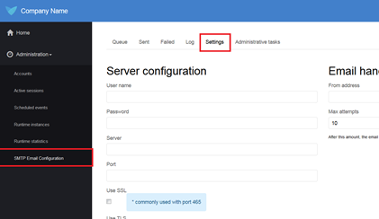
2.  Hit save to commit the settings to the database.

    {}

    Send a test email

    The module includes a ‘Test’ button at the bottom of the settings page.  This will allow you to enter a destination e-mail address that should receive a test message to make sure things are working as they should.

    {}

## 3\. Sending an email in a microflow

In this chapter, you will learn how to build a microflow in your application that can send an email using the credentials configured in Chapter 2.  The actual sending of an e-mail in the SMTP module is accomplished through the microflow SMTPEmailModule.SendEmailMessage, shown below:

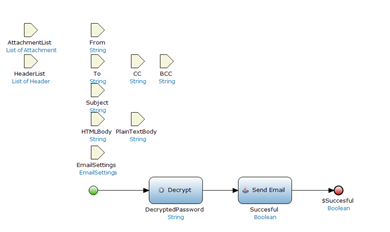

This flow takes in a number of parameters including To, From, Subject, and the email settings.  The java action Send Email is what actually bounces the e-mail to the SMTP, so as long as you define the key input information you have lots of flexibility about what emails you send.

To make the process a little simpler, however, the SMTPEmailModule includes an Email entity in the domain model.  This entity brings together all the important variables into one place. 

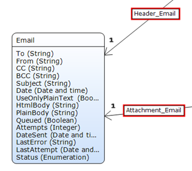

Making an e-mail is as simple as generating an Email object, populating the values, and then passing it to the SendEmail microflow.  This chapter demonstrates how to page where a user can enter a to address, a subject, and the email body and send that out from our Mendix application.

1.  Create a page called ‘MakeANewEmail’ using the basic vertical form.
    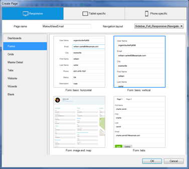

2.  On this page, allow users to edit the following values: To, CC, BCC, Subject, and Plain Body.
    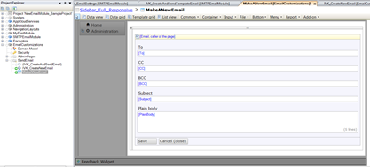

3.  Create a microflow IVK_CreateNewEmail that generates a new Email object and passes it to the page from step 2.  Add this microflow to your navigation.
    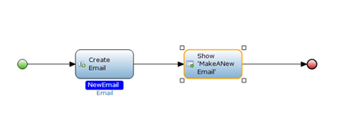

4.  On the MakeANewEmail page, delete the Save button and add an action that calls a Microflow.  Call this microflow IVK_UserManualEmailSend

    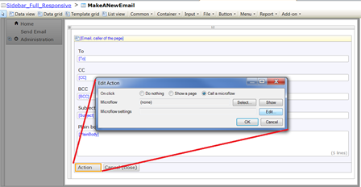

    {}

    Add a progress bar

    Don’t forget to put a progress bar on the call for your action button.  It can take a second to send the email and we want users to know that the app is still working.

    {}
5.  In the microflow IVK_UserManualEmailSend, call the IVK_SendEmail subflow in the SMTP module and then close the page.
    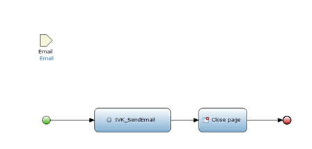
6.  Because users are only editing the Plain Text of the email on the previous page, we need to change the Email so that the ‘UseOnlyPlainText’ Boolean is set to true.  In the Microflow IVK_UserManualEmailSend, edit the change action to set the boolean to true as shown below.

    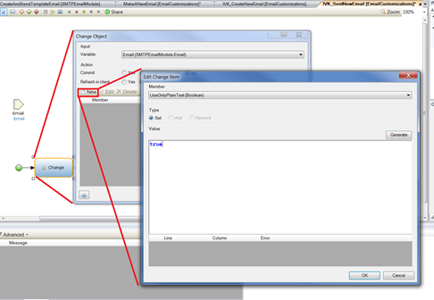

    Once a user logs into the application, they are presented with a page where they can write a custom email and send it to a desired address using your SMTP within a Mendix application
    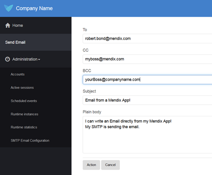

## 4\. Setting up the Email Queue

Beyond simply creating and sending e-mails, the SMTP module comes with a functioning email queue that is easy to set up.  Having an email queue can be very useful to control the email load colume or send nightly updates for users to read first thing in the morning.   The basic process for an email queue is as follows:

1. Create an email
2. Instead of sending, add that Email to the queue
3. Run a scheduled event that sets off all queued emails at once

To add this to our sample application, do the following:

1.  Add a new action to the page MakeANewEmail.  Have it call a new Microflow IVK_QueueEmail

    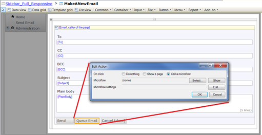
2.  Have this microflow change the Email object so that the status is QUEUED and the Queued Boolean is set to true
    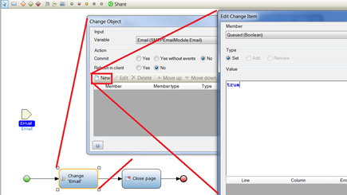
3.  The module already contains a scheduled event called SE_SendQueuedEmails which retrieves those emails in the queue and sends them out.  All that is left to do is to turn this scheduled event on and your email queue is set to go!
    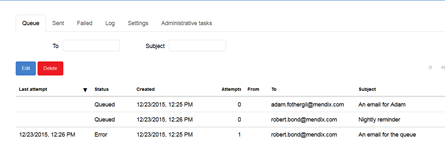

## 5\. Additional Enhancements

The SMTP Email module contains a number of other powerful tools.  Some enhancements you can add to this include:

1)      Allow users to edit the HTML text of the email using a rich text editor.  This will give users even more power to adjust the look and feel of the emails.  Don’t forget to set the UseOnlyPlainText value from true to false before sending!

2)      Add some validation to the form or microflow to make sure users don’t send email messages with no subject, body, or address

 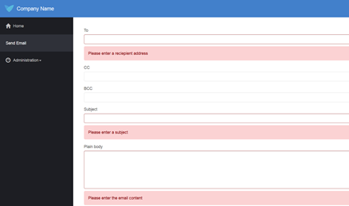

3)      Auto-generate emails in workflow steps to have the app send out emails from your SMTP behind the scenes.
