This document will cover the basics of how to create pages using Layouts and Snippets.

## 1\. Layouts

Let's start with the Layouts. What does a Layout consist of and what is the actual value of it?

### 1.1 Page Components

When you look at a page, you can state that a page exists out of two important components:

*   **Layout**: Structure of the page (just like PowerPoint has one or more layout presets)
*   **Content**: What is displayed within the structure of the page

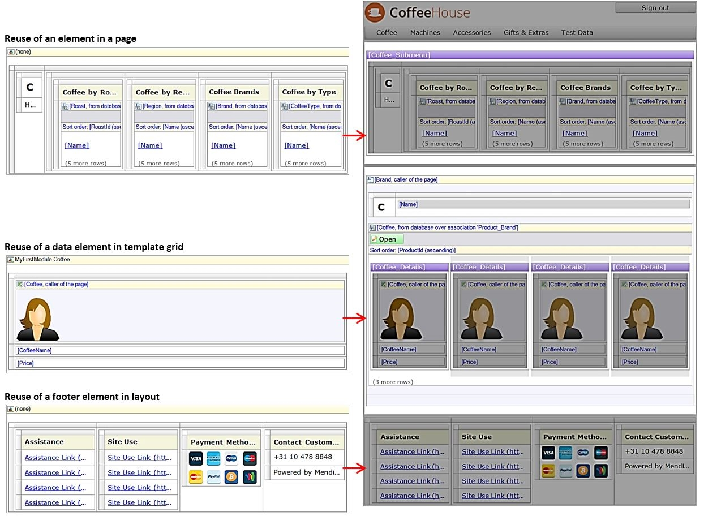

While modeling the pages, we just selected a layout when a page was created. Furthermore, we accepted their presence. Now it is time to focus on Layouts and what they add to the modeling options we have.

### 1.2 The value of Layouts

Layouts are used to structure the user interface, by allowing us to define a default page structure, which can be reused as a template for pages. With this structure you can design the way the application is presented to the end user. It is best practice to pre-define the user interface structure, before you start modeling the app. We started with the blank layout, although this is a basic set up of layouts, there are some pre-defined structures.

**DesktopLayout**

*   Having a header with logo and a menu bar
*   With a content placeholder
*   And finally a footer with text

**PopupLayout**

*   Contains in general only a content placeholder

Most people start with creating an application interface for the desktop user. But it's easy to unlock the app for mobile or tablet users. For each device we can create a set of layouts, which fits the specific layout needs for the device. When device specific layouts have been created, they can be used as templates for creating  the device specific pages.

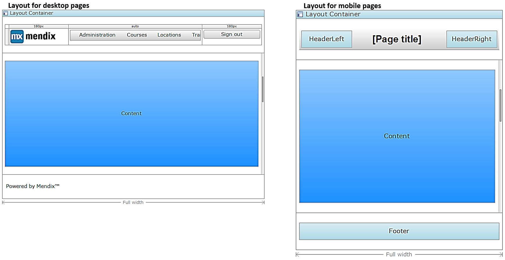

## 2\. Styling

Besides layouts, the application should have a certain look & feel, like a color scheme matching the customer brand. This is accomplished with CSS/Bootstrap with a set of predefined classes which are connected to Mendix page elements through the CSS file. This part of application design is really neat and allows for a lot of flexibility, though it is an advanced step and requires specific CSS & HTML knowledge. For the current scope of this piece of Documentation, we will use the default styling.

### 2.1 Creating a new layout

As already mentioned, a set of predefined layouts is already available, which fits the basic needs while developing a basic app. Though, when you want a more sophisticated app, a more advanced setup of layouts might be needed. The following sub-chapters will explain the basics of creating a new layout.

### 2.2 Layout Widgets

The first question to ask is – what are the main elements you use for creation of a new layout? Thereafter basic design approaches will be discussed. (Element properties can be found in the Mendix online documentation)

**Layout container**

A layout container is used to divide the layout in regions such as a header, sidebar or footer. A layout container must be the only top-level widget. Additionally, a layout container can only be placed directly in another layout container.

**Regions**

With regions you divide the layout container in sections, in order to position the layout elements in specific fixed positions. Each region contains either a placeholder or a specific widget.

**Place holders**

A placeholder can be used in a layout to define an area that can be filled in a page that is based on that layout or in another layout that defines that layout as a master layout.

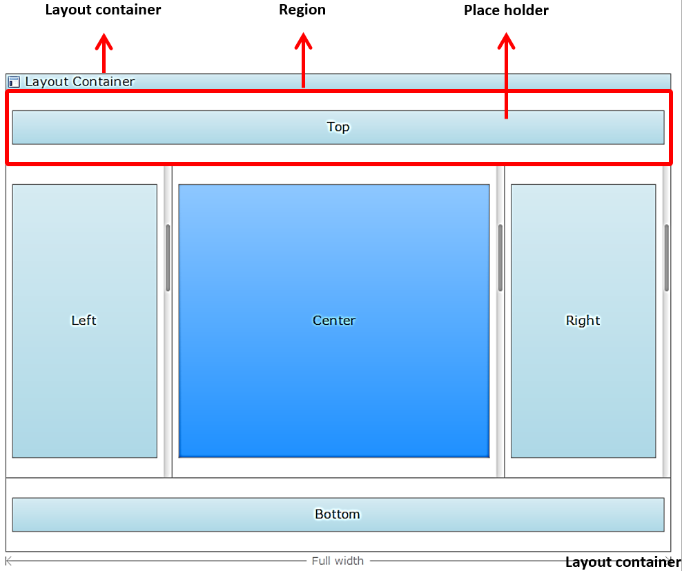

When the area is filled in a page, this will be the content area of that page, showing the dynamic data as specified in that page. When a layout inherits from another layout, the area can filled with a new layout container, in order to define this specialized layout. Or it can be kept empty and then it will be filled in a page.

**Inheritance**

A layout can optionally be based on another layout, called the 'master layout' in this context. If a layout is based on a master layout, the layout can fill the areas defined by the master layout and define new area using placeholders. Pages that use a layout that is based on a master layout will only see the areas defined by the layout, not those of the master layout.

## 3\. Desktop, Tablet or Mobile?

You can distinguish three device types: Desktop, Tablet, and Phone. In fact all pages can be opened on all type of devices because the generated HTML for the pages is HTML5\.  However, each device has its own unique specific UI design needs. Therefore, it is logical that you define a set of layouts per device type. Which serves the specific device type needs.

By default, the desktop & phone layouts are already available, the design of the layouts can be customized to your needs. You can change & extend the default layouts the way you wish and create new layouts as needed.  Be wary of the way you design these layouts, for example in the mobile apps, you do not want to have too many regions – otherwise the design will look crowded and confusing for the end user. On the other hand a desktop application might require different regions and allow for more content to be shown and details to be displayed.

### 3.1 Layout Examples

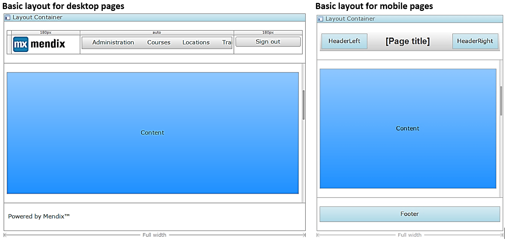

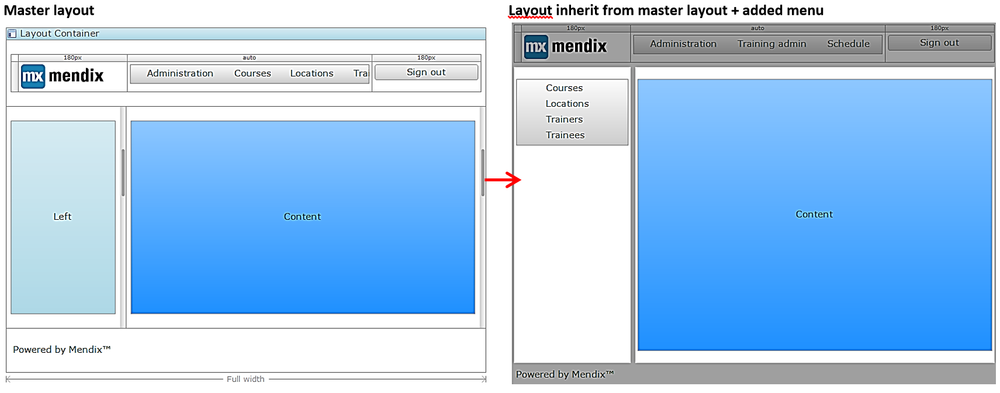

{}

By adjusting the canvas width, you can emulate the end user view of the page in the modeler. For example desktop layout have a canvas width of 800, though the default phone layouts have a width of 500\. The property canvas width only applies on the view in the modeler. The actual width of the page depends on the opened browser or the optional popup size.

{}

After defining the structure of the layout with the layout container(s), the regions content must be defined. This can either be done per page, with page specific elements. For instance by adding data widgets in the empty areas. Or this can be done within the layout, in order to define elements which will be used on each page with this layout. Commonly this will be the general app navigation or specific navigation for a specific function. All widgets can be used, except data & input widgets, since the need a source. Two most useful widgets types are menu widgets & snippets. Let’s learn more about these two.

## 4\. Menu Widgets

### 4.1 Menu Bar

The menu bar widget shows a configured menu in the form of a horizontal bar with items. Items can have sub items and the main item in the menu can be expanded. Sub items can go only one level deep – one sub item cannot have another sub items again. The Menu Item points to either the page or the microflow that will opened or start when the item is clicked.

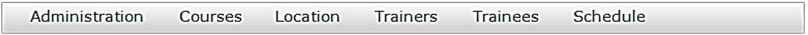

### 4.2 Navigation Tree

The navigation tree widget shows a configured menu in the form of a tree. Items can have sub items when the main item is expanded.. The menu structure of the navigation tree can have up to three levels. In the end a Menu Item points to either the page or the microflow that will open or start when the item is clicked.

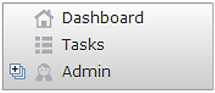

### 4.3 Simple Menu Bar

The simple menu bar widget shows a configured menu in the form of a horizontal bar with images and captions. Items cannot have sub items –the menu structure can only have one level. The menu items points to either the page or the microflow that will open or start when the item is clicked.

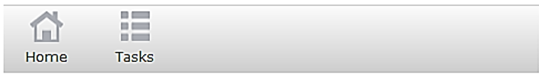

### 4.4 Menu Source

The items that are shown in the menu widget are determined by the menu source. A menu widget is either filled from a menu configured in the Navigation document or a Menu document.

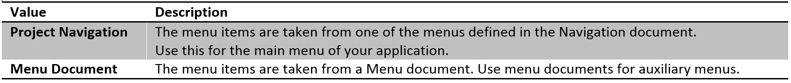

When you have selected the project navigation as source, the type device must be determined for the the correct navigation menu.

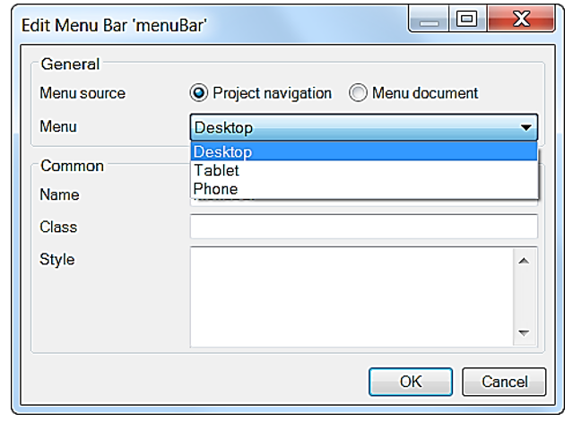

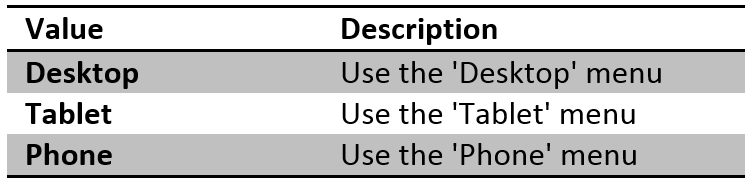

### 4.5 Project Navigation

The Navigation document defines the main navigation structure of the application for end-users. It allows you to set the home page of your application as well as define menu structures for use in menu widgets. The home page can vary based on the roles a user has. If security is enabled, the menu will only show items which the user has access to.

### 4.6 Device Profiles

At the heart of the navigation model in Mendix are three device types: Desktop, Tablet, and Phone. You can define separate home pages and menus for each of these three devices. The Desktop device type is always enabled, while Tablet and Phone can be disabled if you do not want to use them. When a user visits a Mendix application, she is automatically redirected to the home page of the appropriate device type (see 'Redirection to Device Types' below).

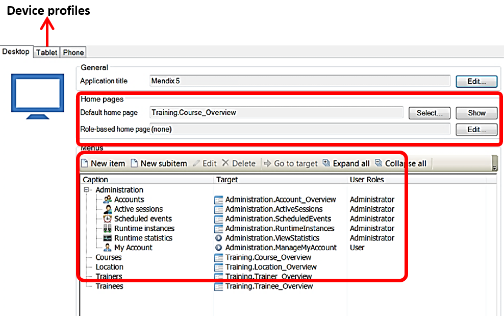

### 4.7 Menu Document

A menu document defines a navigation menu that can be used by a menu widget. Typically the main menus for your application are defined in device types, while you use menu documents for auxiliary menus, e.g. a side bar. A menu consists of a list of menu items, which optionally contain sub-items. Depending on the widget a number of levels are allowed.

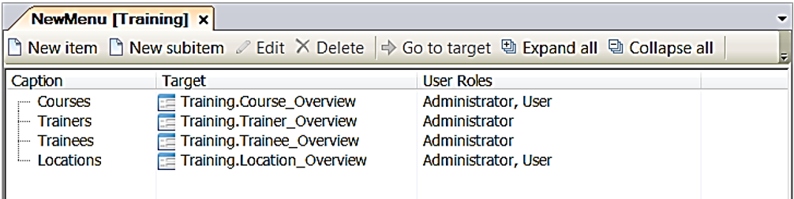

### 4.8 Redirection to Device Types

The Mendix Runtime automatically redirects users to the home page of the appropriate device type based on the device they are using. This happens by examining the User-Agent string that is sent by the device's browser. The default configuration for the redirection is highlighted in the table to the right.

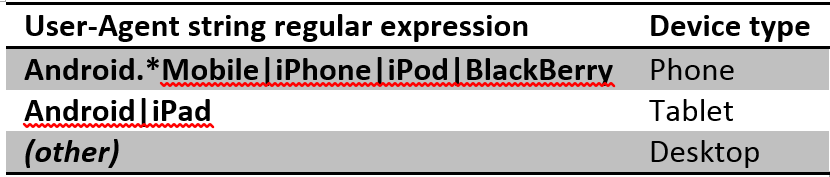

The string for specific user interphases can also be configured within the server custom settings, which is more advanced and not covered in the basic training due to the limited time.

If a device type is not enabled, it falls back to another device type as shown in the following table.

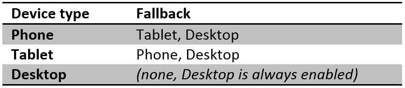

It is also possible to force the client to use a specific device type by adding a 'profile' query string parameter to the URL when visiting a Mendix application. The possible values are 'Desktop', 'Tablet', and 'Phone'.

## 5\. Snippets

Snippets are reusable interface parts that can be used on pages and layouts. Using snippets allows Mendix business engineers to modify fewer places in the interface and allows for a smoother transition and user friendly experience. For example, you can have a snippet that is used both in the contents area of a template grid and in a data view. Changes you make to the snippet, will be applied in all places where the snippet is used.

Additionally, a snippet can define an entity that serves as a context for the widgets placed in it. For example, if you set the Course entity for a snippet, you could place a text box that shows the Course Title on the snippet without having to define a data view first. When an entity is defined on a snippet, everywhere where you uses the snippet, it needs to be placed inside a context for that entity, e.g. a data view.

### 5.1 Example

## 6\. Related content

*   [Scout and Windows 10 Workaround](scout-and-windows-10-workaround)
*   [Layouts and Snippets](layouts-and-snippets)
*   [Filtering Data on an Overview Page](filtering-data-on-an-overview-page)
*   [Setup Mendix UI Framework with just CSS](setup-mendix-ui-framework-with-just-css)

*   [Setting Up the Navigation Structure](setting-up-the-navigation-structure)
*   [Setup Mendix UI Framework](setup-mendix-ui-framework)
*   [Setup Mendix UI Framework with Koala](setup-mendix-ui-framework-with-koala)
*   [Creating your first two Overview and Detail pages](create-your-first-two-overview-and-detail-pages)
*   [Finding the Root Cause of Runtime Errors](finding-the-root-cause-of-runtime-errors)
