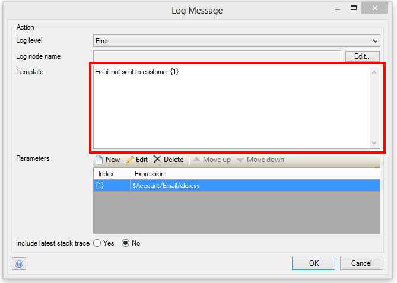
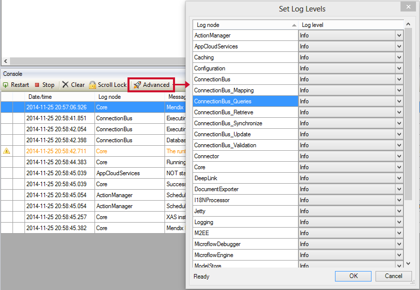
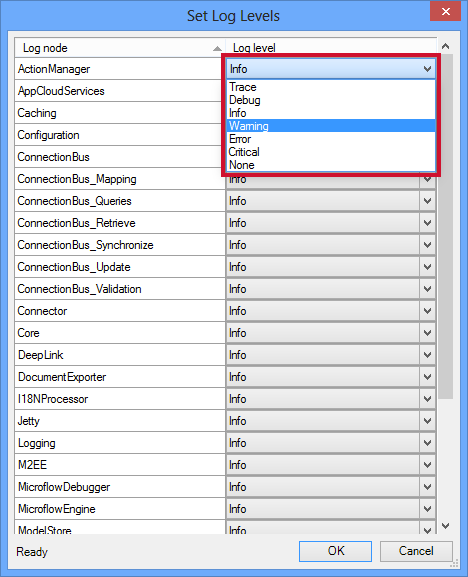
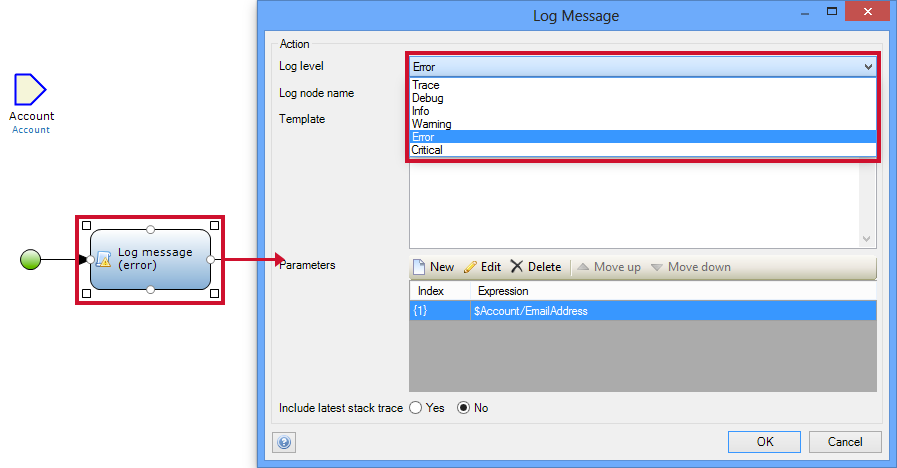

Each application has a log and log-messages to monitor the health of the running of the application. Log levels are used to distinguish the log messages and to highlight the highest priority ones so that they can receive the immediate intervention they require. This How-To will therefore teach you how to configure the log levels for the various occurrence of logging within your application. You will start with the basics around logging and its uses. Moving onto the practices around configuring the log levels.

## 1\. Logging the basics

### 1.1 Log message

Log messages are a note that appears in the log of your Mendix application filled with an abundance of contextual information, such as:

*   The date/time created
*   The level
*   The node
*   A detailed message
*   A stack trace

**_Log Node_**

The log node name defines the source of the log message, for instance a log message from the email module, the log name would appear as **_“Email Module”._**

**_The message_**

Most messages in the log are auto-generated by the system for instance **_‘Mendix Runtime successfully started, the application is now available’_**. However for logging that have been created via microflow, log messages can be customized by the developer.

 

Customized log messages are created by defining a template, in the example above the template for the message is:

**_‘Email not sent to customer {1}’_**

The template is the structure of the log’s message, and can be composed of parameters and free text. If we take the example above, when the error occurs we insert into the parameter placeholder **_‘{1}’_ **the customer’s full name. Therefore producing the log message **_‘Email not sent to customer John Smith’_**. This log message is now customized to data specific to the situation.

**The stack trace**

The stack trace is a list of method calls from the point when the application was started to the point where the exception was thrown.
In the modeler, log messages that include a stack trace are marked with a paperclip icon () and double-clicking them shows the stack trace.

### 1.2 The different levels

The log level defines the severity of the log message. In the modeler, this is represented by different colors and an icon. Current log levels used by Mendix are: 

| Option | Icon | Color | Usage
| --- | --- | --- | --- |
| Trace | | | More detailed information. These are only written to logs. |
| Debug | | | Detailed information, typically of interest only when diagnosing problems. |
| Info  | | | Confirmation that things are working as expected. |
| Warning |  | Orange | An indication that something unexpected happened, or indicative of some problem in the near future (e.g. ‘disk space low’). The application is still working as expected. |
| Error |  | Red | Due to a more serious problem, the application has not been able to perform some function. |
| Critical |  | White (text), red (background) | A serious error, indicating that the application itself may be unable to continue running. |

## 2\. Setting the log levels

Within this part of the how to you will learn how to configure the log levels of the logging messages produced by the system. The different levels highlighted above in section 1.2, can be applied to custom logging and to the predefined logging produced by the Mendix Business Modeller. This section will define how to configure both the log levels in custom logging and the predefined logging created by the Modeller.

### 2.1 Advanced features of the console

1.  Open the console
2.  Click ‘Advanced’ to open the drop down list of advanced options
3.  On the list of options click ‘Set log levels…’

### 2.2 Configuring log levels

You can now select the level that which a log node will log messages as.

 

1.  Set the relevant log node
2.  Click on the drop down list, in the log level column
3.  From the drop down list select the correct level

### 2.3 Configuring custom log levels

You can also set the level of log messages in ones that you have created via a microflow.

 

1.  Open the relevant microflow, for which you intend to change its log message’s level.
2.  Double click on the ‘log message activity’
3.  From the drop list, in the log level row select the correct level 

## 3\. Related content

*   [Finding the Root Cause of Runtime Errors](finding-the-root-cause-of-runtime-errors)
*   [Clearing Warning Messages in Mendix](clear-warning-messages)
*   [Testing web services using SoapUI](testing-web-services-using-soapui)
*   [Monitoring Mendix using JMX](monitoring-mendix-using-jmx)
*   [Debugging Java actions remotely](debug-java-actions-remotely)
*   [Log Levels](log-levels)
*   [Debugging Microflows](debug-microflows)
*   [Debugging Java Actions](debug-java-actions)
*   [Common Mendix SSO Errors](handle-common-mendix-sso-errors)
*   [Debugging Microflows Remotely](debug-microflows-remotely)
