*   For the purpose of this document, the following Mendix SQL data structure will be used. Please adapt the folder tree according to your organization's data structure:

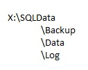

*   Please make sure the SQL Agent service is running, preferably using the Mendix service account for authentication.
*   Please consider the amount of soft backups that need to be kept.
*   Please consider what email address will receive maintenance notifications

## **SQL Basic Maintenance Plan**

### **The Basics**

*   Maintenance plans are created by the built-in WYSIWYG editor in the SQL Server Management Studio. All screenshots in this how-to are made from this editor.
*   To add a task step, simply drag the corresponding item from the Maintenance Plan "tasks" toolbox:

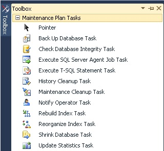

*   Drag connecting lines between items to initiate a sequence of events
*   To change a notification job from "Success" (which is the default connector) to "Failure" please right click the connecting line and choose "Failure":

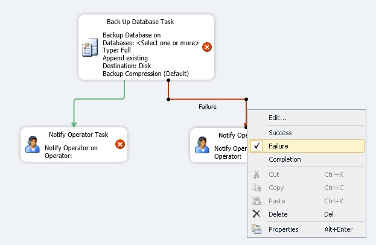

### **Notifications**

*   Start the SQL management studio
*   Create an SQL operator (SQL Server agent). The operator will receive maintenance notifications.
*   Configure Database Mail:

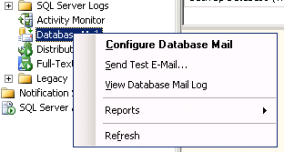

*   Choose a valid email sender-address, e.g: mendix_sql@yourdomainname.com
*   Make sure the email profile is made both "Public" and "Default"

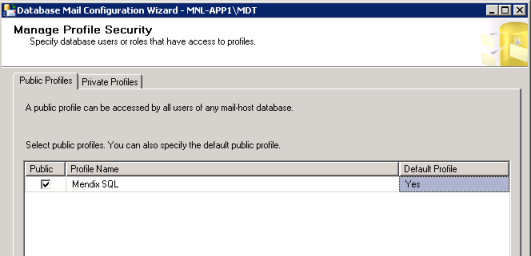

*   Verify your email configuration by sending a test email:

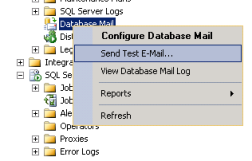

*   Next, create two maintenance plans:

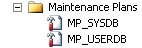

*   For the sake of uniformity, the plan names MP_SYSDB and MP_USERDB will be used throughout this document. Changing the plan names to a different convention will not influence the functionality of the plan.
*   On every (sub)plan notifications will be configured. Whether to only send _Failed_ events or both _Failed_ and _Successful_ is up to the user.

*   Subject: SQL Server Message - <sql instance> - <maintenance plan name> - <subplan name> <successful/failed>
    _E.g.: SQL Server Message - Mendix-SQL1 – MP_USERDB - weekly maintenance failed_
    Body: <sql instance> - <subplan name> <successful/failed>
    _E.g.:_ _Mendix-SQL1 – database backup (full) successful_

### **Maintenance plan: User Databases**

*   Create a new maintenance plan called MP_USERDB, containing the following sub plans:

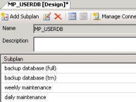

*   **Create a sub plan "backup database (full)"**
*   Schedule the plan to run every working day at 22:00 (or whatever time does not conflict with your external backup application)

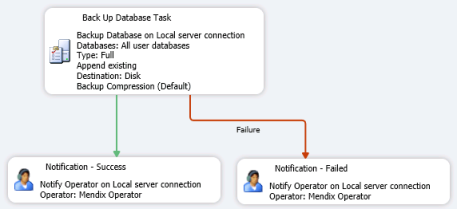

*   Choose backup to "disk"
*   Backup to X:\sqldata\backup
*   Select "create a sub-directory for each database"
*   Backup file extension "bak"
*   Select "verify backup integrity"
*   Set Backup compression to "Compress Backup"

*   **Create a subplan "backup database (trn)"**
*   Schedule to run every working day, as often as is necessary. If hourly backups are run, database recovery will be possible per hour. When run with a smaller interval, database recovery to a more recent point in time will be possible. High volume databases that perform many hourly transactions, should backup more often than lesser used databases.

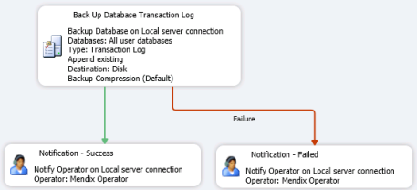

*   Choose Back up Type "Transaction Log"
*   Choose Back up to "disk"
*   Back up naar d:\sqldata\backup
*   Select "create a sub-directory for each database"
*   Backup file extension: "trn"
*   Select "verify back up integrity"
*   Set Backup compression to "Compress Backup"

*   **Create a subplan "weekly maintenance"**
*   Schedule the plan to run every Sunday at 01:00 (or whatever time the application is least used)

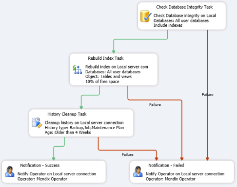

*   Set "Change free space per page percentage to: 10%" and select "Keep index online while reindexing" (Mind: this option will only work in Enterprise versions of Microsoft SQL server)

*   **Create a subplan "daily maintenance"**
*   Schedule to run every Tuesday till Friday at 02:00 (or whatever working days apply for your organization)

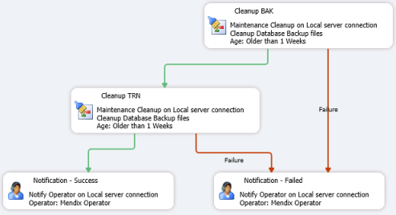

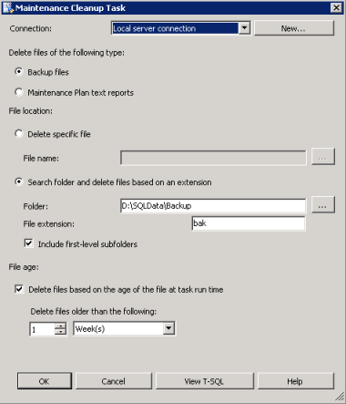 .

*   Please adapt the times set to your desired backup retention time. The cleanup might be set to smaller intervals in order to save disk space.

### **Maintenance plan: System Databases**

*   Create a new maintenance plan called MP_SYSDB, containing the following sub plans:

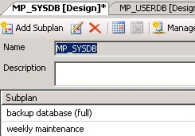

*   **Create a subplan "backup database (full)"**
*   Schedule to run every Tuesday till Friday at 02:00 (or whatever working days apply for your organization)

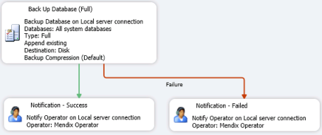

*   Select Back up to "disk"
*   Backup to d:\sqldata\backup
*   Set "create a sub-directory for each database"
*   Backup file extension "bak"
*   Select "verify backup integrity"
*   Set Backup compression to "Compress Backup"

*   **Create a subplan "weekly maintenance"**
*   Schedule to run every Sunday at 01:00

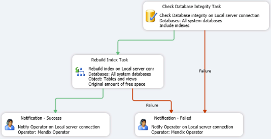

*   Set the rebuild index task to "reorganize pages with default amount of free space" and select "Keep index online while indexing"

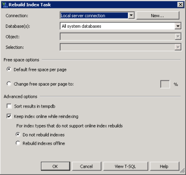

## Related content

*   [Restoring a SQL Server database](restoring-a-sql-server-database)
*   [Troubleshooting SQL Server](troubleshooting-sql-server)
*   [Mendix SQL Maintenance Plans](mendix-sql-maintenance-plans)
*   [Setting up a new SQL Server database](setting-up-a-new-sql-server-database)
*   [Setting up a SQL Server user](setting-up-a-sql-server-user)
*   [Security checklist for your on-premises installation](security-checklist-for-your-on-premises-installation)
*   [Mendix on Windows - Microsoft SQL Server](mendix-on-windows-microsoft-sql-server)
*   [Deploying Mendix on Microsoft Windows](deploy-mendix-on-microsoft-windows)
*   [Installing Mendix on Debian GNU Linux](installing-mendix-on-debian-gnu-linux)
*   [Installing Mendix on RedHat and CentOS](installing-mendix-on-redhat-and-centos)
