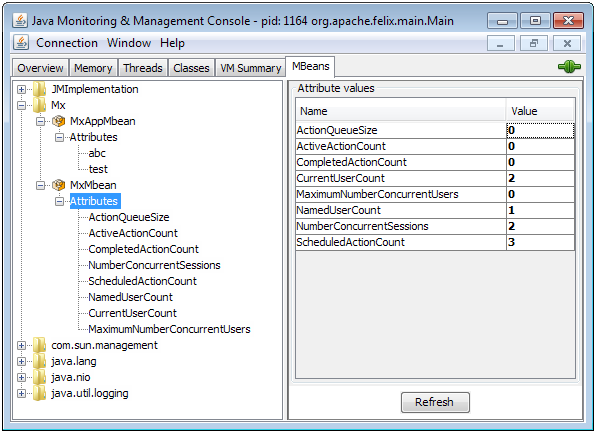

The following is only relevant if you run [Mendix](http://www.mendix.com/) on-premises. If you do, you probably have standard monitoring tooling that you use to monitor all your applications.

For java applications most monitoring tools provide a way to hook into [JMX](http://www.oracle.com/technetwork/java/javase/tech/javamanagement-140525.html) to get information about the application. The following describes how you can use JMX to get information on your Mendix application.

Mendix doesn’t provide any runtime or application specific MBeans, which means that without writing your own MBeans you will only be able to monitor generic JVM statistics. In this post i’ll describe how you enable JMX on your Mendix runtime. I’ll also decribe how you can write custom MBeans to expose Mendix runtime information and application specific information.

## 1\. Starting the Mendix runtime with JMX enabled

To enable JMX on your Mendix runtime you can use the following javaopts to the m2ee.yaml for your Mendix runtime:

```
javaopts: [

"-Dfile.encoding=UTF-8", "-XX:MaxPermSize=64M", "-Xmx128M", "-Xms128M",

"-Djava.io.tmpdir=/tmp",

"-Dcom.sun.management.jmxremote",

"-Dcom.sun.management.jmxremote.port=7845",

"-Dcom.sun.management.jmxremote.local.only=false",

"-Dcom.sun.management.jmxremote.authenticate=false",

"-Dcom.sun.management.jmxremote.ssl=false",

"-Djava.rmi.server.hostname=192.168.1.70",

]
```

## 2\. MBean exposing generic Mendix statistics

The simplest way to expose management information is by writing a MBean interface and a Java class which implements the interface. You can define getters and setter, but you can also define methods which can be called from generic management tooling. I’ve used this for example to tell a running application to reload its configuration file.

1.  Example of an interface which contains getters for some generic Mendix information, MxStatsMBean.java

    ```
    package jmx.actions;

    public interface MxStatsMBean {

    public int getMaximumNumberConcurrentUsers() throws Exception;

    public int getActionQueueSize();

    public int getActiveActionCount();

    public int getScheduledActionCount();

    public long getNumberConcurrentSessions();

    public long getCurrentUserCount();

    public long getCompletedActionCount();

    public long getNamedUserCount();

    }
    ```
2.  And here is the implementation, MxStats.java. The methods just call the [Mendix Core](http://apidocs.mendix.com/4/runtime/classcom_1_1mendix_1_1core_1_1_core.html) class, and return the value:

    ```
    package jmx.actions;

    import com.mendix.core.Core;

     public class MxStats implements MxStatsMBean {

     public int getMaximumNumberConcurrentUsers() throws Exception {

     return Core.getMaximumNumberConcurrentUsers();

     }

     public int getActionQueueSize(){

     return Core.getActionQueueSize();

     }

     public int getActiveActionCount(){

     return Core.getActiveActionCount();

     }

     public int getScheduledActionCount(){

     return Core.getScheduledActionCount();

     }

     public long getNumberConcurrentSessions(){

     return Core.getNumberConcurrentSessions();

     }

     public long getCurrentUserCount(){

     return Core.getConcurrentUserCount(true);

     }

     public long getCompletedActionCount(){

     return Core.getCompletedActionCount();

     }

     public long getNamedUserCount(){

     return Core.getNamedUserCount();

     }
    }
    ```

3.  Next, you're able to see the result of the values exposed by this MBean in JConsole
    

## 3\. MBean exposing application specific statistics

You can use the same approach, with an Interface and implementation class, to also expose application specific information. Here’s a different approach: one that exposes a dynamic set of values. You can do the same with methods, but the example only shows attributes to retrieve values.
The idea is that you will have a Java Action that you can call in a microflow, where you expose arbitrary key, value pairs.

## 4\. Related content

*   [Finding the Root Cause of Runtime Errors](finding-the-root-cause-of-runtime-errors)
*   [Clearing Warning Messages in Mendix](clear-warning-messages)
*   [Testing web services using SoapUI](testing-web-services-using-soapui)
*   [Monitoring Mendix using JMX](monitoring-mendix-using-jmx)
*   [Debugging Java actions remotely](debug-java-actions-remotely)
*   [Log Levels](log-levels)
*   [Debugging Java Actions](debug-java-actions)
*   [Common Mendix SSO Errors](handle-common-mendix-sso-errors)
*   [Debugging Microflows](debug-microflows)
*   [Debugging Microflows Remotely](debug-microflows-remotely)
*   [Debugging Java actions remotely](debug-java-actions-remotely)
*   [Getting started with Nexus maven repository manager](http://www.andrejkoelewijn.com/blog/2010/03/09/getting-started-with-nexus-maven-repository-manager/)
*   [Using eclipse to debug your tomcat web application](http://www.andrejkoelewijn.com/blog/2003/10/23/using-eclipse-to-debug-your-tomcat-web-application/)
*   [Profiling Mendix using JProfiler](http://www.andrejkoelewijn.com/blog/2014/01/15/profiling-mendix-using-jprofiler/)
