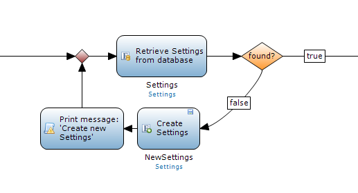

Often in processes you need to retrieve objects in order to complete the process. But what if those objects could not be found? Usually additional actions are required, but since the objects you retrieve and create are assigned different variable names you often can't merge back to a single flow.

## Find or create objects to continue your process

A common example is shown below, when creating an order it needs to be associated with the customer and its primary address. This example ends up in three different flows and cannot be merged back into the main flow because that causes the 'OtherAddress' or 'NewPrimaryAddress' to be unreachable. 

You want to prevent creating the same objects multiple times on different places. This causes a lot of unnecessary maintenance, one solution could be to copy the logic (partially) into a subflow as shown in the example but this doesn't make it easy to read. 

Working around this can easily be done by using a subflow at a different place. Avoid making exceptions in your microflow for the default behavior, so don't put the standard logic in a sub-microflow that is difficult to read because of one exception earlier in the process. Because of the exception, it makes sense to solve this problem by altering the exception and by changing it so that it fits in our standard microflow.

The easiest way to implement it is to move all the logic for acquiring the primary address into a sub-microflow. In this way, all the logic after getting the address only needs to be specified once and the microflow is still easily readable. 

  

The sub-microflow 'GetCustomerPrimaryAddress' contains the same logic as the original example, except that there is only one result: 'The correct primary address.'

## Retrieving an instance of an object

Sometimes you need to have a specific instance of an object, and building a sub-microflow for just one 'retrieve' and 'create' seems like a bit too much work. An alternative is to build your own loop. This allows you to have one main flow but to still be able to find and create objects during this process.

However, there is a risk in creating an infinite loop if the 'retrieve' applies a constraint that is not correctly set during the 'create.' You should always print a log message so that you can easily identify any problems in your design.

## Related content

*   [Defining access rules using XPath](define-access-rules-using-xpath)
*   [Extending Your Application with Custom Java](extending-your-application-with-custom-java)
*   [Working With Lists in a Microflow](working-with-lists-in-a-microflow)
*   [Triggering Logic using Microflows](triggering-logic-using-microflows)
*   [Creating a Custom Save Button](create-a-custom-save-button)
*   [Optimizing Retrieve Activities](optimizing-retrieve-activities)
*   [Error Handling](set-up-error-handling)
*   [Optimizing Microflow Aggregates](optimizing-microflow-aggregates)
*   [Extract and use sub microflows](extract-and-use-sub-microflows)
