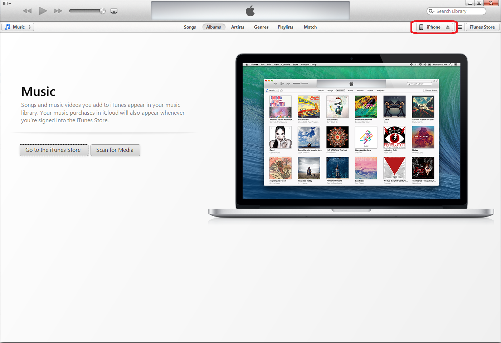
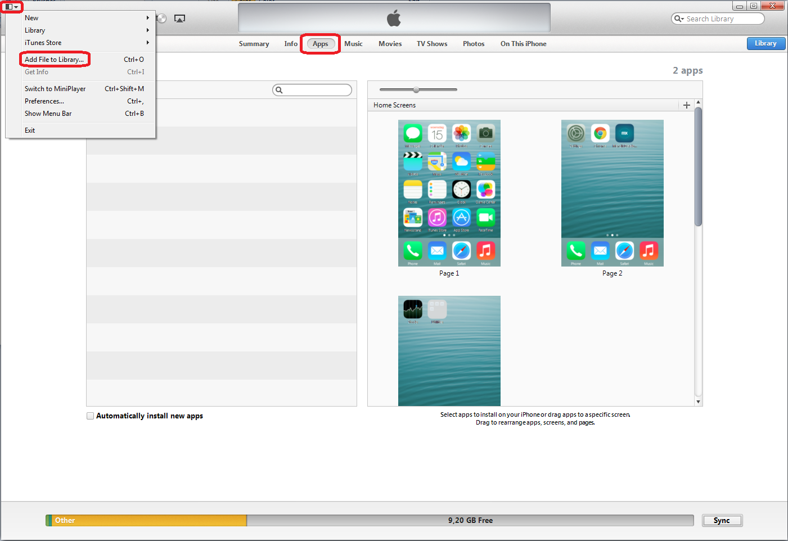

Once you have developed your Mendix Mobile App, you want to make it available as an app for mobile platforms such as Apple's iOS, Google Android and Windows Phone. We provide the possibility to produce a platform-specific native app for your Mendix Apps under the Publish section of the Mendix Developer Portal.

The hybrid mobile app publishing process is based on Adobe PhoneGap. Manually using Adobe PhoneGap is very tedious. You need both a Microsoft Windows machine and an Apple Mac machine, and they need to be set up with correctly configured development environments. Instead, we have integrated the [Adobe PhoneGap Build](https://build.phonegap.com/) service into Mendix to take this burden away and provide support to automatically build the required hybrid mobile packages. Instead of worrying about technical details, you can focus on the essential: rapidly developing an app to support your business processes.

This how-to leads you step-by-step through the process of packaging your Mendix App as a hybrid mobile app that you can then deploy on your iOS developer device or publish in the Apple App Store.

## 1\. Preparation

You require the following before you can build hybrid mobile packages of your apps:

*   A Mendix App with mobile support running in the Mendix Cloud, either in a Free App or on a licensed cloud node.
*   An account for Adobe PhoneGap Build. [Create one for free here](https://build.phonegap.com/plans/free-adobeid).
*   An iOS device (iPhone or iPad) so that you can test the produced iOS package.

*   An iOS deployment certificate for which your test device is activated. You need both a ".p12" certificate file and a ".mobileprovision" profile file.   [Find out how to obtain app signing keys](/refguide6/managing-app-signing-keys) .
*   Apple iTunes installed on your computer, so that you can deploy the produced iOS package on your test device.

## 2\. Starting the packaging process

Before starting, make sure you have a Mendix App with mobile support enabled running in the Mendix Cloud, either in a Free App or in a licensed cloud node.

First, open the "Publish for Mobile App Stores" page in the Mendix Developer Portal:

1. Open the Mendix Developer Portal [from your launchpad](https://home.mendix.com/home/).
2. Go to the project of the Mendix App that you want to publish.
3.  Go to the **Publish** tab.
4. Click **Publish for Mobile App Stores**.

    You are shown the "Publish App for Mobile App Stores" page. Here, you need to set up some options for your hybrid mobile app:
5. Use the **Edit** button on the **App Info** tab to set up the correct settings for your app:
    * Fill in the name that your app will have in the App Stores and on the device, (for example, "Company Expenses")
    * Set the unique "App Identifier" for your app, (for example, "com.example.CompanyExpenses")

    Both the name and the app identifier should correspond to the ones you have set up in your Apple certificate.
6. Select the platforms that you want to support in the right sidebar. This how-to assumes that you choose at least iOS.
7. Optionally, upload custom branded app icons and splash screens under the tabs for the different platforms. You can find those tabs next to the "App Info" tab.
    * If you do not upload any images, default Mendix-branded images will be used (the ones that are shown)
    * Take note of the required resolutions and file types for the image files, as the system will not allow you to upload images with incorrect resolutions, because otherwise your app packages will not function properly
    * For the purposes of this how-to, it is not necessary to upload any images yourself

8. Click the green **Publish for Mobile App Stores** button.
    You are then presented with the "Build Mobile App Store Packages" page.
9. Select the environment that you want to publish.
    *   For Community Edition apps, the only option is "Sandbox" (for example, Free App)
    *   For apps running on a licensed cloud node, you can choose from Test, Acceptance and Production (depending on what is available on your cloud node)
10. Leave the choice on how to build the package on the default: "Build Mobile App Store packages for me by sending the build configuration to Adobe PhoneGap Build". You can use the alternative option to manually download a PhoneGap Build package, which you can then inspect, modify and upload manually to Adobe PhoneGap Build. See our documentation on [how you can customize the PhoneGap Build package](/refguide6/customizing-phonegap-build-packages). This is unnecessary in almost all scenarios.
11. Start the actual hybrid mobile app package building process: Click the green "Start PhoneGap Build job" button to initiate the packaging process.
12. The first time you start this process, you will need to authorize the Mendix Developer Portal to act on your behalf with the Adobe PhoneGap Build service.
    * You are presented with a pop-up to start a redirect to Adobe PhoneGap
    * Build for authorization Click the button "Authorize use of Adobe PhoneGap Build"
    * You will be temporarily redirected to a website of Adobe PhoneGap Build

13. You now end up on a page of the Adobe PhoneGap Build service. It will ask whether you want to authorize the "Mendix Developer Portal" to act on your behalf.
    * Choose "Yes" to allow us to start build jobs using your account
    * You will then be redirected back to the Mendix Developer Portal
        * If you choose "No", you will be redirected back to the Mendix Developer Portal and you will not be able to publish your app
        * If you do not have a session with Adobe PhoneGap Build in your current browser, before being presented with the authorization request, you will be asked to login

After you have been redirected back to the Mendix Developer Portal, the packaging process will continue, and you will have to set up the proper signing keys for your app.

## 3\. Setting up App Signing Keys

You will see the "PhoneGap Build: Signing Key Required" page. It asks you to go to PhoneGap Build and set up the signing keys.

1.  Click the link "log in to PhoneGap Build".

    A new tab will be opened for "[https://build.phonegap.com/apps](https://build.phonegap.com/apps)", where you can see the PhoneGap Build App that was created by the Mendix Developer Portal for your app. The app is named as you defined it in the App Info in a previous step.
2.  First, set up the app signing key for your app in your account.
3.  You will later configure the app to be built with it:

    a. Go to your PhoneGap Build account details. Click the avatar icon at the top right of the page and click the "Edit account" link. 
    b. Click the "Signing Keys" tab. 
    c. Under "iOS", click "add a key ..." 
    d. A pop-up is shown where you must upload a certificate file and a provisioning profile file.
        You can get those files from Apple. The certificate is the ".p12" file, the provisioning profile is the ".mobileprovision" file. See our documentation on [how to obtain app signing keys](/refguide6/managing-app-signing-keys) for more information. 
    e. Give the key a title that you can easily recognize, and upload the files. 

    {}

    Before using the key, it must be unlocked with the passphrase that was set up for the key. Click the lock with yellow background on the same row as the key and enter the passphrase. As the pop-up mentions, the key can now be used for builds for the period of an hour. After an hour, the passphrase needs to be entered again for security reasons.

    {}
4.  Now you are ready to configure the app. Click on "Apps" in the black bar at the top of the page to go to an overview showing your app(s). Click the logo or name of your app to go to the details of the app.
5.  Select the correct key for your app. Next to the text "iOS", there is a dropdown box with "No key selected". Select the newly uploaded key from the dropdown box. It should be listed under "unlocked".

Now your PhoneGap Build account is ready and you can continue the packaging process.

## 4\. Completing the packaging process

Complete the packaging process in the Mendix Developer Portal:

1.  Close the Adobe PhoneGap Build tab and go back to the original Mendix Developer Platform tab.
2.  Click "Restart build job" to restart the packaging process.

    You are presented with a page showing the build status of your apps titled "Building Mobile App Store Packages". It will show a status of "Building..." while PhoneGap Build is processing your app. Once ready, it will show a status of "Done" and a button is available to start the download of your iOS package.
3.  When the build process is done click the "Download iOS package" button and save the package (.ipa file) to your computer.

## 5\. Installing the iOS app to your test device

You can now deploy your app to your test device. An easy way to do this is with Apple iTunes:

1.  Open iTunes and connect your iOS device to your computer.

    
2.  At the top right, click on the device selector to show the contents of your device.
3.  Click "Apps" to show available and installed apps.
    
4.  Open the menu in the top left corner of the iTunes window.
5.  Click "Add File to Library...".
6.  Select the ".ipa" package file that you downloaded earlier.
7. iTunes will ask whether you want to replace any existing version of the app, if there is one - do so.

    *   You can also open an ".ipa" file directly with iTunes by double-clicking on it.
8.  In the list of apps, your app should show up. Click the "Install" button next to your app.

Click "Apply" at the bottom to execute the actual installation.
The app should now be visible on your device. Open it and log in to your app with a regular user account (set one up in the Mendix App in your desktop browser if you have not done so yet).

## 5\. Examples

** How to build a Phonegap app in the cloud **

{}

## 6\. Related content

*   [Mobile](mobile)
*   [Publishing a Mendix Hybrid Mobile App in Mobile App Stores](publishing-a-mendix-hybrid-mobile-app-in-mobile-app-stores)
*   [The Mobile Slider Custom Widget](the-mobile-slider-custom-widget)
*   [Debug a Hybrid Mobile Application](debug-a-hybrid-mobile-application)
