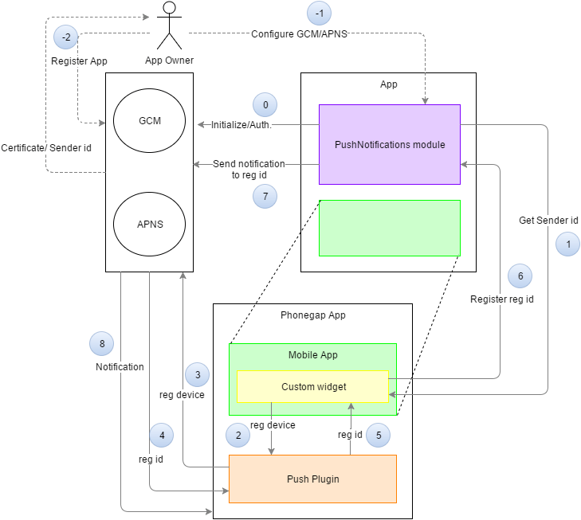

## How-To's

These are the how-to's for push notifications:

* [How to Implement Push Notifications](implementation-guide)
* [How to Test the Push Notifications Implementation](testing-the-implementation)
* [How to Set Up the Apple Push Notification Server](setting-up-apple-push-notification-server)
* [How to Set Up the Firebase Cloud Messaging Server](setting-up-google-firebase-cloud-messaging-server)
* [How to Use the Push Notification APIs](apis)

Push Notifications let your application notify a user of events even when the user is not actively using the application. This is a native capability available on both Android and iOS devices, and controlled via Google Cloud Messaging (GCM) and Apple Push Notifications service (APNs). This project is meant to make it easy for Mendix developers who want to include Push Notification capabilities in their Mendix hybrid mobile application.

## Overview

In general, the Mendix Push Notifications solution consists of two parts: the `PushNotifications` module and the `PushNotifications` widget (depicted in the picture as "Custom widget"). The module is the "server-side" component, and responsible for sending push notifications to GCM/APNs which in turn will send the notifications to end-user devices. The widget resides in the hybrid mobile (PhoneGap) app. It is responsible for the application's interaction with GCM/APNs (via a PhoneGap Push Plugin); both registering the devices with these services and handling push notifications received from them.

## Prerequisites

* Mendix platform account (You can sign up [here](https://www.mendix.com/try-now/?utm_source=documentation&utm_medium=community&utm_campaign=signup))
* Mendix Modeler version 6.8.1 or newer (You can download it [here](https://appstore.home.mendix.com/link/modeler))
* Mobile device (To get started, we recommend an Android device connected to your development machine by data cable)
* [PhoneGap Build](https://build.phonegap.com/) account

## Supported Platforms

* Android 4.4 and newer
* iOS 9.0 and newer

## Demo

An example implementation of the Push Notifications Connector module [can be found in the AppStore](https://appstore.home.mendix.com/link/app/3020/Mendix/Push-Notifications-Connector-Demo). To start sending push notifications to your Android or iOS device, you just need to download the project, deploy it to a Free App and follow the on-screen instructions.

## Limitations and Known Issues

The current version of the PushNotifications Connector assumes that the mobile app and the "back-end" part will reside in the same project.

### GCM vs FCM

Google is replacing GCM with FCM (Firebase Cloud Messaging). This impacts how Google projects need to be set up and how credentials can be obtained. The PushNotifications module will occasionally refer to GCM. We'll replace these references in the near future.

### APNs

From the Admin pages, you currently cannot disable the APNs service completely. We will address this in a later release.

## Dependencies

* Java Apple Push Notification Service Library: BSD 3-clause
* Apache ServiceMix - Commons Codec: Apache 2.0
* Apache Commons IO: Apache 2.0
* Jackson (core+databind+annotations): Apache 2.0
* JSON.simple: Apache 2.0
* Smack (core+tcp): Apache 2.0 
* XmlPull: Public domain
* XmlPull XPP3: Indiana University Extreme! Lab Software License

## Contributing

For more information on contributing to this repository, see [How to Contribute to a GitHub repository](contribute-to-a-github-repository).
