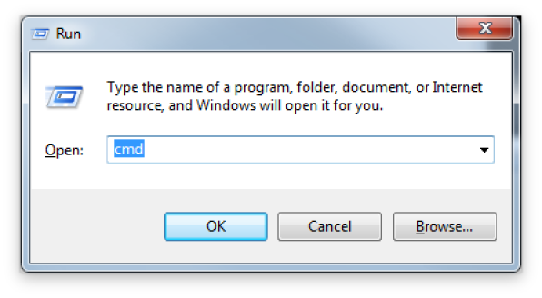
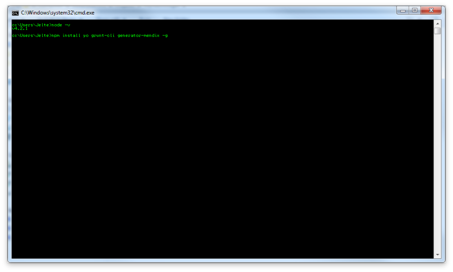
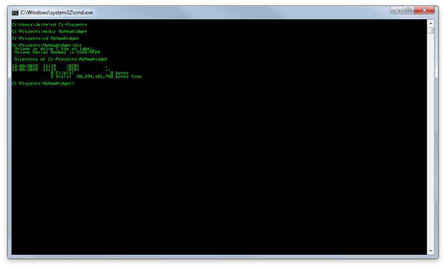
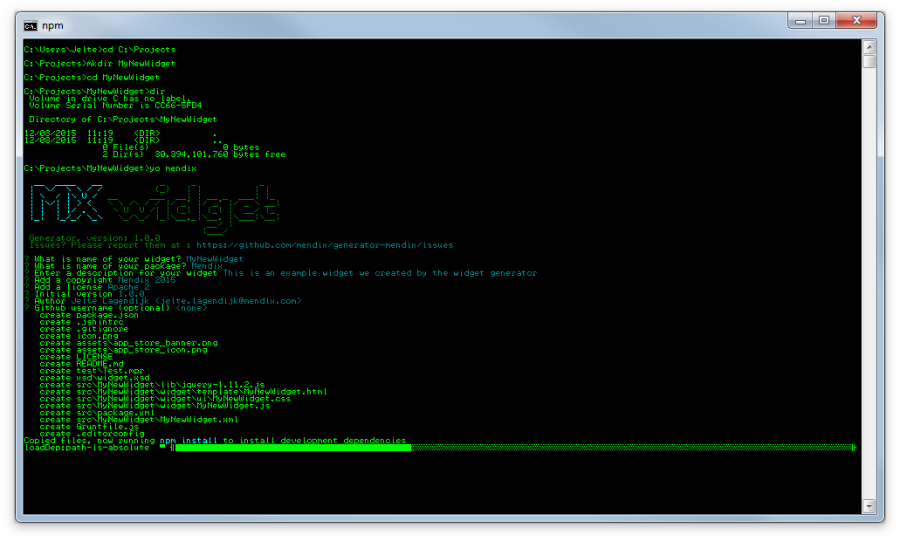
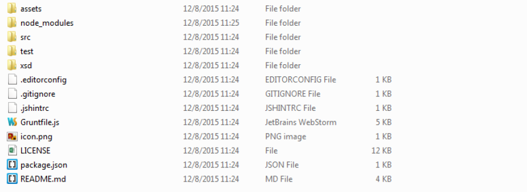
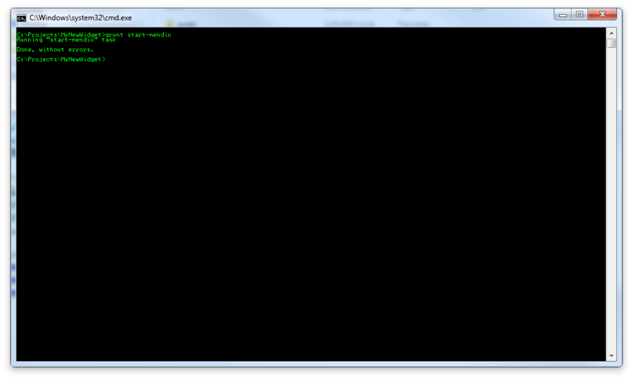
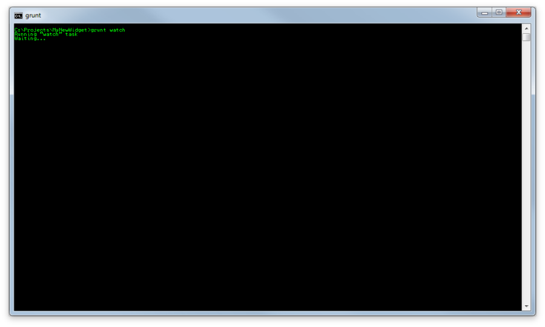
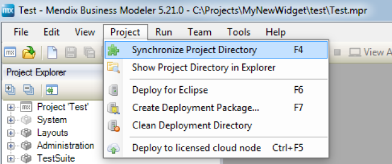
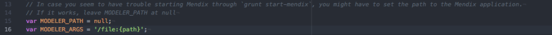
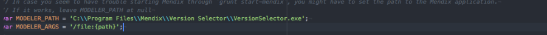

This How-To will teach you how to use the Widget generator. The widget generator is a [Yeoman](http://yeoman.io/) generator that will let you quickly scaffold a new widget. Furthermore, it will integrate Grunt, a task runner, to speedup your widget development.

**What will you learn from this how-to?**

*   How to set up a widget development environment with Node.JS, Yeoman and Grunt
*   How to test the Custom Widget at run-time

## 1\. Preparations

### 1.1\. Install Node.JS

Yeoman and Grunt both run on Node.JS, so you will need to install this.

*   Go to [https://nodejs.org](https://nodejs.org)
*   Download the latest stable release (LTS) and install it.
*   Now open a command-line: Press Windows + R
*   Type 'cmd' and press Enter
    
*   Check if Node.JS is properly installed by typing 'node -v'
    If Node is properly installed, it will show you the version that is installed

### 1.2\. Install Yeoman, widget generator & Grunt

*   In the same window, install these dependencies by typing 'npm install yo grunt-cli generator-mendix -g'
    

    This will take some time (usually a minute or 2/3), depending on your internet connection and computer. Warnings can be ignored. NPM will tell you if it has problems installing them by marking errors in red. If you have problems, see Troubleshooting.
*   Now the dependecies are installed globally, which means you can use them from any folder in your command-line window.

## 2\. Run the generator

In your terminal, move to the folder where you want your widget to be created. In this how-to, we will move to the folder C:\Projects and create a MyNewWidget folder where we will use the generator.

*   Now we can run the generator: 'yo mendix'. It will ask you for a few things, like the name of the widget. The default values are shown as well (so you can just press enter to use the default value).
    

After you have entered the options, it will install all dependencies, copy the AppStoreWidgetBoilerPlate and edit the files according to the options you have set above. Your folder should contain the following things:

## 3\. Use Grunt

Grunt is a powerfull task-runner that will speed up your widget development. In the previous steps, we have installed the Grunt client (grunt-cli), now we are going to use it.

### 3.1 Start modeler (test-project)

You can start the modeler from Grunt with 'grunt start-mendix' or 'grunt start-modeler'

It will open your test-project with the Mendix Version Selector.

### 3.2\. Watch

You can watch for any changes in your src folder by using the default watch task in Grunt. Run 'grunt' or 'grunt watch'.

Now, everytime you make changes in your src folder, it will automatically build a new .mpk file and put this in your /test/widgets/ folder. It will also copy the changes to /test/deployment/web/widgets/ folder.

#### 3.2.1 Why & how to use 'grunt watch'

The watch task has the advantage that you do not have to restart your test-project everytime you make changes to any Javascript file. There are two exceptions:

*   Changes to CSS are not automatically picked up (these are build when you run the project)

Changes to XML are not automatically picked up. Everytime you make changes to your Widget.xml inside your src/Widget/ folder, you need to update the widget in the Modeler.
Update widget:
Press F4 in the Modeler or go to Project -> Synchronize Project Directory

### 3.3 Build

'grunt build' will clean your /dist/ and /test/widgets/ folder (will only destroy your custom widget) and place a new one, build from the /src/ folder.

## 4\. Troubleshooting

*   _**Installing dependencies result in errors**_

    This will likely be a problem with Node.JS and NPM. Make sure you have the latest stable (LTS, Long Term Support) version installed (At the moment of writing this how-to it is v4.2.3 LTS). Also, make sure NPM (Node Package Manager) is up to date: ``npm install npm -g``
*   _**Cannot start modeler**_

    The Grunt-task will try to find the Mendix Version Selector and run the test-project. Obviously, this can only be done in Windows
    If it has trouble finding the Version Selector, you can provide a path to the program in Gruntfile.js.

    Change the MODELER_PATH

    

    from **null** to \'<path to VersionSelector.exe>\' (make sure you use double backward slashes when providing the path)

    
