This how-to explains how you can set up data validation with Mendix. Before you can start with this how-to you need to setup a basic data structure, otherwise there won't be any data to validate. If you don't know how to setup a basic data structure, you can take a look at [this how-to](create-a-basic-data-layer).

## 1. Data Validation on Entity Level

This section will explain how you can add validation rules to the domain model of your module. Validation rules are always triggered when changes to an object are committed. Please note that validation rules can only be applied on entities that are persistable.

1.  Open a **domain model** in the Mendix Modeler.
2.  Double click a persistable entity to open its **properties.**
3.  Open the **Validation Rules** tab page.
    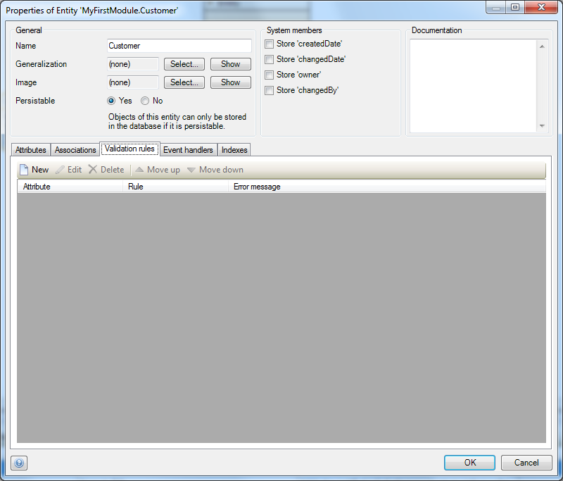
4.  Click **New** to start configuring a new validation rule for this entity.
    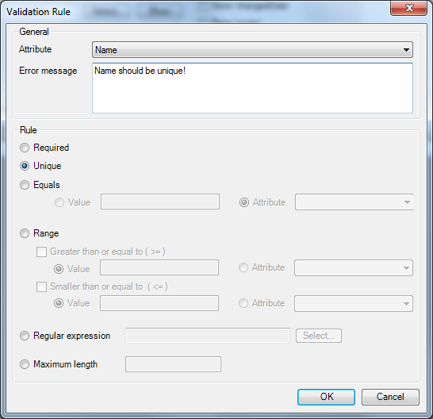
5.  Select the **attribute** of which the value should be validated.
6.  Enter an **error message** that is shown to the user if the validation fails.
7.  Select the **rule type**.
8.  Click **OK** to save this validation rule.

## 2\. Required Validation on Inputs, Reference Selectors and Drop-downs

The page builder of the Mendix Modeler allows you to configure which inputs are mandatory and what message is shown to the user if the input is empty. If you don't have a detail page yet, take a look at [this](create-your-first-two-overview-and-detail-pages) how-to.

1.  Open a **detail page** and double click an input to open its properties.
2.  Set the **Required** property to **Yes** and enter a message. This message is shown below the input if a user clicks the save button without filling in a value.

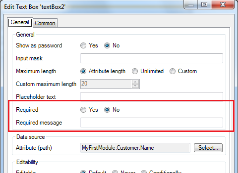

Please note that a _required_ validation rule on entity level overrules this property.

## 3\. Advanced Data Validation with the 'Before Commit' Event

Validation rules are great for simple validations, but Mendix also offers ways to handle more complex validations. The domain model allows you to define event handlers on entity level. The 'Before Commit' and 'After Commit' events are always triggered when an object is committed to the database. The 'After Commit' is most commonly used to calculate values of de-normalised data. With the 'Before Commit' event you can execute a microflow that must return a boolean value. If the microflow returns 'false', the entire commit is aborted otherwise the object is stored in the database. This mechanism is great for data validation. This section will explain how you can validate data by use of the 'Before Commit' event.

1.  Open a **domain model** in the Mendix Modeler.
2.  Double click an entity to open its **properties**.
3.  Open the **Event handlers** tab page.
    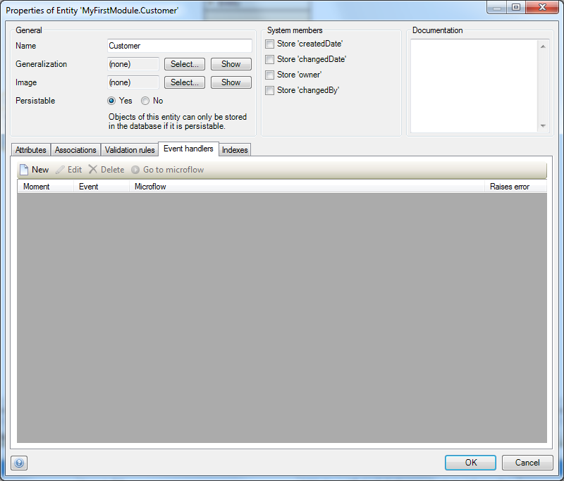
4.  Click **New** to start configuring a new event handler for this entity.
5.  Select **Before** as moment and **Commit** as event. This forces the event to trigger every time an object of this entity is committed.
6.  Make sure that the event object is passed, because this object holds the data that you want to validate.
    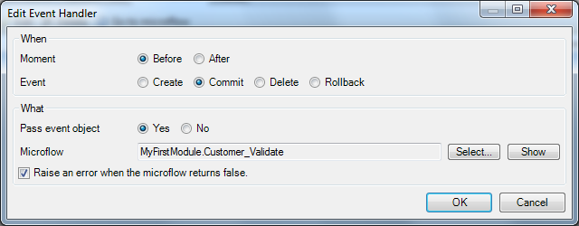
7.  Click **Select** to connect a Microflow to this event.
8.  Click **New** in the Microflow selector to create a new one.
9.  Click **OK** to save the event handler and open the created Microflow. It should look similar to this:
    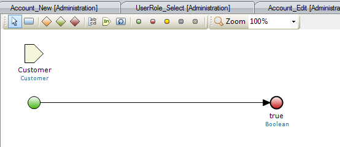

As long as this Microflow returns a boolean value, you are free to add any logic to determine if the data is valid or not. If the Microflow returns 'false', the commit is cancelled. Returning 'true' will commit the object. If you don't know how to work with microflows, take a look at how-to.

## 4\. Advanced Validation with a Custom 'Save' Button

Validating user input can also be achieved by overriding the default save button on a detail page. Start by creating an overview and detail page. If you don't know how to create overview and detail pages, take a look at [this](create-your-first-two-overview-and-detail-pages) how-to. Your detail page should look similar to this:

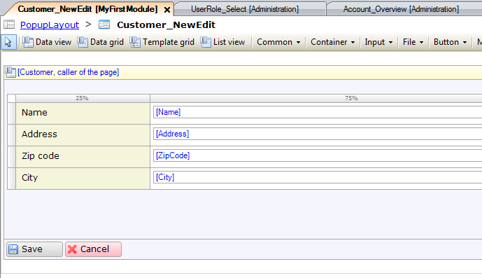

1.  Right click the **Save** button and select **Delete** to remove it from the page.
2.  Right click the data view control bar and select **Add Button > Microflow**.
    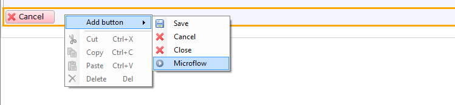
3.  Click the new button and start typing to change its caption in **Save.**
4.  Right click the new button and click **Select Microflow**.
5.  Click **New** to create a new Microflow. It should look like this:
    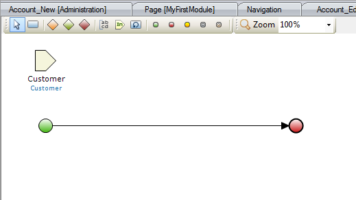
6.  Create a **Commit** activity to store the object in the database.
7.  Create a **Close Page** activity to close the detail page.

    You have now created a Microflow that mimics the default 'Save' button behavior. It should look like this:

    You can now extend the Microflow to validate user input.
8.  After the start event insert an **Exclusive split**.
9.  Double click the split to open the **properties editor** and type in an expression that returns true or false. For example: _$Customer/Name != 'John'_.

    As you can see you can use the **Customer** input parameter in the expression to validate its values.
10.  Save the properties by clicking **OK.**
11.  Right click the line between the split and commit activity and select **true** as condition value. In this case if the customer's name not is 'John', the object is stored in the database and the page is closed.
    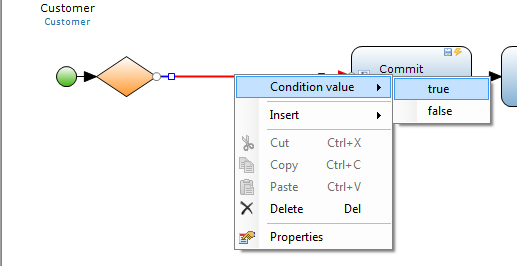
12.  Add an **End event** to the Exclusive Split.
13.  Draw an additional line from the split to the new end event.
14.  Right click the line between the split and end event and select **false** as condition value.
15.  Insert a **Validation feedback** activity between the split and end event. Your Microflow should look similar to this: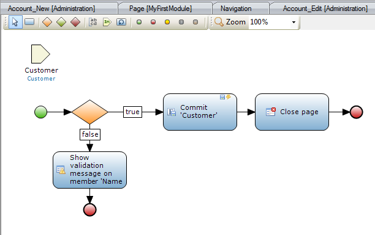
16.  Double click the new activity to open the **properties editor**.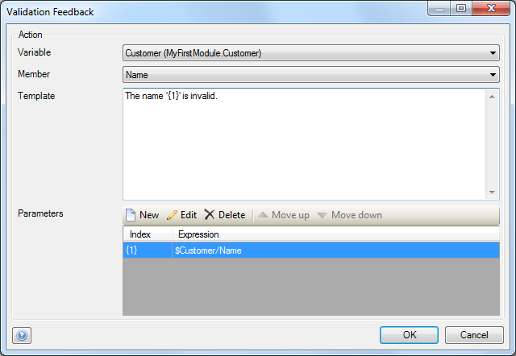
17.  Select the **input parameter** as variable.
18.  Select for example **Name** as member.
19.  Enter an error message in the **Template** field. You can use indexes to dynamically insert parameters in the template.

## 5\. Related content

*   [Working with images and files](working-with-images-and-files)
*   [Creating a basic data layer](create-a-basic-data-layer)
*   [Working With Object Events](working-with-object-events)
*   [Denormalize Data to Improve Performance](denormalize-data-to-improve-performance)
*   [Setting up data validation](setting-up-data-validation)
*   [Finding the Root Cause of Runtime Errors](finding-the-root-cause-of-runtime-errors)
*   [Managing your Application Requirements with Mendix](/developerportal/howto/managing-your-application-requirements-with-mendix)
*   [Scout and Windows 10 Workaround](scout-and-windows-10-workaround)
*   [Generating a personal SSH2 key pair](generating-a-personal-ssh2-key-pair)
*   [Creating a chainable Custom Widget](create-a-chainable-custom-widget)
