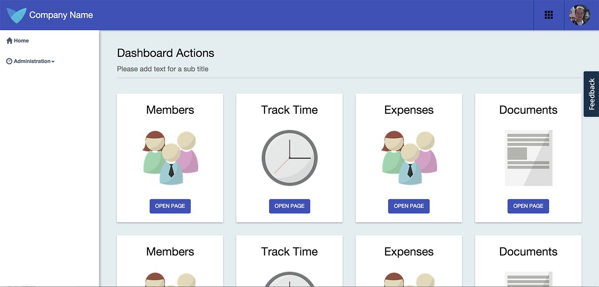
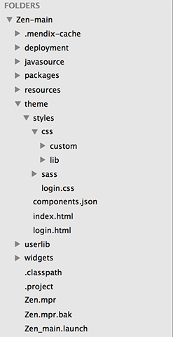
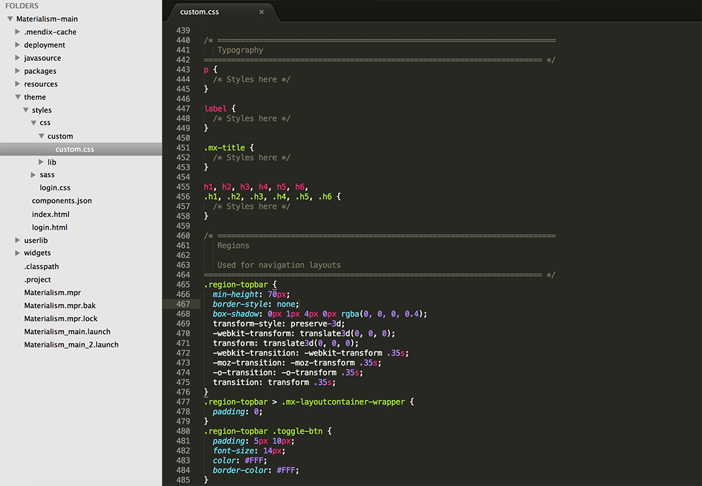
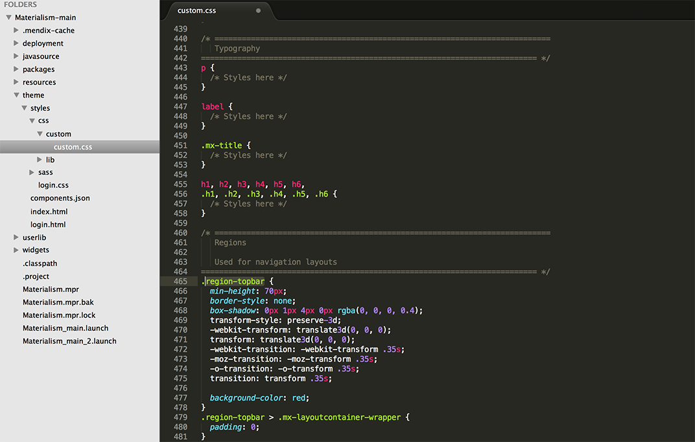
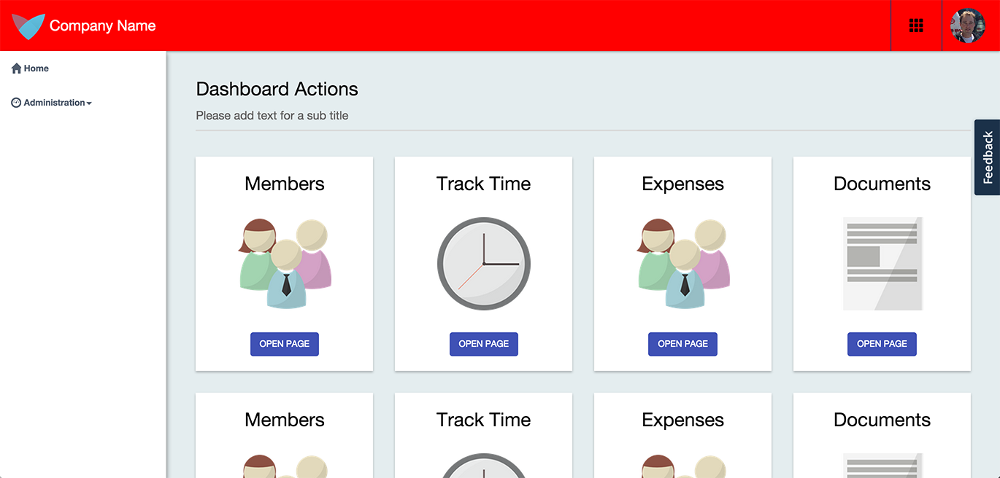

In this how-to we will go through how to setup the [Mendix UI Framework](https://ux.mendix.com/) and do our first styling changes by just using CSS.

**After completing this how-to you will know:**

*   How to create a new App
*   How to create your own theme with just CSS
*   How to make your first styling changes

## 1. Preparation

Before you can start with this how-to, make sure you have completed the following prerequisites.

*   Download the latest [Mendix Modeler](https://appstore.mendix.com)
*   Download a text editor [Sublime Text](http://www.sublimetext.com/)

## 2\. Create a new App in the Mendix Modeler

In this chapter we will create a new app and select a theme from the New App selector.

1.  Open the **Mendix Modeler**.
2.  Create a **New App** from the **My Apps** screen in the Mendix Modeler.

     
3.  Select a theme for your app.

    
4.  You can now deploy your app (F5)

     

## 3\. Open your project in the text editor

1.  Open your **App Project Folder** in your text editor by choice.
2.  Navigate to the folder **theme** and you will find the css files in the folder **styles\css**.

     
3.  There are two subfolders in our **styles\css** folder. 
    a. **Lib**, this folder contains our library file that contains all the default styling from the Mendix UI Framework. It's best practise to not alter this file. 
    b. **Custom**, the custom file contains a preset of CSS elements and a copy of the library file but empty. Here we want to make our custom changes
4.  Let's open up the **custom.css** file. We always want to work from this file so we can always look back at the library.css file to see how the original theme used to be.  
5.  Let's change the color of our topbar. Find the CSS element .**region-topbar **as you can see in the screenshot below.

     
6.  Let's do a simple change by making the topbar red. Insert the following line as in the example below:

    background-color: #FF0000; 

     
7.  Let's redeploy our application and look at the result!

     
8.  Congratulations, you made your first theme change.

## 4\. Related Content

*   [Scout and Windows 10 Workaround](scout-and-windows-10-workaround)
*   [Layouts and Snippets](layouts-and-snippets)
*   [Filtering Data on an Overview Page](filtering-data-on-an-overview-page)
*   [Setup Mendix UI Framework with just CSS](setup-mendix-ui-framework-with-just-css)
*   [Setup Mendix UI Framework](setup-mendix-ui-framework)
*   [Setting Up the Navigation Structure](setting-up-the-navigation-structure)
*   [Setup Mendix UI Framework with Koala](setup-mendix-ui-framework-with-koala)
*   [Creating your first two Overview and Detail pages](create-your-first-two-overview-and-detail-pages)
*   [Finding the Root Cause of Runtime Errors](finding-the-root-cause-of-runtime-errors)
