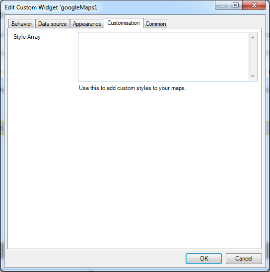
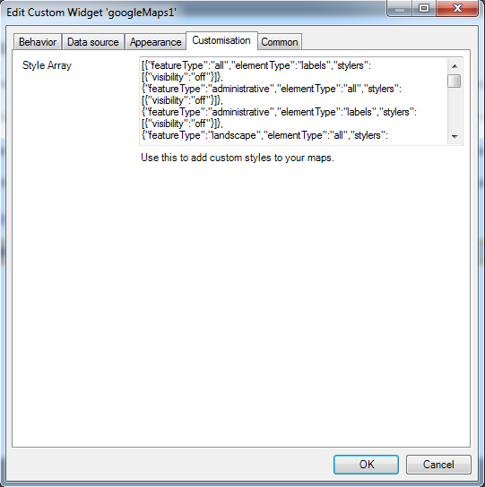
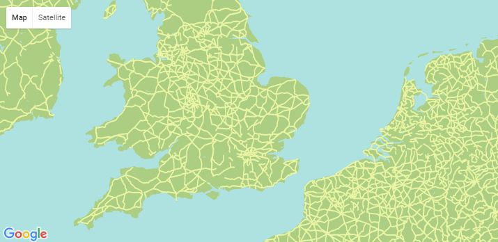
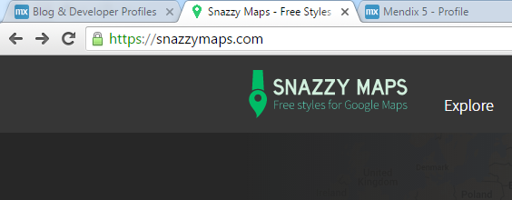
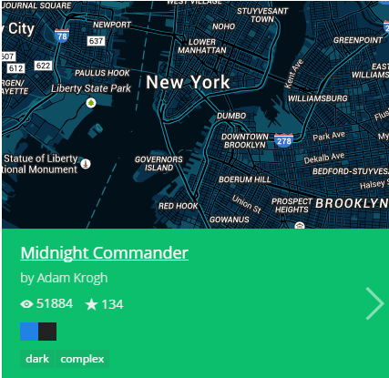
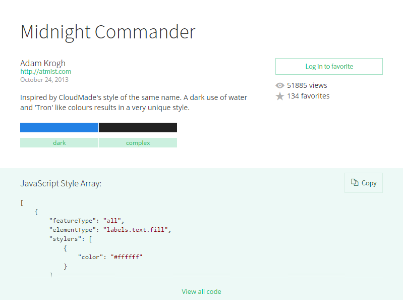
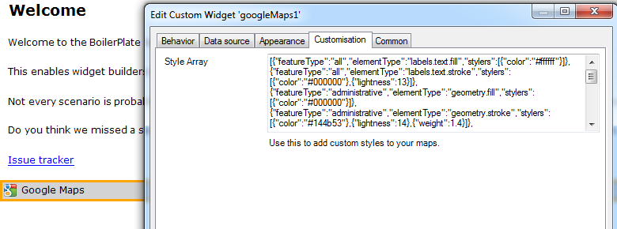
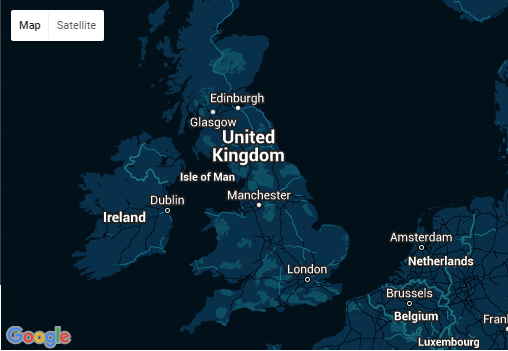
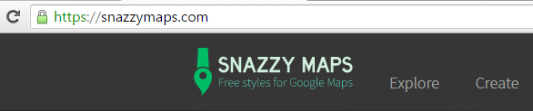
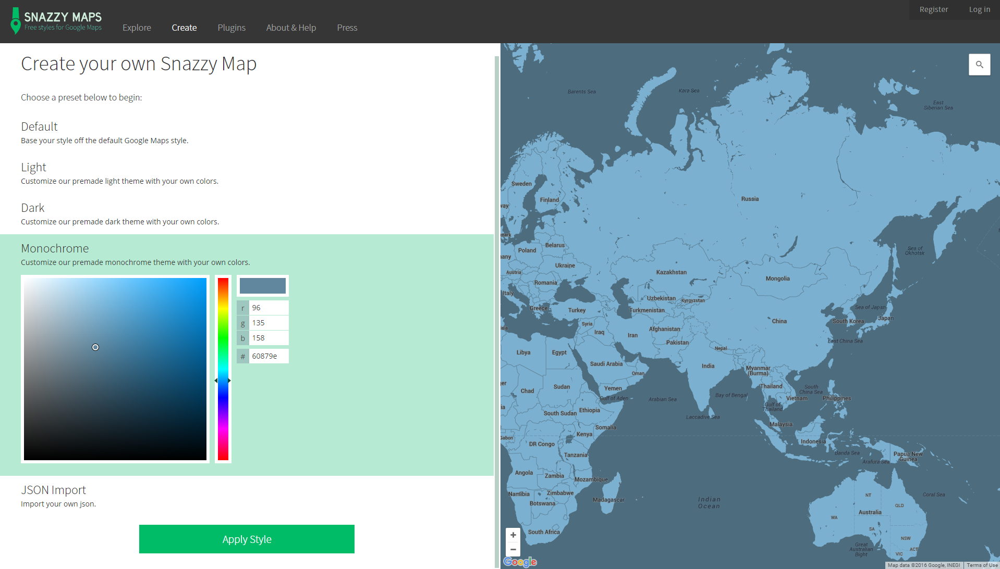

Google Maps is a very powerful addition to your applications. You can use it to display locations, areas, routes, etc. By default every map overview looks the same, like on the default Google Maps website. There is now a new option available on the Google Maps widget to style the map overview to make it match your application design. Follow the steps described below to sauce up the map overviews in your applications with a minimum amount of effort!

**After completing this how-to you will know:**

*   How to configure the new style feature of the Google Maps widget
*   Find and implement the right style matching your application
*   Upload new styles to support the community

## 1. Preparation

Before you can start with this how-to, please make sure you have completed the following prerequisites.

*   Have the latest version of the Google Maps widget in your application: [Google Maps Widget](attachments/19202780/19398965.png)

## 2\. Adding the style

### 2.1 Widget properties

In this chapter I will explain how you can add styling to the Google Maps widget.

1.  Open the properties of your Google Maps widget and go to the **Customisation** tab.
    

2.  Simply enter the style in the **Style Array** section and you're done!
    

    Here is the example styling:

    ```java
    [{"featureType":"all","elementType":"labels","stylers":[{"visibility":"off"}]},{"featureType":"administrative","elementType":"all","stylers":[{"visibility":"off"}]},{"featureType":"administrative","elementType":"labels","stylers":[{"visibility":"off"}]},{"featureType":"landscape","elementType":"all","stylers":[{"visibility":"on"}]},{"featureType":"landscape","elementType":"geometry.fill","stylers":[{"color":"#abce83"}]},{"featureType":"landscape","elementType":"labels","stylers":[{"visibility":"off"}]},{"featureType":"poi","elementType":"all","stylers":[{"visibility":"off"}]},{"featureType":"road","elementType":"geometry.fill","stylers":[{"visibility":"simplified"}]},{"featureType":"road","elementType":"labels.text.fill","stylers":[{"color":"#5B5B3F"}]},{"featureType":"road","elementType":"labels.text.stroke","stylers":[{"color":"#ABCE83"}]},{"featureType":"road","elementType":"labels.icon","stylers":[{"visibility":"off"}]},{"featureType":"road.highway","elementType":"geometry","stylers":[{"color":"#EBF4A4"}]},{"featureType":"road.arterial","elementType":"all","stylers":[{"visibility":"off"}]},{"featureType":"road.local","elementType":"all","stylers":[{"visibility":"off"}]},{"featureType":"transit","elementType":"all","stylers":[{"visibility":"off"}]},{"featureType":"water","elementType":"geometry","stylers":[{"visibility":"on"},{"color":"#aee2e0"}]}]
    ```

3.  The example style will give you this result:
    

### 2.2 Finding the right style

Choosing an existing style sheet from a large library that fits your application will save you a lot of time. Here is a website where a community is formed who uploads new styles on a regular basis: [https://snazzymaps.com/](https://snazzymaps.com/)

1.  On the website click on **Explore:**
    
2.  Explore the styles to find one that matches your application and click on it:
    
3.  On the lefthand pane you will see the style array:
    
4.  Now simply press **Copy.** The style is copied to your clipboard.
5.  Open the **Customisation** tab of the Google Maps widget and paste the style array you just copied from snazzy maps:

    

    The style array:

    ```java
    [{"featureType":"all","elementType":"labels.text.fill","stylers":[{"color":"#ffffff"}]},{"featureType":"all","elementType":"labels.text.stroke","stylers":[{"color":"#000000"},{"lightness":13}]},{"featureType":"administrative","elementType":"geometry.fill","stylers":[{"color":"#000000"}]},{"featureType":"administrative","elementType":"geometry.stroke","stylers":[{"color":"#144b53"},{"lightness":14},{"weight":1.4}]},{"featureType":"landscape","elementType":"all","stylers":[{"color":"#08304b"}]},{"featureType":"poi","elementType":"geometry","stylers":[{"color":"#0c4152"},{"lightness":5}]},{"featureType":"road.highway","elementType":"geometry.fill","stylers":[{"color":"#000000"}]},{"featureType":"road.highway","elementType":"geometry.stroke","stylers":[{"color":"#0b434f"},{"lightness":25}]},{"featureType":"road.arterial","elementType":"geometry.fill","stylers":[{"color":"#000000"}]},{"featureType":"road.arterial","elementType":"geometry.stroke","stylers":[{"color":"#0b3d51"},{"lightness":16}]},{"featureType":"road.local","elementType":"geometry","stylers":[{"color":"#000000"}]},{"featureType":"transit","elementType":"all","stylers":[{"color":"#146474"}]},{"featureType":"water","elementType":"all","stylers":[{"color":"#021019"}]}]
    ```

6.  And there it is:
    

### 2.3 Upload your own style array

Supporting communities is cool. Therefore I will also show you how to upload your own custom style array to the website.

1.  Go-to Snazzy maps and click on **Create.**
    **** 
2.  Now you will see the same sort of handy quick style method that Mendix provides at [https://ux.mendix.com/theme-creator.html](https://ux.mendix.com/theme-creator.html).
     

    Happy modelling!

## 3\. Related content

*   [Create a custom theme with the Mendix UI Framework](create-a-custom-theme-with-the-mendix-ui-framework)
*   [Layouts and Snippets](layouts-and-snippets)
*   [Filtering Data on an Overview Page](filtering-data-on-an-overview-page)
*   [Setup Mendix UI Framework](setup-mendix-ui-framework)
*   [Setting Up the Navigation Structure](setting-up-the-navigation-structure)
*   [Setup Mendix UI Framework with Koala](setup-mendix-ui-framework-with-koala)
*   [Creating your first two Overview and Detail pages](create-your-first-two-overview-and-detail-pages)
