## 1 Introduction

Selenium IDE is a Firefox plugin which records and plays back user interactions with the browser. 

**After using this how-to, you will know how to do the following:**

* Record test scripts with Selenium IDE
* Find unique CSS selectors with FirePath

## 2 Prerequisites

Before starting with this how-to, make sure you have completed the following prerequisite:

*   Download and install [Firefox](https://www.mozilla.org/nl/firefox/new/)
*   Download and install [Selenium IDE](https://addons.mozilla.org/en-US/firefox/addon/selenium-ide/) (when Selenium IDE is installed, it is then available as a Firefox plugin)
*   Install Firefox add-on [Firebug](https://addons.mozilla.org/en-US/firefox/addon/firebug/)
*   Install Firefox add-on [FirePath](https://addons.mozilla.org/en-US/firefox/addon/firepath/)

| Software | Version used in this how-to |
| --- | --- |
| Firefox | 50.1.0 |
| Selenium IDE | 2.9.1.1 |
| Firebug | 2.0.18 |
| FirePath | 0.9.7.1.1 |

{}

All images, names and steps in this how-to are based on these versions. When using other versions the images and/or names on your screen may be different than the images or names used in this how-to.

{}

## 3 Install and Run the Company Expenses App

In this chapter you will install and run the Company Expenses App

1.  Open the **Mendix Modeler**.
2.  Click the **App Store** button.

    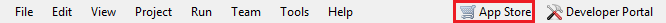
    
3.  Search for _Company Expenses_.
4.  Click **Company Expenses**.

    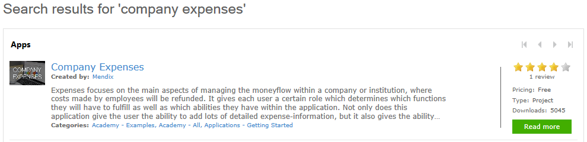
    
5.  Click **Download**.
6.  Click **OK**. This will open the **Company Expenses** app in the **Mendix Modeler**.

    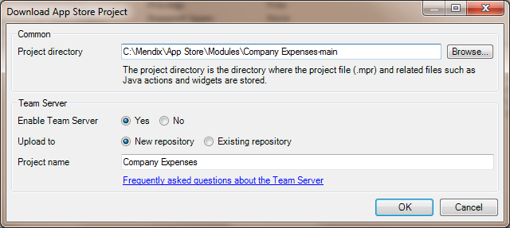
    
7.  Click **Run Locally** (F5).
8.  Click **View App** (F9).

## 4 Create Your First Automated Test

In the first part of this chapter you will create an automated test by using the record button in Selenium IDE.

1.  Open **Firefox.**
2.  Go to _http://localhost:8080/index.html_.
3.  Click the **Selenium IDE** button (DEFAULT RECORDING).

    
    
4.  Enter the following login details on the Mendix login screen:

    | Field | Value |
    | --- | --- |
    | Username | Mxadmin |
    | Password | 1 |

    

5.  Click **Sign in**.
6.  Click **Sign out**.
7.  Click the **Record** button in **Selenium IDE**.

    

    Selenium IDE should look like the image below:
    
    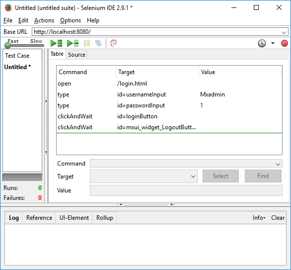
    
8.  Click the **Run current test case** button.

    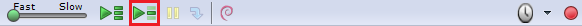

    Every passed test step will be marked green as you can see in the image below:
    
    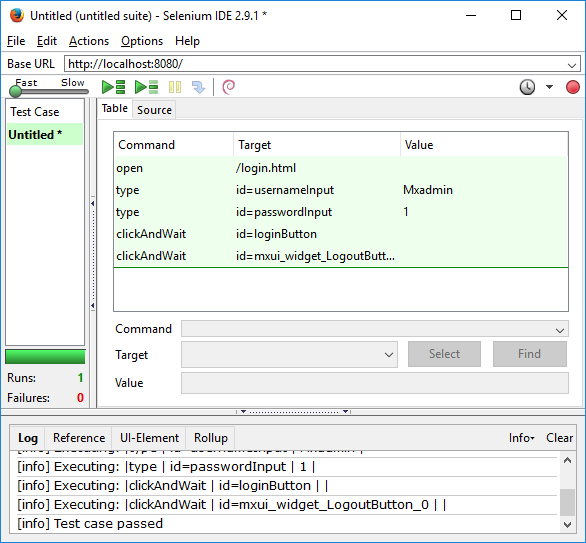

Well done! You have just created your first automated test!

### 4.1 Use Firebug and FirePath to Locate the Element

Selenium IDE can be used to record tests scripts, but almost alway these scripts need to be edited before you can use them (e.g. HTML tag IDs are generated dynamically and will be different with each run of the same page). In this paragraph you will edit some test steps that don't, by using Firebug and FirePath to find the right locator. Locators tell Selenium IDE which GUI elements (e.g. buttons, textboxes, datagrids) it needs to operate on. To make it easier to create a locator for Mendix elements, ‘mx-name’ is added to the class of an element. When the position of an element in the form changes, there is no need to rewrite the script.

1.  Press **CTRL+N** to create a new test case in **Selenium IDE**.
2.  Click the **Record** button.
3.  Enter the following login details on the Mendix login screen:

    | Field | Value |
    | --- | --- |
    | Username | MxAdmin |
    | Password | 1 |

4.  Click the **Sign in** button.
5.  Click the **Expenses** tab.
6.  Click the **New Expense** button.
7.  Enter 1 in the **Amount** field.
8.  Select _Accomodation_ in the **Description** box.

    
    
9.  Click the **Save** button.
10.  Click the **Sign out** button.
11.  Click the **Record** button in **Selenium IDE** to stop recording.
12.  Click the **Run current test case** button. The test will fail because it can not find the element with target `id=mxui_widget_NumberInput_1_input`.

    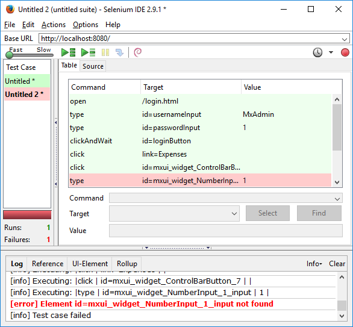
    
    The element with target `id=mxui_widget_NumberInput_1_input` does not exist on the page. The number in the ID is not always the same. You need to find another target selector for the same element with the use of Firebug and FirePath.
13.  Repeat steps 3 till 6.
14.  Click the **Firebug** button in the Firefox toolbar.

    
    
15.  Click the **FirePath** tab.

    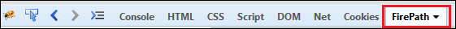
    
16.  Click the **Inspect Element** button.

    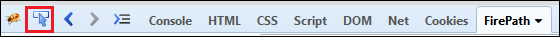

17.  Click the **Amount** field.
    
    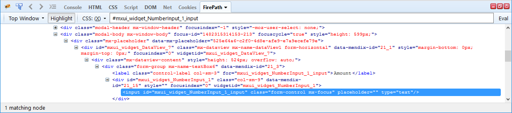
    
    The CSS selector _mxui_widget_NumberInput_1_input_ does not exist. We need to find a unique selector for the **Amount** field. Mendix uses CSS classes to identify page content like widgets and pop-up windows. You can use these classes in Selenium to manipulate pages and verify data. Widgets can be given a name in the Mendix Modeler. These names appear in the HTML document as class names prefixed by _mx-name-_. For instance, a grid named _EmployeeGrid_ will get a CSS class _mx-name-EmployeeGrid_. This is true for all widgets.
18.  Open the **Desktop_Expense_NewEdit_Admin** page in the Mendix Modeler.
    
    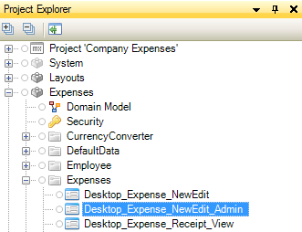
    
19.  Select the **Amount** field.
    
    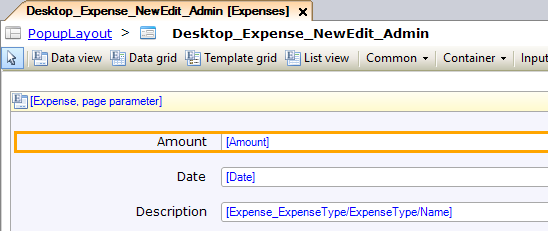 
    
    The name of the **Amount** field is _textBox6_. Every element will automatically get the CSS class _mx-name-[Name]_. So the amount field will have the CSS class _mx-name-textBox6_.
    
    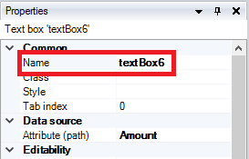

20.  Enter _.mx-name-textBox6_ in **FirePath** and press Enter.
    
    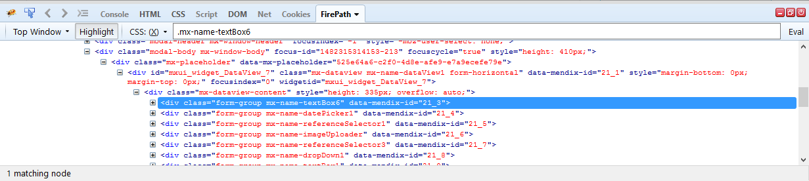
    
    There is only 1 matching node, so you have now found a unique selector for the **Amount** field.

21.  Change this value:

        ```
        id=_mxui_widget_NumberInput_1_input_
        ```

      into:

        ```
        css=.mx-name-textBox6 input
        ```

      in Selenium.

        {}

        Because it is an input field, you have to add _input_ to the target.

        {}

22.  Click the **Run current test case** button. The test will fail because it can not find the element with target _css=.mx-name-textBox6 input_. The element can't be found because the page with the element is not loaded yet.
23.  Switch the speed control to slow. The speed control determines how fast your test script runs. Default the speed control is set to the maximum speed. When the test runs too fast, it is possible that the test started asserting for an element on the page even before the page is fully loaded by the browser. Try to run your test script as fast as possible.

    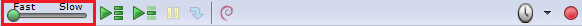
    
24.  Click the **Run current test case** button. The test will fail because it can not find the element with target `css=input.form-control.mx-focus`.
25.  Open the **Desktop_Expense_NewEdit_Admin** page in the Mendix Modeler.
26.  Click the **Description** box. The name of the **Description** box is _referenceSelector1_ and will have the CSS class _mx-name-referenceSelector1_.
27.  Enter _.mx-name-referenceSelector1_ in **FirePath** and press **Enter**. Two elements are found: one in the pop-up window and one on the page in the background. To retrieve the element of the active page, you need to add _.mx-window-active_ to the target.
28.  Enter _.mx-window-active .mx-name-referenceSelector1_ in **FirePath** and press **Enter**. There is only one matching node, so you have now found a unique selector for the **Type** box. 
29.  Change this value:

        ```
        id=mxui_widget_ReferenceSelector_2_input
        ```

      into:

        ```
        css=.mx-window-active .mx-name-referenceSelector1 select
        ```

      in Selenium.

        {}

        Because it is a dropdown list, you have to add _select_ to the target.

        {}
30.  Click the **Run current test case** button. The test will pass.

    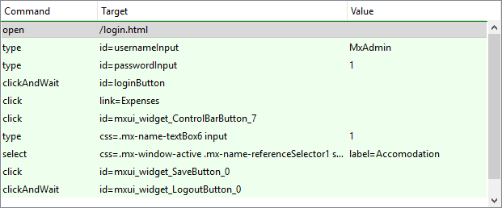

Congratulations! You have just created your second automated test.

{}

Some widgets, like a Grid or a Listview, can show multiple items. Every item has a CSS class `mx-name-index-[indexNumber].` The index number starts at 0.

{}

### 4.2 Install the Selenium Mendix Locator Builder Plugin

Manually editing a lot of test steps is time consuming. Marcel Groenweg created a Selenium plugin for Mendix test recording. When you add the plugin to Selenium IDE, the test steps will have mx-name- CSS selectors rather than the Selenium default. It will also look for parent grids and list views and add selectors to get the correct row by it's index. This reduces the time spent on editing the test steps.

1.  Go to [https://github.com/mgroeneweg/SeleniumMendixLocatorBuilder](https://github.com/mgroeneweg/SeleniumMendixLocatorBuilder).
2.  Click on **Download ZIP**.

    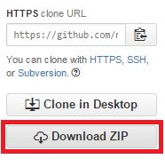
    
3.  Unzip **SeleniumMendixLocatorBuilder-master.zip**.
4.  Open **Selenium IDE**.
5.  Go to **Options > Options**.
6.  Click on **Browse** to select a Selenium IDE extension.
7.  Select **MendixNameLocatorBuilder.js** from extracted folder.
8.  Click **Open**.
9.  Click **OK**.
10.  Restart Selenium IDE.
11.  Click on **Options > Options**.
12.  Select tab **Locator Builders**.
13.  Drag **css:MendixName** to the top.
14.  Restart Selenium IDE.

Now the test steps will have 'mx-name-' CSS selectors rather than the Selenium default.

### 4.3 Create an Automated Test with the Selenium Mendix Locator Builder Plugin

1.  Open **Selenium IDE**.
2.  Enter the following login details on the Mendix login screen:

    | Field | Value |
    | --- | --- |
    | Username | Mxadmin |
    | Password | 1 |

3.  Click the **Sign in** button.
4.  Click the **Expenses** tab.
5.  Click the **New Expense** button.
6.  Enter 1 in the **Amount** field.
7.  Select _Accomodation_ in the **Description** box.

    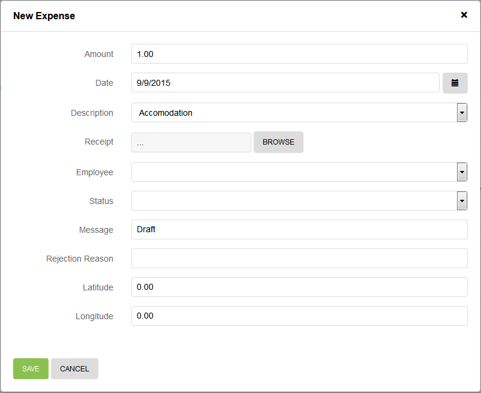
    
8.  Click the **Save** button.
9.  Click the **Sign out** button.
10.  Click the **Record** button in **Selenium IDE** to stop recording.
11.  Click the **Run current test case** button. The test will fail because it can not find the element with target _css=.mx-window-active .mx-name-textBox6 input_. The element can't be found because the page with the element is not loaded yet.

    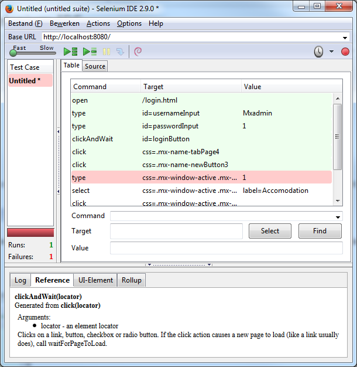
    
12.  Switch the speed control to slow. The speed control determines how fast your test script runs. Default the speed control is set to the maximum speed. When the test runs too fast, it is possible that the test started asserting for an element on the page even before the page is fully loaded by the browser. Try to run your test script as fast as possible.

    
    
13.  Click the **Run current test case** button. The test will pass.

    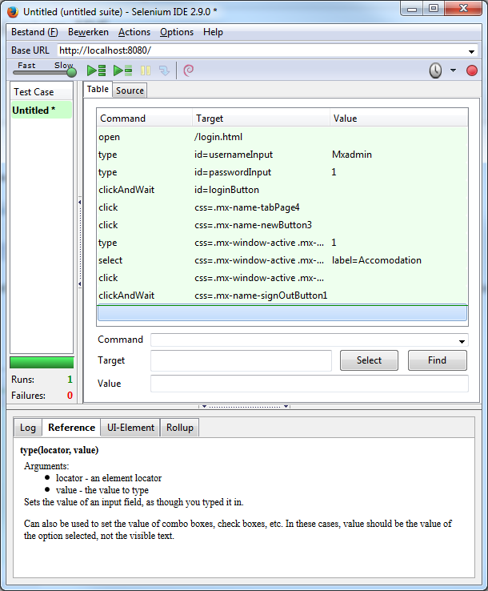

## 5 Related Content

* [How to Test Mendix Applications Using Selenium IDE](testing-mendix-applications-using-selenium-ide)
* [How to Create Automated Tests with TestNG](create-automated-tests-with-testng)
* [How to Test Microflows Using the UnitTesting Module](testing-microflows-using-the-unittesting-module)
* [How to Find the Root Cause of Runtime Errors](finding-the-root-cause-of-runtime-errors)
* [How to Clear Warning Messages in Mendix](clear-warning-messages)
* [How to Test Web Services Using SoapUI](testing-web-services-using-soapui)
* [How to Monitor Mendix Using JMX](monitoring-mendix-using-jmx)
* [How to Debug Java Actions Remotely](debug-java-actions-remotely)
* [How to Log Levels](log-levels)
* [How to Debug Java Actions](debug-java-actions)

Learn more about this topic using the following helpful link:

* [Selenium IDE Documentation](http://docs.seleniumhq.org/docs/02_selenium_ide.jsp)
