To smarten up your app with business logic you can use microflows. To verify that your microflow works as expected you can create unit tests using the UnitTesting module. The UnitTesting module provides an easy to use interface to manage and run unit tests. The module supports unit tests that are created using microflows and unit tests that are created using JUnit.

**After completing this how-to you will know:**

*   How to set up the UnitTesting module.
*   How to create a microflow unit test.

## 1. Preparation

Before you can start with this how-to, make sure you have completed the following prerequisites.

*   Download the Mendix Modeler.

| Software | Version used in this how-to |
| --- | --- |
| Mendix Modeler | 5.18.0 |
| UnitTesting module | 4.2 |
| Community Commons Function Library module | 5.4 |

{}
All images, names and steps in this how-to are based on these versions. When using other versions the images and/or names on your screen may be different than the images or names used in this how-to.
{}

## 2\. The UnitTesting module

In this chapter you will set up the unit testing module and run the example tests.

1.  Create a new project.
2.  Download the **UnitTesting module**.
3.  Download the **Community Commons Function Library module**.
4.  Open the **Settings** of the project.
    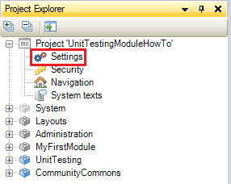
5.  Click tab **Model**.
6.  Click the **Select** button to select an after startup microflow.
    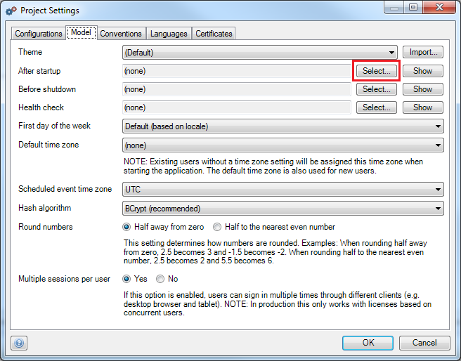
7.  Select the microflow **Startup** which can be found in the _USE ME folder of the UnitTesting module.
    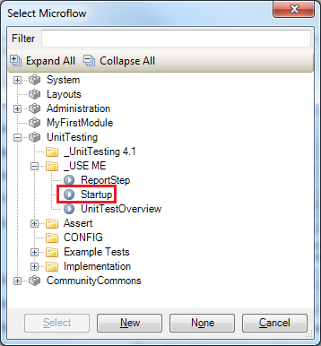
8.  Click **OK**.
9.  Open the **Navigation** of the project.
10.  Click **New item** to add a new item to the menu.
11.  Enter _UnitTestOverview_ in the **Caption** field.
12.  Select the microflow **UnitTestOverview** as target.
    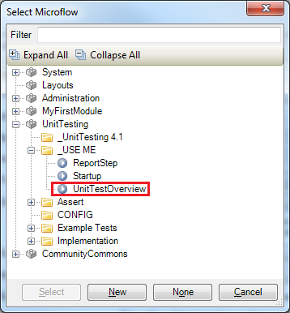
13.  Click **OK**.
    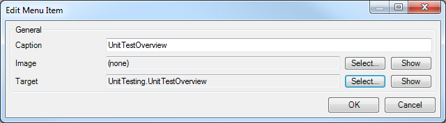
14.  Run the project locally.
15.  Go to **http://localhost:8080/index.html**.
16.  Click on **UnitTestOverview** in the navigation.
    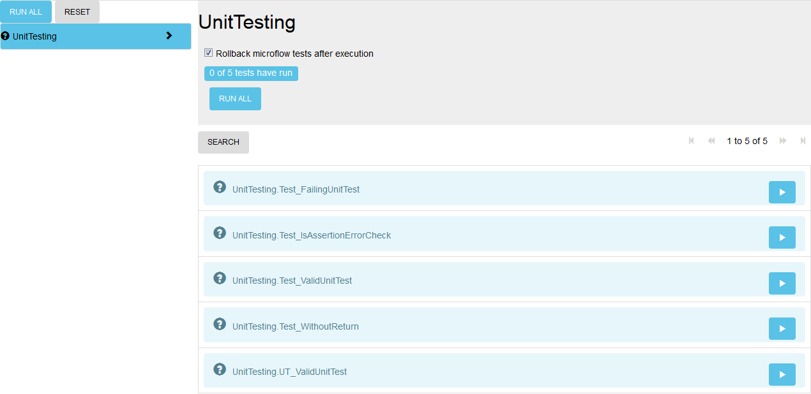
    At the left side 2 buttons are shown. When you click on the Run all button, all unit tests will be executed. When you click on the Reset button, the status of all tests will change to not executed (question mark icon). Beneath the buttons all modules which contains unit tests are shown. In this case UnitTesting is the only module which contains unit tests. When you click on UnitTesting, all unit tests of this module are shown.
    If you want to save all changes made in the microflow to the database, you need to uncheck the checkbox 'Rollback microflow tests after execution'. Keep the checkbox checked if you want to rollback all changes.
    At the right side the unit tests of the selected module are shown. In this example five unit tests are shown. When you click on the Run all button, all unit tests of the selected module will be executed. When you click on the play button next to a unit test, only that unit test will be executed.
17.  Click on the play button of **UnitTesting.Test_ValidUnitTest**.
    
    The color of the testcase will change to green if it passed.
    
    And to red if the test case fails.
    
18.  Double click on **UnitTesting.TestValidUnitTest**.
    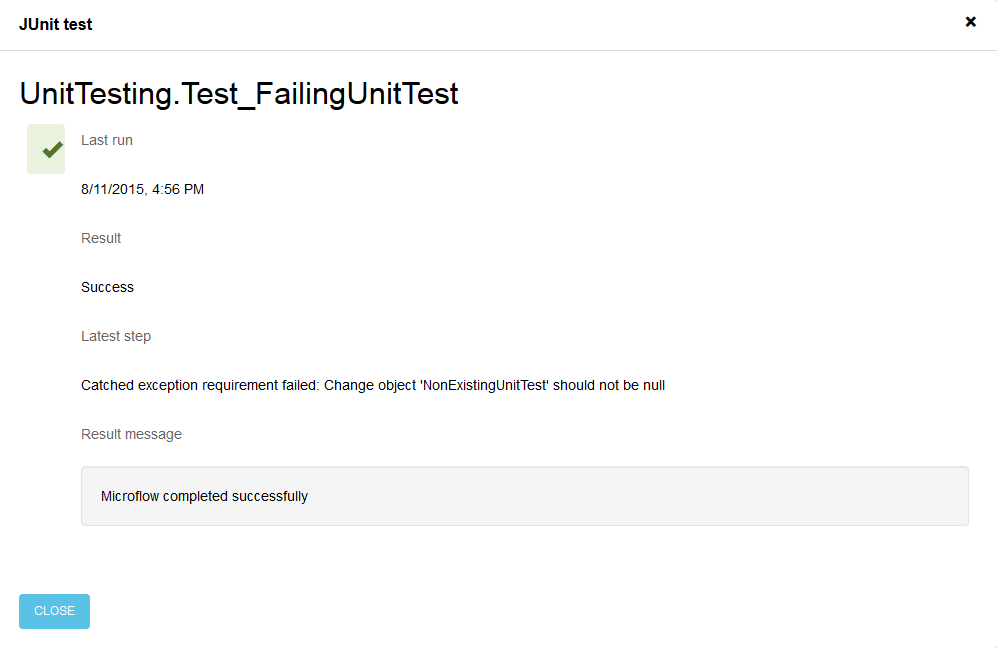 In this overview you will see the date and time of the last run, the result (success or failed), the latest, reported step and the result message.

## 3\. Create a microflow test

In this chapter you will learn how to create a microflow test. To create a new microflow test in a module, you need to add a microflow with a name that starts with "Test". A test microflow should have no input arguments and a boolean or string as result type. In case of a boolean, true means success, false means the test failed. In case of a string, any non empty string indicates a failed test.

### 3.1 Create a microflow

1.  Create a new enumeration **Level** with three enumeration values; **Junior**, **Medior** and **Senior**.
    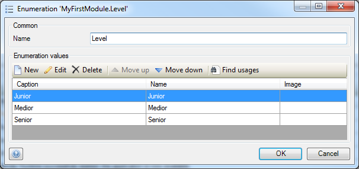
2.  Open the Domain Model of **MyFirstModule**.
3.  Create an entity **Employee** with two attributes, **Name** (String(200)) and **Level** (Enumeration 'Level').
    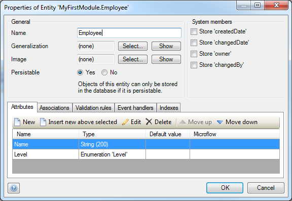
4.  Create a microflow **Promote**.

    <iframe width="100%" height="491px" frameborder="0" src="https://modelshare.mendix.com/models/d5d6ad4f-bcc8-4ce8-a999-a86370bc6ffe/promote?embed=true" allowfullscreen=""></iframe>

### 3.2 Create a unit test

1.    Add a **new folder** to MyFirstModule and name it _UnitTests_.
2.    Add a **new microflow** to the folder UnitTests and name it _Test_PromoteEmployeeToJunior_. The microflow Promote has one input parameter, Employee. So first you need to create the object Employee.
3.    Add a new activity of action type _Create object_.
4.    Select entity Employee.
5.    Set Commit to _Yes_.
6.    Set Name to _John_.
      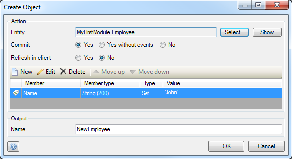
7.    Click OK. Now you need to call the microflow Promote with the just created object Employee.
8.    Add a new activity of action type _Microflow call_.
9.    Select microflow _MyFirstModule.Promote_.
      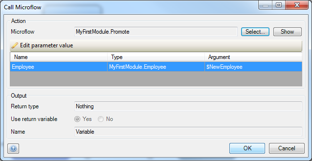
10.   Click OK. The next step is to check if the employee is promoted to the right level.
11.   Add a new activity of action type _Microflow call_.
12.   Select microflow _UnitTesting.AssertTrue1_.
13.   Set the argument of parameter **ValueToAssert** to _$NewEmployee/Level = MyFirstModule.Level.Junior_.
      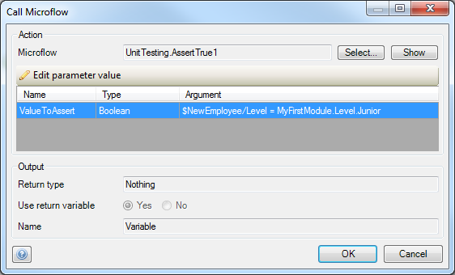
14.   Click OK. For failed tests, the last step information can be very useful. You can provide this information in your microflow by calling the ReportStep submicroflow.
15.   Add a new activity of action type Microflow call between _Create Employee_ and _Promote_.
16.   Select microflow _UnitTesting.ReportStep_.
17.   Set the argument of parameter **Message** to _'Employee created'_.
18.   Click OK.
19.   Add a new activity of action type Microflow call between _Promote_ and _Promoted to Junior?_.
20.   Select microflow _UnitTesting.ReportStep_.
21.   Set the argument of parameter **Message** to _'Employee promoted'_.
22.   Click OK.
23.   Double-click on the **End event**.
24.   Select **Boolean** as return type.
25.   Enter **true** as return value.
26.   Click OK.
27.   The microflow should look like the model below:
      <iframe width="100%" height="491px" frameborder="0" src="https://modelshare.mendix.com/models/93a3546c-df5e-4b7d-9dc8-447a9f24432f/unittest-promote-employee-to-junior?embed=true"></iframe>

28.   Create three more test microflows as shown below:

      **Test_PromoteEmployeeToMedior**

      <iframe width="100%" height="491px" frameborder="0" src="https://modelshare.mendix.com/models/a609f474-dd8c-4315-84fb-1056256ca3fc/unittest-promote-employee-to-medior?embed=true"></iframe>

      **Test_PromoteEmployeeToSenior**

      <iframe width="100%" height="491px" frameborder="0" src="https://modelshare.mendix.com/models/f247e678-1738-416a-8e6a-77dfdb2cf392/unittest-promote-employee-to-senior?embed=true"></iframe>

      **Test_PromoteEmployeeWhenAlreadySenior**

      <iframe width="100%" height="491px" frameborder="0" src="https://modelshare.mendix.com/models/44d6c6be-d35c-403d-ad2f-d89398956a07/unittest-promote-employee-when-already-senior?embed=true"></iframe>
29.   Run the project locally.
30.   Go to **http://localhost:8080/index.html**.
31.   Click on **UnitTestOverview** in the navigation. **MyFirstModule** will be shown in the list with modules that contain one or more testcases.
      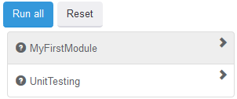
32.   Click on **MyFirstModule**. All testcases of module MyFirstModule will be shown.
      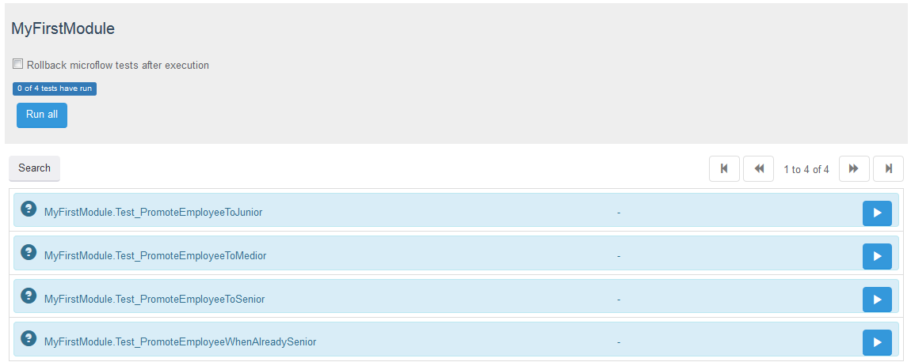
33.   Check the checkbox **Rollback microflow tests after execution**.
34.   Click on **Run all**. All test cases should pass.
      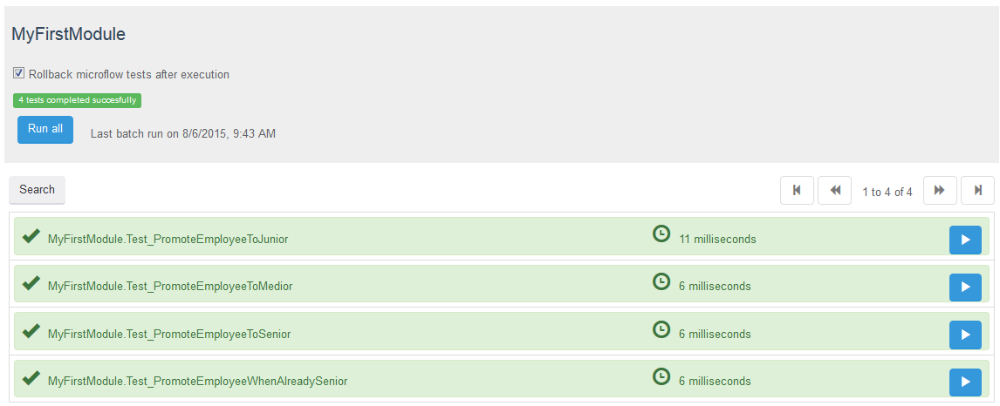

Congratulations! You created your first unit tests using the UnitTesting module.

{}

It is possible to create a Setup and TearDown microflow per module. The Setup microflow is invoked once before each test run and the TearDown microflow is invoked once after each test run (regardless whether the test run consists of one or multiple unit tests).

{}

Do not test everything, focus on the most used and complex microflows.

## 4\. Releated Content

*   [Creating automated tests with TestNG](create-automated-tests-with-testng)
