Each application can export items to Excel format from a Data Grid as standard functionality in the platform (add an Export to Excel button on a Data Grid). However, in instances where more customized Excel documents are required, applications can leverage Mendix App Store content to create custom Excel documents based off of configurable templates. To achieve this, the app will require two Mendix App Store modules and the subsequent configuration of the documents.

## 1\. Download the Required Modules from the Mendix App Store

In this part of the how to you will learn how to download the necessary modules from the Mendix App Store. This is a very quick process, in that in just a few clicks the modules will be imported into your project. The modules that are required for this process are 'MxModelReflection' and 'Excel Exporter'.

{}

The MxModelReflection module is a commonly used module in most apps. The purpose of this module is to allow the app to reflect into the domain model (entities and attributes) and microflow definitions at runtime.

{}

### 1.1 Download the 'MxModelReflection' Module

1.  Open the **Mendix App Store** from within the modeler.
2.  Search for the keyword **Reflection**.
3.  Click the **Download** button and include the module as a new module.
    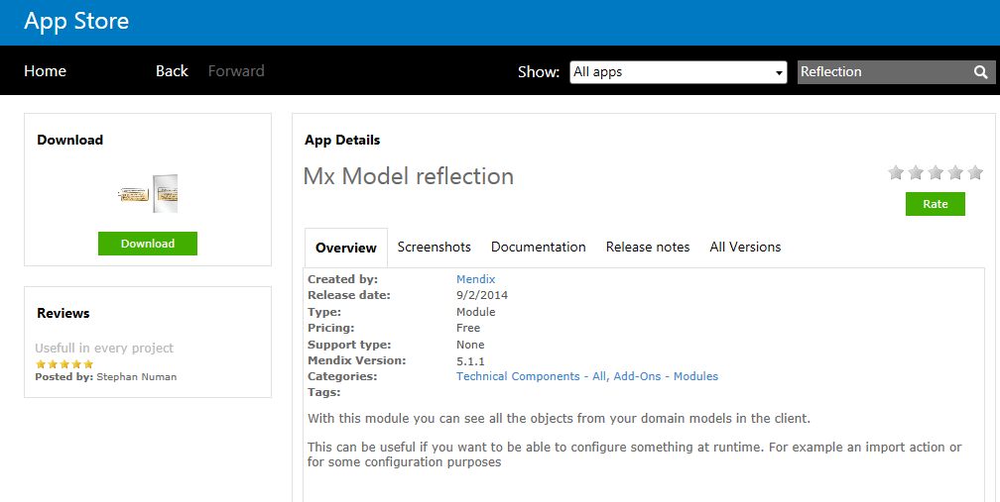
4.  Ensure the module has downloaded successfully and is now a new module in your project.

### 1.2 Download the 'Excel Exporter' Module

1.  Open the **Mendix App Store** from within the modeler.
2.  Search for the keyword **Excel**.
    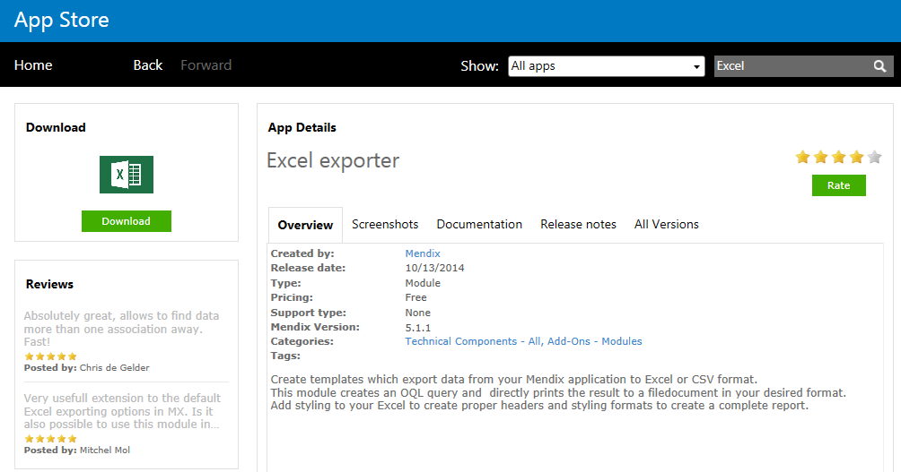
3.  Click the **Download** button and include the module as a new module.

Ensure the module has downloaded successfully and is now a new module in your project.

{}

Depending on the layout selected when the project was created, errors in the modeler may arise due to the new module's default layouts. To correct this, open each page that has an error and update the layout to the desired layout within the app.

{}

## 2\. Add Navigation Items to Allow Users to Configure Settings

In this part of the how to you will learn how to add the required pages into the Project Navigation that are needed to configure both the Mx Model Reflection and the Excel Export templates that will be used within the application.

1.  Open **Navigation** within the project.
2.  Add a new item to the Navigation for **Administrator** to access **MxModelReflection.MxObjects_Overview**.
    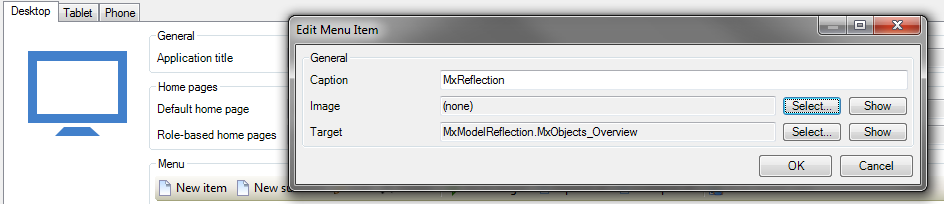
3.  Add a new item to the Navigation for **Administrator** to access **XLSReport.Excel_Document_Overview**.
    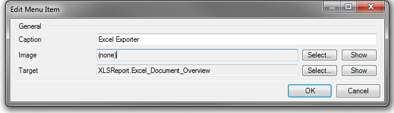

## 3\. Mx Model Reflection Configuration

In this part of the how to you will learn how to run the MxModelReflection synchronization and so the app can leverage the output from that process to create the highly customizable Excel Export templates.

### 3.1 Run the MxModelReflection Synchronization

1.  Open the **MxModelReflection** overview page via the Navigation item configured to MxModelReflection.MxObjects_Overview.
2.  Highlight each module the app needs to synchronize and click the **Toggle Module Sync** button (the Sync this Module should now be 'Yes').
3.  Click the **Synchronize Objects** button to execute the synchronization process.

## 4\. Creating Excel Export Templates

In this part of the how to you will learn how to create a basic Excel Export template within your app. This section will cover an overview of the various configuration items to enable you to start building the desired templates.

{}

This module has many moving pieces that allow the configurations to be as simple or complex as the user desires. This tutorial will go over the basics to get you started, but building the desired template will take a varying degree of configuration options.

{}

### 4.1 Creating an Input Object Entity

1.  Open the **Domain Model** and add an **Entity** to serve as a "Master Export" entity that is of specialization **FileDocument**.
2.  Create an association between the newly created entity and the entity(ies) that you will want to serve as a base for the Excel Export.
    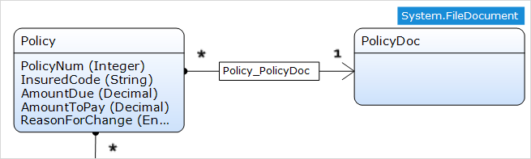

### 4.2 Basic Setup of the Template

1.  Open the **Excel Exporter Overview** via the Navigation item configured to XLSReport.Excel_Document_Overview.
2.  Click the **New** button to create a new template.
3.  Configure the **Filename** (without extension) to be the default file name when the template is used.

    {}

    The file name can always be changed when the template is used within a microflow.

    {}
4.  Configure the **Input Object** to be the file document entity that is associated to your entity to be exported.
5.  Provide a **Description** for identifying and documenting what this exact template is used for.
6.  Specify the **Date time export format** for how the dates and times should appear in the Excel file once exported.

### 4.3 Creating the Sheet Layout

1.  Under the **Worksheets** section, select **New** to create a new sheet template.
    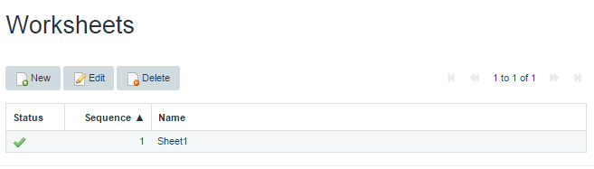
2.  Specify the **Name** that will be given to the sheet when the file is exported.
3.  Configure the **Row Object** that you want to export and set the reference to the template input object (if input object is used).
4.  Configure the **Start retrieved data at row** to set the ordinal number in which the data should be exported.

    {}

    This setting will possibly trim the result set being exported, as the export will go from this value to the end of the list of data

    {}
5.  Select if the export should export distinct only or allow duplicate data
6.  Specify the **Column and Row Settings** for height and width, or leave as default
7.  Specify if the extract will **Use Static Data** or not.

    {}

    If static data is used, that will be configured in Section 4.6.

    {}
8.  Specify if the **Default text style** that will denote the pre-defined style to be applied to the exported data.

9.  Specify if the **Default header text style** that will denote the pre-defined style to be applied to the header data.

    {}

    Specifying styles are addressed in Section 4.5.

    {}

### 4.4 Configuring Dynamic Column Data

1.  Open the **Column Data tab** and select **New** to create a new export column
    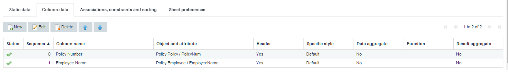
    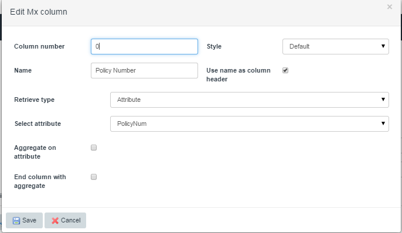
2.  The **Column number** will be set automatically, but can be overwritten to the desired ordinal number.
3.  Define a **Name** for the column and specify if that **Name** should be the **Column Header** as well when exported.
4.  Specify the **Retrieve type** to identify if this column will be an attribute or a reference.
5.  Specify the **Select attribute** to identify the exact attribute on the row entity in which this column corresponds to.
6.  Specify if the column should result in an aggregate.

    {}

    Only types of Decimal, Integer, and Long can be aggregated

    {}

### 4.5 Configuring Static Data in the Sheet

1.  Open the **Static Data tab** and select **New** to create a new export column.
    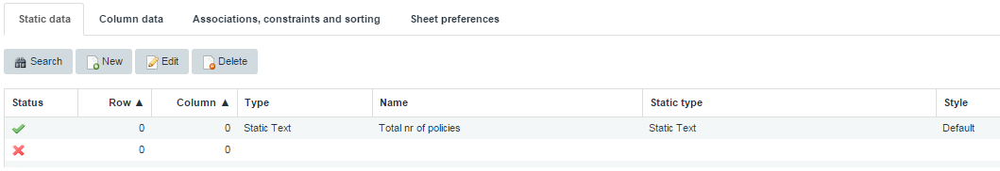
    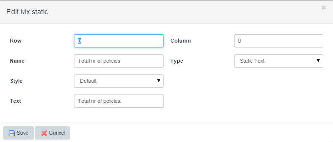
2.  Specify the **Row** and **Column** that the static value should be placed.
3.  Enter a name for the cell in the **Name** field.
4.  Specify the **Type** by denoting if the cell is **Static Text, Object Data, or Aggregate Function**.
5.  Specify the **Style** that should be applied to the cell.
6.  Specify the **Text** if the field **Type** is listed as **Static Text**.

### 4.6 Configuring Custom Formatting/Styling of Cells

1.  Open the main NewEdit page for the Excel Export Template and find the **Styles** section
    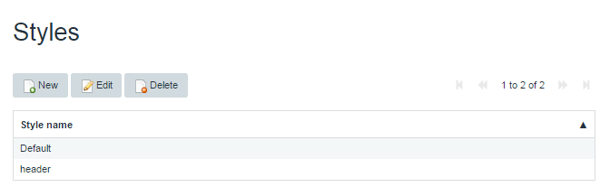
2.  Select **New** to create a new style that can be applied to any of the data in the Excel Export.
    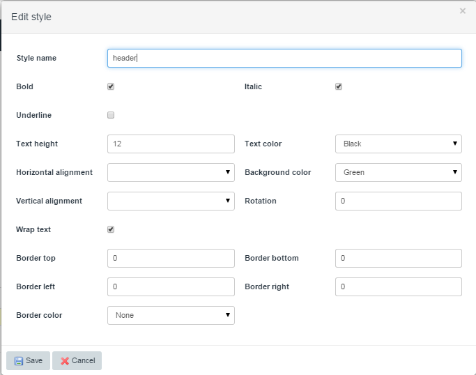
3.  Specify the properties of the style that will be applied to the cells. 
4.  Upon **Save** the style will now be available to be used for dynamic columns, static columns, and headers.

## 5\. Call the Excel Export Module via Microflow

In this section you will learn how to call the newly created Excel Export template in your application. 

{}

This module has many steps that must be configured in order for the template to be used correctly. Please review all steps.

{}

### 5.1 Retrieving the Excel Template and Generating the Document

1.  Create a **Microflow** that either takes an inbound parameter of your object(s) needing to be exported OR retrieve those object(s) into your **Microflow**.
2.  Call the XLSReport.GenerateExcelDoc java action to pass the required objects to the module.
3.  Download the resulting FileDocument object.
    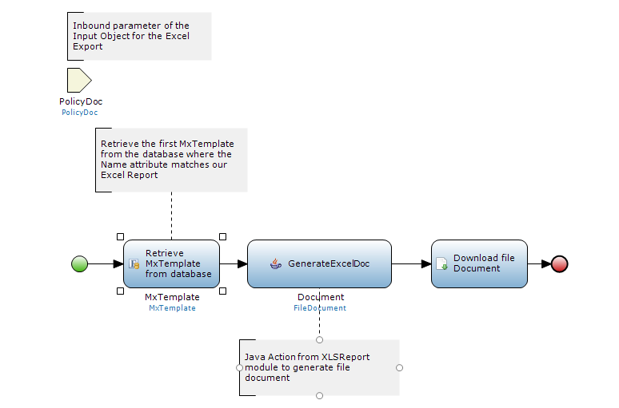

## 6\. Related content

*   [Consuming a complex web service](consume-a-complex-web-service)
*   [Consuming a simple Web Service](consume-a-simple-web-service)
*   [Selenium Support](selenium-support)
*   [Synchronizing user accounts using the LDAP module](synchronizing-user-accounts-using-the-ldap-module)
*   [Importing Excel Documents](importing-excel-documents)
*   [Exporting XML documents](export-xml-documents)
*   [Exposing a web service](expose-a-web-service)
*   [Importing XML documents](importing-xml-documents)
*   [Consuming a REST Service](consume-a-rest-service)
