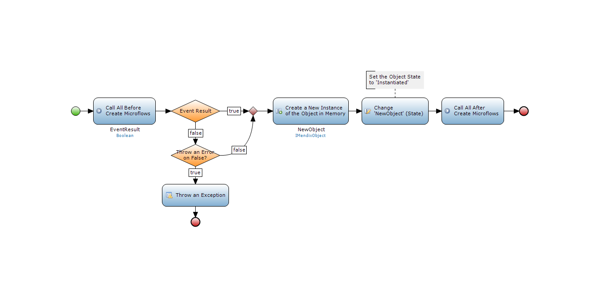

When working with the Platform, objects are being created, removed, or reverted back to the original. Based on the state of the object and the 'Object Events' that are specified in the domain model, different actions are taken by the platform to guarantee data consistency. 

## 1 Create

Wherever an object is initialized, all the events are always executed. The default New button, a create activity in a microflow, webservices, they will always follow the steps described in the image below.  

* Events: all before and after events are executed, and if any of the before create events returns false an exception can be thrown
    * If an exception occurs during an event all changes are being reverted with the default error handling behavior.
* Database: there is no database communication happening during this event, not unless it is specified in a before or after create event
* Result :a new object is available after these triggers
    * The object will have the state 'Instantiated'
    * This is influences the behavior in the other object actions.

## 2 Commit

When an object is being committed through a default save button, a commit activity, or webservices, it will always trigger the commit events. The platform will also evaluate all associated objects. To guarantee data consistency the platform will also auto-commit associated objects.

An autocommit is an automatic commit from the platform. This is done to keep the domain model in sync. If your application ends up having autocommitted objects than you have a modeling error. Since an association is also a member of an object, the association will be stored in the database as well.

That means if you create an OrderLine inside an Order, with OrderLine being the parent of the association. When you commit the OrderLine, the Order will be auto-committed.

If you end up with auto-commited objects, it is always because of a modeling error. At some point in time, an association was set to a new object and the associated object was committed. Thus committing all its associations as well to keep all data consistent.

* Events: all before and after events are executed, and if any of the before rollback events returns false an exception can be thrown
    * If an exception occurs during an event all applied changes are being reverted with the default error handling behavior
    * Changes made prior to the commit will be kept
* Database: there is an insert or update query executed
    * Depending on the object state, the platform will do an insert for objects with the state 'Instantiated', and an update for all other states
* Result :an object with the State: 'Instantiated' will be inserted into the database, an object with any other State will be updated

## 3 Rollback

Pressing a cancel button or triggering a Rollback activity will initiate the Rollback events. These actions are not triggered in case of a rollback because of an error.

* Events: all before and after events are executed, and if any of the before rollback events returns false an exception can be thrown
    * If an exception occurs during an event all applied changes are being reverted with the default error handling behavior
    * Changes made prior to the rollback will be kept
* Database: there is no database communication happening during this event, not unless it is specified in a before or after create event
* Result: an object with the State: 'Instantiated' will be removed, an object with any other State will be reverted back to the values it had during the last commit

## 4 Delete

Pressing a delete button or triggering a Delete activity will initiate the Delete events. Also when an object is removed through the configured delete behavior it will execute all before and after events.

* Events: all before and after events are executed, and if any of the before delete events returns false an exception can be thrown
    * If an exception occurs during an event all applied changes are being reverted with the default error handling behavior
    * Changes made prior to the rollback will be kept 
* Database: if an object has state 'Instantiated' there will be no database communication required
    * For any other status a delete query is executed in the database
* Result: the object will be removed from memory and if applicable from the database
    * All delete behavior for the associations is validated, and any associated objects are removed as well

## 5 Related Content

*   [Working with images and files](working-with-images-and-files)
*   [Creating a basic data layer](create-a-basic-data-layer)
*   [Working With Object Events](working-with-object-events)
*   [Denormalize Data to Improve Performance](denormalize-data-to-improve-performance)
*   [Setting up data validation](setting-up-data-validation)
*   [Finding the Root Cause of Runtime Errors](finding-the-root-cause-of-runtime-errors)
*   [Managing your Application Requirements with Mendix](/developerportal/howto/managing-your-application-requirements-with-mendix)
*   [Scout and Windows 10 Workaround](scout-and-windows-10-workaround)
*   [Creating a chainable Custom Widget](create-a-chainable-custom-widget)
