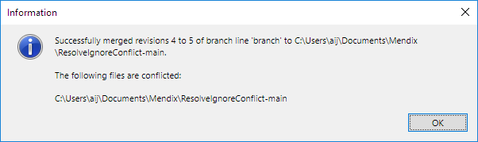

## 1 Introduction

The Mendix Modeler contains a version control system that supports collaborating with team members. This document presents fixes that can be used when version control problems arise.

For more information and general help on version control, see the following documents:

* [Version Control](/refguide7/version-control)
* [Using Version Control in the Desktop Modeler](/refguide7/using-version-control-in-the-dm)

## 2 Known Problems & Fixes

Below is a list of known problems and steps to fix them.

### 2.1 Getting an Error Containing `SharpSvn.SvnAuthenticationException: Proxy authentication failed`


This error means that the Modeler has problems reaching the version control server because of a proxy server.

The proxy settings can be changed in the Modeler by selecting **Edit** > **Preferences** and then the **Advanced** tab. In the **Proxy server** section, you can change the proxy authentication settings. Fill in the correct **User name** and **Password** for the proxy server.


### 2.2 Getting an Error Containing Another `SharpSvn.SvnAuthenticationException`

If you are using the Desktop Modeler version 7.18 or higher, sign out and then sign back in.

If you are using a Desktop Modeler version lower than 7.18, follow these steps:

1. Remove all the files from the *\Users\<your username>\AppData\Roaming\Subversion\auth\svn.simple* folder.
2. Remove all the files from the *\Users\<your username>\AppData\Local\Mendix\svnconfig\auth\svn.simple* folder.

### 2.3 Getting an Error with the Message `Connection timed out`

If you are using the Desktop Modeler version 7.18 or higher, follow these steps:

1. Open the *\Users\<username>\AppData\Roaming\Subversion\servers* file with any text editor.
2. Add the text `http-timeout = 5000` under the section `[global]`.
3. Save the file.

### 2.4 Getting an Error with the Message `<project folder> is already locked`

1. Install TortoiseSVN, as suggested in [System Requirements](/refguide7/system-requirements). Use version 1.7.x, which can be downloaded [here](https://sourceforge.net/projects/tortoisesvn/files/1.7.15/).
2. Go to the parent directory (folder) of your project (this is the folder with the **<folder_name>** from the error message).
3. Right-click to open the folder's context menu.
4. On the **TortoiseSVN** sub-menu, select **Clean up**.

### 2.5 Getting an Error with the Message `System.Security.Cryptography.CryptographicException: Key not valid for use in specified state`

Remove your user settings and restart the Modeler.

1. Rename *\Users\<username>\AppData\Local\Mendix\Settings.sqlite* to *Settings.sqlite.old* 
2. Restart the Modeler.

### 2.6 Getting an Error with the Message `SharpSvn.SvnRepositoryIOException: At least one property change failed; repository is unchanged` {#error-with-message}

1. Install TortoiseSVN, as suggested in [System Requirements](/refguide7/system-requirements). Use version 1.7.x, which can be downloaded from [Sourceforge](https://sourceforge.net/projects/tortoisesvn/files/1.7.15/).
2. Open the project folder via the Desktop Modeler by choosing **Show Project Directory in Explorer** from the **Project** menu.
3. Right-click the white background of the project folder.
4. Select **TortoiseSVN > Properties**.
5. Double-click the `svn:ignore` property.
6. Copy all text by doing <kbd>Ctrl</kbd>+<kbd>A</kbd> followed by <kbd>Ctrl</kbd>+<kbd>C</kbd>.
7. Paste into a new document in Notepad++ (or another editor that understands newline conventions).
8. In the bottom right click `CRLF` and select `LF` instead. This will replace CRLF by LF.
9. Copy all text by doing <kbd>Ctrl</kbd>+<kbd>A</kbd> followed by <kbd>Ctrl</kbd>+<kbd>C</kbd>.
10. Go back to the window showing the `svn:ignore` property.
11. Replace the current content by pasting from the clipboard: <kbd>Ctrl</kbd>+<kbd>A</kbd> followed by <kbd>Ctrl</kbd>+<kbd>V</kbd>.
12. Click **OK** to close the `svn:ignore` property dialog.
13. Click **OK** to close the `properties` dialog.

Restart the Desktop Modeler.

You can now commit your app project.

### 2.7 Resolving Conflicts on the 'svn:ignore' Property {#svn-ignore}

When merging or updating branches a conflict is sometimes reported on the project *folder*, rather than an individual file. This usually means that there is a conflict on the `svn:ignore` property.

In the 'svn:ignore' property, Subversion records which files should be ignored. These are files which are on disk but that should not be on the Team Server.

For example, the `deployment` directory is necessary for running your project but it should not be on the Team Server. Everyone has their own version of the `deployment` folder on their hard disk.

You will need to resolve the conflict before you can commit your app project to the Team Server.

#### 2.7.1 Example

In this example, we will focus on merging a branch into the main line. On the main line the list of ignored files is this:

```
modeler-merge-marker
.mendix-cache
ResolveIgnoreConflict.mpr.lock
*.launch
ResolveIgnoreConflict.mpr.bak
node_modules
```

On the branch the list is like this:

```
modeler-merge-marker
.mendix-cache
ResolveIgnoreConflict.mpr.lock
*.launch
ResolveIgnoreConflict.mpr.bak
.project
.classpath
deployment
```

Note that the first five lines are the same and after that the lists deviate.

Merging the branch to the main line will result in the following information message.



Note that a conflict is reported on the project *folder*. This usually means that there is a conflict on the `svn:ignore` property.

To resolve a conflict on the svn:ignore property, perform the following steps.

1. Install TortoiseSVN, as suggested in [System Requirements](/refguide7/system-requirements). Use version 1.7.x, which can be downloaded from [Sourceforge](https://sourceforge.net/projects/tortoisesvn/files/1.7.15/).
2. Open the project directory in the Windows File Explorer
3. Right-click the white background and choose **TortoiseSVN > Edit Conflicts**.

    The following dialog is shown (resized to show everything):

    

4. Copy all lines starting from `modeler-merge-marker` to the clipboard. 
5. Click **Manually edit property**.
6. Double-click the `svn:ignore` line in the grid.
7. Paste the previously copied lines here: <kbd>Ctrl</kbd>+<kbd>A</kbd> followed by <kbd>Ctrl</kbd>+<kbd>V</kbd>.
8. Remove the special lines that start with `<<<<<<<`, `=======` or `>>>>>>>`.

    For this example, we end up with the following combined ignore list:

    

    Note that it includes both the lines from the main line and from the branch. The order is not important.

9. Click **OK** and then **OK** again to confirm the change.
10. Right-click the white background of the project directory and choose **TortoiseSVN > Edit Conflicts** again.
11. This time click **Resolve using local property**.

You have resolved the conflict and can commit from the Desktop Modeler.

## 3 Other Problems

If the solutions here do not work for your version control problems, please submit a request with [Mendix Support](https://support.mendix.com/).

## 4 Read More

* [How to Submit Support Requests](/developerportal/support/submit-support-request)
