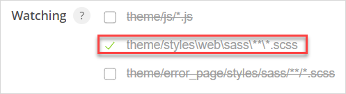

## 1 Introduction

Calypso is a tool which makes it easier for you to customize your Mendix apps' styling. Designers and front-enders, Mac users and Windows users — everyone can easily use this tool without installing any external dependencies. Everything is packaged inside Calypso. You simply need to install Calypso, choose your Mendix app, and start customizing. As you customize, Calypso eases your work by doing the following:

* Checks *SCSS* files for errors
* Compiles *SCSS* files to *CSS*
* Shows notifications on errors
* Moves compiled files to your deployment folder
* Injects the compiled *CSS* files into your browser so you can preview changes instantly 

Calypso is the easiest styling solution for most users. However, if you already use a Gulp service worker in your development workflow please consult [How to Set Up Gulp & Sass](/howto/front-end/sass-eight) for a styling solution which might suit you better.

## 2 Prerequisites

* Download Calypso [here](https://www.dropbox.com/sh/46hip6pq8s9ipqp/AAAHBwm-8qcv9bQKSR7BrirCa?dl=0)

## 3 Setting Up Calypso

1. Install Calypso.

2.  Open Calypso:

	

3. In the **Hostname** drop-down menu, select the host name of your Mendix app's device (or put its IP address in manually by clicking **Other** and typing in the IP address). 
	
	Most Windows users should select **localhost**. If you are running Windows through a virtual machine, use your virtual machine's IP address as the **Hostname** or you can forward your port from your host machine to your virtual machine. Alternatively you can install Calypso on a virtual machine and choose **localhost**.
	
4. If this is your first time using Calypso, you may have to tell your Windows firewall to **Allow access** to use Calypso.

5. Configure your **Port**. 

	A Mendix app normally runs on port 8080. However, if you are running multiple Mendix apps, or changed your port configuration, your port number may be different. Find your port information by navigating to **Project {'YourProjectName'}** > **Settings** in your **Project Explorer**, read your port number in **Application root URL** ({host name:port number}), then type that number into Calypso's **Port** field.

6. In **Apps Collection**, click the **Browse** button and then select the folder which contains all your Mendix apps. Configuring this enables you to switch easily between apps. 
7. Complete **App Folder** by selecting the folder of the Mendix app you want to work on from the drop-down menu.
8.  Complete **Watching** to specify which files you want to be processed by Calypso. 

	Most users will only need to select the **Watching** > **theme/styles** option. However, when you are building custom error pages or are using JavaScript on your pages, you may wish to select the other two folders as well.

	

9.  Click the sun in the top-right corner to toggle between dark mode and regular mode:

	

10. Click **Run Locally** in Mendix Studio Pro to use Calypso.

11. Click the **Start** button in Calypso. This will start a browser page which will let you view your running app. The browser address will match the address in Calypso's **Console**:

    Browser address:

    

    Calypso's **Console**:

    

## 4 Testing Calypso

With your Mendix app and Calypso running, complete the steps below to see how Calypso works:

1.  Add a button widget to your app's **Home_Responsive** page: 

	
	
2.  Run your app again by clicking **Run Locally** to see your new button in your browser:
	
	

2. Click **Project** > **Show Project Directory in Explorer**.
3. Open `theme\styles\web\sass\app\_custom-variables.scss` .
4. Change `$brand-primary: #0595DB;` to `$brand-primary: brown`, then save your changes.
5.  Look at your app in your browser again. The button's text has switched from blue to brown.

	

Good job! You've installed Calypso and used it to customize your styling quickly and easily.

## 5 Read More

* [Get Started with Atlas UI](get-started-with-atlasui)
* [Migrate Existing App Projects to Atlas UI](migrate-existing-projects-to-atlasui)
* [How to Set Up Gulp & Sass](/howto/front-end/sass-eight)