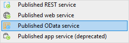
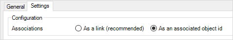
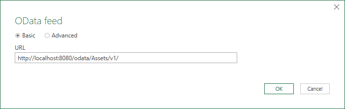
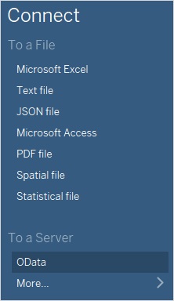
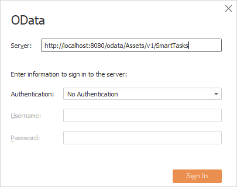
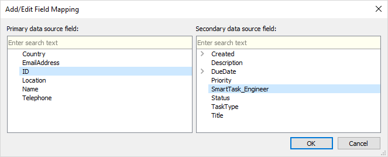
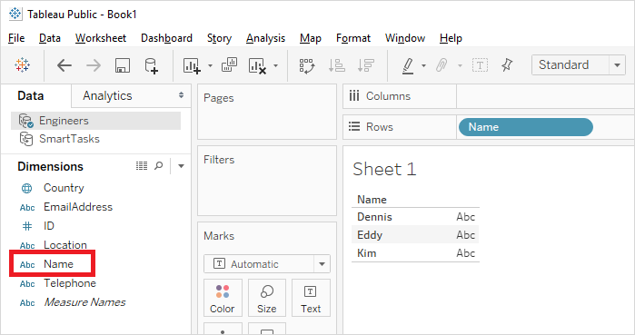
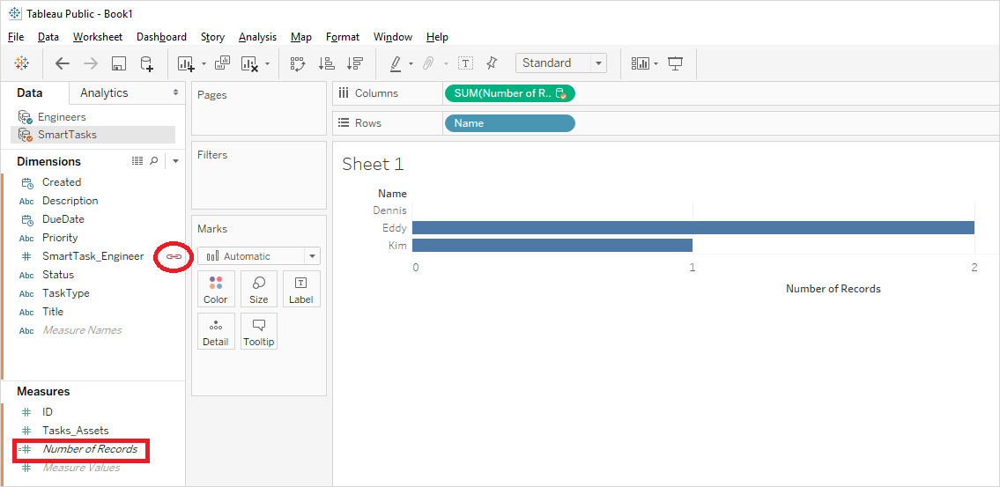
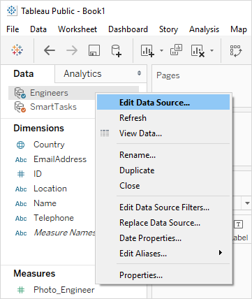
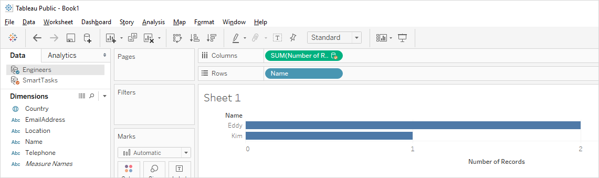

## 1 Introduction

Mendix apps encourage the application of a services-oriented architecture, with multiple smaller services providing APIs and user interfaces for a specific set of data and logic. Enterprises build up complete solutions by assembling these services.

One important aspect of services is that all access to data and logic is handled by the service operations. Direct access to databases used for storing the service data is discouraged, because this would bypass the business rules and security handled by the service. This creates a challenge for generic reporting, data warehousing, and ETL tooling.

A new standard called OData is being adopted more and more, as this enables generic data access within a services-oriented architecture. [OData](http://www.odata.org) is “an open protocol to allow the creation and consumption of queryable and interoperable Restful APIs in a simple and standard way.". In other words, it enables tools to use any REST/OData service by providing metadata that describes the data being provided and by standardizing the messages exchanged with the OData services.

A reporting tool like Tableau or Excel can discover what data and functionality is available in an OData service and provide a generic way for users to build new queries for the data.

**This how-to will teach you how to do the following:**

* Create a published OData service with resources
* Add the OData server to Tableau and Excel
* Combine resources in Tableau
* Create custom queries

## 2 Prerequisites

Before starting this how-to, make sure you have completed the following prerequisites:

* Create an app using the [Asset Manager](https://appstore.home.mendix.com/link/app/69674/0) template
* Install Excel (we will use Excel for Office 365)
* Download and install [Tableau](https://public.tableau.com) (The public version of Tableau is free)

## 3 Creating a Published OData Service

A published OData service can be used by third-party applications to read data from a Mendix application. In this chapter, you will create and configure such a service.

1. Open Studio Pro and add a folder named *OData Services* to **MyFirstModule**.
2.  Right-click the new folder and select **Add other** > **Published OData service**:

	

3.  Enter the name **Assets** and click **OK**:

	

4.  Under **Resources**, click **Add**:

	

5.  In the **Select Persistable Entity** window, select the **SmartTask** entity and click **Select**:

	

	Security in OData is managed by the **Project Security** settings and the entity-level access rules; therefore, if you have already configured access rules in your app, you do not have to configure security separately for OData.

6.  Repeat steps 4 and 5 for the **Engineer** entity:

	

7.  On the **Settings** tab, choose **As an associated id** for **Associations**. Excel can handle the setting **As a link**, but Tableau does not support it.

	

Start the application. The OData service is now ready to be consumed.

## 4 Working with Mendix Data in Excel for Office 365

1. Open Excel.
2.  Open the **DATA** tab and select **Get Data** > **From Other Sources** > **From OData Feed**:

	

3.  On the **OData Feed** dialog box, enter `http://localhost:8080/odata/Assets/v1/` for the **URL** and Click **OK**:

	

4.  Select **SmartTasks** in the Navigator and click **Load**:

	

5. The data of the Mendix application is now available in Excel:

	

## 5 Working with Mendix Data in Tableau

To visualize data from the Asset Manager app in Tableau, follow these steps:

1.  Open **Tableau** and select **Connect** > **To a Server** > **OData**:

	

2.  On the **Server Connection** dialog box, enter `http://localhost:8080/odata/Assets/v1/SmartTasks` for the **Server**   address:

	

3.  Click **Sign In** to save the server connection. You should now see the data source details:

	

4.  Click the name of the server connection and change it to *SmartTasks* for readability:

	

5.  Click **Data** > **New Data Source** and repeat step 1–4 to add a server connection for `http://localhost:8080/odata/Assets/v1/Engineers`.
6.  Open **Sheet1**. Under **Data**, click **Engineers** and drag **ID** from **Measures** to **Dimensions**:

	

7.  Similarly, click **SmartTasks** and drag **SmartTask_Engineer** from **Measures** to **Dimensions**.
8.  Select **Data** > **Edit Relationships...** in order to define the relation between the different data sources:

	

8.  On the **Relationships** window, do the following: 
	a. Select **SmartTasks** for the **Primary data source**. 
	b. Select **Engineers** for the **Secondary data source**. 
	c. Switch to **Custom** mapping. 
	d. Remove any default mappings. 
	e. Click **Add...** to configure a field mapping.

	

9.  In the **Add/Edit Field Mapping** window, select **ID** for the **Primary data source field** and **SmartTask_Engineer** for the **Secondary data source field**, then click **OK** to save the field mapping:

	

10. In the **Relationships** window, click **OK** to save the relationships:

	

11. Select **Engineers** for the data source and drag the **Name** attribute from the **Dimensions** section to **Rows**:

	

14. Select **SmartTasks** for the data source and do the following: 
	a. Click the **SmartTask_Engineer** attribute to use it as the linking field. 
	b. Drag. **Number of Records** from the **Measures** section to **Columns**.

	

You should now see a bar chart of the data.

## 6 Filtering Data With Query Parameters

By default, all data is retrieved by Tableau, but Mendix allows you to add filters to the query so only the desired data is being retrieved.

To filter data with query parameters, follow these steps:

1.  Right-click the **Engineers** data source and select **Edit Data Source...**:

	

2.  Click the OData URL to change the connection settings:

	

3.  Add *?$top=2* to the server URL (in order to only retrieve the first two engineers) and click **Sign In**:

	

4.  On the warning indicating that the data being used was refreshed, click **OK**.
5.  Open **Sheet1** and drag **Name** to **Rows** again. Now you should now see a bar chart with only the data of the two engineers:

	

6. You can combine filters by using the `&` character. Repeat steps 1–4, but now use `http://localhost:8080/odata/Expenses/Expenses?$skip=1` as the server URL. You should now see a bar chart showing the data of engineers 2 and 3.

These are some other query examples:

* `http://localhost:8080/odata/Assets/v1/Engineers(7881299347898469)`
* `http://localhost:8080/odata/Assets/v1/Engineers/$count`
* `http://localhost:8080/odata/Assets/v1/Engineers?$filter=Name+eq+'Kim'`
* `http://localhost:8080/odata/Assets/v1/Engineers?$filter=Name+ne+'Kim'`
* `http://localhost:8080/odata/Assets/v1/SmartTasks?$filter=DueDate+gt+datetime'1995-01-01T00:00:00'`
* `http://localhost:8080/odata/Assets/v1/SmartTasks?$filter=Created+gt+datetime'2005-01-01T00:00:00'&$orderby=DueDate`

## 7 Read More

* [Consume a Complex Web Service](consume-a-complex-web-service)
* [Consume a Simple Web Service](consume-a-simple-web-service)
* [Export XML Documents](export-xml-documents)
* [Import Excel Documents](importing-excel-documents)
* [Expose a Web Service](expose-a-web-service)
