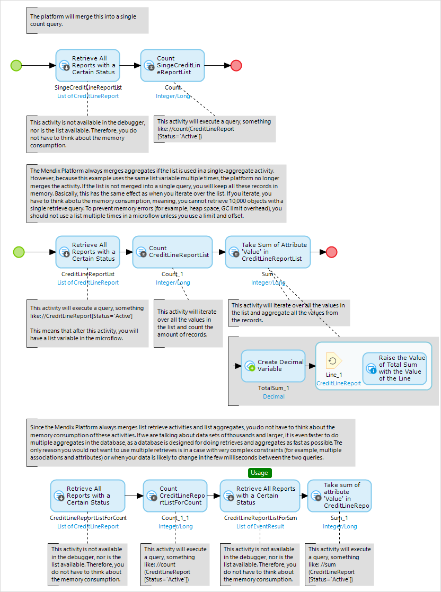

## 1 Optimization

In some projects, it is necessary to evaluate large datasets in a microflow (for example, for reporting purposes). If all those microflows do a lot of retrieves and aggregates on large datasets, it is easy to run into performance or memory problems. 

When a database retrieve activity is only used in list aggregate activities and a custom range is not configured, the platform can automatically merge these two activities into a single action. This executes a single aggregate query on the database. So, if you retrieve all 100k log lines from a database and only do a count on the list, you will not receive a heap space. This is because the microflow will never place all 100k records in memory. However, if you reuse the same list for multiple list aggregates, this does not apply. 

The Mendix Platform only creates an optimized SQL query if the list is not used in the microflow afterwards and a custom range is not configured. If you use the list later (for example, to iterate over) or a custom range is configured, the query will not be optimized.

If you do want to use the list but you also want the optimized query, do two separate retrieves. This will do the optimized query, and you can use the second retrieve in your microflow.

## 2 Read More

* [Define Access Rules Using XPath](define-access-rules-using-xpath)
* [Extend Your Application with Custom Java](extending-your-application-with-custom-java)
* [Work with Lists in a Microflow](working-with-lists-in-a-microflow)
* [Create a Custom Save Button](create-a-custom-save-button)
* [Optimize Retrieve Activities](optimizing-retrieve-activities)
* [Configure Error Handling](set-up-error-handling)
* [Optimize Microflow Aggregates](optimizing-microflow-aggregates)
* [Extract & Use Sub-Microflows](extract-and-use-sub-microflows)
